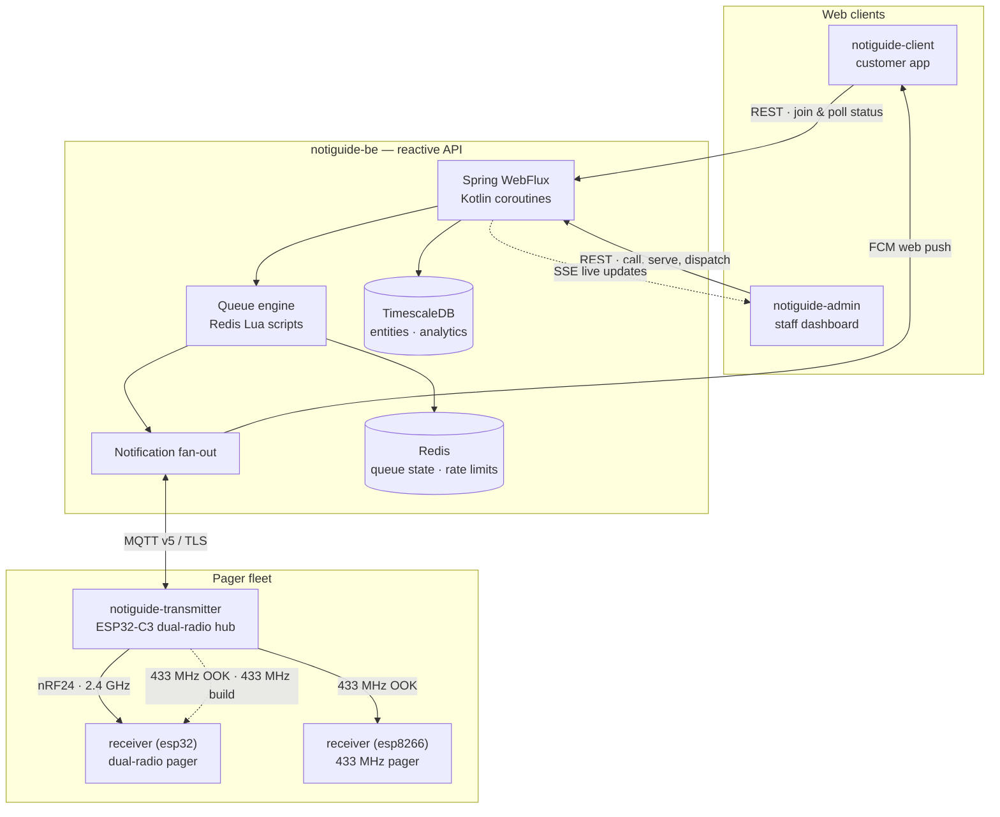

# NotiGuide

NotiGuide is an end-to-end queue management and notification system for stores. Customers join a virtual queue from their phone and watch their position live. Staff run the floor from an admin dashboard — calling, serving, and redirecting tickets in real time. When a ticket is called, the notification reaches the customer wherever they are: as a web push in their browser, or as a buzz on a dedicated RF pager in their hand.

What makes it interesting is the full vertical slice: a reactive Kotlin backend with an atomic Redis queue engine, two bilingual Next.js apps, and custom ESP32/ESP8266 firmware speaking 2.4 GHz and 433 MHz radio — all designed, built, and wired together in this workspace.

## Techstack

<p>
  <a href="https://kotlinlang.org/"></a>
  <a href="https://spring.io/projects/spring-boot"></a>
  <a href="https://www.timescale.com/"></a>
  <a href="https://redis.io/"></a>
  <a href="https://mqtt.org/"></a>
  <a href="https://firebase.google.com/"></a>
  <a href="https://nextjs.org/"></a>
  <a href="https://react.dev/"></a>
  <a href="https://www.typescriptlang.org/"></a>
  <a href="https://tailwindcss.com/"></a>
  <a href="https://ui.shadcn.com/"></a>
  <a href="https://docs.espressif.com/projects/esp-idf/en/stable/esp32c3/"></a>
  <a href="https://github.com/espressif/ESP8266_RTOS_SDK"></a>
  <a href="https://en.cppreference.com/w/c"></a>
  <a href="https://www.freertos.org/"></a>
  <a href="https://lvgl.io/"></a>
  <a href="https://www.docker.com/"></a>
</p>

## System Architecture



## Modules

| Module | Stack | Role |
|--------|-------|------|
| [notiguide-be](https://github.com/Thomas-Hoang-04/notiguide-be) | Kotlin · Spring Boot 3.5 · WebFlux · R2DBC | Reactive API: queue engine, auth, analytics, device orchestration |
| [notiguide-admin](https://github.com/Thomas-Hoang-04/notiguide-admin) | Next.js 16 · React 19 · Tailwind 4 | Staff dashboard: live queue control, pager dispatch, analytics |
| [notiguide-client](https://github.com/Thomas-Hoang-04/notiguide-client) | Next.js 16 · React 19 · Firebase | Customer app: join queues, track position, web push |
| [notiguide-transmitter](https://github.com/Thomas-Hoang-04/notiguide-transmitter) | ESP-IDF v6.0 · C · LVGL | Dual-radio hub: MQTT in, nRF24 + 433 MHz out, OLED status UI |
| [notiguide-receiver (`esp32`)](https://github.com/Thomas-Hoang-04/notiguide-receiver/tree/esp32) | ESP-IDF v6.0 · C | Dual-radio pager (2.4 GHz nRF24 or 433 MHz OOK) with vibration alert |
| [notiguide-receiver (`esp8266`)](https://github.com/Thomas-Hoang-04/notiguide-receiver/tree/esp8266) | ESP8266 RTOS SDK · C | 433 MHz pager with vibration alert |

## Key Capabilities

- **Real-time queueing** — atomic ticket lifecycle (join → call → serve) backed by Redis Lua scripts, with TTL-driven cleanup and SSE live updates to the staff dashboard.
- **Two notification paths** — Firebase Cloud Messaging for browsers, MQTT-to-RF for physical pagers; both fire from the same dispatch action.
- **Physical pager fleet** — enrollment tokens, local PSK pairing, roster sync, and a transmitter hub with an OLED status screen.
- **Analytics** — queue KPIs on TimescaleDB, charted in the admin dashboard.
- **Bilingual by design** — every UI ships in English and Vietnamese, with copy written natively rather than translated.

## Gallery

> 📷 *Admin dashboard — live queue management — coming soon*
<!-- PHOTO: admin dashboard, queue page with active tickets and dispatch controls -->

> 📷 *Customer app — queue tracking on mobile — coming soon*
<!-- PHOTO: client-web ticket view showing live position -->

> 📷 *Assembled transmitter hub — coming soon*
<!-- PHOTO: transmitter hub with OLED, button, both radio modules visible -->

> 📷 *Assembled pager receivers (ESP32-C3 and ESP8266) — coming soon*
<!-- PHOTO: both receiver builds side by side -->

## Repository Layout

This repository is a superproject: each module is a git submodule with its own history, and `docs/` carries the cross-cutting design documents.

```
├── backend/            — notiguide-be          (Kotlin/Spring Boot API)
├── web/                — notiguide-admin       (staff dashboard)
├── client-web/         — notiguide-client      (customer app)
├── transmitter/        — notiguide-transmitter (ESP32-C3 hub firmware)
├── receiver-esp32/     — notiguide-receiver    (branch: esp32)
├── receiver-esp8266/   — notiguide-receiver    (branch: esp8266)
└── docs/               — specs, plans, changelogs, style guides
```

```bash
git clone --recurse-submodules https://github.com/Thomas-Hoang-04/notiguide.git
```

---

_**Created by Minh Hai Hoang. June 2026**_
