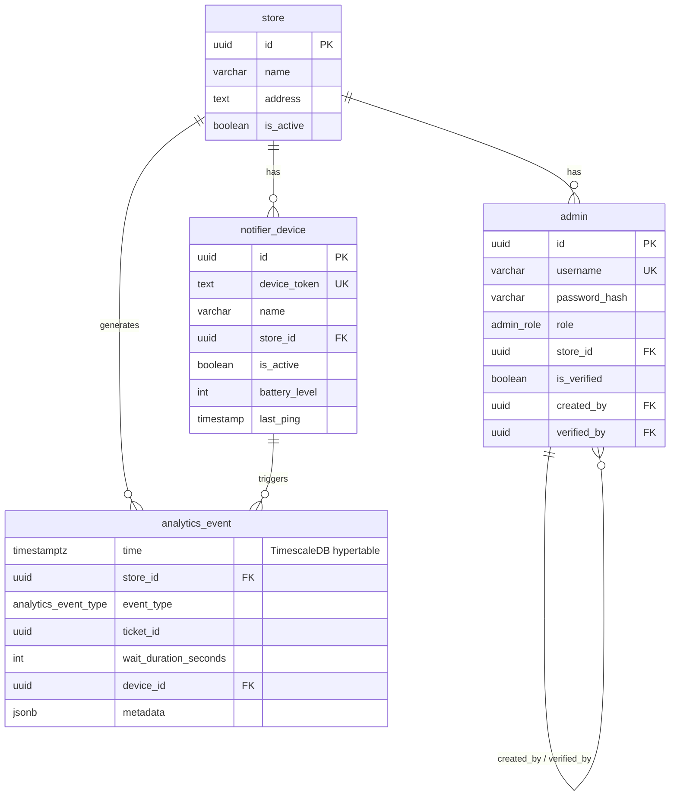

# notiguide Backend Pipeline — Recap

## Tech Stack

| Layer | Technology |
|---|---|
| Language | **Kotlin 2.3** on **Java 21** |
| Framework | **Spring Boot 3.5** (WebFlux — fully reactive) |
| Database | **TimescaleDB** (PostgreSQL 17) via **R2DBC** (non-blocking) |
| Cache / Queue | **Redis 8.6** (Lettuce, RESP3, reactive) |
| Auth | **RSA-512 JWT** (Auth0 java-jwt) + **Argon2** password hashing |
| Push Notifications | **Firebase Admin SDK** (FCM) |
| IoT comms | **Eclipse Paho MQTT v5** client (dependency only — not integrated) |
| Build | Gradle (Kotlin DSL), Docker Compose |

---

## Infrastructure (Docker Compose)

Two containers managed via `compose.yaml`:

| Service | Image | Notes |
|---|---|---|
| `postgres` | `timescale/timescaledb:latest-pg17` | Health-checked, init script mounts from `resources/db/`, persistent volume |
| `redis` | `redis:8.6.1-alpine` | Password-protected, AOF persistence (`appendonly yes`), keyspace notifications (`Ex`), persistent volume |

`spring-boot-docker-compose` dev dependency auto-starts containers on `bootRun`.

---

## Database Schema

Defined in `src/main/resources/db/schema.sql`, mounted into the Postgres init directory:



**Enums:** `admin_role` (`ROLE_SUPER_ADMIN`, `ROLE_ADMIN`), `analytics_event_type` (TICKET_ISSUED/CALLED/COMPLETED/SKIPPED, DEVICE_TRIGGERED).

---

## Security Pipeline

### 1. RSA Key Pair — `RSAKeyProperties.kt`
- Loads **encrypted private key** + public key from `.pem` files via Spring `ResourceLoader`
- Decrypts private key using JDK's `javax.crypto.EncryptedPrivateKeyInfo` + PBE cipher (no Bouncy Castle)
- **Startup verification**: signs + verifies a test payload with `SHA512withRSA` to confirm the key pair matches

### 2. JWT — `JWTManager.kt`
- **Issue**: `subject` = admin UUID, `auth` claim = role list (written for backward compatibility), RSA512-signed, configurable expiry (default 24h via `jwt.expiry-seconds`)
- **Verify**: RSA512 verification using **public key only** (`Algorithm.RSA512(publicKey, null)`) returning `DecodedJWT`

### 3. Auth Filter — `JWTAuthFilter.kt`
- `CoWebFilter` (Kotlin coroutine-based) — uses `withContext(ReactorContext(...))` to propagate the security context
- Extracts `Bearer` token → verifies → converts to `AdminPrincipal` via DB lookup → sets in `ReactiveSecurityContext`
- **No token present**: passes through to the chain unauthenticated (Spring Security enforces auth on protected routes)
- **Invalid/expired token**: writes a JSON `ErrorResponse` (401) directly to the response and returns — does **not** continue the chain
- **Catch-all**: infrastructure exceptions (e.g., DB unavailability during principal conversion) return structured JSON 500 — filter-level errors bypass `@RestControllerAdvice`

### 4. Security Config — `SecurityConfig.kt`
- **Public routes**: `/api/auth/**`, `/api/queue/public/**`, `/actuator/health`, `/actuator/info`
- **Everything else**: requires authentication
- CSRF, httpBasic, formLogin, logout — all disabled (pure JWT API)
- **Filter ordering**: `RateLimitFilter` at `SecurityWebFiltersOrder.FIRST`, `JWTAuthFilter` at `AUTHENTICATION`
- **CORS**: enabled via `.cors {}` integration with `CorsConfigurationSource`

### 5. CORS — `CorsConfig.kt`
- `UrlBasedCorsConfigurationSource` (integrated with Spring Security chain)
- Allowed origins: configurable via `app.cors.allowed-origins` (default: `http://localhost:3000`)
- Allowed methods: GET, POST, PUT, PATCH, DELETE, OPTIONS
- Allowed headers: Authorization, Content-Type
- **Exposed headers**: `X-RateLimit-Limit`, `X-RateLimit-Remaining`, `X-RateLimit-Reset`
- Credentials: true, max-age: 3600s

### 6. Rate Limiting — `core/ratelimit/`
- **`RateLimitFilter`** (`CoWebFilter` at `FIRST` order) — runs before JWT auth
- **3-tier** path-based routing:
  - **Strict** (`/api/queue/public/**`): 20 req / 60s
  - **Auth** (`/api/auth/**`): 10 req / 60s
  - **Standard** (other `/api/**`): 60 req / 60s
- **`RateLimiter`** — atomic Redis Lua sliding-window algorithm (`rate_limiter.lua`)
- Keys by client IP: reads `X-Forwarded-For` first (filter runs before `ForwardedHeaderTransformer`)
- Response headers: `X-RateLimit-Limit`, `X-RateLimit-Remaining`, `X-RateLimit-Reset`
- **Fail-open**: returns `allowed=true` when Redis is unavailable; suppresses rate-limit headers on fail-open responses
- Bypasses `OPTIONS` preflight requests (no quota consumed)
- **`RateLimitProperties`** (`@ConfigurationProperties`): per-tier `maxRequests` + `windowSeconds`, global `enabled` flag
- Disabled in dev profile, enabled in prod

### 7. Password Encoding — `Argon2PwdEncoder.kt`
- `Argon2PasswordEncoder.defaultsForSpringSecurity_v5_8()`

---

## Domain: Admin

Fully implemented — entity, repository, service, controllers, DTOs, requests.

### `AuthController` — `POST /api/auth/login`
- Looks up admin by username → verifies password → checks `isVerified` → issues JWT
- Returns `LoginResponse` (token + `AdminDto`)
- Unverified admins → `UnverifiedAdminException` → HTTP 403

### `AdminController` — `/api/admins`

| Endpoint | Method | Access |
|---|---|---|
| `/me` | GET | Authenticated |
| `/` | POST | SUPER_ADMIN only |
| `/{id}/verify` | PATCH | SUPER_ADMIN only |
| `/{id}/password` | PATCH | Self only |
| `/{id}` | DELETE | SUPER_ADMIN only (cannot self-delete) |
| `?storeId=&page=&size=` | GET | With `storeId`: SUPER_ADMIN or same-store admin; without `storeId`: SUPER_ADMIN only (global listing) |

### `AdminService`
- Role constraint: `ROLE_ADMIN` **must** have `storeId`; `ROLE_SUPER_ADMIN` must **not**
- All newly created admins start with `isVerified = false`, regardless of role
- `createAdmin()` validates store exists (via `StoreRepository`), checks username uniqueness, hashes password with Argon2
- `verifyAdmin()` throws 403 if `adminId == verifierId` (self-verification guard); throws 409 if already verified
- `deleteAdmin()` throws 403 if attempting self-deletion; throws 409 if deleting the last `ROLE_SUPER_ADMIN`
- `listAdminsByStore(storeId, page, size)` → paginated `AdminPageResponse` for store-scoped listing
- `listAllAdmins(page, size)` → paginated `AdminPageResponse` for global listing

---

## Domain: Store

Fully implemented — entity, repository, service, controller, DTOs, requests.

### `StoreController` — `/api/stores`

| Endpoint | Method | Access |
|---|---|---|
| `?page=&size=` | GET | SUPER_ADMIN only |
| `/{id}` | GET | SUPER_ADMIN or same-store admin |
| `/` | POST | SUPER_ADMIN only |
| `/{id}` | PUT | SUPER_ADMIN only |
| `/{id}` | DELETE | SUPER_ADMIN only |

### `StoreService`
- `listStores(page, size)` → paginated `StorePageResponse`
- `updateStore()` uses null-coalescing for partial updates — `null` fields mean "don't change"; `address` uses `addressProvided` flag to distinguish absent field from explicit null
- `deleteStore()` checks for bound admins (`countByStoreId`) → guards against active queue (throws 409 if `queueSize > 0` or serving set is non-empty) → deactivates store → calls `queueService.clearStoreData()` → deletes

---

## Domain: Queue (Redis-backed)

Fully implemented — repositories, service, and both public and admin controllers.

### Redis Key Conventions

| Key | Type | Purpose |
|---|---|---|
| `store:{storeId}:queue` | Sorted Set | Waiting tickets, scored by epoch millis |
| `store:{storeId}:serving` | Set | Currently-called ticket IDs |
| `ticket:{storeId}:{ticketId}` | Hash | Ticket data: store_id, number, status, issued_at, called_at, counter_id |
| `store:{storeId}:counter:{date}` | String | Daily atomic ticket number counter |

### Ticket Lifecycle & TTLs

```
WAITING (12h TTL) → CALLED (30min TTL) → SERVED (deleted) or CANCELLED (deleted)
```

`RedisKeyExpirationListener` subscribes to `__keyevent@0__:expired` and removes expired ticket IDs from the queue and serving sets. Includes exponential backoff retry (5 attempts: 1s→2s→5s→10s→30s) on cleanup failures.

### Lua Scripts (Atomicity)

- **`ISSUE_TICKET_SCRIPT`**: `ZADD` queue + `HSET` ticket + `EXPIRE` — atomic, prevents partial creation
- **`CALL_NEXT_SCRIPT`**: `ZPOPMIN` → `EXISTS` check → `SADD` serving + `HSET` CALLED + `EXPIRE` — ghost-skipping loop (up to 100 iterations), atomic per iteration

### `QueuePublicController` — `/api/queue/public/{storeId}` (unauthenticated)

| Endpoint | Method | Returns |
|---|---|---|
| `/tickets` | POST | 201 `IssueTicketResponse` (storeId + `TicketDto` with position) |
| `/tickets/{ticketId}` | GET | 200 `TicketStatusResponse` (status, positionInQueue, estimatedWaitTime) |

### `QueueAdminController` — `/api/queue/admin/{storeId}` (authenticated, store-scoped)

| Endpoint | Method | Returns |
|---|---|---|
| `/size` | GET | 200 `QueueSizeResponse` (`queueSize: Long`) |
| `/tickets/{ticketId}` | GET | 200 `TicketStatusResponse` |
| `/next?counterId=` | POST | 200 `NextTicketResponse` (`ticket: TicketDto \| null`) |
| `/tickets/{ticketId}/serve` | POST | 204 No Content |
| `/tickets/{ticketId}/cancel` | POST | 204 No Content |
| `/cleanup` | POST | 200 `{ cleanedEntries: Int }` |

### `QueueService` — Key Behaviors
- `issueTicket()`: validates store exists and is active; increments daily counter; executes `ISSUE_TICKET_SCRIPT`; returns position as 1-indexed ZRANK
- `callNextUntilSuccess()`: loops `callNext()` with a max of 10 retries until not `GhostTicketSkipped`; returns `Success(TicketDto)` or `QueueEmpty`
- `serveTicket()` / `cancelTicket()`: reads ticket, deletes it, removes from serving/queue accordingly; idempotent no-ops for missing tickets; `serveTicket` handles `WAITING` tickets by cleaning both queue and serving sets
- `cleanupServingSet()`: iterates serving set, removes entries where ticket hash no longer exists
- `clearStoreData()`: DELs queue, serving keys + SCAN-deletes all `ticket:{storeId}:*` hashes and `counter:*` keys

---

## Cross-cutting

### `StoreAccessUtil`
- `requireStoreAccess(principal, storeId)`: SUPER_ADMIN passes always; ROLE_ADMIN must match `principal.storeId == storeId`
- Used by all store-scoped endpoints in both `StoreController` and `QueueAdminController`

### Firebase — `FirebaseConfig.kt`
- Initializes `FirebaseApp` + `FirebaseMessaging` bean
- Dev: classpath service account; Prod: `FIREBASE_CREDENTIALS_PATH` env var or `/app/config/notiguide-firebase.json`
- **Optional**: returns `null` with warning log if credentials missing (graceful degradation). `FirebaseMessaging` bean gated with `@ConditionalOnBean` — initialization failure does not crash the app

### Exception Handling — `ExceptionHandler.kt`
- `@RestControllerAdvice` handling: `HttpException` (NotFoundException, ConflictException, ForbiddenException, UnverifiedAdminException), `BadCredentialsException`, `JWTVerificationException`, `AccessDeniedException`, `IllegalArgumentException`, `WebExchangeBindException` (Bean Validation), generic catch-all
- Uniform `ErrorResponse` JSON: `{ timestamp, code, error, message, path, method, details? }` — `details` is an optional `Map<String, String>` populated with field-level validation errors on 400 responses

### Redis — `RedisConfig.kt`
- Lettuce client with RESP3 protocol
- **All serializers use `StringRedisSerializer`** (key, value, hashKey, hashValue) — `GenericJackson2JsonRedisSerializer` must NOT be used as it wraps strings in JSON quotes, breaking Lua script ARGV
- `ReactiveRedisTemplate<String, Any>` for general use; `ReactiveStringRedisTemplate` for string ops

### `JWTToPrincipal` — Principal Conversion
- Extracts UUID from JWT subject → DB lookup (validates account still exists)
- Enforces `isVerified` flag — unverified admins rejected even with valid JWT
- **Authorities sourced from DB `admin.role`**, not from JWT `auth` claim — prevents stale privilege escalation on demoted accounts

---

## What's Done vs. What's Remaining

| Area | Status |
|---|---|
| Infrastructure (DB, Redis, Docker) | ✅ Complete |
| Security pipeline (RSA, JWT, auth filter, catch-all error handling) | ✅ Complete |
| CORS configuration (`CorsConfigurationSource` + Security integration) | ✅ Complete |
| Rate limiting (3-tier Redis Lua sliding-window, fail-open) | ✅ Complete |
| Admin domain (auth, CRUD, roles, verification, deletion safeguards, pagination) | ✅ Complete |
| Store domain (CRUD, pagination, partial update with address clearing) | ✅ Complete |
| Queue repositories (Redis data layer) | ✅ Complete |
| Queue service + controller layer (incl. queue size endpoint) | ✅ Complete |
| Queue scheduled cleanup (`ServingSetCleanupScheduler`) | ✅ Complete |
| Centralized timezone config (`app.timezone`) | ✅ Complete |
| Ticket status enum (`TicketStatus`) | ✅ Complete |
| Exception handling (incl. Bean Validation errors) | ✅ Complete |
| Firebase config (FCM infrastructure ready, optional/graceful) | ✅ Complete |
| Analytics domain (entity, repo, service, events) | ❌ Not yet (schema only) |
| Notifier device domain | ❌ Not yet (schema only) |
| MQTT integration | ❌ Not yet (dependency declared only) |

### Open TODOs (from source code)
1. **`serveTicket()` / `cancelTicket()`**: `getTicket()` is called before deletion — `issued_at`/`called_at` data is available but analytics event emission is not yet implemented
2. **`TicketStatusResponse.estimatedWaitTime`**: always `null` — awaits analytics domain for average service duration data
