# Firmware: Diagnostics Heartbeat Enrichment

**Status**: Implementation-ready after audit
**Last updated**: 2026-05-17
**Scope**: Transmitter hub firmware only (ESP-IDF >= 6.0.0, ESP32-C3)
**Isolation**: This plan is self-contained for execution in a Dev Container with this repository checkout.

---

## 1. Objective

Enrich the transmitter hub MQTT heartbeat with diagnostic fields for heap, RSSI, uptime, dispatch counters, and IPv4 address. Extend the serial `status` response with `total_heap`, `dispatch_daily`, and `dispatch_total`.

The dispatch counters must be firmware diagnostics, not OLED diagnostics. They must work when `CONFIG_TRANSMITTER_OLED_ENABLED=n`, and the OLED screens should read the same counter source when the display is enabled.

---

## 2. Audit Findings Applied

| Problem in prior plan | Correction in this plan |
|---|---|
| Heartbeat and serial status were instructed to include `display/display.h` and read counters from `display.c`. That would make always-built modules depend on an optional OLED source file. | Add an always-built `main/diagnostics/dispatch_counters` module and have heartbeat, serial, and display read that module. |
| The plan said the counter writer was an LVGL timer callback. Current source increments from `display_event_handler()` after `TX_EVENT_DISPATCH_OK`, not from `refresh_timer_cb()`. | The new module registers an event handler on `TRANSMITTER_EVENTS` and counts `TX_EVENT_DISPATCH_OK` events whose summary status is not `"unchanged"`, matching the current display behavior. |
| `diag.disp_d` was described as resetting exactly at UTC midnight. Current display counters reset lazily on init or on the next counted dispatch. | The diagnostics counter getter must normalize the daily count against the current UTC date before returning, so heartbeat/status do not report yesterday's daily count after midnight. |
| Serial `free_heap` used `esp_get_free_heap_size()` while the proposed `total_heap` used `MALLOC_CAP_8BIT | MALLOC_CAP_INTERNAL`. That mixes different heap capability sets. | Keep existing `free_heap` unchanged and add `total_heap` as `heap_caps_get_total_size(MALLOC_CAP_DEFAULT)`, which matches `esp_get_free_heap_size()` in ESP-IDF. Use internal 8-bit caps only for the heartbeat `heap_pct` because that matches the OLED memory percentage. |
| The heartbeat JSON used chained `snprintf()` appends without checking negative return values or truncation before advancing the write pointer. | Build heartbeat JSON with cJSON, already used by this project, and publish only when serialization succeeds. |
| The plan implied `IPSTR` / `IP2STR` come only from `esp_netif.h` transitively. | Include `esp_netif_ip_addr.h` explicitly wherever those macros are used in new code. |
| The logical flow said "every 10s" only. Current heartbeat adds `HEARTBEAT_JITTER_MS` of +/-500 ms. | Document the existing 10 second interval plus jitter. |

---

## 3. Files to Modify

| # | File | Change type |
|---|---|---|
| 1 | `main/diagnostics/dispatch_counters.h` | New public counter API |
| 2 | `main/diagnostics/dispatch_counters.c` | New event-driven counter implementation |
| 3 | `main/CMakeLists.txt` | Add new diagnostics source |
| 4 | `main/main.c` | Initialize dispatch counters and flush them before restart |
| 5 | `main/controls/controls.c` | Flush counters before recovery-mode restart |
| 6 | `main/display/display.h` | Remove display-owned counter flush API |
| 7 | `main/display/display.c` | Replace local counter storage with diagnostics counter reads |
| 8 | `main/network/heartbeat.c` | Build enriched heartbeat payload |
| 9 | `main/serial/serial_protocol.c` | Add `total_heap` and dispatch counter fields to `status` |

No Kconfig changes.

---

## 4. ESP-IDF API Reference

Verified against the ESP-IDF v6.0 docs and the local ESP-IDF headers in `/opt/esp/idf`.

| API | Header | Signature / macro | Usage |
|---|---|---|---|
| `heap_caps_get_free_size` | `esp_heap_caps.h` | `size_t heap_caps_get_free_size(uint32_t caps)` | Heartbeat `heap_pct` free bytes for a selected capability set |
| `heap_caps_get_total_size` | `esp_heap_caps.h` | `size_t heap_caps_get_total_size(uint32_t caps)` | Heartbeat heap denominator and serial `total_heap` |
| `esp_get_free_heap_size` | `esp_system.h` | `uint32_t esp_get_free_heap_size(void)` | Existing serial `free_heap`; local ESP-IDF implements it as `heap_caps_get_free_size(MALLOC_CAP_DEFAULT)` |
| `esp_wifi_sta_get_rssi` | `esp_wifi.h` | `esp_err_t esp_wifi_sta_get_rssi(int *rssi)` | Add RSSI only when the call returns `ESP_OK` |
| `esp_netif_get_handle_from_ifkey` | `esp_netif.h` | `esp_netif_t *esp_netif_get_handle_from_ifkey(const char *if_key)` | Valid direct lookup for `"WIFI_STA_DEF"`; already used by current `handle_status()` |
| `esp_netif_get_ip_info` | `esp_netif.h` | `esp_err_t esp_netif_get_ip_info(esp_netif_t *esp_netif, esp_netif_ip_info_t *ip_info)` | Add IP only when it returns `ESP_OK` and `ip_info.ip.addr != 0` |
| `esp_timer_get_time` | `esp_timer.h` | `int64_t esp_timer_get_time(void)` | Microseconds since boot; divide by `1000` for milliseconds |
| `IPSTR` / `IP2STR` | `esp_netif_ip_addr.h` | IPv4 format macro and argument macro | Format `esp_ip4_addr_t` into `char ip_str[16]` |

Use `MALLOC_CAP_8BIT | MALLOC_CAP_INTERNAL` for heartbeat `heap_pct` to match the OLED dashboard's current `get_heap_percent()` calculation in `main/display/display.c`. Use `MALLOC_CAP_DEFAULT` for serial `total_heap` to match the existing serial `free_heap` field.

---

## 5. Change 1 - Add Dispatch Counter Diagnostics Module

### 5.1 `main/diagnostics/dispatch_counters.h`

Create:

```c
#ifndef TRANSMITTER_DISPATCH_COUNTERS_H
#define TRANSMITTER_DISPATCH_COUNTERS_H

#include <stdint.h>

#include "esp_err.h"

#ifdef __cplusplus
extern "C" {
#endif

esp_err_t dispatch_counters_init(void);

void dispatch_counters_get(uint32_t *daily, uint32_t *total);

void dispatch_counters_flush(void);

#ifdef __cplusplus
}
#endif

#endif /* TRANSMITTER_DISPATCH_COUNTERS_H */
```

### 5.2 `main/diagnostics/dispatch_counters.c`

Create an always-built counter module with these responsibilities:

1. Keep `static uint32_t s_daily_count`, `s_total_count`, `s_daily_since_flush`, and `s_stored_date_key`.
2. Protect counter state with a `portMUX_TYPE`.
3. Load and store counters in NVS.
4. Register one event handler for `TRANSMITTER_EVENTS`.
5. Increment only on `TX_EVENT_DISPATCH_OK` when the copied `dispatch_summary_t.status` is not `"unchanged"`.
6. Normalize the daily count by UTC date before returning values from `dispatch_counters_get()`.
7. Flush to NVS every 10 counted dispatches and when `dispatch_counters_flush()` is called.

Required includes:

```c
#include "diagnostics/dispatch_counters.h"

#include <stdbool.h>
#include <stdint.h>
#include <string.h>
#include <time.h>

#include "esp_event.h"
#include "events/transmitter_events.h"
#include "freertos/FreeRTOS.h"
#include "freertos/portmacro.h"
#include "nvs.h"
#include "utils/time_utils.h"
```

Use the existing NVS namespace and keys from `display.c` to preserve deployed counter values:

```c
static const char *NVS_NS_COUNTERS = "display";
static const char *KEY_DISP_DATE   = "disp_date";
static const char *KEY_DISP_DAILY  = "disp_daily";
static const char *KEY_DISP_TOTAL  = "disp_total";
```

The namespace name remains `"display"` only for data migration compatibility. New code should treat the diagnostics module as the owner.

Date key logic should match the current display implementation:

```c
static uint32_t get_today_date_key(void)
{
    const int64_t now_ms = time_utils_now_epoch_ms();
    time_t now = (time_t)(now_ms / 1000LL);
    struct tm tm_utc = { 0 };
    (void)gmtime_r(&now, &tm_utc);
    return (uint32_t)((tm_utc.tm_year + 1900) * 10000 +
                      (tm_utc.tm_mon + 1) * 100 +
                      tm_utc.tm_mday);
}
```

Event handling rule:

```c
static void dispatch_counters_event_handler(void *arg,
                                            esp_event_base_t base,
                                            int32_t id,
                                            void *data)
{
    (void)arg;
    (void)base;

    if ((transmitter_event_id_t)id != TX_EVENT_DISPATCH_OK || data == NULL) {
        return;
    }

    dispatch_summary_t summary = { 0 };
    memcpy(&summary, data, sizeof(summary));
    if (strcmp(summary.status, "unchanged") == 0) {
        return;
    }

    record_counted_dispatch();
}
```

`record_counted_dispatch()` must compute today's date before entering the spinlock, call UTC-date normalization before incrementing, copy the post-increment values under the spinlock, and perform NVS writes after leaving the critical section. After a successful automatic NVS write or explicit `dispatch_counters_flush()`, subtract the flushed pending count under the spinlock rather than blindly resetting the counter, so increments that happen during the NVS write remain pending for the next flush.

`dispatch_counters_init()` must:

1. Load existing NVS values.
2. Normalize the daily count for today's UTC date.
3. Register the event handler:

```c
return esp_event_handler_register(TRANSMITTER_EVENTS,
                                  TX_EVENT_DISPATCH_OK,
                                  dispatch_counters_event_handler,
                                  NULL);
```

---

## 6. Change 2 - Wire Counter Module into Build and Boot

### 6.1 `main/CMakeLists.txt`

Add the new source to the always-built `SRCS` list:

```cmake
    "diagnostics/dispatch_counters.c"
```

Do not place it inside the `CONFIG_TRANSMITTER_OLED_ENABLED` block.

### 6.2 `main/main.c`

Add:

```c
#include "diagnostics/dispatch_counters.h"
```

Initialize after `esp_event_loop_create_default()` and `device_config_load()`, before `display_init()`:

```c
ESP_ERROR_CHECK(dispatch_counters_init());
```

This ordering is valid because `device_config_nvs_init_or_recover()` and the default event loop already exist before the counter module uses NVS and registers its handler.

Update `restart_after_response_flush()` to flush counters unconditionally before restart:

```c
static void restart_after_response_flush(void)
{
    dispatch_counters_flush();
    vTaskDelay(pdMS_TO_TICKS(250));
    esp_restart();
}
```

This replaces the current OLED-gated call to `display_notify_dispatch()`. Counter persistence must not depend on `CONFIG_TRANSMITTER_OLED_ENABLED`.

---

## 7. Change 3 - Flush Counters from Recovery Restart Path

In `main/controls/controls.c`, add:

```c
#include "diagnostics/dispatch_counters.h"
```

In `recovery_stage2_timer_cb()`, replace:

```c
display_notify_dispatch();
```

with:

```c
dispatch_counters_flush();
```

This keeps recovery-mode restart persistence available in both OLED and non-OLED builds. Remove the non-OLED local `display_notify_dispatch()` stub after the call site is replaced.

---

## 8. Change 4 - Update OLED Display to Read Shared Counters

`main/display/display.c` is optional at build time, so it must not remain the authoritative counter owner.

In `main/display/display.h`, remove:

```c
void display_notify_dispatch(void);
```

Add:

```c
#include "diagnostics/dispatch_counters.h"
```

Remove the display-local counter state and helpers:

```c
NVS_NS_DISPLAY
KEY_DISP_DATE
KEY_DISP_DAILY
KEY_DISP_TOTAL
s_daily_count
s_total_count
s_daily_since_flush
s_stored_date_key
get_today_date_key()
nvs_load_counters()
nvs_flush_counters()
increment_dispatch_counter()
```

Remove the `nvs_load_counters();` call from `display_init()`.

Replace display counter reads with shared counter reads. The dashboard needs daily and total state:

```c
uint32_t daily = 0;
uint32_t total = 0;
dispatch_counters_get(&daily, &total);
```

Use `daily` for `"Dispatches today"` and `total` for `"Dispatches: %lu total"`.

The device screen only needs the lifetime count, so it can call:

```c
uint32_t total = 0;
dispatch_counters_get(NULL, &total);
```

In `display_event_handler()`, keep the last-dispatch overlay logic, but remove the call that increments counters. The diagnostics module now observes the same `TX_EVENT_DISPATCH_OK` event and owns the count.

Remove the `display_notify_dispatch()` implementation from `display.c`; counter flushing is now handled by the always-built callers in `main.c` and `controls.c`.

---

## 9. Change 5 - Enrich Heartbeat Payload

### 9.1 Includes

In `main/network/heartbeat.c`, add:

```c
#include <string.h>

#include "cJSON.h"
#include "diagnostics/dispatch_counters.h"
#include "esp_heap_caps.h"
#include "esp_netif.h"
#include "esp_netif_ip_addr.h"
#include "esp_timer.h"
#include "esp_wifi.h"
#include "network/wifi.h"
```

Do not include `display/display.h`.

### 9.2 Metric collection

Inside the existing publish condition:

```c
cfg->has_public_id &&
cfg->op_state == OP_STATE_ACTIVE &&
mqtt_is_connected()
```

collect:

```c
const uint32_t heap_caps = MALLOC_CAP_8BIT | MALLOC_CAP_INTERNAL;
const size_t heap_free = heap_caps_get_free_size(heap_caps);
const size_t heap_total = heap_caps_get_total_size(heap_caps);
const bool has_heap_pct = heap_total > 0;
const int heap_pct = has_heap_pct
    ? (int)((heap_free * 100U + heap_total / 2U) / heap_total)
    : 0;
const int heap_pct_clamped = heap_pct > 100 ? 100 : heap_pct;

const int64_t uptime_ms = esp_timer_get_time() / 1000;

uint32_t dispatch_daily = 0;
uint32_t dispatch_total = 0;
dispatch_counters_get(&dispatch_daily, &dispatch_total);
```

RSSI and IP remain optional:

```c
int rssi = 0;
const bool has_rssi = wifi_is_sta_connected() &&
                      esp_wifi_sta_get_rssi(&rssi) == ESP_OK;

char ip_str[16] = "";
bool has_ip = false;
if (wifi_is_sta_connected()) {
    esp_netif_t *sta = esp_netif_get_handle_from_ifkey("WIFI_STA_DEF");
    if (sta != NULL) {
        esp_netif_ip_info_t ip_info = { 0 };
        if (esp_netif_get_ip_info(sta, &ip_info) == ESP_OK &&
            ip_info.ip.addr != 0) {
            (void)snprintf(ip_str, sizeof(ip_str), IPSTR, IP2STR(&ip_info.ip));
            has_ip = true;
        }
    }
}
```

### 9.3 JSON building

Use cJSON instead of append-style `snprintf()`:

```c
cJSON *root = cJSON_CreateObject();
cJSON *diag = cJSON_CreateObject();
if (root == NULL || diag == NULL) {
    cJSON_Delete(root);
    cJSON_Delete(diag);
    goto heartbeat_wait;
}

if (cJSON_AddNumberToObject(root, "schema_version", 1) == NULL ||
    cJSON_AddStringToObject(root, "issued_at", issued_at) == NULL ||
    !cJSON_AddItemToObject(root, "diag", diag)) {
    cJSON_Delete(root);
    cJSON_Delete(diag);
    goto heartbeat_wait;
}

cJSON *heap_item = has_heap_pct
    ? cJSON_AddNumberToObject(diag, "heap_pct", heap_pct_clamped)
    : cJSON_AddNullToObject(diag, "heap_pct");
if (heap_item == NULL ||
    cJSON_AddNumberToObject(diag, "uptime_ms", (double)uptime_ms) == NULL ||
    cJSON_AddNumberToObject(diag, "disp_d", (double)dispatch_daily) == NULL ||
    cJSON_AddNumberToObject(diag, "disp_t", (double)dispatch_total) == NULL) {
    cJSON_Delete(root);
    goto heartbeat_wait;
}
if (has_rssi) {
    cJSON_AddNumberToObject(diag, "rssi", rssi);
}
if (has_ip) {
    cJSON_AddStringToObject(diag, "ip", ip_str);
}

char *payload = cJSON_PrintUnformatted(root);
if (payload != NULL) {
    (void)mqtt_publish(topic, payload, (int)strlen(payload), 0, 0);
    cJSON_free(payload);
}
cJSON_Delete(root);
```

If this exact `goto` form is used, place the `heartbeat_wait:` label immediately before the existing delay calculation at the bottom of the loop. The actual implementation can avoid `goto` by factoring metric publication into a helper, but it must keep the existing heartbeat delay/notification behavior.

---

## 10. Change 6 - Extend Serial `status` Response

### 10.1 Includes

In `main/serial/serial_protocol.c`, add:

```c
#include "diagnostics/dispatch_counters.h"
#include "esp_heap_caps.h"
```

### 10.2 Payload fields

Keep the existing `free_heap` field unchanged for backward compatibility:

```c
cJSON_AddNumberToObject(payload, "free_heap",
                        (double)esp_get_free_heap_size());
```

Add:

```c
uint32_t dispatch_daily = 0;
uint32_t dispatch_total = 0;
dispatch_counters_get(&dispatch_daily, &dispatch_total);

cJSON_AddNumberToObject(payload, "total_heap",
                        (double)heap_caps_get_total_size(MALLOC_CAP_DEFAULT));
cJSON_AddNumberToObject(payload, "dispatch_daily", (double)dispatch_daily);
cJSON_AddNumberToObject(payload, "dispatch_total", (double)dispatch_total);
```

Place these fields after `free_heap` and before `firmware_version`.

---

## 11. Data Contracts

### 11.1 MQTT Heartbeat Payload

**Topic**: `transmitter/hub/{publicId}/heartbeat`
**QoS**: 0
**Direction**: Hub -> Broker -> Backend

Example:

```json
{
  "schema_version": 1,
  "issued_at": "2026-05-17T16:30:45Z",
  "diag": {
    "heap_pct": 72,
    "uptime_ms": 3612000,
    "disp_d": 42,
    "disp_t": 1337,
    "rssi": -52,
    "ip": "192.168.1.42"
  }
}
```

| Field | Type | Presence | Meaning |
|---|---|---|---|
| `diag` | object | Always present in new firmware | Diagnostics container |
| `diag.heap_pct` | int or null | Always present | Internal 8-bit heap free percentage, rounded like OLED display |
| `diag.uptime_ms` | number | Always present | Milliseconds since boot |
| `diag.disp_d` | number | Always present | Counted dispatches for current UTC date |
| `diag.disp_t` | number | Always present | Lifetime counted dispatches |
| `diag.rssi` | number | Only when STA RSSI is available | WiFi RSSI in dBm |
| `diag.ip` | string | Only when STA has a non-zero IPv4 address | IPv4 dotted decimal |

Counting semantics:

- Count `TX_EVENT_DISPATCH_OK` events except summaries whose `status` is `"unchanged"`.
- Do not count `TX_EVENT_DISPATCH_REJECTED`.
- Count both MQTT-originated and USB-originated applied dispatches because both paths post `TX_EVENT_DISPATCH_OK`.
- Normalize `disp_d` to the current UTC date before reporting.

Backward compatibility:

- `schema_version` remains `1`.
- `diag` is additive. Backend consumers must treat it as optional because older firmware publishes only `schema_version` and `issued_at`.

### 11.2 Serial `status` Response

**Direction**: Hub -> Browser over USB Serial/JTAG

New fields appended to the existing response payload:

| Field | Type | Notes |
|---|---|---|
| `total_heap` | number | `heap_caps_get_total_size(MALLOC_CAP_DEFAULT)` in bytes; capability set matches existing `free_heap` |
| `dispatch_daily` | number | Counted dispatches for current UTC date |
| `dispatch_total` | number | Lifetime counted dispatches |

Existing fields remain unchanged.

---

## 12. Logical Flow

```mermaid
flowchart TD
    subgraph "dispatch counter module"
        A["dispatch_counters_init after default event loop"] --> B["load NVS counters"]
        B --> C["register TX_EVENT_DISPATCH_OK handler"]
        C --> D{"event status != unchanged?"}
        D -->|yes| E["normalize UTC date and increment daily/total"]
        D -->|no| F["ignore event"]
        E --> G{"10 counted dispatches?"}
        G -->|yes| H["flush counters to NVS"]
        G -->|no| I["keep RAM state"]
    end

    subgraph "heartbeat_task - every 10s +/- 500ms"
        J["has_public_id AND ACTIVE AND mqtt_connected"] -->|pass| K["collect diagnostics"]
        J -->|fail| W["wait for next tick or stop notification"]
        K --> K1["heap free/total using internal 8-bit caps"]
        K --> K2["esp_timer_get_time / 1000"]
        K --> K3["dispatch_counters_get"]
        K --> K4{"wifi_is_sta_connected?"}
        K4 -->|yes| K5["try RSSI and IPv4"]
        K4 -->|no| K6["omit rssi and ip"]
        K1 & K2 & K3 & K5 & K6 --> L["build cJSON payload"]
        L --> M["mqtt_publish QoS 0"]
    end

    subgraph "serial status"
        N["handle_status"] --> O["existing status fields"]
        O --> P["free_heap unchanged"]
        P --> Q["add total_heap and dispatch counters"]
        Q --> R["serial_send_response"]
    end

    subgraph "OLED enabled builds"
        S["display screens"] --> T["dispatch_counters_get"]
    end

    subgraph "restart paths"
        U["restart_after_response_flush / recovery_stage2_timer_cb"] --> V["dispatch_counters_flush"]
        V --> X["esp_restart"]
    end
```



---

## 13. Testing

### Build verification

```bash
idf.py build
```

Also verify the optional-display boundary:

```bash
idf.py -B build-no-oled -D SDKCONFIG_DEFAULTS=sdkconfig.no-oled.defaults build
```

Use a scratch `sdkconfig.no-oled.defaults` containing `CONFIG_TRANSMITTER_OLED_ENABLED=n`, and do not commit that scratch file unless the project intentionally adopts it.

### Runtime verification

1. Flash firmware and connect over USB Serial/JTAG.
2. Send:

   ```json
   {"id":"1","type":"status"}
   ```

3. Verify the response still contains existing fields and now contains `total_heap`, `dispatch_daily`, and `dispatch_total`.
4. Trigger a successful USB dispatch and verify `dispatch_daily` and `dispatch_total` increment.
5. Trigger or receive an unchanged MQTT dispatch and verify counters do not increment.
6. Subscribe to heartbeat:

   ```bash
   mosquitto_sub -h <broker> -t "transmitter/hub/+/heartbeat" -v
   ```

7. Verify heartbeat JSON contains `diag.heap_pct`, `diag.uptime_ms`, `diag.disp_d`, and `diag.disp_t`.
8. Verify `diag.rssi` and `diag.ip` appear only when STA is connected and the relevant ESP-IDF calls succeed.
9. Leave the device running across UTC midnight or simulate the date key in a test build; verify `disp_d` reports `0` before the next dispatch if no dispatch has occurred today.
10. On OLED-enabled builds, verify the OLED daily and total dispatch values match serial status after a successful dispatch.

### Failure checks

- Force cJSON allocation failure in a test build, or inspect the failure path, and verify the heartbeat task still reaches its wait delay without publishing a malformed payload.
- Disconnect WiFi while MQTT is reconnecting and verify heartbeat omits `rssi` and `ip` instead of publishing stale values.
- Confirm `dispatch_counters_flush()` is called before restart paths in both OLED and non-OLED builds.
