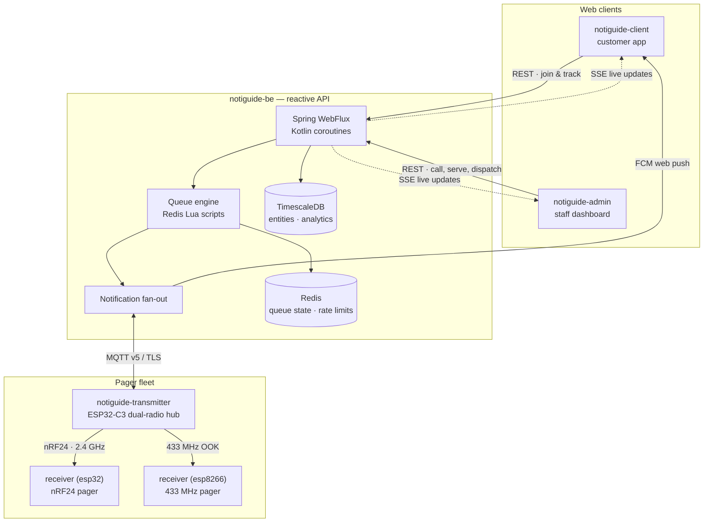
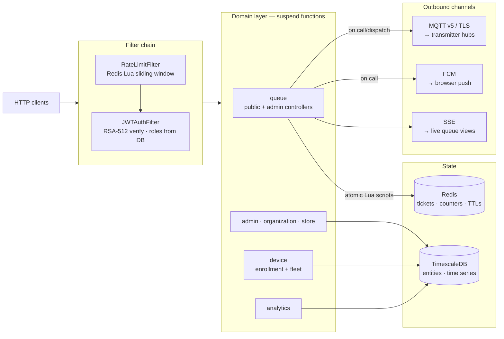
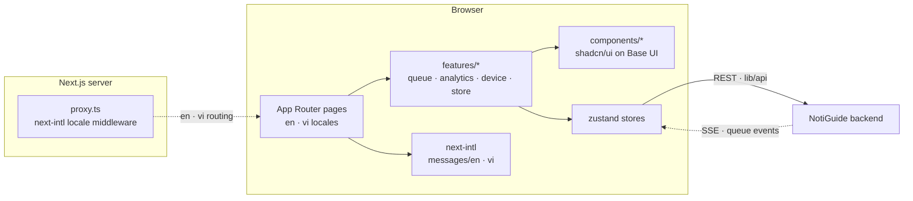
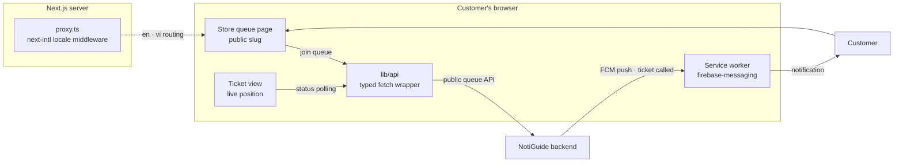
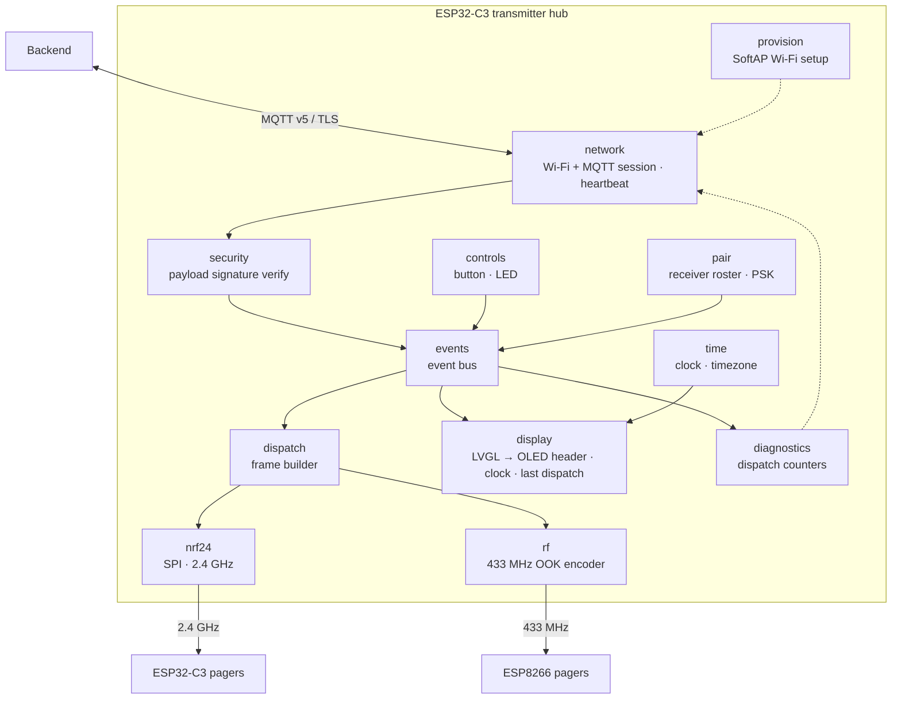
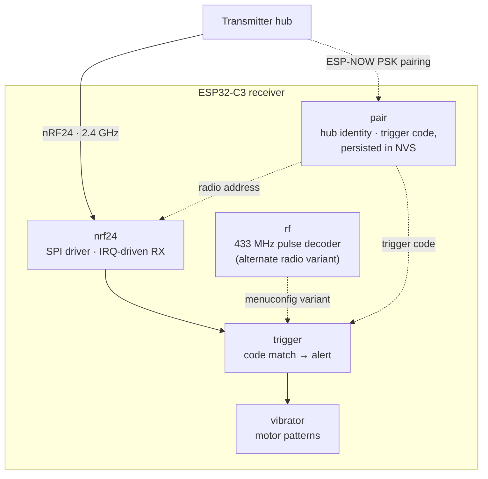
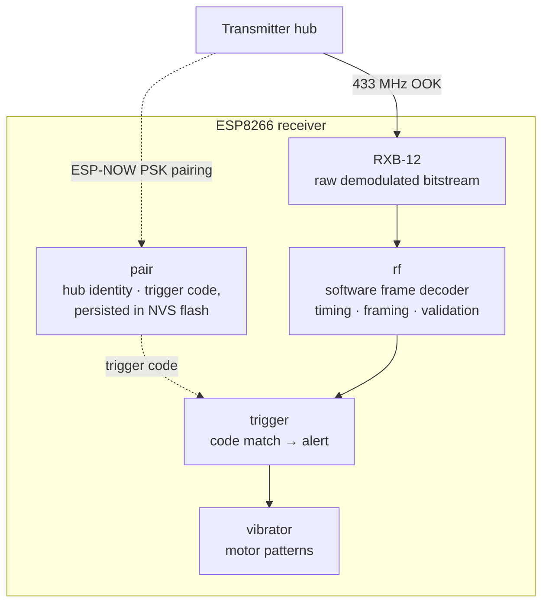

# Module READMEs Implementation Plan

> **For agentic workers:** REQUIRED SUB-SKILL: Use superpowers:subagent-driven-development (recommended) or superpowers:executing-plans to implement this plan task-by-task. Steps use checkbox (`- [ ]`) syntax for tracking.

**Goal:** Replace scaffold/missing READMEs across the NotiGuide workspace with a unified, portfolio-grade set: one master README plus six module READMEs, per `docs/spec/Module READMEs Spec.md`.

**Architecture:** Shared spine (intro → badges → ecosystem → features → highlights → architecture → family slot → getting started → structure → sign-off) with three family profiles (backend / web / firmware). Every README is a standalone Markdown file in its own git repo; the two receiver READMEs live on different branches of the same repo.

**Tech Stack:** Markdown, shields.io badges (simple-icons slugs), Mermaid diagrams.

---

## Global rules (read before any task)

1. **No commits.** Write files only. The author decides when and what to commit.
2. **Tone:** natural and engaging, the way a good README reads — confident, concrete, first-person-plural-free. Short sentences. No marketing superlatives ("blazingly fast", "cutting-edge"), no roadmap promises, no AI-flavored filler ("seamlessly", "robust", "comprehensive"). Present tense, describe only what the code does today. It should read like the developer wrote it about their own project.
3. **Verify before you write.** Each task starts with fact-check steps. If a draft claim contradicts the code, fix the claim, not the code. Drafts below are grounded in the codebase as of 2026-06-10 but the code is the source of truth.
4. **Mermaid only** for diagrams — never ASCII art.
5. **Photo placeholders** use exactly this two-line pattern (the author replaces them later):

   ```markdown
   > 📷 *Screenshot of the live queue dashboard — coming soon*
   <!-- PHOTO: admin dashboard, queue management page with active tickets -->
   ```

6. **Sign-off** is the last line of every README, after a `---` rule:

   ```markdown
   _**Created by Minh Hai Hoang. June 2026**_
   ```

7. After all tasks, log the work in `docs/CHANGELOGS.md` (Task 8), including anything skipped.
8. **All verification commands run from the workspace root** (`/home/thomas/Coding/notiguide`) unless a task says otherwise.

## Validated badge reference

All logo slugs below were verified to render on shields.io (logo embeds as base64 in the SVG), and hex colors were pulled from the simple-icons CDN on 2026-06-10. **Do not invent new slugs** — `freertos`, `zustand`, and `recharts` have **no** simple-icons logo (FreeRTOS gets a logo-less badge; zustand/recharts get no badge).

| Tech | Badge markup |
|------|--------------|
| Kotlin | `<a href="https://kotlinlang.org/"></a>` |
| Spring Boot | `<a href="https://spring.io/projects/spring-boot"></a>` |
| Spring Security | `<a href="https://spring.io/projects/spring-security"></a>` |
| Java 21 | `<a href="https://openjdk.org/"></a>` |
| TimescaleDB | `<a href="https://www.timescale.com/"></a>` |
| PostgreSQL | `<a href="https://www.postgresql.org/"></a>` |
| Redis | `<a href="https://redis.io/"></a>` |
| Lua | `<a href="https://www.lua.org/"></a>` |
| MQTT | `<a href="https://mqtt.org/"></a>` |
| Firebase | `<a href="https://firebase.google.com/"></a>` |
| Gradle | `<a href="https://gradle.org/"></a>` |
| Docker | `<a href="https://www.docker.com/"></a>` |
| Next.js | `<a href="https://nextjs.org/"></a>` |
| React | `<a href="https://react.dev/"></a>` |
| TypeScript | `<a href="https://www.typescriptlang.org/"></a>` |
| Tailwind CSS | `<a href="https://tailwindcss.com/"></a>` |
| shadcn/ui | `<a href="https://ui.shadcn.com/"></a>` |
| Biome | `<a href="https://biomejs.dev/"></a>` |
| Vitest | `<a href="https://vitest.dev/"></a>` |
| Yarn | `<a href="https://yarnpkg.com/"></a>` |
| ESP-IDF | `<a href="https://docs.espressif.com/projects/esp-idf/en/stable/esp32c3/"></a>` |
| ESP8266 RTOS SDK | `<a href="https://github.com/espressif/ESP8266_RTOS_SDK"></a>` |
| C | `<a href="https://en.cppreference.com/w/c"></a>` |
| FreeRTOS | `<a href="https://www.freertos.org/"></a>` *(no logo — slug doesn't exist)* |
| LVGL | `<a href="https://lvgl.io/"></a>` |
| CMake | `<a href="https://cmake.org/"></a>` |

**Badge render check** (run after writing each README; every listed slug must print `1`):

```bash
for slug in kotlin springboot openjdk timescale redis lua mqtt firebase nextdotjs react typescript tailwindcss shadcnui biome vitest yarn espressif c lvgl cmake postgresql springsecurity gradle docker; do
  echo "$slug: $(curl -s "https://img.shields.io/badge/-T-blue?logo=$slug" | grep -c 'data:image')"
done
```

Expected: every line ends in `1`.

## Canonical ecosystem table

Used verbatim in every README's "The NotiGuide System" section. In each file, replace the row for the **current** repo: bold the repository name and remove its link (e.g., `| **notiguide-be** (this repo) | ... |`).

```markdown
| Repository | Role |
|------------|------|
| [notiguide](https://github.com/Thomas-Hoang-04/notiguide) | Workspace superproject — system docs and submodule index |
| [notiguide-be](https://github.com/Thomas-Hoang-04/notiguide-be) | Reactive Kotlin/Spring Boot API — queue engine, auth, analytics, device orchestration |
| [notiguide-admin](https://github.com/Thomas-Hoang-04/notiguide-admin) | Next.js dashboard for store staff — live queue control, dispatch, analytics |
| [notiguide-client](https://github.com/Thomas-Hoang-04/notiguide-client) | Next.js customer app — join queues, track position, receive web push |
| [notiguide-transmitter](https://github.com/Thomas-Hoang-04/notiguide-transmitter) | ESP32-C3 hub bridging MQTT dispatches to RF pager calls |
| [notiguide-receiver (`esp32`)](https://github.com/Thomas-Hoang-04/notiguide-receiver/tree/esp32) | ESP32-C3 pager on the 2.4 GHz nRF24 link |
| [notiguide-receiver (`esp8266`)](https://github.com/Thomas-Hoang-04/notiguide-receiver/tree/esp8266) | ESP8266 pager on the 433 MHz link |
```

The intro sentence above the table (adapt the final clause per module): *"NotiGuide is an end-to-end queue management and notification system for stores — customers join a virtual queue from their phone, staff run the floor from a dashboard, and calls reach people through web push or dedicated RF pagers. This repository is the `<role>`."*

---

### Task 1: Master README (`/home/thomas/Coding/notiguide/README.md`)

**Files:**
- Create: `/home/thomas/Coding/notiguide/README.md`

- [x] **Step 1: Verify superproject layout**

Run: `cat /home/thomas/Coding/notiguide/.gitmodules && ls /home/thomas/Coding/notiguide/docs`
Expected: six submodules (backend, web, client-web, transmitter, receiver-esp32 on branch `esp32`, receiver-esp8266 on branch `esp8266`); `docs/` with `CHANGELOGS.md`, `done/`, `planned/`, `spec/`, `walkthrough/`.

- [x] **Step 2: Write the file**

Write `/home/thomas/Coding/notiguide/README.md` with this content (adjust only where verification contradicts it):

````markdown
# NotiGuide

NotiGuide is an end-to-end queue management and notification system for stores. Customers join a virtual queue from their phone and watch their position live. Staff run the floor from an admin dashboard — calling, serving, and redirecting tickets in real time. When a ticket is called, the notification reaches the customer wherever they are: as a web push in their browser, or as a buzz on a dedicated RF pager in their hand.

What makes it interesting is the full vertical slice: a reactive Kotlin backend with an atomic Redis queue engine, two bilingual Next.js apps, and custom ESP32/ESP8266 firmware speaking 2.4 GHz and 433 MHz radio — all designed, built, and wired together in this workspace.

## Techstack

<p>
  <a href="https://kotlinlang.org/"></a>
  <a href="https://spring.io/projects/spring-boot"></a>
  <a href="https://www.timescale.com/"></a>
  <a href="https://redis.io/"></a>
  <a href="https://mqtt.org/"></a>
  <a href="https://firebase.google.com/"></a>
  <a href="https://nextjs.org/"></a>
  <a href="https://react.dev/"></a>
  <a href="https://www.typescriptlang.org/"></a>
  <a href="https://tailwindcss.com/"></a>
  <a href="https://ui.shadcn.com/"></a>
  <a href="https://docs.espressif.com/projects/esp-idf/en/stable/esp32c3/"></a>
  <a href="https://github.com/espressif/ESP8266_RTOS_SDK"></a>
  <a href="https://en.cppreference.com/w/c"></a>
  <a href="https://www.freertos.org/"></a>
  <a href="https://lvgl.io/"></a>
  <a href="https://www.docker.com/"></a>
</p>

## System Architecture



## Modules

| Module | Stack | Role |
|--------|-------|------|
| [notiguide-be](https://github.com/Thomas-Hoang-04/notiguide-be) | Kotlin · Spring Boot 3.5 · WebFlux · R2DBC | Reactive API: queue engine, auth, analytics, device orchestration |
| [notiguide-admin](https://github.com/Thomas-Hoang-04/notiguide-admin) | Next.js 16 · React 19 · Tailwind 4 | Staff dashboard: live queue control, pager dispatch, analytics |
| [notiguide-client](https://github.com/Thomas-Hoang-04/notiguide-client) | Next.js 16 · React 19 · Firebase | Customer app: join queues, track position, web push |
| [notiguide-transmitter](https://github.com/Thomas-Hoang-04/notiguide-transmitter) | ESP-IDF v6.0 · C · LVGL | Dual-radio hub: MQTT in, nRF24 + 433 MHz out, OLED status UI |
| [notiguide-receiver (`esp32`)](https://github.com/Thomas-Hoang-04/notiguide-receiver/tree/esp32) | ESP-IDF v6.0 · C | 2.4 GHz pager with vibration alert |
| [notiguide-receiver (`esp8266`)](https://github.com/Thomas-Hoang-04/notiguide-receiver/tree/esp8266) | ESP8266 RTOS SDK · C | 433 MHz pager with vibration alert |

## Key Capabilities

- **Real-time queueing** — atomic ticket lifecycle (join → call → serve) backed by Redis Lua scripts, with TTL-driven cleanup and SSE live updates.
- **Two notification paths** — Firebase Cloud Messaging for browsers, MQTT-to-RF for physical pagers; both fire from the same dispatch action.
- **Physical pager fleet** — enrollment tokens, local PSK pairing, roster sync, and a transmitter hub with an OLED status screen.
- **Analytics** — queue KPIs on TimescaleDB, charted in the admin dashboard.
- **Bilingual by design** — every UI ships in English and Vietnamese, with copy written natively rather than translated.

## Gallery

> 📷 *Admin dashboard — live queue management — coming soon*
<!-- PHOTO: admin dashboard, queue page with active tickets and dispatch controls -->

> 📷 *Customer app — queue tracking on mobile — coming soon*
<!-- PHOTO: client-web ticket view showing live position -->

> 📷 *Assembled transmitter hub — coming soon*
<!-- PHOTO: transmitter hub with OLED, button, both radio modules visible -->

> 📷 *Assembled pager receivers (ESP32-C3 and ESP8266) — coming soon*
<!-- PHOTO: both receiver builds side by side -->

## Repository Layout

This repository is a superproject: each module is a git submodule with its own history, and `docs/` carries the cross-cutting design documents.

```
├── backend/            — notiguide-be          (Kotlin/Spring Boot API)
├── web/                — notiguide-admin       (staff dashboard)
├── client-web/         — notiguide-client      (customer app)
├── transmitter/        — notiguide-transmitter (ESP32-C3 hub firmware)
├── receiver-esp32/     — notiguide-receiver    (branch: esp32)
├── receiver-esp8266/   — notiguide-receiver    (branch: esp8266)
└── docs/               — specs, plans, changelogs, style guides
```

```bash
git clone --recurse-submodules https://github.com/Thomas-Hoang-04/notiguide.git
```

---

_**Created by Minh Hai Hoang. June 2026**_
````

- [x] **Step 3: Validate badges**

Run the badge render check from "Validated badge reference" for the slugs used here.
Expected: all `1`.

- [x] **Step 4: Proofread**

Read the file top to bottom once. Check: no marketing filler, no future tense, ecosystem/modules links resolve to the URLs in `.gitmodules`, Mermaid block has balanced quotes/brackets, sign-off is the last line.

---

### Task 2: Backend README (`backend/README.md`)

**Files:**
- Create: `/home/thomas/Coding/notiguide/backend/README.md`

- [x] **Step 1: Verify claims against code**

Run:
```bash
grep -rh '@RequestMapping' backend/src/main/kotlin --include='*Controller.kt' | grep -o '"/api[^"]*"' | sort -u
ls backend/src/main/kotlin/com/thomas/notiguide/core backend/src/main/kotlin/com/thomas/notiguide/domain
grep -E 'kotlin\(|springframework.boot..version|firebase-admin|paho|java-jwt' backend/build.gradle.kts
```
Expected: 12 base paths (auth, admins, admins/requests, analytics, devices, devices/enrollment-tokens, orgs, queue/admin, queue/public, stores, stores/{id}/slugs, stores/{id}/service-types); core packages include `sse`, `tenant`, `mqtt`, `firebase`, `ratelimit`; Kotlin 2.3.x, Boot 3.5.x. If the SSE or tenant claim in the draft is wrong, correct the Features/Highlights bullets accordingly.

- [x] **Step 2: Write the file**

Write `/home/thomas/Coding/notiguide/backend/README.md`:

````markdown
# NotiGuide — Backend

The reactive core of NotiGuide: a Kotlin/Spring Boot WebFlux API that runs virtual queues for stores. Customers join through public endpoints, staff manage the floor through authenticated ones, and every "call next" fans out to web push and physical RF pagers at once.

The stack is non-blocking end to end — Kotlin coroutines in every controller and service, R2DBC for PostgreSQL, reactive Lettuce for Redis — and the queue itself is a set of Redis Lua scripts, so ticket state changes stay atomic no matter how many counters are serving.

## Techstack

<p>
  <a href="https://kotlinlang.org/"></a>
  <a href="https://spring.io/projects/spring-boot"></a>
  <a href="https://spring.io/projects/spring-security"></a>
  <a href="https://openjdk.org/"></a>
  <a href="https://www.timescale.com/"></a>
  <a href="https://www.postgresql.org/"></a>
  <a href="https://redis.io/"></a>
  <a href="https://www.lua.org/"></a>
  <a href="https://mqtt.org/"></a>
  <a href="https://firebase.google.com/"></a>
  <a href="https://gradle.org/"></a>
  <a href="https://www.docker.com/"></a>
</p>

## The NotiGuide System

NotiGuide is an end-to-end queue management and notification system for stores — customers join a virtual queue from their phone, staff run the floor from a dashboard, and calls reach people through web push or dedicated RF pagers. This repository is the API that everything else talks to.

| Repository | Role |
|------------|------|
| [notiguide](https://github.com/Thomas-Hoang-04/notiguide) | Workspace superproject — system docs and submodule index |
| **notiguide-be** (this repo) | Reactive Kotlin/Spring Boot API — queue engine, auth, analytics, device orchestration |
| [notiguide-admin](https://github.com/Thomas-Hoang-04/notiguide-admin) | Next.js dashboard for store staff — live queue control, dispatch, analytics |
| [notiguide-client](https://github.com/Thomas-Hoang-04/notiguide-client) | Next.js customer app — join queues, track position, receive web push |
| [notiguide-transmitter](https://github.com/Thomas-Hoang-04/notiguide-transmitter) | ESP32-C3 hub bridging MQTT dispatches to RF pager calls |
| [notiguide-receiver (`esp32`)](https://github.com/Thomas-Hoang-04/notiguide-receiver/tree/esp32) | ESP32-C3 pager on the 2.4 GHz nRF24 link |
| [notiguide-receiver (`esp8266`)](https://github.com/Thomas-Hoang-04/notiguide-receiver/tree/esp8266) | ESP8266 pager on the 433 MHz link |

## Features

- **Redis-backed queue engine** — join, call, serve, and cancel tickets with atomic Lua scripts; per-store queues, serving sets, and daily counters.
- **Public customer endpoints** — join and track a queue by store slug, no account needed, with SSE for live position updates.
- **Role-based administration** — organizations, stores, admins, and join requests, split across `SUPER_ADMIN` and `ADMIN` roles.
- **Dual notification fan-out** — Firebase Cloud Messaging to browsers and MQTT v5 to transmitter hubs, both triggered by the same dispatch.
- **Pager fleet management** — device enrollment tokens, registration, and per-store rosters for the physical receivers.
- **Analytics** — queue KPIs aggregated on TimescaleDB and served to the admin dashboard.
- **Defense in depth** — sliding-window rate limiting, strict CORS, validated inputs, and structured error responses on every route.

## Technical Highlights

- **Atomic queue semantics in Lua.** Every ticket transition runs as a single Redis script, so concurrent counters can't double-call a ticket. TTLs drive the lifecycle (12 h waiting, 30 min called), and a keyspace-expiry listener cleans up what time forgets.
- **Reactive all the way down.** WebFlux + Kotlin coroutines, R2DBC PostgreSQL, and reactive Redis — no blocking thread pools hiding in the stack.
- **JWT without stale privileges.** RSA-512 tokens are verified with the public key only, and authorities are re-read from the database on every request, so a role change takes effect immediately.
- **Argon2 password hashing** with Spring Security's recommended parameters.
- **Rate limiting at the door.** A Redis Lua sliding-window limiter runs as the first filter in the chain, with separate strict/auth/standard tiers and `X-RateLimit-*` headers exposed through CORS.
- **Graceful degradation.** Firebase and MQTT integrations are conditional beans — the API boots and serves queues even when a notification channel is unconfigured.

## Architecture



## API Overview

The surface area at a glance — not a full reference.

| Group | Base path | Auth | Purpose |
|-------|-----------|------|---------|
| Auth | `/api/auth` | Public | Admin login and token issuance |
| Public queue | `/api/queue/public/{publicId}` | Public | Join, track, and cancel tickets |
| Admin queue | `/api/queue/admin/{storeId}` | Admin | Call next, serve, cancel, dispatch pagers |
| Stores | `/api/stores` | Admin | Store CRUD, plus `/slugs` and `/service-types` |
| Admins | `/api/admins` | Admin | Admin CRUD and `/requests` (join requests) |
| Organizations | `/api/orgs` | Admin | Organization management |
| Devices | `/api/devices` | Admin | Pager registration, plus `/enrollment-tokens` |
| Analytics | `/api/analytics` | Admin | Queue KPIs and time-series stats |

## Getting Started

You need JDK 21 and Docker. Everything else is wired up by Spring Boot's Docker Compose support.

```bash
docker compose up -d     # TimescaleDB (PostgreSQL 17) + Redis
./gradlew bootRun        # dev profile auto-connects to the compose services
./gradlew test           # unit + WebFlux slice tests
```

Dev credentials (RSA key pair, Firebase service account) load from the classpath; production reads them from environment variables instead. The database schema initializes from `src/main/resources/db/schema.sql` on first start.

## Project Structure

```
src/main/kotlin/com/thomas/notiguide/
├── core/                — cross-cutting infrastructure
│   ├── security/ jwt/   — RSA-512 JWT auth, Argon2 hashing, route rules
│   ├── redis/ ratelimit/ — queue state, TTL policy, Lua sliding-window limiter
│   ├── mqtt/ firebase/ sse/ — the three notification/live-update channels
│   ├── device/ store/   — infra halves: command signing + MQTT publishing, slug rules (domain logic lives in domain/)
│   └── tenant/ database/ config/ exception/ — multi-tenancy, R2DBC, app config, error handling
├── domain/              — one package per business domain
│   ├── queue/           — Lua scripts, ticket lifecycle, public + admin controllers
│   ├── admin/ organization/ store/ — accounts, orgs, stores, slugs, service types
│   ├── device/          — pager enrollment and fleet management
│   └── analytics/       — KPI aggregation
└── shared/              — principals and access helpers
```

---

_**Created by Minh Hai Hoang. June 2026**_
````

- [x] **Step 3: Validate badges**

Run the badge render check for: `kotlin springboot springsecurity openjdk timescale postgresql redis lua mqtt firebase gradle docker`.
Expected: all `1`.

- [x] **Step 4: Proofread**

Same checklist as Task 1 Step 4, plus: confirm every API table row matches a real `@RequestMapping` from Step 1; confirm `core/` subpackage names in the tree match the actual directory listing.

---

### Task 3: Admin dashboard README (`web/README.md`)

**Files:**
- Modify (full replace): `/home/thomas/Coding/notiguide/web/README.md`

- [x] **Step 1: Verify claims against code**

Run:
```bash
cat web/package.json | grep -E '"(next|react|next-intl|recharts|zustand|sonner|react-day-picker)"'
ls web/src web/src/features
```
Expected: Next 16.x, React 19.x, next-intl 4.x, recharts, zustand present; `src/` has `app components features hooks i18n lib messages store styles types` and `proxy.ts`. Note the actual `features/` subfolders for the Features bullets — adjust the draft if a claimed feature area (queue, analytics, devices, stores) has no corresponding code.

- [x] **Step 2: Write the file** (replace the create-next-app scaffold entirely)

Write `/home/thomas/Coding/notiguide/web/README.md`:

````markdown
# NotiGuide — Admin Dashboard

The dashboard where store staff run the floor. Tickets stream in live; staff call the next customer, mark them served, or dispatch a physical pager — all from one queue board. Around it sit the management surfaces: organizations, stores, service types, admin accounts, device fleets, and an analytics view charting how the queues actually behave.

The whole UI ships in English and Vietnamese — not as an afterthought translation, but with copy written natively for each language — and respects light and dark themes throughout.

## Techstack

<p>
  <a href="https://nextjs.org/"></a>
  <a href="https://react.dev/"></a>
  <a href="https://www.typescriptlang.org/"></a>
  <a href="https://tailwindcss.com/"></a>
  <a href="https://ui.shadcn.com/"></a>
  <a href="https://biomejs.dev/"></a>
  <a href="https://vitest.dev/"></a>
  <a href="https://yarnpkg.com/"></a>
</p>

## The NotiGuide System

NotiGuide is an end-to-end queue management and notification system for stores — customers join a virtual queue from their phone, staff run the floor from a dashboard, and calls reach people through web push or dedicated RF pagers. This repository is that dashboard.

| Repository | Role |
|------------|------|
| [notiguide](https://github.com/Thomas-Hoang-04/notiguide) | Workspace superproject — system docs and submodule index |
| [notiguide-be](https://github.com/Thomas-Hoang-04/notiguide-be) | Reactive Kotlin/Spring Boot API — queue engine, auth, analytics, device orchestration |
| **notiguide-admin** (this repo) | Next.js dashboard for store staff — live queue control, dispatch, analytics |
| [notiguide-client](https://github.com/Thomas-Hoang-04/notiguide-client) | Next.js customer app — join queues, track position, receive web push |
| [notiguide-transmitter](https://github.com/Thomas-Hoang-04/notiguide-transmitter) | ESP32-C3 hub bridging MQTT dispatches to RF pager calls |
| [notiguide-receiver (`esp32`)](https://github.com/Thomas-Hoang-04/notiguide-receiver/tree/esp32) | ESP32-C3 pager on the 2.4 GHz nRF24 link |
| [notiguide-receiver (`esp8266`)](https://github.com/Thomas-Hoang-04/notiguide-receiver/tree/esp8266) | ESP8266 pager on the 433 MHz link |

## Features

- **Live queue board** — waiting and serving tickets update in real time over SSE; call, serve, and cancel without a refresh.
- **Pager dispatch** — pick a paired receiver right from the queue board and the call goes out over RF.
- **Analytics** — queue KPIs charted with Recharts, with date-range picking and skeleton loading states.
- **Fleet management** — enroll pager devices with one-time tokens and manage per-store rosters.
- **Org & store administration** — organizations, stores, custom public slugs, service types, admin accounts, and join requests.
- **Bilingual UI** — full English and Vietnamese coverage via next-intl, plus light/dark themes.

## Technical Highlights

- **Next.js 16 App Router with React 19** and the React Compiler enabled — no manual memoization.
- **shadcn/ui on Base UI primitives**, styled with Tailwind CSS 4; complex styles live in dedicated CSS files, not mile-long class strings.
- **Zustand stores** keep server state and UI state separated and testable.
- **Locale routing in middleware** — `src/proxy.ts` (Next.js middleware) drives next-intl's en/vi routing, while the `lib/` API layer talks to the backend with cookie-based auth and automatic token refresh.
- **Native-quality Vietnamese.** The `vi.json` catalog is written by hand to read like Vietnamese, not like translated English — structural parity with `en.json` is enforced, phrasing is not.
- **Vitest + Biome** — fast unit tests, single-tool lint and format.

## Architecture



## Screenshots

> 📷 *Live queue board with active tickets and dispatch controls — coming soon*
<!-- PHOTO: queue management page, tickets in waiting/serving columns -->

> 📷 *Analytics view with KPI charts — coming soon*
<!-- PHOTO: analytics page, charts with date range picker -->

> 📷 *Device fleet management — coming soon*
<!-- PHOTO: devices page with enrolled pagers and enrollment token dialog -->

## Getting Started

You need a recent Node.js LTS with Corepack (the repo pins Yarn 4) and a running [NotiGuide backend](https://github.com/Thomas-Hoang-04/notiguide-be).

```bash
yarn install
yarn dev          # http://localhost:3000
yarn build        # production build
yarn lint         # biome check
yarn test         # vitest run
```

## Project Structure

```
src/
├── app/          — App Router routes and layouts
├── features/     — domain UI: queue, analytics, device, store, …
├── components/   — shared shadcn/ui components
├── store/        — zustand stores
├── hooks/ lib/   — shared hooks and utilities
├── i18n/ messages/ — next-intl setup + en/vi catalogs
├── styles/       — global and per-feature CSS
├── types/        — shared TypeScript types
└── proxy.ts      — Next.js middleware (next-intl locale routing)
```

---

_**Created by Minh Hai Hoang. June 2026**_
````

- [x] **Step 3: Validate badges**

Run the badge render check for: `nextdotjs react typescript tailwindcss shadcnui biome vitest yarn`.
Expected: all `1`.

- [x] **Step 4: Proofread**

Standard checklist; additionally confirm the `features/` areas named in the tree comment match Step 1's listing, and the SSE arrow claim holds (look for an SSE/EventSource usage under `web/src`; if absent, change "over SSE" to "live updates" and drop the dashed arrow).

---

### Task 4: Client app README (`client-web/README.md`)

**Files:**
- Modify (full replace): `/home/thomas/Coding/notiguide/client-web/README.md`

- [x] **Step 1: Verify claims against code**

Run:
```bash
cat client-web/package.json | grep -E '"(next|react|firebase|next-intl)"'
ls client-web/src client-web/src/features client-web/public
grep -rl "storage-access\|requestStorageAccess" client-web/src | head -3
```
Expected: firebase 12.x present; a service worker file under `public/` (e.g., `firebase-messaging-sw.js`). If the Storage Access API grep returns nothing, drop that highlight bullet.

- [x] **Step 2: Write the file** (replace the scaffold entirely)

Write `/home/thomas/Coding/notiguide/client-web/README.md`:

````markdown
# NotiGuide — Client App

The customer's side of NotiGuide. Open a store's link, take a number, and put your phone back in your pocket — your place in line is tracked live, and when staff call you, a push notification finds you. No account, no app install, no standing around staring at a counter display.

It's a deliberately small Next.js app: mobile-first, bilingual (English/Vietnamese), with Firebase Cloud Messaging wired through a service worker so notifications arrive even with the tab in the background.

## Techstack

<p>
  <a href="https://nextjs.org/"></a>
  <a href="https://react.dev/"></a>
  <a href="https://www.typescriptlang.org/"></a>
  <a href="https://tailwindcss.com/"></a>
  <a href="https://ui.shadcn.com/"></a>
  <a href="https://firebase.google.com/"></a>
  <a href="https://biomejs.dev/"></a>
  <a href="https://vitest.dev/"></a>
  <a href="https://yarnpkg.com/"></a>
</p>

## The NotiGuide System

NotiGuide is an end-to-end queue management and notification system for stores — customers join a virtual queue from their phone, staff run the floor from a dashboard, and calls reach people through web push or dedicated RF pagers. This repository is the app the customer holds.

| Repository | Role |
|------------|------|
| [notiguide](https://github.com/Thomas-Hoang-04/notiguide) | Workspace superproject — system docs and submodule index |
| [notiguide-be](https://github.com/Thomas-Hoang-04/notiguide-be) | Reactive Kotlin/Spring Boot API — queue engine, auth, analytics, device orchestration |
| [notiguide-admin](https://github.com/Thomas-Hoang-04/notiguide-admin) | Next.js dashboard for store staff — live queue control, dispatch, analytics |
| **notiguide-client** (this repo) | Next.js customer app — join queues, track position, receive web push |
| [notiguide-transmitter](https://github.com/Thomas-Hoang-04/notiguide-transmitter) | ESP32-C3 hub bridging MQTT dispatches to RF pager calls |
| [notiguide-receiver (`esp32`)](https://github.com/Thomas-Hoang-04/notiguide-receiver/tree/esp32) | ESP32-C3 pager on the 2.4 GHz nRF24 link |
| [notiguide-receiver (`esp8266`)](https://github.com/Thomas-Hoang-04/notiguide-receiver/tree/esp8266) | ESP8266 pager on the 433 MHz link |

## Features

- **Join by link** — every store exposes a public slug; opening it shows the queue and a join form, no sign-up involved.
- **Live ticket tracking** — position and status refresh automatically while you wait.
- **Web push when called** — opt in once and the call notification arrives via FCM, even with the browser tab in the background.
- **Bilingual & themed** — English and Vietnamese, light and dark, mobile-first layout.

## Technical Highlights

- **FCM through a service worker** — push tokens registered with the backend per ticket, notifications delivered by `firebase-messaging` in the background.
- **Next.js 16 + React 19 with the React Compiler** — the UI stays simple and the compiler keeps it fast.
- **Resilient API layer** — a typed `fetch` wrapper with request timeouts and structured error types (rate-limit, not-found, network) pointed at the backend's public queue API, polling at an adaptive interval.
- **Vietnamese written natively** — the `vi.json` catalog reads like a Vietnamese speaker wrote it, because one did; structure mirrors `en.json`, phrasing doesn't.

## Architecture



## Screenshots

> 📷 *Store queue page with join form — coming soon*
<!-- PHOTO: public store page on mobile, queue status + join button -->

> 📷 *Live ticket view with position — coming soon*
<!-- PHOTO: ticket tracking screen showing position in line -->

> 📷 *Call notification arriving — coming soon*
<!-- PHOTO: browser push notification for a called ticket -->

## Getting Started

You need a recent Node.js LTS with Corepack (the repo pins Yarn 4) and a running [NotiGuide backend](https://github.com/Thomas-Hoang-04/notiguide-be). Configuration lives in `.env.local`: the backend URL (`NEXT_PUBLIC_API_BASE_URL`) plus the Firebase keys for web push.

```bash
yarn install
yarn dev          # http://localhost:3000
yarn build        # production build
yarn lint         # biome check
yarn test         # vitest run
```

## Project Structure

```
src/
├── app/          — App Router routes (store pages, ticket views)
├── features/     — domain logic: queue (join · live tracking), store (public store data)
├── components/   — shared shadcn/ui components
├── store/        — zustand stores
├── hooks/ lib/   — shared hooks and utilities
├── i18n/ messages/ — next-intl setup + en/vi catalogs
├── styles/       — global and per-feature CSS
├── types/        — shared TypeScript types
└── proxy.ts      — Next.js middleware (next-intl locale routing)
```

---

_**Created by Minh Hai Hoang. June 2026**_
````

- [x] **Step 3: Validate badges**

Run the badge render check for: `nextdotjs react typescript tailwindcss shadcnui firebase biome vitest yarn`.
Expected: all `1`.

- [x] **Step 4: Proofread**

Standard checklist; additionally verify the service-worker claim (file under `client-web/public/`) and the `features/` names in the tree against Step 1 output.

---

### Task 5: Transmitter README (`transmitter/README.md`)

**Files:**
- Modify (full replace): `/home/thomas/Coding/notiguide/transmitter/README.md`

- [x] **Step 1: Verify claims against code**

Run:
```bash
ls transmitter/main
cat transmitter/main/idf_component.yml
grep -E 'OLED|SSD1306|ssd1306' -ri transmitter/main/display | head -5
grep -m1 'CONFIG_IDF_TARGET=' transmitter/sdkconfig
```
Expected: modules `config controls diagnostics dispatch display events network nrf24 pair provision rf security serial time utils`; deps `espressif/mqtt`, `lvgl/lvgl 8.3.11`, `esp_lvgl_port`, `espressif/button`, `espressif/cjson`; target `esp32c3`. Confirm the OLED controller (SSD1306 expected) — if the display driver names a different chip, use that name in the Hardware table.

- [x] **Step 2: Write the file** (replace the hello-world scaffold entirely)

Write `/home/thomas/Coding/notiguide/transmitter/README.md`:

````markdown
# NotiGuide — Transmitter Hub

The bridge between NotiGuide's cloud and its pagers. This ESP32-C3 firmware holds a TLS-secured MQTT v5 session to the backend, and when staff dispatch a call, it pushes the page out over radio — nRF24L01+ on 2.4 GHz for the ESP32 receivers, a 433 MHz OOK transmitter for the ESP8266 ones. A small OLED, driven by LVGL, shows connection state, a live clock, and the last dispatch at a glance.

It's a complete embedded application rather than a sketch: Wi-Fi provisioning over SoftAP, signed-payload verification against the backend's public key, local PSK-based receiver pairing with roster sync, a serial maintenance protocol, and a diagnostics heartbeat back to the backend.

## Techstack

<p>
  <a href="https://docs.espressif.com/projects/esp-idf/en/stable/esp32c3/"></a>
  <a href="https://en.cppreference.com/w/c"></a>
  <a href="https://www.freertos.org/"></a>
  <a href="https://lvgl.io/"></a>
  <a href="https://mqtt.org/"></a>
  <a href="https://cmake.org/"></a>
</p>

## The NotiGuide System

NotiGuide is an end-to-end queue management and notification system for stores — customers join a virtual queue from their phone, staff run the floor from a dashboard, and calls reach people through web push or dedicated RF pagers. This repository is the hub that turns a dispatch into a radio call.

| Repository | Role |
|------------|------|
| [notiguide](https://github.com/Thomas-Hoang-04/notiguide) | Workspace superproject — system docs and submodule index |
| [notiguide-be](https://github.com/Thomas-Hoang-04/notiguide-be) | Reactive Kotlin/Spring Boot API — queue engine, auth, analytics, device orchestration |
| [notiguide-admin](https://github.com/Thomas-Hoang-04/notiguide-admin) | Next.js dashboard for store staff — live queue control, dispatch, analytics |
| [notiguide-client](https://github.com/Thomas-Hoang-04/notiguide-client) | Next.js customer app — join queues, track position, receive web push |
| **notiguide-transmitter** (this repo) | ESP32-C3 hub bridging MQTT dispatches to RF pager calls |
| [notiguide-receiver (`esp32`)](https://github.com/Thomas-Hoang-04/notiguide-receiver/tree/esp32) | ESP32-C3 pager on the 2.4 GHz nRF24 link |
| [notiguide-receiver (`esp8266`)](https://github.com/Thomas-Hoang-04/notiguide-receiver/tree/esp8266) | ESP8266 pager on the 433 MHz link |

## Features

- **MQTT v5 over TLS** — subscribes to per-device dispatch topics and verifies payload signatures against the backend's public key before acting.
- **Dual-radio dispatch** — nRF24L01+ (2.4 GHz) for ESP32-C3 receivers and 433 MHz OOK for ESP8266 receivers, addressed per paired device.
- **OLED status UI** — LVGL-rendered header with connectivity and clock, plus a last-dispatch screen showing who was paged and when.
- **Local receiver pairing** — PSK challenge-response over ESP-NOW with a bounded roster, synced back to the backend.
- **SoftAP Wi-Fi provisioning** — first boot opens an access point for credential setup; no hardcoded Wi-Fi.
- **Operations hooks** — serial maintenance protocol, status heartbeat to the backend, button and LED controls, timezone-aware clock.

## Technical Highlights

- **Event-driven FreeRTOS design** — radio, display, network, and input each run in their own task, talking through an event layer instead of shared globals.
- **Security at the edge** — dispatch payloads are signature-verified on-device, so a compromised broker can't fake a page.
- **LVGL on a C3** — a full widget pipeline (via `esp_lvgl_port`) kept lean enough for a single-core RISC-V MCU and an I²C OLED.
- **Config without recompiling** — radios, pins, pairing PSK, MQTT topic prefix, and timezone are all `menuconfig` options.

## Architecture



## Hardware

| Part | Role |
|------|------|
| ESP32-C3 | Single-core RISC-V MCU with Wi-Fi, runs the whole hub |
| nRF24L01+ | 2.4 GHz link to the ESP32-C3 receivers (SPI) |
| FS1000A | 433 MHz OOK transmitter for the ESP8266 receivers |
| SSD1306 OLED | I²C status display, driven by LVGL |
| Push button + status LED | Local controls and state indication |

All GPIO assignments, radio parameters, and credentials are configurable through `idf.py menuconfig` — there is no fixed pinout to document.

> 📷 *Fully assembled transmitter hub — coming soon*
<!-- PHOTO: assembled hub showing OLED, button, nRF24 and FS1000A modules -->

## Getting Started

You need [ESP-IDF v6.0+](https://docs.espressif.com/projects/esp-idf/en/stable/esp32c3/get-started/index.html) with its environment exported.

```bash
idf.py set-target esp32c3
idf.py menuconfig        # Transmitter Hub Firmware → radios, pins, pairing, MQTT
idf.py build
idf.py -p <PORT> flash monitor
```

On first boot the hub opens a SoftAP for Wi-Fi provisioning, then connects to the backend over MQTT and starts listening for dispatches.

## Project Structure

```
main/
├── network/      — Wi-Fi + MQTT v5 session, status heartbeat
├── dispatch/     — turns verified dispatch events into radio frames
├── nrf24/ rf/    — 2.4 GHz driver and 433 MHz OOK encoder
├── display/      — LVGL UI: header, clock, last-dispatch screen
├── events/       — event bus tying the tasks together
├── pair/ provision/ — receiver pairing, SoftAP Wi-Fi setup
├── security/     — backend signature verification
├── serial/ diagnostics/ — maintenance protocol, persistent dispatch counters
├── controls/ time/ config/ utils/ — button/LED, clock, Kconfig glue
└── main.c        — boot sequence and task startup
```

---

_**Created by Minh Hai Hoang. June 2026**_
````

- [x] **Step 3: Validate badges**

Run the badge render check for: `espressif c lvgl mqtt cmake`.
Expected: all `1`.

- [x] **Step 4: Proofread**

Standard checklist; additionally confirm against Step 1: OLED controller name, the event-bus claim (`main/events/` exists), and the signature-verification claim (`main/security/` + `TRANSMITTER_BACKEND_PUBKEY_B64` in `Kconfig.projbuild`).

---

### Task 6: Receiver ESP32 README (`receiver-esp32/README.md`)

**Files:**
- Modify (full replace): `/home/thomas/Coding/notiguide/receiver-esp32/README.md`

- [x] **Step 1: Verify claims against code**

Run:
```bash
ls receiver-esp32/main
grep -m1 'CONFIG_IDF_TARGET=' receiver-esp32/sdkconfig
grep -ri 'vibrat' receiver-esp32/main/vibrator | head -3
git -C receiver-esp32 branch --show-current
```
Expected: modules `config nrf24 pair rf trigger vibrator`; target `esp32c3`; branch `esp32`.

- [x] **Step 2: Write the file** (replace the hello-world scaffold entirely)

Write `/home/thomas/Coding/notiguide/receiver-esp32/README.md`:

````markdown
# NotiGuide — Receiver (ESP32-C3)

The pager itself. This ESP32-C3 firmware listens on the 2.4 GHz nRF24 link for calls addressed to it, and when one lands, the device buzzes — the customer holding it knows it's their turn, no phone required.

It pairs locally with a transmitter hub over a PSK challenge-response handshake, then spends its life in a receive loop: frame in, address filter, trigger-code match, vibration out.

## Repository Branches

This repo hosts both pager variants, one per branch — they share a purpose but not a radio or an SDK:

- **`esp32` (this branch)** — ESP32-C3 + nRF24L01+ on 2.4 GHz, built with ESP-IDF v6.0.
- [**`esp8266`**](https://github.com/Thomas-Hoang-04/notiguide-receiver/tree/esp8266) — ESP8266 + RXB-12 on 433 MHz, built with the ESP8266 RTOS SDK.

## Techstack

<p>
  <a href="https://docs.espressif.com/projects/esp-idf/en/stable/esp32c3/"></a>
  <a href="https://en.cppreference.com/w/c"></a>
  <a href="https://www.freertos.org/"></a>
  <a href="https://cmake.org/"></a>
</p>

## The NotiGuide System

NotiGuide is an end-to-end queue management and notification system for stores — customers join a virtual queue from their phone, staff run the floor from a dashboard, and calls reach people through web push or dedicated RF pagers. This repository is the pager.

| Repository | Role |
|------------|------|
| [notiguide](https://github.com/Thomas-Hoang-04/notiguide) | Workspace superproject — system docs and submodule index |
| [notiguide-be](https://github.com/Thomas-Hoang-04/notiguide-be) | Reactive Kotlin/Spring Boot API — queue engine, auth, analytics, device orchestration |
| [notiguide-admin](https://github.com/Thomas-Hoang-04/notiguide-admin) | Next.js dashboard for store staff — live queue control, dispatch, analytics |
| [notiguide-client](https://github.com/Thomas-Hoang-04/notiguide-client) | Next.js customer app — join queues, track position, receive web push |
| [notiguide-transmitter](https://github.com/Thomas-Hoang-04/notiguide-transmitter) | ESP32-C3 hub bridging MQTT dispatches to RF pager calls |
| **notiguide-receiver (`esp32`)** (this branch) | ESP32-C3 pager on the 2.4 GHz nRF24 link |
| [notiguide-receiver (`esp8266`)](https://github.com/Thomas-Hoang-04/notiguide-receiver/tree/esp8266) | ESP8266 pager on the 433 MHz link |

## Features

- **2.4 GHz receive loop** — nRF24L01+ tuned to the hub's channel, filtering frames by paired address.
- **Local pairing** — PSK challenge-response over ESP-NOW with a transmitter hub; the device only answers its own hub afterwards.
- **Vibration alerts** — a paged call triggers the vibration motor pattern; no screen, no sound, no ambiguity.
- **Kconfig-driven setup** — the active radio (nRF24 or 433 MHz), pins, channel, and pairing parameters all live in `menuconfig`.

## Technical Highlights

- **Hardware-filtered receive path** — the nRF24L01+ does address matching in silicon and raises an IRQ, so the RX task only runs for frames that are plausibly its own.
- **Pairing that survives power loss** — the paired hub address and key persist in NVS flash; a pager handed out in the morning still knows its hub after a battery swap.
- **Small on purpose** — a handful of focused FreeRTOS tasks (radio, trigger, motor) with clear handoffs; the whole firmware is readable in one sitting.

## Architecture



## Hardware

| Part | Role |
|------|------|
| ESP32-C3 | Single-core RISC-V MCU running the receive loop |
| nRF24L01+ | 2.4 GHz radio listening to the hub (SPI) |
| Vibration motor | The actual "you're up" signal |

GPIO assignments and radio parameters are configurable through `idf.py menuconfig`.

> 📷 *Fully assembled ESP32-C3 receiver — coming soon*
<!-- PHOTO: assembled esp32 pager build, nRF24 module and vibration motor visible -->

## Getting Started

You need [ESP-IDF v6.0+](https://docs.espressif.com/projects/esp-idf/en/stable/esp32c3/get-started/index.html) with its environment exported.

```bash
idf.py set-target esp32c3
idf.py menuconfig        # Receiver Firmware → pins, radio, pairing
idf.py build
idf.py -p <PORT> flash monitor
```

Pair the receiver with a transmitter hub (see the [transmitter repo](https://github.com/Thomas-Hoang-04/notiguide-transmitter)) and it's ready to be handed to a customer.

## Project Structure

```
main/
├── nrf24/        — nRF24L01+ SPI driver (IRQ-driven RX task)
├── rf/           — 433 MHz pulse decoder (selectable radio variant)
├── pair/         — ESP-NOW PSK pairing and NVS persistence
├── trigger/      — matches trigger codes and fires alerts
├── vibrator/     — motor control patterns
├── config/       — Kconfig glue
└── main.c        — boot and task startup
```

---

_**Created by Minh Hai Hoang. June 2026**_
````

- [x] **Step 3: Validate badges**

Run the badge render check for: `espressif c cmake`.
Expected: all `1`.

- [x] **Step 4: Proofread**

Standard checklist; confirm the branch-link URLs and that the structure tree matches Step 1's `ls`. Verify the persistence highlight (`grep -ri 'nvs' receiver-esp32/main/pair | head -3` should hit) — if pairing state is stored some other way, reword "persist in flash" to match.

---

### Task 7: Receiver ESP8266 README (`receiver-esp8266/README.md`)

**Files:**
- Modify (full replace): `/home/thomas/Coding/notiguide/receiver-esp8266/README.md`

- [x] **Step 1: Verify claims against code**

Run:
```bash
ls receiver-esp8266/main
head -10 "receiver-esp8266/docs/ESP8266_MAKE_COMMANDS.md"
ls receiver-esp8266/main/provision
git -C receiver-esp8266 branch --show-current
```
Expected: modules `config pair provision rf trigger vibrator`; SDK is ESP8266_RTOS_SDK v3.x with GNU Make; note that `main/provision/` is an EMPTY stub (UART provisioning is designed in `docs/UART Provisioning Design.md` but not implemented) — the README must not claim working UART provisioning; branch `esp8266`.

- [x] **Step 2: Write the file** (replace the hello-world scaffold entirely)

Write `/home/thomas/Coding/notiguide/receiver-esp8266/README.md`:

````markdown
# NotiGuide — Receiver (ESP8266)

The 433 MHz variant of the NotiGuide pager. An RXB-12 superheterodyne module feeds this ESP8266 a raw OOK bitstream; the firmware decodes frames, matches them against its paired trigger code, and fires the vibration motor when a call comes in.

Where its ESP32 sibling leans on an SPI radio with hardware addressing, this build does the radio work in software on a much older MCU — which is exactly what makes it fun.

## Repository Branches

This repo hosts both pager variants, one per branch — they share a purpose but not a radio or an SDK:

- [**`esp32`**](https://github.com/Thomas-Hoang-04/notiguide-receiver/tree/esp32) — ESP32-C3 + nRF24L01+ on 2.4 GHz, built with ESP-IDF v6.0.
- **`esp8266` (this branch)** — ESP8266 + RXB-12 on 433 MHz, built with the ESP8266 RTOS SDK.

## Techstack

<p>
  <a href="https://github.com/espressif/ESP8266_RTOS_SDK"></a>
  <a href="https://en.cppreference.com/w/c"></a>
  <a href="https://www.freertos.org/"></a>
</p>

## The NotiGuide System

NotiGuide is an end-to-end queue management and notification system for stores — customers join a virtual queue from their phone, staff run the floor from a dashboard, and calls reach people through web push or dedicated RF pagers. This repository is the pager.

| Repository | Role |
|------------|------|
| [notiguide](https://github.com/Thomas-Hoang-04/notiguide) | Workspace superproject — system docs and submodule index |
| [notiguide-be](https://github.com/Thomas-Hoang-04/notiguide-be) | Reactive Kotlin/Spring Boot API — queue engine, auth, analytics, device orchestration |
| [notiguide-admin](https://github.com/Thomas-Hoang-04/notiguide-admin) | Next.js dashboard for store staff — live queue control, dispatch, analytics |
| [notiguide-client](https://github.com/Thomas-Hoang-04/notiguide-client) | Next.js customer app — join queues, track position, receive web push |
| [notiguide-transmitter](https://github.com/Thomas-Hoang-04/notiguide-transmitter) | ESP32-C3 hub bridging MQTT dispatches to RF pager calls |
| [notiguide-receiver (`esp32`)](https://github.com/Thomas-Hoang-04/notiguide-receiver/tree/esp32) | ESP32-C3 pager on the 2.4 GHz nRF24 link |
| **notiguide-receiver (`esp8266`)** (this branch) | ESP8266 pager on the 433 MHz link |

## Features

- **433 MHz OOK decoding in software** — the RXB-12 hands over a raw demodulated stream; framing, trigger-code matching, and validation happen on the MCU.
- **Local pairing** — PSK challenge-response over ESP-NOW with a transmitter hub, persisted across reboots.
- **Vibration alerts** — a matched call triggers the motor pattern.
- **Kconfig-driven setup** — pins and radio/pairing parameters configured via `make menuconfig`.

## Technical Highlights

- **Software radio on a constrained MCU** — OOK frame timing, decoding, and trigger-code matching done entirely in firmware, where the ESP32 sibling gets address filtering from silicon.
- **Pairing that survives power loss** — the paired hub identity and trigger code persist in NVS flash across reboots and battery swaps.
- **Small on purpose** — a handful of focused FreeRTOS tasks (radio, trigger, motor) with clear handoffs; the whole firmware is readable in one sitting.

## Architecture



## Hardware

| Part | Role |
|------|------|
| ESP8266 | Wi-Fi MCU doing the software radio decoding |
| RXB-12 | 433 MHz superheterodyne receiver module |
| Vibration motor | The actual "you're up" signal |

GPIO assignments and radio parameters are configurable through `make menuconfig`.

> 📷 *Fully assembled ESP8266 receiver — coming soon*
<!-- PHOTO: assembled esp8266 pager build, RXB-12 module and vibration motor visible -->

## Getting Started

You need the [ESP8266 RTOS SDK](https://github.com/espressif/ESP8266_RTOS_SDK) (v3.x) with its toolchain on `PATH` and `IDF_PATH` pointing at the SDK.

```bash
make menuconfig          # Receiver Configuration → pins, radio, pairing
make all
make flash monitor
```

Pair the receiver with a transmitter hub (see the [transmitter repo](https://github.com/Thomas-Hoang-04/notiguide-transmitter)) and it's ready to be handed to a customer.

## Project Structure

```
main/
├── rf/           — 433 MHz OOK frame decoder
├── pair/         — PSK challenge-response pairing over ESP-NOW
├── provision/    — UART provisioning (designed, not yet implemented — see docs/UART Provisioning Design.md)
├── trigger/      — matches trigger codes and fires alerts
├── vibrator/     — motor control patterns
├── config/       — Kconfig glue and NVS-backed pairing persistence
└── main.c        — boot and task startup
```

---

_**Created by Minh Hai Hoang. June 2026**_
````

- [x] **Step 3: Validate badges**

Run the badge render check for: `espressif c`.
Expected: all `1`.

- [x] **Step 4: Proofread**

Standard checklist; confirm `main/provision/` is still an empty stub (the tree annotates it as designed-only), and the make commands against `docs/ESP8266_MAKE_COMMANDS.md`. Verify the persistence highlight: pairing state (`slot_id`, `hub_mac`, `rf_code`) persists via NVS in `main/config/device_config.c`.

---

### Task 8: Cross-file consistency check + changelog

**Files:**
- Modify: `/home/thomas/Coding/notiguide/docs/CHANGELOGS.md`

- [x] **Step 1: Ecosystem table consistency**

Run:
```bash
for f in README.md backend/README.md web/README.md client-web/README.md transmitter/README.md receiver-esp32/README.md receiver-esp8266/README.md; do
  echo "== $f: $(grep -c 'github.com/Thomas-Hoang-04' "$f") repo links, $(grep -c 'Created by Minh Hai Hoang' "$f") sign-off"
done
```
Expected: every module README has ≥6 repo links (7 rows minus the unlinked self-row, plus in-prose links) and exactly `1` sign-off; the master has ≥10 links (ecosystem absent but modules table + layout links) and `1` sign-off.

- [x] **Step 2: Shared-badge consistency**

Run: `grep -h 'img.shields.io' README.md backend/README.md web/README.md client-web/README.md transmitter/README.md receiver-esp32/README.md receiver-esp8266/README.md | sort | uniq -c | sort -rn | head -20`
Expected: shared technologies (e.g., Next.js, React, ESP-IDF, MQTT) show identical URLs across files — same label, hex, and slug. Fix any drift.

- [x] **Step 3: Placeholder and tone sweep**

Run: `grep -rn 'TODO\|TBD\|lorem\|FIXME\|seamless\|blazing\|cutting-edge\|robust\|comprehensive' README.md backend/README.md web/README.md client-web/README.md transmitter/README.md receiver-esp32/README.md receiver-esp8266/README.md`
Expected: no matches (📷 placeholders are intentional and don't match these patterns).

- [x] **Step 4: Log in CHANGELOGS.md**

Append an entry to `docs/CHANGELOGS.md` under a new dated heading, following the file's existing format: list all seven README files written/replaced, note that photo/screenshot slots are placeholders pending real captures, and note anything skipped or amended from this plan.

---

## Self-review notes (already applied)

- Spec coverage: spine order, family slots, ecosystem table, badge style, Mermaid-only, photo placeholders, branch section on both receivers, sign-off line, no commits, CHANGELOGS entry — all mapped to tasks above.
- The spec's "Spring Security" badge appears only in the backend (the only module using it); FreeRTOS badge is logo-less by validated necessity; zustand/recharts intentionally have no badges.
- Receiver READMEs are written per-branch: Task 6 edits the `receiver-esp32/` worktree (branch `esp32`), Task 7 the `receiver-esp8266/` worktree (branch `esp8266`) — no branch switching needed.
- Audit amendments (2026-06-10): added the spine-mandated Technical Highlights section to both receiver drafts (with flash-persistence claims gated behind grep verification), and pinned the working directory for all verification commands to the workspace root.
- LICENSE sections, `README_VI.md`, version badges, GPIO tables: out of scope per spec.
