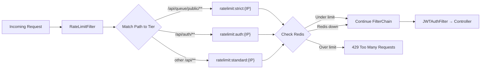

# Rate Limiting Plan

Redis-backed sliding window rate limiter implemented as a `CoWebFilter` (coroutine-based, matching the existing `JWTAuthFilter` pattern) to protect all API endpoints — especially the public queuing API — from abuse and DDoS scenarios.

## Why This Approach

| Consideration | Decision |
|---|---|
| **Algorithm** | Sliding window log via Redis Sorted Sets — prevents burst spikes at window boundaries (unlike fixed-window) |
| **Storage** | Redis (already in stack) — atomic, fast, distributed-ready |
| **Integration** | `CoWebFilter` — intercepts requests before they hit controllers, uses Kotlin coroutines consistently with the rest of the codebase |
| **Fail mode** | Fail-open — if Redis is down, requests pass through (log warning, app stays usable) |

## Rate Limit Tiers

| Tier | Endpoints | Key | Window | Max Requests | Rationale |
|---|---|---|---|---|---|
| **Strict** | `/api/queue/public/**` | IP address | 60s | 20 | Public, unauthenticated — highest abuse risk. 20 req/min is generous for legitimate ticket operations |
| **Auth** | `/api/auth/**` | IP address | 60s | 10 | Login endpoint — brute-force protection. 10 attempts/min prevents credential stuffing |
| **Standard** | All other `/api/**` routes | IP address | 60s | 60 | Authenticated users — lower risk, but still capped. Uses IP-only (not IP+Principal) because the filter runs before JWT authentication |

> [!NOTE]
> All tiers use **IP-only** keying. The filter must run before `JWTAuthFilter` to protect unauthenticated endpoints, which means principal identity is not yet available. IP-only is sufficient — per-user granularity can be added later at the controller/service layer if needed.

> [!NOTE]
> The strict tier scopes to `/api/queue/public/**` (not `/api/queue/**`) so admin queue operations (`/api/queue/admin/**`) fall under the standard tier with the more generous 60 req/min limit.

> [!TIP]
> These limits are configurable via `application.yaml` using a `@ConfigurationProperties` data class (same pattern as `JwtProperties`).

## Architecture



## Filter Ordering

> [!IMPORTANT]
> `RateLimitFilter` **must** be registered before `JWTAuthFilter` in the security filter chain. This ensures:
> 1. Abusive requests are rejected before any JWT parsing/DB lookup overhead
> 2. Brute-force attacks on `/api/auth/**` are throttled before hitting the auth stack
>
> Register at `SecurityWebFiltersOrder.FIRST` in `SecurityConfig`:
> ```kotlin
> .addFilterAt(rateLimitFilter, SecurityWebFiltersOrder.FIRST)
> .addFilterAt(jwtAuthFilter, SecurityWebFiltersOrder.AUTHENTICATION)
> ```

## Proposed Changes

---

### Rate Limiting Core

---

#### [NEW] `src/main/kotlin/com/thomas/notiguide/core/ratelimit/RateLimitProperties.kt`
`@ConfigurationProperties(prefix = "rate-limit")` data class:
```kotlin
@ConfigurationProperties(prefix = "rate-limit")
data class RateLimitProperties(
    val strict: TierConfig = TierConfig(windowSeconds = 60, maxRequests = 20),
    val auth: TierConfig = TierConfig(windowSeconds = 60, maxRequests = 10),
    val standard: TierConfig = TierConfig(windowSeconds = 60, maxRequests = 60),
    val enabled: Boolean = true
) {
    data class TierConfig(
        val windowSeconds: Long = 60,
        val maxRequests: Long = 20
    )
}
```

Add to `application-prod.yaml`:
```yaml
rate-limit:
  enabled: true
  strict:
    window-seconds: 60
    max-requests: 20
  auth:
    window-seconds: 60
    max-requests: 10
  standard:
    window-seconds: 60
    max-requests: 60
```

> [!NOTE]
> `application-dev.yaml` already has `rate-limit.enabled: false`. The data class defaults `enabled` to `true`, so production gets rate limiting out of the box without needing explicit config.

---

#### [NEW] `src/main/kotlin/com/thomas/notiguide/core/ratelimit/RateLimiter.kt`
Sliding window logic using Redis Sorted Sets:

**Algorithm:**
1. Key = `ratelimit:{tier}:{ip}` (e.g., `ratelimit:strict:192.168.1.1`)
2. Use ZSet where each member is a unique request ID (UUID), score is timestamp in millis
3. On each request:
   - `ZREMRANGEBYSCORE` — remove entries older than `now - windowSeconds`
   - `ZCARD` — count remaining entries
   - If count < max → `ZADD` the new request + `EXPIRE` the key → **allow**
   - If count >= max → **reject**
4. All operations wrapped in a Lua script for atomicity

```kotlin
@Component
class RateLimiter(
    private val redis: ReactiveRedisTemplate<String, Any>
) {
    suspend fun isAllowed(key: String, windowSeconds: Long, maxRequests: Long): RateLimitResult
}

data class RateLimitResult(
    val allowed: Boolean,
    val remaining: Long,
    val resetAtEpochSeconds: Long
)
```

**Fail-open when Redis is down:**
- Catch `RedisConnectionFailureException` (and other Redis errors) inside `isAllowed()`
- Return `RateLimitResult(allowed = true, remaining = -1, resetAtEpochSeconds = 0)` — request passes through
- Log a warning so operators know rate limiting is degraded
- No in-memory fallback — keeps the implementation simple and aligns with the fail-open design

> [!IMPORTANT]
> Use a **Lua script** for atomicity. Running ZREMRANGEBYSCORE + ZCARD + ZADD as separate commands creates a race condition under high concurrency. A Lua script executes all three atomically on the Redis server.

**How the Lua script is invoked:**
1. `RateLimiter` loads the script file at startup using Spring's `DefaultRedisScript<List<Long>>`:
   ```kotlin
   val script = DefaultRedisScript<List<Long>>().apply {
       setLocation(ClassPathResource("redis/rate_limiter.lua"))
       setResultType(List::class.java as Class<List<Long>>)
   }
   ```
2. On each request, `RateLimiter.isAllowed()` calls `ReactiveRedisTemplate.execute(script, keys, args)` which sends the script to Redis for server-side execution
3. Redis caches the compiled script after the first call (via SHA1 hash), so subsequent calls skip re-parsing — minimal overhead

---

#### [NEW] `src/main/kotlin/com/thomas/notiguide/core/ratelimit/RateLimitFilter.kt`
`CoWebFilter` implementation (matches `JWTAuthFilter` pattern):

1. If `RateLimitProperties.enabled` is `false` → pass through immediately
2. Extract client IP from `ServerHttpRequest.remoteAddress` (Spring resolves `X-Forwarded-For` automatically via `forward-headers-strategy: framework`)
3. Match request path to tier:
   - `/api/queue/public/**` → strict
   - `/api/auth/**` → auth
   - `/api/**` → standard
   - Non-API paths (actuator, etc.) → skip rate limiting
4. Build the rate limit key: `ratelimit:{tier}:{ip}`
5. Call `RateLimiter.isAllowed()`
6. If allowed → add response headers + continue chain
7. If rejected → return `429` with `ErrorResponse` body

**Response Headers** (always added when rate limiting is active):
```
X-RateLimit-Limit: 20
X-RateLimit-Remaining: 15
X-RateLimit-Reset: 1709510400
```

**429 Response Body** (uses existing `ErrorResponse` format for consistency):
```json
{
  "timestamp": "2026-03-12T10:00:00",
  "code": 429,
  "error": "Too Many Requests",
  "message": "Rate limit exceeded. Try again in 45 seconds.",
  "path": "/api/queue/public/abc-123/tickets",
  "method": "POST"
}
```

---

#### [NEW] `src/main/resources/redis/rate_limiter.lua`
Lua script for atomic sliding window:
```lua
local key = KEYS[1]
local now = tonumber(ARGV[1])
local window = tonumber(ARGV[2])
local max = tonumber(ARGV[3])
local member = ARGV[4]

local windowStart = now - window * 1000
redis.call('ZREMRANGEBYSCORE', key, 0, windowStart)
local count = redis.call('ZCARD', key)

if count < max then
    redis.call('ZADD', key, now, member)
    redis.call('EXPIRE', key, window + 1)
    -- Return: allowed, remaining, oldest entry score (for reset time)
    local oldest = redis.call('ZRANGE', key, 0, 0, 'WITHSCORES')
    local resetAt = 0
    if #oldest >= 2 then
        resetAt = tonumber(oldest[2]) + window * 1000
    end
    return {1, max - count - 1, resetAt}
end

-- Rejected: return oldest entry to calculate when window frees a slot
local oldest = redis.call('ZRANGE', key, 0, 0, 'WITHSCORES')
local resetAt = 0
if #oldest >= 2 then
    resetAt = tonumber(oldest[2]) + window * 1000
end
return {0, 0, resetAt}
```

---

### Config Registration

---

#### [MODIFY] `src/main/kotlin/com/thomas/notiguide/core/security/SecurityConfig.kt`
Register `RateLimitFilter` before `JWTAuthFilter`:
```kotlin
// Add to constructor
private val rateLimitFilter: RateLimitFilter

// Add to filter chain (before existing JWT line)
.addFilterAt(rateLimitFilter, SecurityWebFiltersOrder.FIRST)
.addFilterAt(jwtAuthFilter, SecurityWebFiltersOrder.AUTHENTICATION)
```

#### ~~[MODIFY] `NotiguideApplication.kt`~~
~~Add `@ConfigurationPropertiesScan`~~ — **already present** (line 9). No change needed.

---

## File Summary

```
core/ratelimit/
├── RateLimitProperties.kt    [NEW]
├── RateLimiter.kt             [NEW]
└── RateLimitFilter.kt         [NEW]

core/security/
└── SecurityConfig.kt          [MODIFY] — register RateLimitFilter

resources/redis/
└── rate_limiter.lua           [NEW]

resources/
└── application-prod.yaml     [MODIFY] — add rate-limit config
```

## IP Extraction — Traefik

> [!WARNING]
> The app will sit behind **Traefik** as a reverse proxy. Traefik sets `X-Forwarded-For` and `X-Real-Ip` headers by default. Since `server.forward-headers-strategy: framework` is already set in `application.yaml`, Spring automatically resolves `ServerHttpRequest.remoteAddress` from these headers. No extra code needed — just ensure Traefik's `forwardedHeaders` middleware is enabled (it is by default).

## Verification Plan

### Manual Verification
1. Build and start the app
2. Send rapid requests to `/api/queue/public/{storeId}/tickets` and verify 429 after 20 requests in 60s
3. Verify `X-RateLimit-*` headers are present on all responses
4. Verify rate limit resets after the window expires
5. Verify `/api/queue/admin/**` uses the standard tier (60 req/min), not strict
6. Verify app still works when Redis is down (fail-open, requests pass through)
7. Verify `rate-limit.enabled: false` in dev skips the filter entirely
