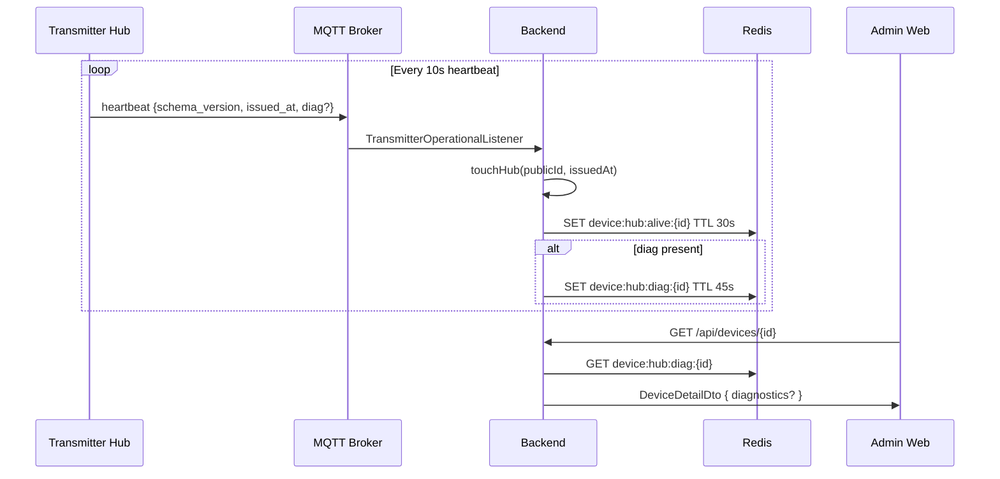
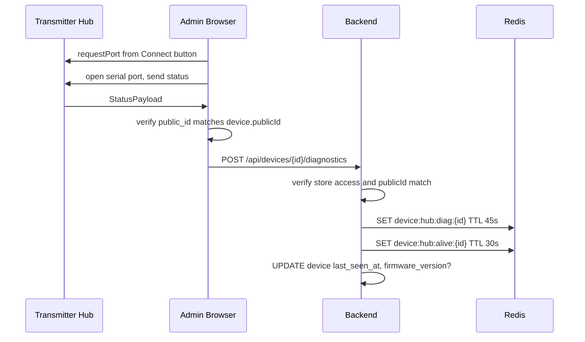
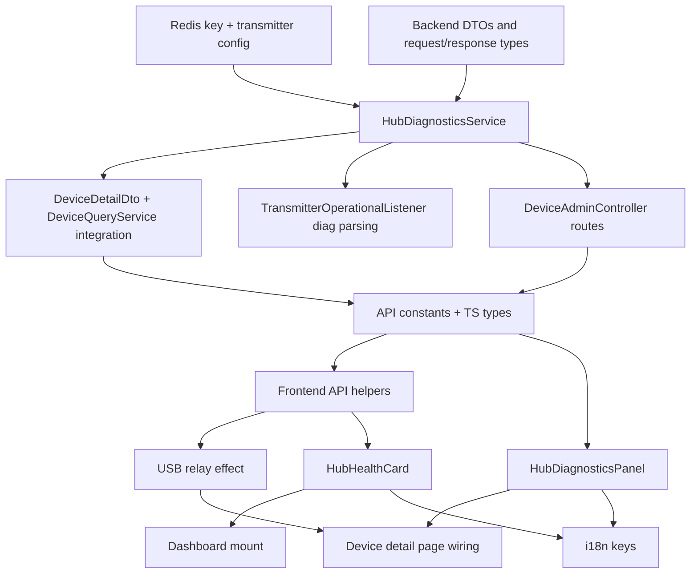

# Remote Device Diagnostics — Backend & Frontend Plan

**Status**: Implementation-ready after audit amendments
**Last updated**: 2026-05-17
**Companion firmware doc**: `docs/planned/Firmware Diagnostics Heartbeat Plan.md`
**Scope boundary**: Backend and admin web only. Firmware changes stay in the companion doc and must land first or in the same release.

---

## 1. Audit Findings Acknowledged and Amended

| # | Category | Finding | Amendment |
|---|---|---|---|
| 1 | Codebase reference | The earlier plan used `API_ROUTES.DEVICES` as if it were a string. In the current web code it is an object with `BASE`, `BY_ID`, and action helpers. | Add explicit `API_ROUTES.DEVICES.DIAGNOSTICS(id)` and `API_ROUTES.DEVICES.HUB_HEALTH` constants, and use those in API helpers. |
| 2 | Flow inconsistency | The earlier USB relay instruction said to add code after `setDeviceState(status)` inside `usb-control-panel.tsx`, but `setDeviceState` lives in `web/src/lib/serial/use-serial.ts`. | Relay from `usb-control-panel.tsx` with a `useEffect` watching `serial.deviceState`, so it sees initial, manual refresh, and 30s poll updates without moving serial state ownership. |
| 3 | Security/flow gap | USB relay trusted only the URL device id. A connected but mismatched hub could be relayed to the selected backend record if the frontend guard regressed. | Include `publicId` in the relay request and reject when it does not match the backend device record. Keep the existing frontend mismatch guard too. |
| 4 | Service boundary | The earlier plan put diagnostic writes, health summary SQL, and relay behavior into `DeviceQueryService`, which is currently a read/query service. | Add a dedicated `HubDiagnosticsService` for cache writes, relay validation, and health summary. `DeviceQueryService` only loads diagnostics for device detail. |
| 5 | Non-factual DTO semantics | `heapPct` was described as memory but actually meant free heap percentage. | Rename the backend/API/frontend field to `freeHeapPct`. The MQTT parser still reads firmware's `heap_pct` wire field. |
| 6 | UI rules | Raw Tailwind colors (`text-yellow-500`, `text-orange-500`) bypass the semantic tokens defined in `docs/walkthrough/Web Styles.md`. | Use semantic classes only: `text-success`, `text-warning`, `text-destructive`, plus matching `border-*/40 bg-*/10` badge patterns. Caution and warning are separate severity labels but share the warning color family. |
| 7 | Dashboard semantics | Counting `PENDING`, `PENDING_RF_CODE`, or `SUSPENDED` hubs as dashboard "offline" would create false operational warnings. | Hub health summary counts only `ACTIVE` transmitter hubs. Other statuses remain visible on the device detail page. |
| 8 | Unused request fields | `wifiConnected` and `firmwareVersion` were accepted but not stored or surfaced. | Keep both because they are useful diagnostics; cache `wifiConnected` and `firmwareVersion`, and update `device.firmware_version` when a nonblank USB relay value is present. |
| 9 | i18n mismatch risk | New visible labels must be bilingual and structurally mirrored. | Add keys under `devices.hub.diagnostics` and `devices.hub.health` in both `en.json` and `vi.json` with matching structure. |
| 10 | Component-library rule | The plan could be read as requiring new shadcn primitives. | Only feature components are added. Use existing shadcn/ui primitives already present in the project (`Badge`, `Button`, `Card`, `Skeleton`, `Tooltip` if needed). |
| 11 | MQTT compatibility | The backend listener subscribes with `mqtt.topic-prefix` (`notiguide` by default), while current transmitter source builds relative `transmitter/...` topic strings. | This backend/web plan keeps the existing backend listener path. The companion firmware/broker setup must publish heartbeats on the backend's configured prefixed topic path before MQTT diagnostics can arrive. USB relay still works independently. |

---

## 2. Objective

Ingest transmitter hub diagnostics from two paths and surface them in the admin dashboard:

- MQTT heartbeat enrichment from active transmitter hubs.
- USB Web Serial relay from an admin browser while a matching hub is connected.
- Device detail diagnostics panel replacing the current hub heartbeat panel.
- Main dashboard hub health card for active transmitter hubs.

The plan remains independent for backend/web implementation, but it depends on the companion firmware plan for the enriched MQTT `diag` object and serial `status` fields.

MQTT diagnostics also depend on topic-path alignment: the backend currently subscribes to `${mqtt.topic-prefix}/transmitter/hub/+/heartbeat`, with `notiguide` as the default prefix. If transmitter firmware or broker configuration still publishes unprefixed `transmitter/hub/...` topics, the companion firmware/broker work must correct that before MQTT diagnostics can be observed by this backend.

---

## 3. Verified Current Baseline

| Area | Current state |
|---|---|
| Backend heartbeat | `TransmitterOperationalListener` subscribes to `notiguide/transmitter/hub/+/heartbeat`, parses `schema_version` and `issued_at`, updates `device.last_seen_at`, and writes `RedisKeyManager.deviceHubAlive(deviceId)` with `heartbeatLivenessSeconds`. |
| Backend device detail | `DeviceQueryService.findDeviceDetailById()` already adds `lifecycleCommand`, `isElected`, and `boundTicket` to `DeviceDetailDto`. |
| Backend routes | `DeviceAdminController` is rooted at `/api/devices` and already exposes `/api/devices/{id}`, lifecycle routes, and `/api/devices/usb-dispatch-payload`. |
| Frontend detail page | `web/src/app/[locale]/dashboard/devices/[id]/page.tsx` renders `UsbControlPanel` for hubs and `HubHeartbeatPanel` for active hub records. |
| Frontend serial | `useSerial()` owns `deviceState`, sends initial `status` after opening, and polls `status` every 30s. Web Serial `requestPort()` is triggered from the Connect button. |
| Web Serial API | Context7 WICG and MDN docs confirm `requestPort()` requires user activation, `port.open({ baudRate })` requires `baudRate`, opened ports expose readable/writable streams, and availability still depends on browser support, secure context, and Permissions-Policy. |
| UI system | `docs/walkthrough/Web Styles.md` requires semantic tokens, shadcn/ui only, glass cards without glass-on-glass nesting, and bilingual visible copy. |

---

## 4. Data Contract

### 4.1 Firmware MQTT heartbeat input

The backend accepts the current heartbeat without diagnostics and the enriched heartbeat from the companion firmware plan:

```json
{
  "schema_version": 1,
  "issued_at": "2026-05-17T10:00:00Z",
  "diag": {
    "heap_pct": 64,
    "uptime_ms": 1234567,
    "disp_d": 12,
    "disp_t": 420,
    "rssi": -58,
    "ip": "192.168.1.42"
  }
}
```

Rules:

- `diag` is optional for backward compatibility.
- `heap_pct` means free heap percentage and maps to API field `freeHeapPct`.
- Missing `rssi` or `ip` stays `null`.
- MQTT source writes `source = MQTT`.

### 4.2 Firmware serial status input

The current `StatusPayload` already has:

- `public_id`
- `wifi_connected`
- `wifi_rssi?`
- `ip?`
- `uptime_ms`
- `free_heap`
- `firmware_version`

The companion firmware plan adds:

- `total_heap`
- `dispatch_daily`
- `dispatch_total`

The frontend relay silently no-ops when `total_heap` is absent or not positive, so older firmware keeps working.

### 4.3 Cached backend record

Create `HubDiagnosticsDto` as the API/cache shape:

```kotlin
data class HubDiagnosticsDto(
    val freeHeapPct: Int,
    val rssi: Int?,
    val uptimeMs: Long,
    val dispatchDaily: Int,
    val dispatchTotal: Int,
    val wifiConnected: Boolean?,
    val ip: String?,
    val firmwareVersion: String?,
    val source: HubDiagnosticsSource,
    val updatedAt: OffsetDateTime
)

enum class HubDiagnosticsSource {
    MQTT,
    USB
}
```

Redis key:

```kotlin
fun deviceHubDiagnostics(deviceId: UUID) = "device:hub:diag:$deviceId"
```

Default TTL: 45 seconds. This intentionally exceeds the 10s heartbeat interval but is short enough to expire soon after the 30s liveness key.

---

## 5. Health Thresholds and UI Severity

Use the same severity logic in backend warnings and frontend display. The frontend must use semantic tokens only.

### 5.1 Free heap percentage

| Severity | Range | Frontend class | Backend warning |
|---|---|---|---|
| Healthy | `> 50` | `text-success` | none |
| Caution | `36..50` | `text-warning` | none |
| Warning | `21..35` | `text-warning` | `LOW_MEMORY` |
| Critical | `<= 20` | `text-destructive` | `LOW_MEMORY` |

### 5.2 WiFi RSSI

| Severity | Range | Frontend class | Backend warning |
|---|---|---|---|
| Excellent | `> -50 dBm` | `text-success` | none |
| Good | `-65..-50 dBm` | `text-success` | none |
| Fair | `-75..<-65 dBm` | `text-warning` | `WEAK_SIGNAL` |
| Weak | `< -75 dBm` | `text-destructive` | `WEAK_SIGNAL` |

### 5.3 Uptime advisory

| Severity | Range | Frontend class | Backend warning |
|---|---|---|---|
| Normal | `< 3 days` | `text-success` | none |
| Fine | `3..6 days` | `text-warning` | none |
| Long | `7..13 days` | `text-warning` | `LONG_UPTIME` |
| Very long | `>= 14 days` | `text-destructive` | `LONG_UPTIME` |

---

## 6. Architecture

### 6.1 MQTT diagnostics flow



### 6.2 USB relay flow



---

## 7. Backend Implementation

### 7.1 RedisKeyManager

**File**: `backend/src/main/kotlin/com/thomas/notiguide/core/redis/RedisKeyManager.kt`

Add after `deviceHubAlive`:

```kotlin
fun deviceHubDiagnostics(deviceId: UUID) = "device:hub:diag:$deviceId"
```

### 7.2 DeviceTransmitterProperties

**File**: `backend/src/main/kotlin/com/thomas/notiguide/core/device/DeviceTransmitterProperties.kt`

Add:

```kotlin
val diagnosticsCacheSeconds: Long = 45
```

Validation:

```kotlin
require(diagnosticsCacheSeconds > heartbeatIntervalSeconds) {
    "device.transmitter.diagnostics-cache-seconds must exceed heartbeat interval"
}
```

### 7.3 DTOs and requests

Create:

- `domain/device/dto/HubDiagnosticsDto.kt`
- `domain/device/response/HubHealthSummaryResponse.kt`
- `domain/device/request/DeviceDiagnosticsRelayRequest.kt`

Relay request:

```kotlin
data class DeviceDiagnosticsRelayRequest(
    val publicId: String,
    @field:Min(0) @field:Max(100)
    val freeHeapPct: Int,
    @field:Min(-127) @field:Max(0)
    val rssi: Int?,
    @field:Min(0)
    val uptimeMs: Long,
    @field:Min(0)
    val dispatchDaily: Int,
    @field:Min(0)
    val dispatchTotal: Int,
    val wifiConnected: Boolean,
    val ip: String?,
    val firmwareVersion: String?
)
```

Hub health response:

```kotlin
data class HubHealthSummaryResponse(
    val totalHubs: Int,
    val onlineHubs: Int,
    val offlineHubs: Int,
    val warnings: List<HubWarningDto>
)

data class HubWarningDto(
    val deviceId: UUID,
    val deviceName: String?,
    val type: HubWarningType,
    val value: String
)

enum class HubWarningType {
    LOW_MEMORY,
    WEAK_SIGNAL,
    LONG_UPTIME
}
```

### 7.4 HubDiagnosticsService

**Create**: `backend/src/main/kotlin/com/thomas/notiguide/domain/device/service/HubDiagnosticsService.kt`

Responsibilities:

- Load cached diagnostics for device detail.
- Store MQTT diagnostics when `diag` is present.
- Store USB relayed diagnostics after public-id validation.
- Produce active-hub health summary.

Important implementation rules:

- `loadDiagnostics(deviceId)` returns `null` on missing cache or malformed JSON.
- `recordMqttDiagnostics(deviceId, diag, seenAt)` writes only `device:hub:diag:{id}`; heartbeat liveness stays in `TransmitterOperationalListener`.
- `relayUsbDiagnostics(device, request)` must reject non-hubs, rejected/decommissioned devices, and `request.publicId != device.publicId`.
- USB relay writes both diagnostics and liveness keys, then updates `last_seen_at`; update `firmware_version` only when `request.firmwareVersion` is nonblank.
- `getHubHealthSummary(storeId)` selects only `kind = 'TRANSMITTER_HUB' AND status = 'ACTIVE'`, with store filtering applied for store-scoped admins.

### 7.5 DeviceDetailDto and DeviceQueryService

**Files**:

- `domain/device/dto/DeviceDetailDto.kt`
- `domain/device/service/DeviceQueryService.kt`

Add:

```kotlin
val diagnostics: HubDiagnosticsDto? = null
```

Inject `HubDiagnosticsService` into `DeviceQueryService` and load diagnostics only for hubs:

```kotlin
val diagnostics = if (device.kind.isHub()) {
    hubDiagnosticsService.loadDiagnostics(deviceId)
} else null
```

Pass `diagnostics` through the private `toDetail(...)` extension.

### 7.6 TransmitterOperationalListener

**File**: `domain/device/listener/TransmitterOperationalListener.kt`

Extend `TransmitterHeartbeatEnvelope` with optional `diag`, but keep old heartbeats valid:

```kotlin
private data class TransmitterHeartbeatEnvelope(
    @field:JsonProperty("schema_version")
    val schemaVersion: Int = 0,
    @field:JsonProperty("issued_at")
    val issuedAt: OffsetDateTime? = null,
    val diag: HeartbeatDiagPayload? = null
)

private data class HeartbeatDiagPayload(
    @field:JsonProperty("heap_pct")
    val freeHeapPct: Int = 0,
    val rssi: Int? = null,
    @field:JsonProperty("uptime_ms")
    val uptimeMs: Long = 0,
    @field:JsonProperty("disp_d")
    val dispatchDaily: Int = 0,
    @field:JsonProperty("disp_t")
    val dispatchTotal: Int = 0,
    val ip: String? = null
)
```

After `touchHub(...)` and existing liveness write, call `HubDiagnosticsService.recordMqttDiagnostics(...)` when `diag` is not null.

### 7.7 DeviceAdminController endpoints

**File**: `domain/device/controller/DeviceAdminController.kt`

Inject `HubDiagnosticsService`.

Add before `isSuperAdmin`:

```kotlin
@PostMapping("/{id}/diagnostics")
suspend fun relayDiagnostics(
    @PathVariable id: UUID,
    @Valid @RequestBody request: DeviceDiagnosticsRelayRequest,
    @AuthenticationPrincipal principal: AdminPrincipal
): ResponseEntity<Void> {
    val device = deviceQueryService.getRequiredDeviceDetailById(id)
    val storeId = device.storeId
    if (storeId == null && !isSuperAdmin(principal)) {
        throw ForbiddenException("Store-scoped admins need an assigned store to relay diagnostics")
    }
    if (storeId != null) {
        StoreAccessUtil.requireStoreAccess(principal, storeId)
    }
    hubDiagnosticsService.relayUsbDiagnostics(device, request)
    return ResponseEntity.noContent().build()
}

@GetMapping("/hub-health")
suspend fun getHubHealth(
    @AuthenticationPrincipal principal: AdminPrincipal
): ResponseEntity<HubHealthSummaryResponse> {
    val effectiveStoreId = when {
        isSuperAdmin(principal) -> null
        else -> principal.storeId
            ?: throw ForbiddenException("Store-scoped admins need an assigned store to view hub health")
    }
    return ResponseEntity.ok(hubDiagnosticsService.getHubHealthSummary(effectiveStoreId))
}
```

Controller imports should include only used request/response/service types. Do not import `HubDiagnosticsDto` into the controller.

---

## 8. Frontend Implementation

### 8.1 Constants and API helpers

**File**: `web/src/lib/constants.ts`

Add under `DEVICES`:

```typescript
DIAGNOSTICS: (id: string) => `/api/devices/${id}/diagnostics`,
HUB_HEALTH: "/api/devices/hub-health",
```

**File**: `web/src/features/device/api.ts`

Add typed helpers:

```typescript
export function relayDiagnostics(
  id: string,
  data: DeviceDiagnosticsRelayRequest,
) {
  return post<void>(API_ROUTES.DEVICES.DIAGNOSTICS(id), data);
}

export function getHubHealth() {
  return get<HubHealthSummaryResponse>(API_ROUTES.DEVICES.HUB_HEALTH);
}
```

### 8.2 TypeScript types

**Files**:

- `web/src/types/device.ts`
- `web/src/lib/serial/types.ts`

Add:

```typescript
export interface HubDiagnosticsDto {
  freeHeapPct: number;
  rssi: number | null;
  uptimeMs: number;
  dispatchDaily: number;
  dispatchTotal: number;
  wifiConnected: boolean | null;
  ip: string | null;
  firmwareVersion: string | null;
  source: "MQTT" | "USB";
  updatedAt: string;
}
```

Add `diagnostics?: HubDiagnosticsDto | null` to `DeviceDetailDto`.

Add optional serial fields:

```typescript
total_heap?: number;
dispatch_daily?: number;
dispatch_total?: number;
```

### 8.3 HubDiagnosticsPanel

**Create**: `web/src/features/device/hub-diagnostics-panel.tsx`

This is an app feature component, not a new shadcn/ui primitive. It should use existing primitives only.

Behavior:

- Replace `HubHeartbeatPanel`.
- Preserve the current 15s `getDevice()` polling behavior.
- Always show liveness and election badges.
- When `device.diagnostics` exists, show free heap, RSSI, uptime, dispatch counters, network, source, and updated time.
- When diagnostics are absent, show the same liveness/election fallback plus a muted "no diagnostics" message.
- Use `useFormatter()` for timestamps and `useTranslations("devices.hub.diagnostics")` for all visible copy.

UI constraints:

- Outer panel: `glass-card rounded-xl p-6`.
- Metric tiles inside the glass panel: plain `Card`, not `.glass-card`.
- Badges: `variant="outline"` with semantic token classes.
- No raw `text-yellow-*` or `text-orange-*`.
- No hardcoded English labels.

### 8.4 USB relay from UsbControlPanel

**File**: `web/src/features/device/usb-control-panel.tsx`

Add props:

```typescript
interface UsbControlPanelProps {
  serial: UseSerialReturn;
  deviceId: string;
  backendMqttConnected?: boolean;
  expectedPublicId?: string | null;
}
```

Add a `useEffect` that watches `deviceState`:

```typescript
useEffect(() => {
  if (!isConnected || !deviceState || isMismatched || !expectedPublicId) return;
  if (deviceState.public_id !== expectedPublicId) return;
  if (!deviceState.total_heap || deviceState.total_heap <= 0) return;

  const freeHeapPct = Math.round(
    (deviceState.free_heap / deviceState.total_heap) * 100,
  );

  relayDiagnostics(deviceId, {
    publicId: deviceState.public_id,
    freeHeapPct,
    rssi: deviceState.wifi_rssi ?? null,
    uptimeMs: deviceState.uptime_ms,
    dispatchDaily: deviceState.dispatch_daily ?? 0,
    dispatchTotal: deviceState.dispatch_total ?? 0,
    wifiConnected: deviceState.wifi_connected,
    ip: deviceState.ip ?? null,
    firmwareVersion: deviceState.firmware_version ?? null,
  }).catch(() => {
    // Silent: USB panel remains useful even when backend relay fails.
  });
}, [deviceId, deviceState, expectedPublicId, isConnected, isMismatched]);
```

This effect covers initial connect, manual refresh, and the current 30s status poll because all three update `serial.deviceState`.

### 8.5 Device detail page

**File**: `web/src/app/[locale]/dashboard/devices/[id]/page.tsx`

Replace import and render:

```tsx
import { HubDiagnosticsPanel } from "@/features/device/hub-diagnostics-panel";
```

```tsx
<HubDiagnosticsPanel device={device} onUpdate={setDevice} />
```

Pass `deviceId` into `UsbControlPanel`:

```tsx
<UsbControlPanel
  serial={serial}
  deviceId={device.id}
  backendMqttConnected={device.status === "ACTIVE" || device.status === "SUSPENDED"}
  expectedPublicId={device.publicId}
/>
```

### 8.6 HubHealthCard

**Create**: `web/src/features/device/hub-health-card.tsx`

Behavior:

- Fetch `getHubHealth()` on mount.
- Return `null` when `totalHubs === 0`.
- Render one standalone `glass-card rounded-xl p-4 l:p-5`.
- Header uses `Radio` icon from `lucide-react`.
- Online/offline badges use existing outline semantic pattern:
  - online: `border-success/40 bg-success/10 text-success`
  - offline with count: `border-destructive/40 bg-destructive/10 text-destructive`
  - offline zero: `border-border text-muted-foreground`
- Warning rows use `border-warning/40 bg-warning/15 text-warning dark:border-warning/50 dark:bg-warning/20` (matching existing device badge pattern).
- Link to `/dashboard/devices` with existing `Link` helper.
- Use `useTranslations("devices.hub.health")` for visible copy.

### 8.7 Dashboard page

**File**: `web/src/app/[locale]/dashboard/page.tsx`

Mount after `RealtimeStats` in both admin branches:

```tsx
<HubHealthCard />
```

The backend endpoint handles super-admin vs store-admin scope, so the component does not need store props.

### 8.8 i18n keys

**Files**:

- `web/src/messages/en.json`
- `web/src/messages/vi.json`

Add under `devices.hub`:

English:

```json
"diagnostics": {
  "title": "Diagnostics",
  "lastHeartbeat": "Last heartbeat",
  "liveness": "Liveness",
  "election": "Election",
  "freeHeap": "Free heap",
  "signal": "WiFi signal",
  "signalExcellent": "Excellent",
  "signalGood": "Good",
  "signalFair": "Fair",
  "signalWeak": "Weak",
  "uptime": "Uptime",
  "dispatches": "Dispatches",
  "dispatchToday": "today",
  "dispatchTotal": "total",
  "network": "Network",
  "lastUpdated": "Updated",
  "source": "Source",
  "sourceMqtt": "MQTT",
  "sourceUsb": "USB",
  "noData": "No diagnostics available",
  "noDataHint": "Diagnostics appear after the hub runs the enriched firmware or a matching USB session relays status."
},
"health": {
  "title": "Hub health",
  "online": "{count} online",
  "offline": "{count} offline",
  "allHealthy": "All active hubs look healthy",
  "warningLowMemory": "Low memory",
  "warningWeakSignal": "Weak signal",
  "warningLongUptime": "Long uptime",
  "manageDevices": "Manage devices"
}
```

Vietnamese:

```json
"diagnostics": {
  "title": "Chẩn đoán",
  "lastHeartbeat": "Tín hiệu gần nhất",
  "liveness": "Tín hiệu sống",
  "election": "Vai trò phát",
  "freeHeap": "Bộ nhớ trống",
  "signal": "Tín hiệu WiFi",
  "signalExcellent": "Rất mạnh",
  "signalGood": "Tốt",
  "signalFair": "Trung bình",
  "signalWeak": "Yếu",
  "uptime": "Thời gian chạy",
  "dispatches": "Lượt phát",
  "dispatchToday": "hôm nay",
  "dispatchTotal": "tổng",
  "network": "Mạng",
  "lastUpdated": "Cập nhật",
  "source": "Nguồn",
  "sourceMqtt": "MQTT",
  "sourceUsb": "USB",
  "noData": "Chưa có dữ liệu chẩn đoán",
  "noDataHint": "Dữ liệu xuất hiện khi hub chạy firmware mới hoặc phiên USB khớp thiết bị gửi trạng thái về hệ thống."
},
"health": {
  "title": "Sức khỏe hub",
  "online": "{count} trực tuyến",
  "offline": "{count} ngoại tuyến",
  "allHealthy": "Các hub đang hoạt động ổn định",
  "warningLowMemory": "Bộ nhớ thấp",
  "warningWeakSignal": "Tín hiệu mạng yếu",
  "warningLongUptime": "Đã chạy quá lâu",
  "manageDevices": "Quản lý thiết bị"
}
```

Keep `en.json` and `vi.json` structurally identical.

---

## 9. Implementation Order



---

## 10. Out of Scope

- Historical diagnostics/time-series storage.
- Push alerts for degraded hubs.
- Receiver diagnostics.
- MQTT request/response diagnostics.
- Firmware implementation details beyond the input contract summarized here.
- New shadcn/ui primitives.

---

## 11. Verification Checklist

Do not run build commands during this plan-audit task. When implementing later, verify:

- Backend source compiles after adding `HubDiagnosticsService` and controller imports.
- `GET /api/devices/{id}` returns `diagnostics: null` for old firmware and a populated object after MQTT or USB input.
- `POST /api/devices/{id}/diagnostics` returns 204 only for accessible matching transmitter hubs.
- `GET /api/devices/hub-health` scopes store admins to their store and super admins to all active hubs.
- `en.json` and `vi.json` have identical key structure.
- The diagnostics panel and health card use existing shadcn/ui primitives and semantic token classes only.
- USB relay failure stays silent in the browser while local USB controls continue to work.
