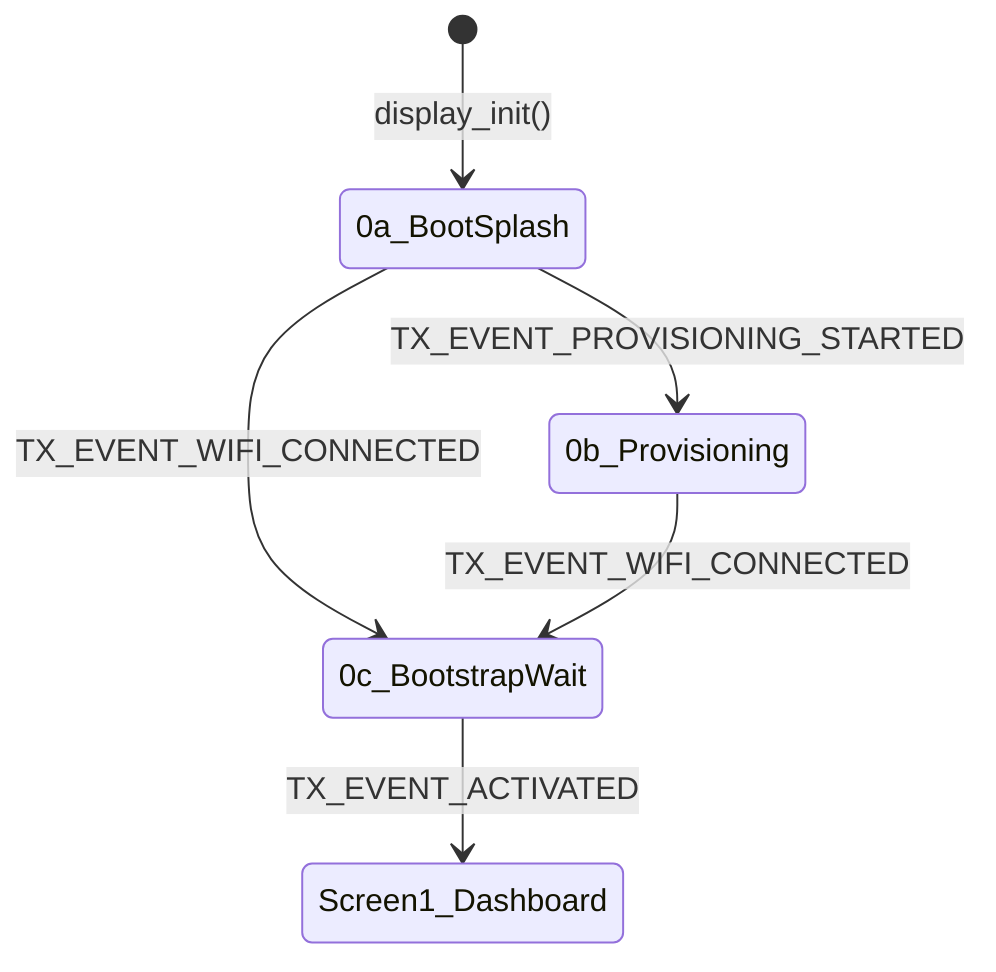
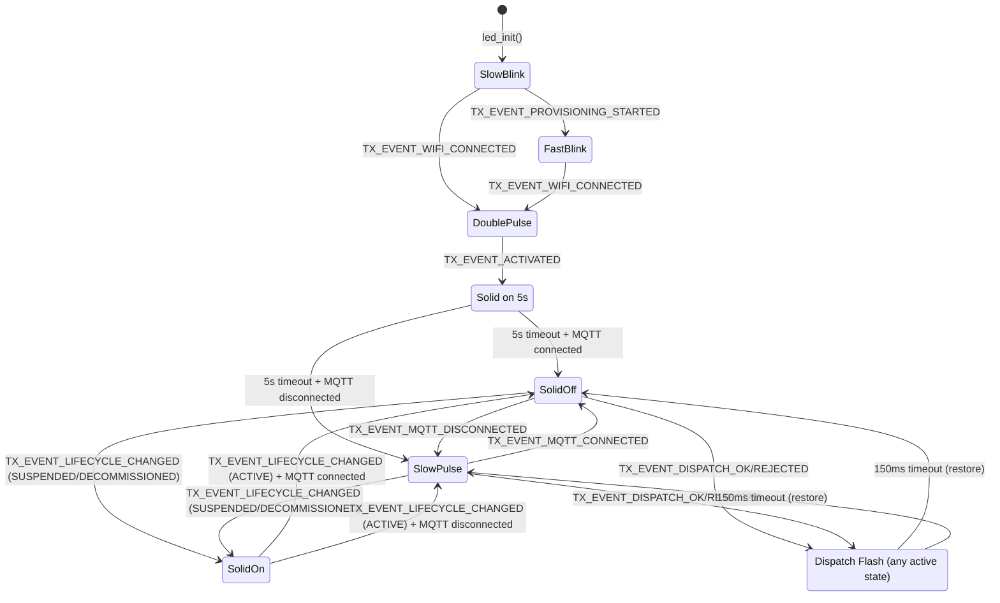
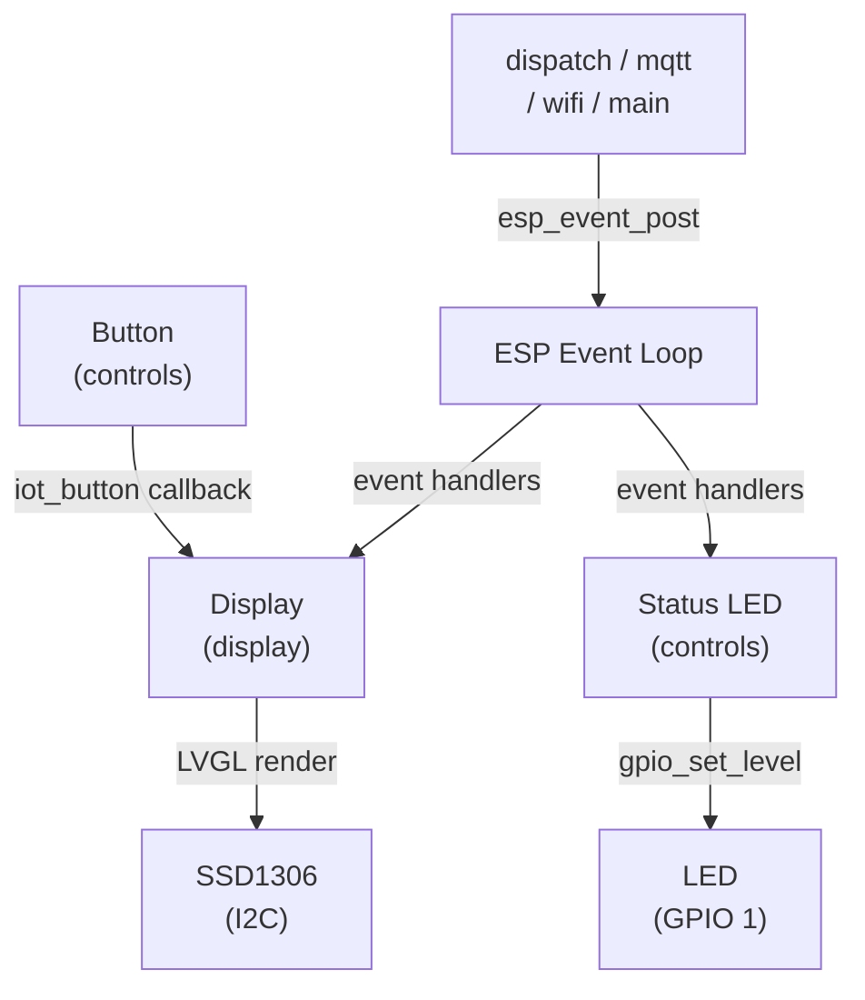

# Transmitter Hub — OLED, Button & LED Plan

> **Scope:** Add a 0.96" monochrome SSD1306 OLED (128×64, I2C), a single physical button, and a mono-color status LED to the ESP32-C3 transmitter hub. The display shows device status and operational statistics; the button navigates between screens and triggers actions; the LED provides at-a-glance state feedback without needing to read the screen.
>
> **Libraries:** LVGL 8.3.11, esp_lvgl_port declared as `^2.6.0` (resolved to 2.7.2 in `transmitter/dependencies.lock`), espressif/button ^4.1.6 — all already declared in `transmitter/main/idf_component.yml`.
>
> **Reference samples:** `transmitter/main/OLED_Sample/` (LVGL + SSD1306 init, screen management, timer animations), `transmitter/main/Button_Sample/` (Espressif Button lib, mode-sensitive event dispatch, FreeRTOS queues).

---

## Existing Firmware Context

This section provides the context needed to implement this plan independently, without access to the broader notiguide project (backend, web, docs).

### What the Transmitter Hub Does

The transmitter hub is an ESP32-C3 device that receives signed RF transmit commands from a backend server over MQTT and dispatches them to physical receiver devices via nRF24L01+ (2.4 GHz) and 433 MHz radio. It runs ESP-IDF v6.0.

### Current Module Layout

```
transmitter/main/
├── main.c                          # app_main(), boot sequence, recovery loop
├── config/
│   ├── device_config.h             # device_config_t struct, op state enum, NVS load/save
│   └── device_config.c
├── dispatch/
│   ├── dispatch.h                  # Transmit command parsing, dispatch ring, ack publishing
│   ├── dispatch.c
│   ├── radio_supervisor.h          # Radio hardware coordination
│   └── radio_supervisor.c
├── network/
│   ├── mqtt.h                      # MQTT client, topic routing, subscriptions
│   ├── mqtt.c
│   ├── wifi.h                      # WiFi STA + event handlers
│   ├── wifi.c
│   ├── heartbeat.h                 # Periodic heartbeat publish
│   ├── heartbeat.c
│   └── certs/                      # TLS certificates for MQTTS
├── nrf24/                          # nRF24L01+ SPI driver (nrf24_regs.h, nrf24_transmitter.c/h)
├── rf/                             # 433 MHz + nRF24 transmit logic (rf_common.h, rf_data.c, rf_timer.c, rf_transmitter.c)
├── provision/
│   ├── http_server.h               # SoftAP provisioning HTTP server
│   ├── http_server.c
│   ├── index.html                  # Provisioning web UI source
│   └── index.html.gz              # Gzipped provisioning web UI (served by HTTP server)
├── security/
│   ├── device_identity.h           # EC P-256 key management + signature verification
│   └── device_identity.c
└── utils/
    ├── time_utils.h
    └── time_utils.c
```

### Boot Sequence (`app_main()`)

1. `device_config_nvs_init_or_recover()` — init NVS
2. `esp_netif_init()` + `esp_event_loop_create_default()` — network + event loop
3. `device_config_load()` — load config from NVS into RAM
4. `wait_for_station_or_recover(false)` — WiFi STA with 45s timeout; on failure, enters SoftAP provisioning
5. `device_identity_ensure()` — ensure EC P-256 device keys exist
6. `radio_supervisor_init()` — init radio hardware
7. `mqtt_start()` — connect MQTT client
8. Bootstrap loop (if not yet activated) → idle loop

### Key Data Structures

**`device_config_t`** (`config/device_config.h`) — in-RAM snapshot, loaded from NVS:

| Field | Type | Notes |
|-------|------|-------|
| `schema_version` | `uint8_t` | Config schema version (currently `1`) |
| `wifi_ssid` | `char[33]` | |
| `wifi_pwd` | `char[65]` | |
| `mqtt_uri` | `char[192]` | Full URI, e.g. `mqtts://broker:8883` |
| `mqtt_user` | `char[96]` | |
| `mqtt_pwd` | `char[128]` | |
| `enroll_token` | `char[192]` | Bootstrap enrollment token (cleared after activation) |
| `public_id` | `char[32]` | Hub's public identifier, e.g. `HUB-7F3A` |
| `device_name` | `char[96]` | Human-readable name set during provisioning |
| `last_deact_id` | `char[64]` | Last processed deactivation command ID (dedup guard) |
| `op_state` | `device_operational_state_t` | See below |
| `has_schema_version` | `bool` | NVS presence sentinel |
| `has_enroll_token` | `bool` | NVS presence sentinel |
| `has_public_id` | `bool` | NVS presence sentinel |
| `has_device_name` | `bool` | NVS presence sentinel |
| `has_last_deact_id` | `bool` | NVS presence sentinel |
| `has_op_state` | `bool` | NVS presence sentinel |

The `has_*` sentinel fields track whether each optional value has been written to NVS at least once. This allows distinguishing "not yet set" from "set to default/empty".

**`device_operational_state_t`** (`config/device_config.h`):

```c
typedef enum {
    OP_STATE_INVALID = 0,        // Not yet activated
    OP_STATE_ACTIVE = 1,         // Normal operation
    OP_STATE_SUSPENDED = 2,      // Suspended by backend command
    OP_STATE_DECOMMISSIONED = 3, // Permanently decommissioned
} device_operational_state_t;
```

**`dispatch_ring_entry_t`** (`dispatch/dispatch.c`) — ring buffer of last 8 dispatches:

| Field | Type | Notes |
|-------|------|-------|
| `dispatch_id` | `char[48]` | |
| `status` | `char[16]` | `"applied"`, `"rejected"`, `"unchanged"` |
| `reason` | `char[32]` | Rejection reason if applicable |
| `applied_at_ms` | `int64_t` | Timestamp in milliseconds |

### MQTT Topics

| Topic | Direction | Purpose |
|-------|-----------|---------|
| `transmitter/hub/{public_id}/cmd/transmit` | Subscribe | Signed RF transmit commands |
| `transmitter/hub/{public_id}/cmd/deact` | Subscribe | Lifecycle commands (suspend/resume/decommission) |
| `transmitter/hub/{public_id}/ack` | Publish | Acknowledgments for transmit + deact commands |
| `transmitter/hub/{public_id}/heartbeat` | Publish | Periodic liveness heartbeat while active |
| `transmitter/bootstrap/+` | Subscribe | Bootstrap phase (before activation) |
| `transmitter/bootstrap/{challenge_id}` | Subscribe / Publish | Narrowed bootstrap topic after `pending` |
| `transmitter/bootstrap/register` | Publish | Bootstrap registration request |

### Key Functions Referenced in This Plan

| Function | File | What it does |
|----------|------|-------------|
| `wait_for_station_or_recover()` | `main.c` | WiFi STA connect with 45s timeout; enters SoftAP on failure |
| `publish_transmit_ack()` | `dispatch.c` | Publishes ack JSON to `…/ack` topic after dispatch |
| `dispatch_handle_transmit_json()` | `dispatch.c` | Parses `cmd/transmit` payload, verifies signature, dispatches RF |
| `mqtt_start()` | `mqtt.c` | Starts MQTT client, subscribes to topics |

---

## A. Hardware & GPIO Allocation

### A.1 Current Pin Map (ESP32-C3)

This map reflects the checked-in `transmitter/sdkconfig`. The defaults in `transmitter/main/Kconfig.projbuild` are older and still assign some of these pins differently; update those defaults when adding the OLED/button/LED options so a fresh `sdkconfig` does not collide with the display controls.


| GPIO | Current Use |
| ---- | ----------- |
| 0 | 433 MHz TX |
| 3 | nRF24 SCK |
| 4 | nRF24 CE |
| 5 | nRF24 MISO |
| 6 | nRF24 IRQ |
| 7 | nRF24 CS |
| 10 | nRF24 MOSI |


### A.2 New Assignments


| GPIO | New Use        | Notes                                            |
| ---- | -------------- | ------------------------------------------------ |
| 1    | Status LED     | Active-high when wired as GPIO → resistor → LED → ground; invert the software logic if the board instead wires the LED to VCC and sinks current through the GPIO |
| 2    | Button         | Active-low; external pull-up avoids GPIO 2 boot-mode glitch on ESP32-C3 |
| 8    | I2C SCL (OLED) | Strapping pin (boot mode select); external pull-up to VCC keeps default boot behavior and satisfies I2C bus requirements |
| 9    | I2C SDA (OLED) | Strapping pin (boot mode select); external pull-up to VCC keeps default boot behavior and satisfies I2C bus requirements |


GPIO 8 and 9 are strapping pins that select boot mode on the ESP32-C3. External pull-ups (typically 4.7 kΩ to VCC) serve double duty: they hold the strapping state high for normal SPI boot, and they meet the I2C bus pull-up requirement for reliable SSD1306 communication at 400 kHz. GPIO 2 is safe for the button with an external pull-up, avoiding the low-on-reset glitch that can affect GPIO 2 on some ESP32-C3 modules. The repo uses USB Serial/JTAG console settings (GPIO 18/19), so those pins remain reserved.

### A.3 Kconfig Additions (`Kconfig.projbuild`)

```
config TRANSMITTER_OLED_SDA_GPIO
    int "OLED I2C SDA GPIO"
    default 9

config TRANSMITTER_OLED_SCL_GPIO
    int "OLED I2C SCL GPIO"
    default 8

config TRANSMITTER_BUTTON_GPIO
    int "Navigation button GPIO"
    default 2

config TRANSMITTER_LED_GPIO
    int "Status LED GPIO"
    default 1

config TRANSMITTER_OLED_ENABLED
    bool "Enable OLED display"
    default y
```

Also align the existing RF GPIO defaults in `Kconfig.projbuild` with the checked-in `sdkconfig` before relying on these new defaults: RF433 TX = 0, nRF24 SCK = 3, MOSI = 10, MISO = 5, CS = 7, CE = 4, IRQ = 6. Without that cleanup, a newly generated config can reuse GPIO 1 for nRF24 IRQ and GPIO 2 for nRF24 MISO, conflicting with the planned LED and button.

---

## B. Display Architecture

### B.1 Screen Layout (128×64 Monochrome)

The display is divided into a fixed **status bar** (top 12 px) and a **content area** (remaining 52 px). The status bar is persistent across all screens; only the content area changes.

```
┌────────────────────────────────────┐  0
│ ● MQTT  ▲ WiFi   ACTIVE     10:32 │  ← Status bar (12 px)
├────────────────────────────────────┤ 12
│                                    │
│         (Screen content)           │  ← Content area (52 px)
│                                    │
│                                    │
└────────────────────────────────────┘ 63
```

**Status bar indicators (left to right):**

- **MQTT:** Filled circle = connected, hollow circle = disconnected
- **WiFi:** Signal-strength icon (▲ full / △ weak / ✕ none)
- **Op state:** `ACTIVE` / `SUSPENDED` / `BOOT` / `PROV` (provisioning) / `WAIT` (bootstrap wait)
- **Uptime or time** (right-aligned): HH:MM since boot, or wall-clock once `time_utils` has been synced from backend-issued timestamps. There is no SNTP module in the current firmware

### B.2 Screen Definitions

There are **4 screens** the user can cycle through with the button. The display also has transient **overlay screens** that appear automatically on events and dismiss after a timeout.

#### Screen 0 — Splash / Boot (auto, not user-selectable)

Shown during init, provisioning, and bootstrap. Not part of the button cycle. Has three visual states, each with its own animation treatment. Transitions between states are driven by boot-sequence events from `main.c`.

All animations use LVGL 8.x built-in primitives: `lv_anim_t` path functions (`lv_anim_path_linear`, `lv_anim_path_ease_out`, `lv_anim_path_overshoot`, `lv_anim_path_step`), `lv_arc`, `lv_line`, `lv_label`, and `lv_timer_create`. API availability was cross-checked against the LVGL 8.4 docs and the vendored LVGL 8.3.x sources in `transmitter/managed_components`, and the functions used here are present in the checked-in component version.

##### State 0a — Boot Splash: "Pulse Broadcast" (~2.0s one-shot)

A heartbeat trace draws across the screen, spikes at center (the hub is alive), and the spike detonates into expanding radio-wave arcs (it's broadcasting). The identity text then slides in. Plays once during `display_init()`, before WiFi begins.

**Narrative:** flatline → pulse → broadcast → identity → operational.

```
Phase 1: Trace (0–550ms)            Phase 2: Spike (550–700ms)
┌────────────────────────────────┐   ┌────────────────────────────────┐
│                                │   │                ╱╲              │
│───────────────────             │   │───────────────╱  ╲─────────────│
│                                │   │                    ╲╱          │
└────────────────────────────────┘   └────────────────────────────────┘

Phase 3: Arcs (750–1290ms)          Phase 4: Reveal (1300–1950ms)
┌────────────────────────────────┐   ┌────────────────────────────────┐
│            ╭───╮               │   │                                │
│          ╭─┤ ● ├─╮            │   │       notiguide hub            │
│          ╰─┤   ├─╯            │   │      ────────────────          │
│            ╰───╯               │   │      ●  Connecting...         │
└────────────────────────────────┘   └────────────────────────────────┘
```

**Timing & implementation:**

| Time | What happens | LVGL mechanism |
|------|-------------|----------------|
| 0ms | Horizontal trace line draws rightward from x=0 at y=37 (content center) | `lv_line`, 2-point array. `lv_anim_t` custom exec callback extends endpoint x: 0→128, `lv_anim_path_linear`, 550ms |
| 550ms | Trace spikes at center: peak y=20, trough y=48, settles y=37 | Swap `lv_line` points to 5-point zigzag. Animate peak/trough y with `lv_anim_path_ease_out`, 150ms |
| 700ms | Trace flashes and vanishes. Spike midpoint remains as 2×2 dot | `lv_anim_t` on line `opa` 255→0, 80ms. Dot is separate `lv_obj`, revealed via `lv_anim_set_ready_cb` |
| 750ms | 1st arc ring (20px) ripples: fade in 150ms → auto fade out 150ms | `lv_arc` — 360° indicator, 1px width, no knob/bg. `opa` 0→255, `lv_anim_path_ease_out`, 150ms + `lv_anim_set_playback_time(150)`. Total: 300ms. Delete via `lv_anim_set_ready_cb` |
| 870ms | 2nd arc ring (36px) ripples: same 300ms in+out cycle | Same config, staggered 120ms via `lv_anim_set_delay` |
| 990ms | 3rd arc ring (52px) ripples: same 300ms in+out cycle | Same config, staggered 120ms |
| 1200ms | Dot fades out (arc 3 is in its fade-out phase — minimal overlap) | `lv_anim_t` on dot `opa` 255→0, 100ms. Delete dot via `lv_anim_set_ready_cb` |
| 1300ms | "notiguide" slides from x=−60; "hub" from x=188 — both toward center | `lv_anim_t` on `x`, `lv_anim_path_overshoot`, 300ms. Overshoot ~4px then settle. All arcs fully gone before text arrives |
| 1600ms | 1px separator expands from center outward | `lv_line`, animate points from `{64,y}↔{64,y}` to `{10,y}↔{118,y}`, `lv_anim_path_ease_out`, 150ms |
| 1750ms | Heartbeat dot `●` pulses at 1Hz left of "Connecting..." | `lv_label`, `lv_anim_t` on `opa` with `lv_anim_path_step` + `lv_anim_set_playback_time`, `LV_ANIM_REPEAT_INFINITE` |
| 1800ms | "Connecting..." fades in | `lv_anim_t` on `opa` 0→255, 150ms |
| 1950ms+ | Ellipsis cycles: `. → .. → ...` | `lv_timer_create` at 400ms, rotates label substring |

**Arc implementation:** Each `lv_arc` is styled with 1px indicator width, transparent background arc (`LV_OPA_TRANSP` on `LV_PART_MAIN`), and removed knob (`lv_obj_remove_style(arc, NULL, LV_PART_KNOB)`). Three pre-sized objects (20/36/52px) centered on screen, revealed in sequence rather than animating size.

**Cleanup:** All transient objects (trace line, dot, 3 arcs) are deleted via `lv_anim_set_ready_cb` as their animations complete. Only the settled elements persist: "notiguide hub" labels, separator line, "Connecting..." + heartbeat dot. These are reused or replaced when transitioning to State 0b/0c.

##### State 0b — Provisioning (continuous, entered on SoftAP start)

When WiFi STA fails and the hub enters SoftAP provisioning, the boot splash transitions to a calm info screen. The user needs to read the AP credentials, so legibility takes priority over animation.

```
┌────────────────────────────────────┐
│                                    │
│   ↻  Provisioning Mode            │
│                                    │
│   AP:  notiguide-trans-A3F2         │
│   PW:  <configured AP password>    │
│                                    │
└────────────────────────────────────┘
```

**Animation:** A single `lv_arc` spinner (24px, 90° indicator, 1px width) rotates continuously. Implemented by animating the arc's `start_angle` / `end_angle` pair with `lv_anim_t`: values 0→360, `lv_anim_path_linear`, 2000ms period, `LV_ANIM_REPEAT_INFINITE`. Placed left of the "Provisioning Mode" title.

**Data:** AP name from `wifi_get_softap_ssid()` (format: `notiguide-trans-XXYY`, where XX and YY are the hex-encoded 5th and 6th bytes (`mac[4]`, `mac[5]`) of the WiFi STA MAC address), password from `CONFIG_TRANSMITTER_AP_PASSWORD` (Kconfig; currently `notiguide@04` in the checked-in `sdkconfig`, with `setup1234` as the Kconfig default). Both as static `lv_label` objects.

**Transition in:** From State 0a — stop any in-progress boot animations (delete pending `lv_anim_t`), hide "Connecting..." labels, create provisioning labels + spinner. If provisioning triggers before boot animation completes, skip remaining animation frames.

**Transition out:** On `TX_EVENT_WIFI_CONNECTED` — stop spinner, delete provisioning labels, transition to State 0c.

##### State 0c — Bootstrap Wait (continuous, entered after WiFi connects)

After WiFi connects but before backend activation, the hub shows a patient waiting indicator.

```
┌────────────────────────────────────┐
│                                    │
│        notiguide hub               │
│                                    │
│    Waiting for activation          │
│          ●  ●  ●                   │
│                                    │
└────────────────────────────────────┘
```

**Animation:** Three dots (`lv_obj`, 4×4px, `LV_RADIUS_CIRCLE`) pulse in a sequential wave. Each dot's `opa` animates 80→255→80 using `lv_anim_set_playback_time` with `LV_ANIM_REPEAT_INFINITE` and staggered delays (dot 1: 0ms, dot 2: 200ms, dot 3: 400ms via `lv_anim_set_delay`). Creates a gentle left-to-right ripple at ~1200ms per cycle.

**Transition in:** From State 0a (normal boot) — reuse "notiguide hub" labels, replace "Connecting..." with "Waiting for activation" label + pulsing dots. From State 0b (after provisioning) — replace provisioning UI with this layout.

**Transition out:** On `TX_EVENT_ACTIVATED` — delete all Screen 0 objects and animations, load Screen 1 (dashboard) via `lv_scr_load()`. Permanent exit from splash.

##### Screen 0 State Transition Flow



#### Screen 1 — Dashboard (default after boot)

The primary idle screen. Shows key operational stats at a glance.

```
┌────────────────────────────────────┐
│ ● MQTT  ▲ WiFi   ACTIVE     00:42 │
├────────────────────────────────────┤
│  Dispatches today:            23   │
│  Last dispatch:          00:41:07  │
│  Uptime:               0d 00:42   │
│  Memory free:              34%     │
└────────────────────────────────────┘
```

**Data sources (all local, no backend query):**

- `Dispatches today` — NVS-persisted counter with date key (see F.1); incremented on every successful `cmd/transmit`, resets when the calendar date changes
- `Last dispatch` — timestamp of last successful transmit, formatted as HH:MM:SS
- `Uptime` — `esp_timer_get_time()` formatted
- `Memory free` — implement this as aggregate free general-purpose heap percentage on ESP32-C3, using the same capability mask for both numerator and denominator: `caps = MALLOC_CAP_8BIT | MALLOC_CAP_INTERNAL`, `total = heap_caps_get_total_size(caps)`, `free = heap_caps_get_free_size(caps)`, `percent = (free * 100 + total / 2) / total` (rounded, clamp to `100`). If `total == 0`, render `--%`. This is the definitive percentage basis; do not use `esp_get_free_heap_size()` or a boot-time free-heap snapshot as the denominator. On ESP32-C3 there is no PSRAM, so this measures the byte-addressable internal heap used by normal `malloc()`/LVGL allocations. If fragmentation diagnostics are needed, track `heap_caps_get_largest_free_block(caps)` separately, but do not use it in the displayed percentage.

#### Screen 2 — Last Dispatch Detail

Shows details of the most recent transmit command.

```
┌────────────────────────────────────┐
│ ● MQTT  ▲ WiFi   ACTIVE     00:42 │
├────────────────────────────────────┤
│  Last Dispatch                     │
│  To:    RCV-A3F2                   │
│  Band:  433M    Proto: any         │
│  Bits:  24      At: 00:41:07      │
│  Result: applied                   │
└────────────────────────────────────┘
```

**Data source:** Populated from the `dispatch_summary_t` event payload (see E.4). The display module keeps a copy of the last received summary for rendering Screen 2. All fields (`receiver_public_id`, `band`, `rf_code_bits`, `status`, `applied_at_ms`) are populated by `dispatch.c` at dispatch time and delivered via `esp_event_post()`. Format `applied_at_ms` as HH:MM:SS. The raw RF code hex is intentionally omitted from both the struct and the display to avoid leaking sensitive signal data on-screen.

If no dispatch has occurred since boot, show `"No dispatches yet"` centered.

#### Screen 3 — Network Info

Shows connectivity details useful for field diagnostics.

```
┌────────────────────────────────────┐
│ ● MQTT  ▲ WiFi   ACTIVE     00:42 │
├────────────────────────────────────┤
│  IP:  192.168.1.42                 │
│  RSSI: -52 dBm (Good)             │
│  SSID: HomeLab-5G                  │
│  Ch:   6                           │
│  Hub:  HUB-7F3A                    │
└────────────────────────────────────┘
```

**Data sources:**

- IP — cached directly from the `ip_event_got_ip_t` payload on `IP_EVENT_STA_GOT_IP`; this avoids reaching into `wifi.c`'s private `s_sta_netif`
- RSSI — `esp_wifi_sta_get_rssi(int *rssi)` is documented in ESP-IDF v6.0 for STA/APSTA mode after association, so Screen 3 can poll RSSI through that lighter helper
- SSID, Channel — cache from `esp_wifi_sta_get_ap_info()` on connect/reconnect, since those values do not need 1 Hz polling
- Hub public ID — from `device_config_t.public_id`

#### Screen 4 — Device Info

Static device identity and build information.

```
┌────────────────────────────────────┐
│ ● MQTT  ▲ WiFi   ACTIVE     00:42 │
├────────────────────────────────────┤
│  Notiguide Transmitter Hub         │
│  ─────────────────────────────     │
│  Store Front Hub       HUB-7F3A   │
│  Firmware: <build tag>              │
│  Dispatches: 12,847 total          │
└────────────────────────────────────┘
```

### B.3 Transient Overlay — Dispatch Flash

When a `cmd/transmit` is received and processed, a brief overlay flashes on the current screen for **2 seconds** regardless of which screen is active. This provides immediate visual feedback that the hub is transmitting.

```
┌────────────────────────────────────┐
│ ● MQTT  ▲ WiFi   ACTIVE     00:42 │
├────────────────────────────────────┤
│                                    │
│    ► TX  RCV-A3F2  433M            │
│        applied                     │
│                                    │
└────────────────────────────────────┘
```

After 2 seconds, the overlay dismisses and the previous screen content is restored. An LVGL timer handles the auto-dismiss.

### B.4 Status Change Transitions

When device state changes (MQTT connect/disconnect, WiFi drop, lifecycle command), the status bar updates immediately. For major state changes, a brief fullscreen overlay may appear:

- **Suspended:** Full-screen `"SUSPENDED"` text, stays until resumed
- **Decommissioned:** Full-screen `"DECOMMISSIONED"`, permanent until factory reset
- **WiFi lost:** Status bar WiFi icon updates to `✕` immediately. No separate overlay — the status bar indicator is sufficient, and WiFi auto-reconnects in the background
- **MQTT lost:** Status bar updates; heartbeat stops automatically (backend election handles failover)

---

## C. Button Interaction Model

### C.1 Single-Button Navigation

With only one button, the interaction model must be simple and unambiguous:


| Action              | Behavior                                       |
| ------------------- | ---------------------------------------------- |
| **Single press**    | Cycle to next screen (1 → 2 → 3 → 4 → 1)       |
| **Double press**    | Return to Screen 1 (dashboard) from any screen |
| **Long press (5s)** | Arm provisioning recovery flow                 |


**Why single-button:** The transmitter hub is a set-and-forget device. Unlike the RF remote (sample code), it doesn't need multi-button mode switching. One button for diagnostics is sufficient — the device's primary job is autonomous MQTT-driven dispatch.

### C.2 Espressif Button Configuration (v4.x API)

```c
button_config_t btn_cfg = {0};
button_gpio_config_t btn_gpio_cfg = {
    .gpio_num = CONFIG_TRANSMITTER_BUTTON_GPIO,  // GPIO 2
    .active_level = 0,                           // active-low, external pull-up
};
button_handle_t btn;
iot_button_new_gpio_device(&btn_cfg, &btn_gpio_cfg, &btn);

// Registered callbacks:
iot_button_register_cb(btn, BUTTON_SINGLE_CLICK, NULL, cycle_screen, NULL);
iot_button_register_cb(btn, BUTTON_DOUBLE_CLICK, NULL, jump_to_dashboard, NULL);

button_event_args_t long_args = { .long_press.press_time = 5000 };
iot_button_register_cb(btn, BUTTON_LONG_PRESS_START, &long_args, on_long_press_start, NULL);
iot_button_register_cb(btn, BUTTON_LONG_PRESS_UP, &long_args, on_long_press_release, NULL);
```

### C.3 Recovery Mode via Long Press

Currently, recovery mode (SoftAP + provisioning HTTP server) is only entered programmatically when STA connection fails. The long-press provides a manual override for field scenarios:

1. User long-presses button for 5 seconds
2. Display shows confirmation: `"Recovery mode? Hold 5s more"`
3. If held for another 5 seconds (total 10s), the hub restarts into SoftAP provisioning
4. If released early, returns to normal operation

This replaces the need to physically power-cycle and wait for the 45-second STA timeout to fail.

### C.4 Screen Timeout / Dim

To reduce power consumption and OLED burn-in on the SSD1306:

- Because this plan uses raw `iot_button` callbacks instead of an LVGL input device, inactivity should be driven from an explicit `last_user_activity_ms` timestamp (or by calling `lv_disp_trig_activity(disp)` on every qualifying button event), not by assuming LVGL will track the GPIO button automatically
- After **60 seconds** of no button press, the display enters "dim" mode by sending the SSD1306 contrast command directly: `esp_lcd_panel_io_tx_param(io_handle, 0x81, &low_contrast, 1)`. This is a datasheet-driven manufacturer-specific command path; I did not find a dedicated SSD1306 contrast example in the checked-in samples or the official ESP-IDF docs
- After **5 minutes** of no button press, the display turns off via `esp_lcd_panel_disp_on_off(panel, false)` (sends SSD1306 display-off command 0xAE; frame buffer is retained). This is the verified on/off control path already used by the sample code
- Any button press wakes the display: call `esp_lcd_panel_disp_on_off(panel, true)` + restore contrast via `esp_lcd_panel_io_tx_param(io_handle, 0x81, &normal_contrast, 1)`, then update the activity timestamp. The first press after sleep only wakes (doesn't cycle screen)

---

## D. Status LED

A single mono-color LED on GPIO 1 provides at-a-glance device state feedback without needing to look at the OLED. It uses simple GPIO on/off control for steady states and an `esp_timer` for blink patterns — no LEDC/PWM hardware needed.

### D.1 LED Patterns

| Pattern | Meaning | When |
|---------|---------|------|
| **Off** | Pre-init | Before `led_init()` runs in `controls_init()` |
| **Slow blink** (1 Hz: 500 ms on, 500 ms off) | Booting / connecting | State 0a → WiFi STA attempt in progress |
| **Fast blink** (4 Hz: 125 ms on, 125 ms off) | Provisioning mode | State 0b → SoftAP active, waiting for user to configure |
| **Double pulse** (2× 100 ms on, 800 ms gap) | Bootstrap wait | State 0c → WiFi connected, waiting for backend activation |
| **Solid on 5 s** | Activation confirmation | One-shot: plays on `TX_EVENT_ACTIVATED`, then transitions to Solid off (active idle) |
| **Solid off** | Active & healthy | `OP_STATE_ACTIVE`, MQTT connected — LED stays dark during normal operation to avoid distraction |
| **Brief flash** (single 150 ms pulse) | Dispatch processed | Fires on `TX_EVENT_DISPATCH_OK` / `TX_EVENT_DISPATCH_REJECTED`, then returns to previous pattern |
| **Slow pulse** (2s on, 2s off) | Active but MQTT disconnected | `OP_STATE_ACTIVE` with MQTT down — hub is alive but cannot receive commands |
| **Solid on** | Suspended / Decommissioned | `OP_STATE_SUSPENDED` or `OP_STATE_DECOMMISSIONED` — constant light signals abnormal state requiring attention |

### D.2 LED State Machine

The LED follows the same event bus (`TRANSMITTER_EVENTS`) as the display. Each event triggers a transition to a new blink pattern. The dispatch flash is a one-shot overlay that temporarily interrupts the current pattern and returns to it after 150 ms.



### D.3 Implementation

**GPIO init** (`led_init()`) — called from `controls_init()`, before event handler registration:

```c
#include "driver/gpio.h"

#define LED_GPIO CONFIG_TRANSMITTER_LED_GPIO  // GPIO 1

static esp_timer_handle_t led_timer;
static led_pattern_t current_pattern;
static bool led_on;

void led_init(void) {
    gpio_config_t io = {
        .pin_bit_mask = 1ULL << LED_GPIO,
        .mode = GPIO_MODE_OUTPUT,
        .pull_up_en = GPIO_PULLUP_DISABLE,
        .pull_down_en = GPIO_PULLDOWN_DISABLE,
        .intr_type = GPIO_INTR_DISABLE,
    };
    gpio_config(&io);
    gpio_set_level(LED_GPIO, 0);
    // Start with slow blink (booting)
    led_set_pattern(LED_PATTERN_SLOW_BLINK);
}
```

**Pattern engine** — a single `esp_timer` (periodic) drives all blink patterns. Each pattern is a small struct defining on/off durations. Switching patterns reconfigures the timer period; steady states (solid on, solid off) stop the timer and set the GPIO directly:

```c
typedef enum {
    LED_PATTERN_OFF,
    LED_PATTERN_SLOW_BLINK,    // 500/500 ms
    LED_PATTERN_FAST_BLINK,    // 125/125 ms
    LED_PATTERN_DOUBLE_PULSE,  // 100 on, 100 off, 100 on, 800 off
    LED_PATTERN_SOLID_OFF,     // active idle — LED dark
    LED_PATTERN_SOLID_ON,      // suspended/decommissioned — LED constant
    LED_PATTERN_SLOW_PULSE,    // 2000/2000 ms
} led_pattern_t;

void led_set_pattern(led_pattern_t pattern);
void led_activation_confirm(void);  // one-shot 5s solid-on then transition to idle
void led_dispatch_flash(void);      // one-shot 150ms interrupt
```

**Activation confirm** — on `TX_EVENT_ACTIVATED`, force LED on and start a one-shot 5 s `esp_timer`. On timer callback, transition to `LED_PATTERN_SOLID_OFF` (if MQTT connected) or `LED_PATTERN_SLOW_PULSE` (if not) based on the current `mqtt_connected` flag.

**Dispatch flash** — on dispatch event, save `current_pattern`, force LED on, start a one-shot 150 ms `esp_timer`. On timer callback, restore the saved pattern via `led_set_pattern()`.

**Event handler** — registered on `TRANSMITTER_EVENTS` alongside the display handler (can be the same handler function or a separate lightweight one in `controls.c`). The handler maps events to patterns using the state machine above. It tracks two pieces of state: the current `op_state` and `mqtt_connected` flag, which together determine the steady-state pattern after any transition.

**Thread safety** — The LED event handler runs on the default event loop task, while `esp_timer` callbacks run on the ESP timer task. Do not rely on the event loop being the only writer. Keep GPIO writes and timer start/stop calls in normal task context, and protect shared LED pattern/phase state with a small critical section or an explicit owner model. A simple implementation is: event handler updates `current_pattern` and phase under a `portMUX_TYPE`, stops/restarts the timer outside the critical section, and the timer callback reads/advances only the phase state under the same lock before calling `gpio_set_level()`.

**Memory cost:** One `esp_timer` handle (~80 bytes) + a few bytes of pattern state. Negligible.

---

## E. Firmware Module Structure

### E.1 New Files

```
transmitter/main/
├── display/
│   ├── display.h          # Public API entrypoints + shared display state/types
│   ├── display.c          # LVGL init, I2C + SSD1306 panel, screen management, timer callbacks
│   ├── display_screens.h  # Screen builder functions (internal)
│   ├── display_screens.c  # Screen 1-4 layout + data population
│   └── display_font.c     # Embedded monospace bitmap font (reuse proggy_clean_12 from sample)
├── controls/
│   ├── controls.h         # Public API: controls_init(), led_init()
│   └── controls.c         # Button registration, LED pattern engine, event dispatch to display
```

### E.2 Integration Points

The display module needs to observe events from existing modules. Rather than modifying every existing module to call display functions directly, use a lightweight **event observer** pattern via the existing ESP-IDF event loop:

**New custom event base: `TRANSMITTER_EVENTS`**


| Event ID                     | Data Payload         | Posted by    |
| ---------------------------- | -------------------- | ------------ |
| `TX_EVENT_DISPATCH_OK`       | `dispatch_summary_t` | `dispatch.c` |
| `TX_EVENT_DISPATCH_REJECTED` | `dispatch_summary_t` | `dispatch.c` |
| `TX_EVENT_MQTT_CONNECTED`    | (none)               | `mqtt.c`     |
| `TX_EVENT_MQTT_DISCONNECTED` | (none)               | `mqtt.c`     |
| `TX_EVENT_WIFI_CONNECTED`    | (none)               | `wifi.c`     |
| `TX_EVENT_WIFI_DISCONNECTED` | (none)               | `wifi.c`     |
| `TX_EVENT_PROVISIONING_STARTED` | (none)            | `main.c`     |
| `TX_EVENT_LIFECYCLE_CHANGED` | `device_operational_state_t` | `dispatch.c` |
| `TX_EVENT_BOOTSTRAP_STARTED` | (none)               | `main.c`     |
| `TX_EVENT_ACTIVATED`         | (none)               | `main.c`     |


**Changes to existing modules (minimal, additive only):**

- `dispatch.c` — Post `TX_EVENT_DISPATCH_OK` / `TX_EVENT_DISPATCH_REJECTED` after the local dispatch outcome is known, and post `TX_EVENT_LIFECYCLE_CHANGED` after lifecycle state is committed. If the UI must strictly wait for MQTT ack publication, `publish_*_ack()` will need to surface publish success/failure instead of remaining a fire-and-forget helper, so this is not literally a one-line change.
- `mqtt.c` — Post `TX_EVENT_MQTT_CONNECTED` / `TX_EVENT_MQTT_DISCONNECTED` in the existing MQTT event handler (already has these cases).
- `wifi.c` — Post `TX_EVENT_WIFI_CONNECTED` / `TX_EVENT_WIFI_DISCONNECTED` in existing event handlers.
- `main.c` — Post `TX_EVENT_PROVISIONING_STARTED` immediately after `wifi_start_softap()` succeeds inside `wait_for_station_or_recover()`. Post `TX_EVENT_BOOTSTRAP_STARTED` before `mqtt_begin_bootstrap()` and `TX_EVENT_ACTIVATED` after activation is committed. Add `display_init()` and `controls_init()` only after `esp_event_loop_create_default()` is already in place.

The display and LED modules register listeners for these custom events. The display also listens directly to `IP_EVENT_STA_GOT_IP` for Screen 3's IP cache. Existing modules gain no dependency on display or LED — they just fire events. Event posts are unconditional since the LED module always runs regardless of `TRANSMITTER_OLED_ENABLED`. When the OLED is disabled, only the display event handler is absent; the LED handler still processes every event.

### E.3 Data Flow



### E.4 Dispatch Summary Struct

Extend the information available at dispatch time for display purposes:

```c
typedef struct {
    char receiver_public_id[48];
    char band[8];
    int  rf_code_bits;
    bool proto_any;
    char status[16];       // "applied", "rejected", etc.
    char reason[32];       // rejection reason if applicable
    int64_t applied_at_ms;
} dispatch_summary_t;
```

This struct is posted via `esp_event_post()` and consumed by the display module. It also replaces the need to separately extend the dispatch ring — the display keeps its own copy of the last dispatch for Screen 2.

### E.5 LVGL Task & Thread Safety

- LVGL is **not thread-safe**. All LVGL API calls must happen from a single task.
- `esp_lvgl_port` provides `lvgl_port_lock()` / `lvgl_port_unlock()` for safe cross-task access. `lvgl_port_lock()` returns `bool`, so callers must check the result or use a bounded timeout instead of assuming a zero-timeout lock always succeeds.
- The display event handler (running on the default event loop task) acquires the LVGL lock, updates screen data, releases the lock. LVGL's internal tick + refresh runs on its own timer task (managed by `esp_lvgl_port`).
- Button callbacks also acquire the LVGL lock before switching screens, and skip/defer screen mutation if the lock is not acquired.

### E.6 Memory Budget

On ESP32-C3 with 400 KB SRAM:


| Component                          | Estimate   |
| ---------------------------------- | ---------- |
| LVGL draw buffer (128×64 mono, 2×) | ~2 KB      |
| LVGL internal state                | ~8 KB      |
| Font glyph bitmaps                 | ~3 KB      |
| Screen objects (4 screens)         | ~4 KB      |
| LVGL port task stack contribution  | ~4 KB      |
| ESP event overhead                 | ~1 KB      |
| **Total**                          | **~22 KB** |


These are planning estimates only. The monochrome 1-bit target is relatively light for LVGL on ESP32-C3, but this repo does not currently carry a checked-in free-heap baseline for the transmitter build, so actual target-side verification is still required after integration.

### E.7 Build Integration

**CMakeLists.txt additions:**

- Add `display/display.c`, `display/display_screens.c`, `display/display_font.c`, `controls/controls.c` to `SRCS`
- Add `PRIV_REQUIRES`: `esp_lcd`, `esp_driver_i2c`, `esp_driver_gpio`, `lvgl__lvgl`, `espressif__esp_lvgl_port`, `espressif__button`. This matches the managed-component names present under `transmitter/managed_components/`; local component names would only be `lvgl` / `esp_lvgl_port` if the project carried local components with those exact names.
- Conditional compilation via `CONFIG_TRANSMITTER_OLED_ENABLED` — if disabled, display source files are excluded from the build. `controls.c` (button + LED) is always compiled since the LED operates independently of the OLED

**LVGL menuconfig — required widgets (already enabled in sdkconfig):**

| Config flag | Widget | Used for |
|-------------|--------|----------|
| `CONFIG_LV_USE_ARC=y` | `lv_arc` | Radio wave rings (boot splash), provisioning spinner |
| `CONFIG_LV_USE_LABEL=y` | `lv_label` | All text across all screens and overlays |
| `CONFIG_LV_USE_LINE=y` | `lv_line` | Heartbeat trace (boot splash), separator lines, Screen 4 divider |
| `CONFIG_LV_USE_BAR=y` | `lv_bar` | (Available as fallback; not primary) |
| `CONFIG_LV_USE_FLEX=y` | Flex layout | Dashboard (Screen 1) vertical column layout |
| `CONFIG_LV_USE_THEME_MONO=y` | Mono theme | SSD1306 monochrome rendering |

Base `lv_obj` (always available) is used for the 2×2 dot (boot splash), pulsing dots (bootstrap wait), and dispatch flash overlay container. `lv_anim_t` is core LVGL — no config flag required.

**Widgets to keep disabled** (already disabled in the current `transmitter/sdkconfig`; keep them off unless the implementation really needs them):

| Config flag | Action |
|-------------|--------|
| `CONFIG_LV_USE_CHART` | Set to `n` |
| `CONFIG_LV_USE_METER` | Set to `n` |
| `CONFIG_LV_USE_SPAN` | Set to `n` |
| `CONFIG_LV_USE_SNAPSHOT` | Set to `n` |
| `CONFIG_LV_USE_SPINNER` | Set to `n` (provisioning spinner uses `lv_arc` directly, not `lv_spinner`) |

**Fonts:**

- **Primary:** `proggy_clean_12` — custom embedded bitmap font from `OLED_Sample/`, compiled into `display/display_font.c`. Used for all screen text.
- **Fallback:** Montserrat 12 (`CONFIG_LV_FONT_DEFAULT_MONTSERRAT_12=y`) — kept as the LVGL default font. Available if any widget renders before the custom font is set, or as a safety net.
- Montserrat 8 and 10 (`CONFIG_LV_FONT_MONTSERRAT_8=y`, `CONFIG_LV_FONT_MONTSERRAT_10=y`) can remain enabled for potential use in the status bar (compact indicators) or be disabled to save ~2 KB flash.
- UNSCII 8/16 (`CONFIG_LV_FONT_UNSCII_8=y`, `CONFIG_LV_FONT_UNSCII_16=y`) — monospace bitmap fonts, useful for fixed-width data on Screen 2/3. Keep enabled.

---

## F. Backend Changes

The OLED operates entirely on locally-available data. **No new MQTT topics or backend endpoints are required** for the core display functionality. All data shown on the screens comes from:

- Device config (NVS)
- Dispatch ring buffer (RAM)
- WiFi/MQTT connection state (ESP-IDF APIs)
- System stats (heap, uptime — ESP-IDF APIs)

### F.1 Dispatch Counter Persistence (NVS)

The "dispatches today" counter survives reboots via NVS:

- Store a daily counter in NVS with a date key
- Increment on each successful dispatch
- Reset when the date changes
- Flush to NVS every 10 dispatches and before controlled restarts such as provisioning-triggered `esp_restart()`

The transmitter already writes to NVS for lifecycle state, so this adds negligible wear and keeps the display fully self-contained with zero backend changes.

### F.2 Future Considerations (Not In Scope)

- **Remote diagnostics:** Deferred to the backend backlog. Would expose hub health data (heap, RSSI, uptime, dispatch count) to the admin dashboard via MQTT request/response or enriched heartbeat payloads.

---

## G. Implementation Phases

### G0 — Display Hardware Init

**Scope:** I2C bus, SSD1306 panel driver, LVGL port init, splash screen.

**Steps:**

1. **I2C master bus** — create with `i2c_new_master_bus()`. Ref: `transmitter/main/OLED_Sample/oled.c` (`i2c_master_bus_config_t` and `i2c_new_master_bus()` setup).

```c
const i2c_master_bus_config_t bus_config = {
    .clk_source = I2C_CLK_SRC_DEFAULT,
    .glitch_ignore_cnt = 7,
    .i2c_port = I2C_NUM_0,
    .sda_io_num = CONFIG_TRANSMITTER_OLED_SDA_GPIO,   // GPIO 9
    .scl_io_num = CONFIG_TRANSMITTER_OLED_SCL_GPIO,    // GPIO 8
    .flags.enable_internal_pullup = true,
};
i2c_master_bus_handle_t i2c_bus;
ESP_ERROR_CHECK(i2c_new_master_bus(&bus_config, &i2c_bus));
```

2. **Panel I/O handle** — create I2C transport for the SSD1306 at address 0x3C. Ref: `transmitter/main/OLED_Sample/oled.c` (`esp_lcd_new_panel_io_i2c()` setup) and the vendored `esp_lvgl_port` I2C OLED example. The ESP-IDF docs describe `esp_lcd_new_panel_io_i2c()` as a low-level factory, but this repo's checked-in samples use it directly.

```c
esp_lcd_panel_io_i2c_config_t io_config = {
    .dev_addr = 0x3C,
    .scl_speed_hz = 400000,
    .control_phase_bytes = 1,
    .lcd_cmd_bits = 8,
    .lcd_param_bits = 8,
    .dc_bit_offset = 6,
};
esp_lcd_panel_io_handle_t io_handle;
ESP_ERROR_CHECK(esp_lcd_new_panel_io_i2c(i2c_bus, &io_config, &io_handle));
```

3. **SSD1306 panel driver** — instantiate, init, and turn on. Ref: `transmitter/main/OLED_Sample/oled.c` (`esp_lcd_new_panel_ssd1306()`, panel init, and `esp_lcd_panel_disp_on_off()` setup).

```c
esp_lcd_panel_ssd1306_config_t ssd1306_config = { .height = 64 };
esp_lcd_panel_dev_config_t panel_config = {
    .bits_per_pixel = 1,
    .reset_gpio_num = GPIO_NUM_NC,
    .vendor_config = &ssd1306_config,
};
esp_lcd_panel_handle_t panel;
ESP_ERROR_CHECK(esp_lcd_new_panel_ssd1306(io_handle, &panel_config, &panel));
ESP_ERROR_CHECK(esp_lcd_panel_init(panel));
ESP_ERROR_CHECK(esp_lcd_panel_disp_on_off(panel, true));
```

4. **LVGL port init** — initialize LVGL core and register the display. Ref: `transmitter/main/OLED_Sample/oled.c` (`lvgl_port_init()`, `lvgl_port_add_disp()`, and `lv_disp_set_rotation()` setup).

```c
const lvgl_port_cfg_t lvgl_cfg = ESP_LVGL_PORT_INIT_CONFIG();
ESP_ERROR_CHECK(lvgl_port_init(&lvgl_cfg));

const lvgl_port_display_cfg_t disp_cfg = {
    .io_handle = io_handle,
    .panel_handle = panel,
    .buffer_size = 128 * 64,
    .double_buffer = true,
    .hres = 128,
    .vres = 64,
    .monochrome = true,
    .rotation = { .swap_xy = false, .mirror_x = true, .mirror_y = true },
};
lv_disp_t *disp = lvgl_port_add_disp(&disp_cfg);
lv_disp_set_rotation(disp, LV_DISP_ROT_NONE);
```

5. **Monochrome color note** — SSD1306 LVGL monochrome mode inverts colors: `lv_color_hex(0x000000)` = white pixels, `lv_color_hex(0xFFFFFF)` = black pixels. Define `WHITE`/`BLACK` constants accordingly (see `OLED_Sample/oled.h`).

6. **Splash screen — "Pulse Broadcast" boot animation** — acquire LVGL lock. Build the State 0a boot splash as specified in Screen 0: create the heartbeat trace `lv_line`, configure the chained `lv_anim_t` sequence (trace → spike → arc reveal → text slide-in → separator → "Connecting..." with pulsing dot). The animation plays asynchronously via LVGL timers and does not block `app_main()`. Store references to the persistent labels ("notiguide", "hub", separator, "Connecting...", heartbeat dot) so State 0b/0c transitions can reuse or replace them. Release lock.

7. **Integration** — call `display_init()` early in `app_main()`, before `wait_for_station_or_recover()`. Store the `io_handle`, `panel`, and `disp` in module-level statics for use by later phases (contrast control, sleep, screen refresh).

**Deliverable:** Display shows splash screen on power-up.

### G1 — Event System, Status Bar & Dashboard

**Scope:** Custom event base, event handler registration, persistent status bar, Screen 1.

**Steps:**

1. **Declare custom event base** — in a shared header (e.g., `transmitter_events.h`):

```c
ESP_EVENT_DECLARE_BASE(TRANSMITTER_EVENTS);
```

Define in one `.c` file:

```c
ESP_EVENT_DEFINE_BASE(TRANSMITTER_EVENTS);
```

Define event IDs as an enum (see E.2 table for the full list).

2. **Register event handlers** — in `display_init()`, after LVGL setup, register handlers on the default event loop for all `TRANSMITTER_EVENTS`, and register a second handler for `IP_EVENT_STA_GOT_IP` so Screen 3 can cache IP changes from the existing system event stream:

```c
esp_event_handler_register(TRANSMITTER_EVENTS, ESP_EVENT_ANY_ID, display_event_handler, NULL);
esp_event_handler_register(IP_EVENT, IP_EVENT_STA_GOT_IP, display_ip_event_handler, NULL);
```

The handler calls `lvgl_port_lock()` before any LVGL call, checks the returned `bool`, and releases with `lvgl_port_unlock()` after successful acquisition (see E.5). Use a switch on `event_id` to dispatch to specific update functions. For `IP_EVENT_STA_GOT_IP`, read the address from the `ip_event_got_ip_t` event payload rather than calling into `wifi.c` internals.

3. **Post events from existing modules** — add one-line `esp_event_post()` calls to `dispatch.c`, `mqtt.c`, `wifi.c`, `main.c` as described in E.2. These posts are unconditional (no `#ifdef` guard) because the LED module consumes the same events independently of the OLED.

4. **Status bar** — create as a container on `lv_layer_top()` (persists across screen switches). Fixed at top 12px, full width. Contains 4 labels: MQTT indicator, WiFi indicator, op state text, uptime/time (right-aligned). Update these labels from the event handler when MQTT/WiFi/lifecycle events fire.

5. **Screen 1 — Dashboard** — create as an `lv_obj_t` screen with 4 labels (Dispatches today, Last dispatch, Uptime, Memory free). Use `lv_obj_set_layout(container, LV_LAYOUT_FLEX)` with `LV_FLEX_FLOW_COLUMN` for vertical stacking. Populate from local state: RAM dispatch counter, `esp_timer_get_time()`, and a real heap percentage computed from `heap_caps_get_total_size(MALLOC_CAP_8BIT | MALLOC_CAP_INTERNAL)` plus `heap_caps_get_free_size()` with the same mask. Cache the total-byte denominator after display init if desired, but never replace it with a boot-time free-heap sample.

6. **Periodic refresh** — create an LVGL timer (`lv_timer_create()`) at ~1s interval to refresh dynamic values on the active screen (uptime, memory, RSSI on Screen 3). The timer callback checks which screen is active and updates only its labels.

**Deliverable:** Status bar reflects live connectivity. Dashboard shows real-time stats.

### G2 — Screens 2-4

**Scope:** Last Dispatch Detail, Network Info, Device Info screens.

**Steps:**

1. **Screen 2 — Last Dispatch Detail** — create screen with title label + 4 data labels (To, Band/Proto, Bits/At, Result). Populated from a module-level `dispatch_summary_t` copy, updated on `TX_EVENT_DISPATCH_OK` / `TX_EVENT_DISPATCH_REJECTED`. Format `applied_at_ms` as HH:MM:SS. Show centered "No dispatches yet" if the summary is unset.

2. **Screen 3 — Network Info** — create screen with 5 labels (IP, RSSI, SSID, Ch, Hub). Cache SSID + channel from `esp_wifi_sta_get_ap_info()` on `TX_EVENT_WIFI_CONNECTED`; cache IP from the `ip_event_got_ip_t` payload on `IP_EVENT_STA_GOT_IP`; refresh RSSI via `esp_wifi_sta_get_rssi()` when Screen 3 is active. Hub ID comes from `device_config_t.public_id`.

3. **Screen 4 — Device Info** — create screen with product title ("Notiguide Transmitter Hub"), an `lv_line` separator (1px horizontal), device name + ID on one row, firmware version, lifetime dispatch counter. All values are static except the lifetime counter (read from NVS once on screen creation, refreshed on screen entry).

4. **Screen array** — store all 4 screens in a `lv_obj_t *screens[4]` array. Track the current screen index in a module-level `uint8_t current_screen`. Screen switching loads via `lv_scr_load(screens[idx])`.

**Deliverable:** All 4 content screens built and populated with live data.

### G3 — Button & LED Integration

**Scope:** Button init, LED init, screen cycling, display wake, LED event handler.

**Steps:**

1. **LED init** — call `led_init()` at the top of `controls_init()`, before button setup. This configures GPIO 1 as output and starts the slow-blink boot pattern (see D.3). The LED is immediately visible on power-up as a sign-of-life indicator.

2. **LED event handler** — register a handler for `TRANSMITTER_EVENTS` that maps events to LED patterns per the state machine in D.2. Track `op_state` and `mqtt_connected` as module-level state. On dispatch events, call `led_dispatch_flash()` for the 150 ms one-shot pulse.

3. **Button init** — in `controls_init()`, configure using the Espressif Button component. Ref: `transmitter/main/Button_Sample/controls.c` (`iot_button_new_gpio_device()` and `iot_button_register_cb()` setup).

```c
button_config_t btn_cfg = {0};
button_gpio_config_t btn_gpio_cfg = {
    .gpio_num = CONFIG_TRANSMITTER_BUTTON_GPIO,  // GPIO 2
    .active_level = 0,
};
button_handle_t btn;
ESP_ERROR_CHECK(iot_button_new_gpio_device(&btn_cfg, &btn_gpio_cfg, &btn));
```

4. **Register callbacks** — single click, double click, and long press:

```c
iot_button_register_cb(btn, BUTTON_SINGLE_CLICK, NULL, on_single_click, NULL);
iot_button_register_cb(btn, BUTTON_DOUBLE_CLICK, NULL, on_double_click, NULL);

button_event_args_t long_args = { .long_press.press_time = 5000 };
iot_button_register_cb(btn, BUTTON_LONG_PRESS_START, &long_args, on_long_press_start, NULL);
iot_button_register_cb(btn, BUTTON_LONG_PRESS_UP, &long_args, on_long_press_release, NULL);
```

5. **Wake-from-sleep gate** — maintain module-level `bool display_asleep`, `bool display_dimmed`, and `int64_t last_user_activity_ms` (shared with G5). In every button callback, first record user activity (`last_user_activity_ms = esp_timer_get_time() / 1000;` and optionally `lv_disp_trig_activity(disp)`). If the display is dimmed or asleep, wake it, clear the sleep flags, and **return without advancing the screen**. Only process navigation when the display is already awake.

6. **Screen cycling (single click)** — acquire the LVGL lock with a checked `lvgl_port_lock()` result, increment `current_screen = (current_screen + 1) % 4`, call `lv_scr_load(screens[current_screen])`, release lock.

7. **Jump to dashboard (double click)** — same pattern, set `current_screen = 0`, load Screen 1.

8. **Long press** — triggers recovery mode flow (see G6).

**Deliverable:** All 4 screens navigable via button. LED reflects device state and flashes on dispatch. Display wakes correctly on first press.

### G4 — Dispatch Flash Overlay

**Scope:** Transient 2-second overlay on transmit events.

**Steps:**

1. **Overlay container** — create a full-content-area container on `lv_layer_top()` (below the status bar, above screen content). Initially hidden via `lv_obj_add_flag(overlay, LV_OBJ_FLAG_HIDDEN)`. Contains centered labels: "TX" icon + receiver ID + band + result.

2. **Show on dispatch event** — in the `TX_EVENT_DISPATCH_OK` / `TX_EVENT_DISPATCH_REJECTED` handler, populate the overlay labels from the `dispatch_summary_t` payload, remove the hidden flag, keep the status bar in the foreground, and start or reset a single one-shot dismiss timer (do not create an unbounded new timer on every event):

```c
if (dismiss_timer == NULL) {
    dismiss_timer = lv_timer_create(dismiss_overlay_cb, 2000, overlay);
    lv_timer_set_repeat_count(dismiss_timer, 1);
} else {
    lv_timer_reset(dismiss_timer);
}
```

3. **Auto-dismiss callback** — `dismiss_overlay_cb` re-adds `LV_OBJ_FLAG_HIDDEN` to the overlay, deletes the timer, and clears the stored `dismiss_timer` handle.

4. **Button interaction during overlay** — if a button press occurs while the overlay is visible, the button handler hides the overlay immediately (clear the timer, add hidden flag), then processes the press normally (advance screen). This prevents the overlay from blocking navigation.

**Deliverable:** Visual feedback on every dispatch command, auto-dismisses in 2s.

### G5 — Screen Timeout & Dim

**Scope:** Inactivity detection, contrast dimming, display sleep.

**Steps:**

1. **Inactivity polling timer** — create an LVGL timer at ~2s interval that checks elapsed time since the last raw-button activity timestamp. `lv_disp_get_inactive_time()` is useful only if the input path is actually routed through LVGL; this plan's button path is outside LVGL, so the module should own the authoritative idle clock:

```c
int64_t idle_ms = (esp_timer_get_time() / 1000) - last_user_activity_ms;
if (idle_ms > 300000 && !display_asleep) {
    // 5 min: display off
    esp_lcd_panel_disp_on_off(panel, false);
    display_asleep = true;
} else if (idle_ms > 60000 && !display_dimmed) {
    // 60s: dim
    uint8_t low = 0x10;
    esp_lcd_panel_io_tx_param(io_handle, 0x81, &low, 1);
    display_dimmed = true;
}
```

2. **Wake path** — called from button callbacks when `display_asleep` or `display_dimmed` is true:

```c
esp_lcd_panel_disp_on_off(panel, true);
uint8_t normal = 0x7F;
esp_lcd_panel_io_tx_param(io_handle, 0x81, &normal, 1);
last_user_activity_ms = esp_timer_get_time() / 1000;
lv_disp_trig_activity(disp);   // optional mirror for LVGL-side bookkeeping
display_asleep = false;
display_dimmed = false;
```

3. **Contrast command** — SSD1306 command `0x81` followed by 1 byte (0x00-0xFF). Normal contrast: `0x7F`. Dimmed: `0x10`. Use the raw `esp_lcd_panel_io_tx_param()` path as a manufacturer-specific command hook after panel init. The official ESP-IDF docs show this generic pattern for extra panel commands, but I did not find an SSD1306-specific contrast example.

4. **Display off** — `esp_lcd_panel_disp_on_off(panel, false)` is the verified ESP-IDF panel power-control path exercised by the sample in this repo. For SSD1306 panels it maps to display off/on commands at the driver level; do not depend on a full panel reinitialization for wake.

**Deliverable:** Display dims after 60s, turns off after 5 min, wakes instantly on button press.

### G6 — Lifecycle States, Recovery Mode & Boot Flow

**Scope:** Suspended/decommissioned overlays, long-press recovery, boot screen transitions.

**Steps:**

1. **Suspended overlay** — on `TX_EVENT_LIFECYCLE_CHANGED` with `op_state == SUSPENDED`: create a full-screen overlay (covers both status bar and content) with centered "SUSPENDED" text. Block screen cycling while active. On resume (`op_state == ACTIVE`), dismiss overlay and restore the dashboard.

2. **Decommissioned overlay** — same pattern but permanent. Only cleared by factory reset (which erases NVS and reboots).

3. **Recovery mode — two-stage long press** — on `BUTTON_LONG_PRESS_START` (5s threshold registered in G3):
   - Stage 1: show confirmation overlay "Recovery mode? Hold 5s more" and set a module flag such as `recovery_arm_pending = true`
   - Start a second one-shot timer (5s). If `recovery_arm_pending` is still true when the timer fires, persist a small recovery flag in NVS and reboot into the existing provisioning flow. This extra boot flag is not present in the current transmitter code and must be added explicitly
   - On `BUTTON_LONG_PRESS_UP`, clear `recovery_arm_pending`, dismiss the confirmation, and cancel the second-stage timer if it has not fired yet

4. **Boot flow screen transitions** — the splash screen from G0 transitions through the three visual states specified in Screen 0:
   - **State 0a → 0b (Provisioning):** On `TX_EVENT_PROVISIONING_STARTED` after WiFi STA timeout — stop any in-progress boot animation, hide "Connecting..." labels, create provisioning screen with AP name/password labels + rotating `lv_arc` spinner (`LV_ANIM_REPEAT_INFINITE`).
   - **State 0a → 0c (Bootstrap Wait):** On `TX_EVENT_WIFI_CONNECTED` with no provisioning — reuse "notiguide hub" labels from boot splash, replace "Connecting..." with "Waiting for activation" label + three sequentially pulsing dots (staggered `lv_anim_set_delay`).
   - **State 0b → 0c (Post-Provisioning Wait):** On `TX_EVENT_WIFI_CONNECTED` after provisioning — stop spinner, replace provisioning labels with bootstrap wait layout.
   - **State 0c → Screen 1:** On `TX_EVENT_ACTIVATED` — delete all Screen 0 objects and running animations, load Screen 1 (dashboard) via `lv_scr_load()`. Permanent exit from splash.

**Deliverable:** Device state changes are immediately visible. Recovery mode accessible via long press. Boot progress shown on screen.

### G7 — NVS Counters & Polish

**Scope:** Persistent dispatch counters, final verification.

**Steps:**

1. **NVS daily counter** (per F.1) — open NVS namespace `"display"`. Store key `"disp_date"` (YYYYMMDD string) and `"disp_daily"` (uint32). On dispatch, increment a RAM counter. Every 10 dispatches and before controlled restarts, flush to NVS. On boot and whenever the local date rolls over, read NVS and reset if the stored date differs.

2. **NVS lifetime counter** — store key `"disp_total"` (uint32). Increment alongside the daily counter, never resets. Displayed on Screen 4.

3. **Date tracking** — keep `time_utils` synchronized from bootstrap/dispatch `issued_at` fields, but derive the day boundary from the current local clock estimate rather than only from the latest dispatch payload. Otherwise "dispatches today" can stay stale across midnight until the next command arrives.

4. **Memory verification** — after all phases are integrated, capture `heap_caps_get_total_size(MALLOC_CAP_8BIT | MALLOC_CAP_INTERNAL)`, `heap_caps_get_free_size(...)`, `heap_caps_get_largest_free_block(...)`, and `esp_get_minimum_free_heap_size()` before/after the display feature is enabled. Verify the Screen 1 percentage denominator stays constant, the free-byte numerator still leaves comfortable headroom for MQTT/Wi-Fi/radio tasks, and the largest free block does not indicate severe fragmentation. Do not hard-code an acceptance threshold until target-side measurements exist.

5. **Lock contention check** — verify that LVGL lock acquisition in event handlers (running on the default event loop task) does not add measurable latency to the MQTT→dispatch→ack path. The dispatch handler posts events asynchronously via `esp_event_post()` and does not wait for display updates.

6. **WiFi reconnection behavior** — test that the status bar correctly toggles WiFi/MQTT indicators during repeated disconnect/reconnect cycles, and that cached SSID/channel refresh on `WIFI_EVENT_STA_CONNECTED`.

**Deliverable:** Dispatch counters persist across reboots. System stable under load.

---

## H. Risk Assessment


| Risk                                     | Severity | Mitigation                                                                                                                                                                       |
| ---------------------------------------- | -------- | -------------------------------------------------------------------------------------------------------------------------------------------------------------------------------- |
| SSD1306 driver compatibility             | Low      | `esp_lcd_new_panel_ssd1306()` is the intended driver path and already matches the checked-in sample, but panel-module offsets and wiring should still be validated on the exact hardware |
| LVGL memory pressure on ESP32-C3         | Low      | Mono 128×64 is a relatively light LVGL target, but treat the table in E.6 as an estimate and verify real headroom on device                                                     |
| LVGL lock contention delays dispatch     | Low      | Dispatch handler runs on its own task and doesn't touch LVGL directly — it posts an event. The display task picks it up asynchronously. No blocking path from MQTT→dispatch→LVGL |
| I2C bus conflict with future peripherals | Low      | Only one I2C device (OLED). If a future sensor shares the bus, I2C supports multi-device addressing natively                                                                     |
| Button debounce / ghost presses          | Low      | Espressif Button handles debounce internally. In this repo's current `sdkconfig`, the button component uses a 5 ms scan period and 2 debounce ticks (about 10 ms), and can be tuned if field noise demands it |
| NVS wear from dispatch counter           | Low      | Flush counters periodically and before controlled restarts, not on every dispatch. Keep the daily/lifetime counters in their own namespace so the write pattern stays obvious    |


---

## I. Resolved Questions

1. **Dispatch counter scope:** Show both — "today" (calendar-day, NVS-persisted with date key as defined in F.1) and "lifetime" (NVS-persisted, never resets). Screen 1 shows "Dispatches today" (daily NVS counter); Screen 4 shows "Dispatches: N total" (lifetime NVS counter). The hub syncs approximate date from `issued_at` in dispatch commands.
2. **Screen auto-rotation vs static:** Static — manual button navigation only. The hub is a diagnostic tool, not a kiosk.
