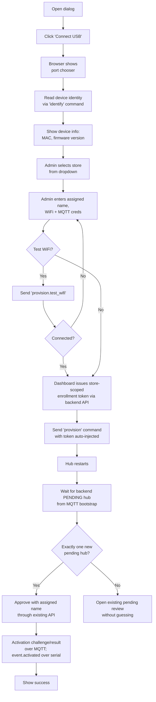

# Transmitter Hub — Web Serial Communication Plan

> **Scope:** Add Web Serial API support to the admin dashboard (Next.js), enabling three capabilities over a direct USB connection to ESP32-C3 transmitter hubs: (1) USB-assisted provisioning through the existing backend enrollment and approval flow, (2) local RF dispatch and lifecycle control after activation, and (3) live serial diagnostics.
>
> **Environment:** This plan targets the `web/` (Next.js admin dashboard) and one narrow `backend/` (Kotlin/Spring Boot) helper for receiver-based USB test dispatch. It otherwise reuses the existing backend enrollment, pending-device approval, and activation flow. The implemented transmitter firmware under `transmitter/main/serial/` is the serial protocol source of truth.
>
> **Prerequisite (completed in source):** The firmware serial protocol is implemented under `transmitter/main/serial/`, including 9 commands, event forwarding, and the 30-second protocol-session timeout. Runtime verification is outside this web plan.

---

## Firmware Protocol Reference

The firmware serial protocol is implemented in the current transmitter source. This section is a reference for dashboard implementation only — do not modify firmware code from this plan.

### Protocol Framing

JSON Lines over the ESP32-C3 USB Serial/JTAG serial link. Each protocol message is a single JSON object terminated by `\n`. Console logs and protocol messages share the same host-visible serial pipe. The browser discriminates complete lines by first non-empty character: `{` = candidate JSON protocol, anything else = ESP-IDF log output. A line that starts with `{` but fails JSON parsing is displayed as console output.

### Message Envelope

**Request** (browser → hub):

```json
{"id":"<uuid>","type":"<type>","payload":{...}}
```

**Response** (hub → browser):

```json
{"id":"<echoed-uuid>","type":"response","ok":true,"payload":{...}}
```

**Event** (hub → browser, unsolicited):

```json
{"id":null,"type":"event.wifi_connected","payload":{}}
```

### Command Table

#### Provisioning Commands

| Type                  | Payload                                                              | Response Payload                                  |
| --------------------- | -------------------------------------------------------------------- | ------------------------------------------------- |
| `status`              | (none)                                                               | Device status snapshot (see below)                |
| `provision`           | `{wifi_ssid, wifi_pwd, mqtt_uri, mqtt_user, mqtt_pwd, enroll_token}` | `{restarting: true}`                              |
| `provision.test_wifi` | `{wifi_ssid, wifi_pwd}`                                              | `{connected: bool, ip: string, rssi: int}`        |
| `update_mqtt`         | `{mqtt_uri, mqtt_user, mqtt_pwd}`                                    | `{restarting: true}`                              |
| `factory_reset`       | (none)                                                               | `{restarting: true}`                              |

#### Control Commands (post-activation)

| Type        | Payload                                                              | Response Payload                              |
| ----------- | -------------------------------------------------------------------- | --------------------------------------------- |
| `transmit`  | `{receiver_public_id?, band, rf_code_hex, rf_code_bits, proto_any}` | `{status, reason?, applied_at_ms?}` |
| `lifecycle` | `{action: "suspend" \| "resume" \| "decommission"}`                  | `{op_state: "<new state>"}`                   |

#### Diagnostic Commands

| Type       | Payload | Response Payload                                                      |
| ---------- | ------- | --------------------------------------------------------------------- |
| `ping`     | (none)  | `{uptime_ms: number}`                                                 |
| `identify` | (none)  | `{public_id, device_name, firmware_version, mac, op_state}` |

### Status Response Schema

```json
{
  "schema_version": 1,
  "provisioned": true,
  "activated": true,
  "recovery_required": false,
  "wifi_connected": true,
  "mqtt_connected": true,
  "op_state": "ACTIVE",
  "public_id": "HUB-7F3A",
  "device_name": "Store Front Hub",
  "wifi_ssid": "StoreLab-5G",
  "wifi_rssi": -52,
  "ip": "192.168.1.42",
  "uptime_ms": 3612000,
  "free_heap": 142560,
  "firmware_version": "v1.0",
  "mac": "AA:BB:CC:DD:EE:FF"
}
```

### Event Types Forwarded

| Firmware Event                | Serial event type              | Payload                                         |
| ----------------------------- | ------------------------------ | ------------------------------------------------ |
| `TX_EVENT_WIFI_CONNECTED`     | `event.wifi_connected`         | (none)                                           |
| `TX_EVENT_WIFI_DISCONNECTED`  | `event.wifi_disconnected`      | (none)                                           |
| `TX_EVENT_MQTT_CONNECTED`     | `event.mqtt_connected`         | (none)                                           |
| `TX_EVENT_MQTT_DISCONNECTED`  | `event.mqtt_disconnected`      | (none)                                           |
| `TX_EVENT_ACTIVATED`          | `event.activated`              | (none)                                           |
| `TX_EVENT_LIFECYCLE_CHANGED`  | `event.lifecycle_changed`      | `{op_state}`                                     |
| `TX_EVENT_DISPATCH_OK`        | `event.dispatch_ok`            | `{receiver_public_id, band, status, source?}`     |
| `TX_EVENT_DISPATCH_REJECTED`  | `event.dispatch_rejected`      | `{receiver_public_id, band, status, reason?, source?}` |

### Trust Model

USB is a direct physical connection — serial `transmit` commands skip ECDSA signature verification, dispatch ring dedup, and MQTT ack publication. They still require the hub's local operational state to be `ACTIVE`.

### Session Management

The firmware tracks active serial sessions via a 30-second RX inactivity timeout. Events are only forwarded when a protocol session is active (valid JSON command received within the last 30 seconds). The browser should send `status` immediately after connecting to establish the session.

### Hardware Constants

| Constant       | Value    |
| -------------- | -------- |
| USB Vendor ID  | `0x303A` |
| USB Product ID | `0x1001` |
| Baud rate      | `115200` (required by Web Serial `open()` options; conventional for this USB Serial/JTAG path) |

### Shared USB Pipe Design

Console output and protocol messages share the same USB Serial/JTAG path. The browser must discriminate by content:

| First character | Classification        | Handling                                                          |
| --------------- | --------------------- | ----------------------------------------------------------------- |
| `{`             | JSON protocol message | Parse and route to request/response correlation or event dispatch |
| Anything else   | Console log output    | Display in the live console log viewer                            |

The frontend must treat the stream as line-oriented and defensive: buffer until `\n`, trim only for classification, parse candidate JSON inside `try/catch`, and show malformed or non-protocol lines in the console viewer. Do not rely on browser-side timing or task ordering to infer command completion; only a matching response `id` resolves a request.

---

## Motivation

A USB-connected transmitter hub opens a direct, zero-latency control channel between the admin dashboard and the device. This serves three equally important purposes:

### 1. USB-Assisted Provisioning (reduces SoftAP friction)

The current SoftAP provisioning flow requires the admin to disconnect from their WiFi, join the hub's AP, open a separate provisioning page, manually enter credentials and an enrollment token, then wait for the hub to restart. With USB-assisted provisioning, the admin stays on their network, issues the existing backend enrollment token from the dashboard, and sends the provisioning payload over serial with the token auto-injected.

USB does not remove the backend approval step. The current backend creates a `PENDING` transmitter hub after MQTT bootstrap registration, and `DeviceApprovalService.approve()` still issues the activation challenge after an admin assigns a name and approves the pending device.

### 2. Direct Dispatch & Control (supplements MQTT)

A USB-connected hub can receive RF transmit commands and lifecycle actions (suspend/resume/decommission) directly from the browser, bypassing the MQTT roundtrip entirely. This is valuable for:

- **Bench testing during setup** — dispatch RF commands to verify receivers work before deploying the hub to its final location. The hub must already be activated locally (`op_state == ACTIVE`), but the active USB command path itself does not require MQTT to be connected
- **On-site diagnostics** — plug into a deployed hub to send test transmissions, check signal reach, or cycle lifecycle states while troubleshooting, even if the network is down
- **MQTT credential rotation** — update MQTT broker credentials (`update_mqtt`) without full re-provisioning, useful when rotating broker passwords or migrating to a new broker
- **Factory reset** — wipe a hub's NVS and return it to factory state from the dashboard, without needing the SoftAP page

### 3. Real-Time Monitoring & Diagnostics

The USB connection provides a live event stream and console log viewer:

- **Device status snapshots** — RSSI, free heap, uptime, op state, WiFi/MQTT connectivity from the `status` command
- **Event stream** — WiFi connect/disconnect, MQTT connect/disconnect, activation, dispatch results, and lifecycle changes surfaced as they happen. These events do not include every status metric, so the UI still needs a status poll or manual refresh for counters such as uptime and free heap
- **ESP-IDF console logs** — boot messages, WiFi association logs, MQTT handshake output, radio driver messages — visible directly in the dashboard terminal panel. Invaluable for diagnosing connectivity issues without a separate serial terminal

---

## Technical Feasibility

### Web Serial API (Browser Side)

| Aspect           | Detail                                                                                         |
| ---------------- | ---------------------------------------------------------------------------------------------- |
| Browser support  | Treat as Chromium-desktop only in product behavior. Render USB UI only when `"serial" in navigator`; SoftAP remains the fallback for Safari, Firefox, mobile, and locked-down enterprise browsers |
| Security         | Requires a secure context (HTTPS, with localhost acceptable for development) and transient user activation for `navigator.serial.requestPort()` |
| Permission model | Per-origin, per-device permission. `navigator.serial.getPorts()` returns ports the origin already has permission for while that permission remains granted; the user can revoke it |
| Permissions policy | If the dashboard is ever embedded in an iframe, the embedding page must allow the `serial` permission policy. The current dashboard is top-level, so no new header is required |
| Framework        | Pure browser API. Access `navigator.serial`, `window`, and stream objects only inside `"use client"` components/hooks and effects. Use a client-only dynamic import if a future component reads browser globals during module initialization |

**ESP32-C3 filter:**

```javascript
const port = await navigator.serial.requestPort({
  filters: [{ usbVendorId: 0x303A, usbProductId: 0x1001 }]
});
```

---

## USB Provisioning Flow

### Current SoftAP Flow vs. Proposed USB Flow

```mermaid
flowchart TD
    subgraph current["Current: SoftAP Provisioning"]
        A1[Admin issues token in dashboard] --> A2[Admin goes to hub location]
        A2 --> A3[Connect laptop to hub's WiFi AP]
        A3 --> A4[Open 192.168.4.1 in browser]
        A4 --> A5[Manually type WiFi + MQTT creds + token]
        A5 --> A6[Hub restarts, connects to WiFi]
        A6 --> A7[Hub bootstraps via MQTT]
    end

    subgraph proposed["Proposed: USB Provisioning"]
        B1[Plug hub into USB] --> B2[Click 'Provision via USB' in dashboard]
        B2 --> B3[Select store to assign hub to]
        B3 --> B4[Enter assigned name,\nWiFi + MQTT creds]
        B4 --> B5[Dashboard issues store-scoped\nenrollment token via backend API]
        B5 --> B6[Dashboard sends provision command\nover serial with token auto-injected]
        B6 --> B7[Hub restarts, connects to WiFi]
        B7 --> B8[Backend creates PENDING hub\nthrough existing MQTT bootstrap]
        B8 --> B9[Admin approves pending hub\nor dashboard auto-approves only if\none new pending hub is unambiguous]
        B9 --> B10[Activation challenge/response\nruns over MQTT]
        B10 --> B11[Hub becomes ACTIVE]
    end
```



### What Changes

**Eliminated friction:**

- No WiFi switching — the admin stays on their network
- Single interface — everything happens in one browser tab within the dashboard
- No manual token handling — the dashboard issues the enrollment token via the existing backend API. The admin never sees or copies a token
- Real-time feedback — the serial event stream shows WiFi/MQTT connectivity and activation events when they happen, while the dashboard uses status polling and the existing device APIs for backend pending/approval state

**What the admin enters (USB provisioning):**

- **Store assignment** — which store this hub belongs to (dropdown from existing stores)
- **Assigned hub name** — required by the existing approval API before activation
- **WiFi SSID and password** — the store's WiFi network
- **MQTT broker URI, username, and password** — the broker connection details (same as SoftAP)

**What the dashboard handles automatically:**

- **Enrollment token** — generated on-the-fly via the existing enrollment-token API when the admin clicks "Provision". Injected directly into the serial `provision` command
- **Device registration timing** — the dashboard reads the hub's MAC address via `identify` for user confirmation only. The backend device record is created later by the existing MQTT bootstrap registration and starts as `PENDING`
- **Pending approval handling** — after provisioning, poll `listDevices("TRANSMITTER_HUB", storeId)` for newly created `PENDING` hubs. If exactly one new pending hub appears after this provisioning attempt, use the existing `approveDevice()` API with the assigned name entered in the dialog. If there are zero or multiple candidates, show the existing pending review path and do not guess

### SoftAP Is Retained as Fallback

USB provisioning does **not** replace SoftAP. It supplements it. SoftAP remains the fallback for scenarios where:

- The admin doesn't have a laptop with a USB port at the hub's location
- The browser doesn't support Web Serial (Safari, Firefox stable)
- The USB cable is broken or unavailable
- Remote provisioning by a non-technical operator who only has a phone

---

## Live USB Control (Supplementing MQTT)

When a hub is USB-connected, the dashboard can send commands directly over the serial link. The hub processes USB `transmit` commands through the same radio supervisor used by MQTT dispatch, but skips signature verification, dispatch-ring deduplication, and MQTT ack publication. Local control requires the hub to have completed activation earlier, because the firmware rejects transmit commands unless local `op_state` is `ACTIVE`.

### Dashboard UX

On the hub detail page, the admin explicitly connects a serial port. After `identify`/`status`, the UI shows a **"USB Connected"** indicator when the serial hub's `public_id` matches the backend `DeviceDetailDto.publicId`. If the firmware has no `public_id` yet or the IDs differ, allow diagnostics/provisioning actions only after a clear local-device confirmation and keep backend-specific controls disabled.

- **RF Dispatch** — send a local `transmit` command using either a manually entered test payload or a backend-prepared payload for a selected receiver. The existing `DeviceDto.rfCode` only exposes masked summary data, not `rf_code_hex`, so selected-receiver USB dispatch requires a narrow backend helper that validates store/device access and returns `{receiver_public_id, band, rf_code_hex, rf_code_bits, proto_any}` without publishing MQTT. Do not reuse `device-dispatch-dialog.tsx` directly: that dialog issues queue tickets through the backend and does not expose the raw RF payload required by the serial command
- **Lifecycle Control** — suspend, resume, or decommission the hub locally. Useful for cycling states during setup or field troubleshooting, but it does not update backend `Device.status`
- **MQTT Credential Update** — update broker URI/user/password via `update_mqtt` without full re-provisioning. Hub restarts with new credentials
- **Factory Reset** — wipe NVS and restart from the dashboard
- **Live Diagnostics** — status snapshots for RSSI, free heap, uptime, op state, and WiFi/MQTT connectivity, plus push events for connectivity, activation, lifecycle, and dispatch outcomes. Console log panel shows ESP-IDF output (boot, WiFi, MQTT, radio logs) in the browser

Commands sent over USB are **local only** — the backend is not notified and no MQTT ack is published. If the hub is also MQTT-connected, backend state may drift. The dashboard shows a warning banner for local USB control and keeps backend state visually separate from the serial snapshot.

---

## USB Provisioning End-to-End Flow

**USB provisioning uses existing backend endpoints.** It uses the existing `POST /api/devices/enrollment-tokens` endpoint (`DEVICES.TOKENS` in `web/src/lib/constants.ts`, `issueEnrollmentToken()` in `web/src/features/device/api.ts`). The endpoint accepts `{storeId?: UUID}`, returns `{token, tokenHash, expiresAt}`, and enforces store-scoped access. Current backend activation is still a two-step flow: MQTT bootstrap creates a `PENDING` device, then `POST /api/devices/{id}/approve` (`approveDevice()`) assigns the name/store and publishes the activation challenge.

Most USB control commands (`lifecycle`, `status`, `ping`, `identify`, `update_mqtt`, `factory_reset`, and manually entered `transmit` payloads) are client-side serial operations. They do not call backend command endpoints and do not create backend ack records. Receiver-based USB test dispatch is the exception: the current web DTOs intentionally expose only masked RF-code summaries, so the frontend needs a backend helper that prepares the same plaintext RF payload shape already built inside `TransmitterDispatchService` without publishing it over MQTT.

```mermaid
sequenceDiagram
    participant Admin as Admin Dashboard
    participant Backend as Backend API
    participant Hub as USB Hub (serial)
    participant MQTT as MQTT Broker

    Admin->>Hub: identify (serial)
    Hub-->>Admin: {public_id, device_name, firmware_version, mac, op_state}
    Admin->>Backend: POST /api/devices/enrollment-tokens {storeId}
    Backend-->>Admin: {token, tokenHash, expiresAt}
    Admin->>Hub: provision (serial)
    Hub-->>Admin: {restarting: true}
    Note over Hub: Hub restarts — USB port disconnects
    Note over Admin: Browser detects port disconnect
    Note over Hub: Hub reboots, USB port reappears
    Admin->>Hub: Re-open port + status (serial)
    Hub-->>Admin: Status snapshot (provisioned, connecting...)
    Hub->>MQTT: Bootstrap registration (enrollment token + public key)
    MQTT->>Backend: Forward registration
    Backend->>Backend: Consume token, create/update PENDING hub and bind store when token is scoped
    Backend-->>Hub: Bootstrap pending notice
    Admin->>Backend: Poll/list pending transmitter hubs for selected store
    alt exactly one new pending candidate
        Admin->>Backend: POST /api/devices/{id}/approve {assignedName, storeId}
        Backend-->>MQTT: Publish activation challenge
        Hub->>MQTT: Signed activation response
        MQTT->>Backend: Forward activation response
        Backend-->>MQTT: Publish activation result
        Hub-->>Admin: event.activated (serial push)
    else none or multiple pending candidates
        Admin->>Admin: Show link/list for existing pending review; do not guess device identity
    end
```

---

## Backend Helper for USB Test Dispatch

Provisioning, approval, lifecycle, and diagnostics reuse existing backend APIs or stay fully local to serial. The only required backend addition is for selected-receiver USB test dispatch, because current `DeviceDto.rfCode`/`DeviceDetailDto.rfCode` intentionally expose masked RF-code summary fields (`bits`, `byteLen`, `version`, ack metadata) and not the plaintext `rf_code_hex` needed by the firmware serial `transmit` command.

### New Endpoint

Add a store-scoped, admin-authenticated helper endpoint:

| Method | Route | Request | Response |
| ------ | ----- | ------- | -------- |
| `POST` | `/api/devices/usb-dispatch-payload` | `{storeId: UUID, deviceId: UUID, action: "call" \| "stop"}` | `{receiverPublicId, band, rfCodeHex, rfCodeBits, protoAny}` |

Implementation notes:

- Put the route in `DeviceAdminController` and keep access checks aligned with existing device endpoints.
- Reuse the RF payload construction rules from `TransmitterDispatchService`: decrypt the receiver RF code via `DeviceRfCodeRepository.findDecryptedPayload()`, derive `band` from receiver kind, set `protoAny` to `true` for active firmware receivers, and patch PT2272 passive receivers with the same call/stop channel logic.
- Do **not** elect a transmitter, create a queue ticket, set `deviceBusy`, sign a canonical command, publish MQTT, or emit queue events. The endpoint only prepares the local serial payload.
- Return errors through the existing API error envelope style: not found/forbidden for access failures, conflict-style errors for non-dispatchable devices, missing RF code, or RF-code decrypt failure.
- Keep the response unpersisted and short-lived in UI state. Do not add `rfCodeHex` to `DeviceDto` or `DeviceDetailDto`; those DTOs should remain masked.

Manual USB test dispatch can skip this endpoint and send an explicitly typed payload from the dialog, but receiver selection must use the helper.

---

## Frontend Changes

### Existing Device Infrastructure

The device domain is well-established in the frontend:

- **15+ components** in `web/src/features/device/` covering device list, approval, lifecycle, RF code rotation, enrollment tokens, passive device registration, hub management
- **Full i18n** — ~150 `devices.*` keys in both `en.json` and `vi.json`
- **Types** — `DeviceDto`, `DeviceDetailDto`, `EnrollmentTokenIssueResponse` in `web/src/types/device.ts`
- **API constants** — all device endpoints in `web/src/lib/constants.ts` including `DEVICES.TOKENS`
- **Queue dispatch** — `device-dispatch-dialog.tsx` in `web/src/features/queue/` exists for backend-issued queue tickets; it is a style/reference source, not the implementation target for local USB RF dispatch

### New Module: `web/src/lib/serial/`

```
web/src/lib/serial/
├── types.ts               # TypeScript types for serial messages
├── serial-protocol.ts     # JSON-lines framing, request/response correlation
└── use-serial.ts          # React hook: connect, disconnect, port state
```

#### A. `types.ts` — Serial Message Types

TypeScript interfaces for all serial messages, matching the firmware protocol exactly:

```typescript
// Message envelope types
interface SerialRequest {
  id: string;
  type: string;
  payload?: Record<string, unknown>;
}

interface SerialResponse {
  id: string;
  type: "response";
  ok: boolean;
  payload?: Record<string, unknown>;
  error?: string;
}

interface SerialEvent {
  id: null;
  type: string;
  payload: Record<string, unknown>;
}

// Command payload types
interface ProvisionPayload {
  wifi_ssid: string;
  wifi_pwd?: string;
  mqtt_uri: string;
  mqtt_user: string;
  mqtt_pwd: string;
  enroll_token: string;
}

interface TestWifiPayload {
  wifi_ssid: string;
  wifi_pwd?: string;
}

interface UpdateMqttPayload {
  mqtt_uri: string;
  mqtt_user: string;
  mqtt_pwd: string;
}

interface TransmitPayload {
  receiver_public_id?: string;
  band: "433M" | "2_4G";
  rf_code_hex: string;
  rf_code_bits: number;
  proto_any: boolean;
}

interface LifecyclePayload {
  action: "suspend" | "resume" | "decommission";
}

// Response payload types
interface StatusPayload {
  schema_version: number;
  provisioned: boolean;
  activated: boolean;
  recovery_required: boolean;
  wifi_connected: boolean;
  mqtt_connected: boolean;
  op_state: string;
  public_id: string;
  device_name: string;
  wifi_ssid?: string;
  wifi_rssi?: number;
  ip?: string;
  uptime_ms: number;
  free_heap: number;
  firmware_version: string;
  mac: string;
}

interface IdentifyPayload {
  public_id: string;
  device_name: string;
  op_state: string;
  firmware_version: string;
  mac: string;
}

interface TestWifiResult {
  connected: boolean;
  ip?: string;
  rssi?: number;
}

interface TransmitResult {
  status: "applied" | "rejected";
  reason?: string;
  applied_at_ms?: number;
}
```

#### B. `serial-protocol.ts` — Line Discrimination + Request/Response Correlation

```typescript
class SerialProtocol {
  private pending = new Map<
    string,
    {
      resolve: (payload: unknown) => void;
      reject: (error: Error) => void;
      timeout: ReturnType<typeof setTimeout>;
    }
  >();
  private writer: WritableStreamDefaultWriter<Uint8Array>;
  private eventTarget = new EventTarget();

  async send<T>(type: string, payload?: object): Promise<T> {
    const id = crypto.randomUUID();
    const msg = JSON.stringify({ id, type, payload }) + "\n";

    return new Promise((resolve, reject) => {
      const timeout = setTimeout(() => {
        this.pending.delete(id);
        reject(new Error(`Timeout: ${type}`));
      }, 10_000);

      this.pending.set(id, {
        resolve: (value) => resolve(value as T),
        reject,
        timeout,
      });

      this.writer.write(new TextEncoder().encode(msg)).catch((error) => {
        clearTimeout(timeout);
        this.pending.delete(id);
        reject(error instanceof Error ? error : new Error("serial_write_failed"));
      });
    });
  }

  handleLine(line: string) {
    const trimmed = line.trim();
    if (!trimmed) return;

    if (trimmed.startsWith("{")) {
      try {
        this.handleProtocolMessage(trimmed);
      } catch {
        // Malformed JSON starting with '{' — treat as console output
        this.eventTarget.dispatchEvent(
          new CustomEvent("console.log", { detail: trimmed })
        );
      }
    } else {
      this.eventTarget.dispatchEvent(
        new CustomEvent("console.log", { detail: trimmed })
      );
    }
  }

  private handleProtocolMessage(json: string) {
    const msg = JSON.parse(json);
    if (msg.type === "response" && this.pending.has(msg.id)) {
      const { resolve, reject, timeout } = this.pending.get(msg.id)!;
      clearTimeout(timeout);
      this.pending.delete(msg.id);
      msg.ok ? resolve(msg.payload) : reject(new Error(msg.error ?? "serial_error"));
    } else if (msg.type?.startsWith("event.")) {
      this.eventTarget.dispatchEvent(
        new CustomEvent(msg.type, { detail: msg.payload })
      );
    }
  }
}
```

#### C. `use-serial.ts` — React Hook

```typescript
"use client";

type PortState = "closed" | "opening" | "open" | "closing";

interface UseSerialReturn {
  canUseSerial: boolean;
  portState: PortState;
  connect: () => Promise<void>;
  disconnect: () => Promise<void>;
  sendCommand: <T>(type: string, payload?: object) => Promise<T>;
  deviceState: StatusPayload | null;
  events: EventTarget;
}
```

Key behaviors:

- **Feature detection:** `"serial" in navigator` — gate all serial UI behind this check. Initializes to `false` on SSR, set in a `useEffect`
- **Filter:** `{ usbVendorId: 0x303A, usbProductId: 0x1001 }` — only show Espressif devices
- **Previously granted ports:** call `navigator.serial.getPorts()` only after feature detection to offer reconnect for ports the origin can already access. Opening still can fail if the OS/device is gone or another tab/app owns the port
- **Baud rate:** open the port with `{ baudRate: 115200 }`
- **Read loop:** Background reader that buffers until `\n`, discriminates lines (JSON protocol vs console log), routes responses to pending promises (by `id`) or dispatches events
- **State model:** On connect, send `status` to populate `deviceState`. Push events update discrete booleans/state labels where possible, but metrics such as uptime, free heap, RSSI, and IP require a periodic `status` refresh. Use a 30-second poll while the control panel is open
- **Reconnect after restart:** listen to `navigator.serial` `disconnect`/`connect` events. After a provisioning/update/reset restart, try to reopen a previously granted matching port through `getPorts()` when it reappears. If permission is missing or the port cannot be identified, show a reconnect action that calls `requestPort()` from a user click
- **Cleanup:** cancel the active reader, release reader/writer locks, close the writer if needed, and then close the port. Run this on component unmount; `pagehide`/`beforeunload` can be best-effort only because async cleanup is not guaranteed to finish

### UI Components

All UI components use **shadcn/ui** exclusively. Styling follows `docs/walkthrough/Web Styles.md`. The `Dialog` component has glass styling built-in (`bg-surface/85 backdrop-blur-xl`). For `Card` and other elements, apply the `.glass-card` CSS class from `web/src/styles/glass.css`. Color states use CSS variable tokens (`--success`, `--warning`, `--destructive`, `--primary`, `--action`). Complex or lengthy styles go in separate CSS files, not inline Tailwind. All components must support dark mode via the existing `.dark` theme tokens.

#### USB Provisioning Dialog

New component in `web/src/features/device/`:

**`usb-provision-dialog.tsx`** — uses shadcn `Dialog` (has glass styling built-in). Triggered from a shadcn `Button` variant="outline" with a USB icon on the device management page next to the existing token and passive-device actions.

**Flow:**



**Form fields** (shadcn `Input`, `Select`, `Button`, `Label` components):

| Field           | shadcn component      | Validation                                    | Notes                                                                      |
| --------------- | --------------------- | --------------------------------------------- | -------------------------------------------------------------------------- |
| Store           | `Select`              | required                                      | Select from existing stores. Determines which store the hub is assigned to |
| Assigned name   | `Input`               | required, max 100                             | Passed to `approveDevice()` when the new pending hub is unambiguous        |
| WiFi SSID       | `Input`               | required, max 32                              | Store's WiFi network                                                       |
| WiFi password   | `Input` type=password | optional, max 64                              | WPA2/WPA3 key                                                              |
| MQTT broker URI | `Input`               | required, must start with `mqtts://`, max 191 | Broker address                                                             |
| MQTT username   | `Input`               | required, max 95                              | Broker auth                                                                |
| MQTT password   | `Input` type=password | required, max 127                             | Broker auth                                                                |

**Progress indicator:** Multi-step stepper built from shadcn primitives (no external stepper library). Steps: Token → Provisioning → Restarting → WiFi → MQTT bootstrap → Pending approval → Activated. Active step uses `--primary`, completed steps use `--success`, failed steps use `--destructive`. Wrap in a plain `Card` (no `.glass-card` — avoid glass-on-glass inside Dialog) with appropriate breathability (padding/spacing).

**Auto-injected (not shown to admin):**

| Field            | Source      | Notes                                                                                                         |
| ---------------- | ----------- | ------------------------------------------------------------------------------------------------------------- |
| Enrollment token | Backend API | Auto-generated when admin clicks "Provision". One-time use, injected directly into serial `provision` command |

**Backend matching rule:** the current backend DTO does not expose the hub MAC address, public key, enrollment token hash, or registration nonce on device list/detail responses. The frontend therefore must not claim deterministic correlation between the serial `identify` result and a backend record. It may auto-approve only when polling finds exactly one new `PENDING` `TRANSMITTER_HUB` for the selected store after this provisioning attempt; otherwise it routes the admin to the existing pending review UI.

#### USB Control Panel

New component shown on the device detail page when a USB connection is active:

**`usb-control-panel.tsx`** — uses shadcn `Collapsible` wrapping a `Card` with `.glass-card` class. Appears on the device detail page.

**Features:**

- **Connection indicator** — shadcn `Badge` variant="outline" with `border-success/40 bg-success/10 text-success` when connected (same pattern as `hub-heartbeat-panel.tsx` liveness badge). Switches to `border-border` + `text-muted-foreground` when disconnected
- **Live status** — fetches initial snapshot via `status` on connect, merges discrete push events into local serial state, and runs a 30-second `status` sync for metrics that events do not carry. Metrics displayed in a grid of small `Card` tiles (plain `Card`, not `.glass-card` — avoid glass-on-glass inside the parent `.glass-card` panel)
- **Test dispatch** — use a new USB-specific dispatch dialog instead of changing `device-dispatch-dialog.tsx`. It may reuse select/list styling from that dialog, but selected-receiver mode must call the backend payload helper before sending serial `transmit`; manual mode can send an explicitly typed payload. The existing queue dialog issues backend device tickets and is not the right abstraction for local raw RF transmission
- **Quick lifecycle** — suspend/resume using shadcn `Button` components. Same `AlertDialog` confirmation as existing lifecycle panel. Label the result as local serial state and do not mutate the backend `DeviceDetailDto` as if the backend acknowledged it
- **Event log** — scrolling list of timestamped events inside a `Card`. Event types color-coded: WiFi/MQTT events use `--primary`, dispatch events use `--action`, errors use `--destructive`
- **Console log viewer** — nested shadcn `Collapsible` with a true monospace font (e.g., `font-family: 'Courier New', Consolas, monospace` — note: the project's `--font-mono` maps to Inter which is not monospace). Dark background using `bg-[#1E293B]` in light mode, `bg-[#0F172A]` in dark mode to resemble a terminal. Fed by `console.log` events from the protocol layer. Auto-scrolls with a "Pause" toggle (`Button` variant="ghost"). All terminal styling (monospace font, auto-scroll behavior, log-level color highlighting) goes in a separate `usb-console.css` file
- **Warning banner** — styled `div` with `border-warning/40 bg-warning/10 p-3 text-sm text-warning-foreground rounded-lg` (same pattern as the warning in `enrollment-token-dialog.tsx`). Shown when the hub is also MQTT-connected

#### Browser Support Gate

All serial UI is wrapped in a feature-detection guard:

```tsx
{canUseSerial ? (
  <UsbProvisionButton />
) : null}
```

No error message or "unsupported browser" warning — the USB option simply doesn't appear. SoftAP remains the default path for unsupported browsers.

Do not add unused unsupported-browser translation copy unless a visible fallback message is introduced in the same implementation pass.

#### UI Patterns (must match existing codebase conventions)

Follow these established patterns from existing device components:

- **Error display:** Field validation errors use the `InlineError` component (from `@/components/ui/inline-error`) with `aria-invalid` on the input. API errors use `toast.error()` with `translateCommonApiError()` and `translateNetworkError()` from `@/lib/api-error`
- **Button styling:** Primary CTA uses `bg-primary text-primary-foreground hover:bg-primary-hover`. Cancel/secondary uses `variant="outline"`. Destructive uses `text-destructive hover:text-destructive` on outline buttons (see `lifecycle-panel.tsx`)
- **Loading states:** `Loader2` icon with `animate-spin mr-2 size-4` inside the button. Button disabled via `disabled={loading}`. Separate `fetching` state for data loads (spinner in content area, not button)
- **Forms:** Controlled inputs (`value` + `onChange`). Validation via a `validate()` function on submit that sets an `errors` record. `noValidate` on the form element. Field-level errors shown below each field
- **Select component styling:** `SelectTrigger` with `h-10 w-full gap-2 px-3`. `SelectContent` with `align="start" alignItemWithTrigger={false} p-1.5`. `SelectItem` with `py-2`
- **useTranslations:** Use multiple namespaces: `const tCommon = useTranslations("common")`, `const tDevices = useTranslations("devices")`, `const tErrors = useTranslations("errors")`. Follow the same pattern as `enrollment-token-dialog.tsx` and `approve-dialog.tsx`
- **Badge styling:** All badges use `variant="outline"` with semantic color borders: `border-success/40 bg-success/10 text-success` for positive, `border-destructive/40 bg-destructive/10 text-destructive` for negative, `border-primary/40 bg-primary/10 text-primary` for informational
- **Glass usage:** `.glass-card` on standalone panels (like `lifecycle-panel.tsx`, `hub-heartbeat-panel.tsx`). Never glass-on-glass (no `.glass-card` on children inside a `.glass-card` parent). Dialog content is already glass-styled — don't add `.glass-card` inside dialogs
- **Store selector pattern:** Conditional on `isSuperAdmin` — super admins get a `Select` with `listStores()` results, regular admins see a disabled `Input` showing their assigned store name (see `approve-dialog.tsx`)

### i18n Keys

New translation keys for both `en.json` and `vi.json`:

| Key                             | English                                                                                                                                                 | Vietnamese                                                                                                                      |
| ------------------------------- | ------------------------------------------------------------------------------------------------------------------------------------------------------- | ------------------------------------------------------------------------------------------------------------------------------- |
| `devices.usb.connect`            | Connect USB                                                                                                                                             | Kết nối USB                                                                                                                     |
| `devices.usb.disconnect`         | Disconnect                                                                                                                                              | Ngắt kết nối                                                                                                                    |
| `devices.usb.connected`          | USB Connected                                                                                                                                           | Đã kết nối USB                                                                                                                  |
| `devices.usb.provision_title`    | Provision via USB                                                                                                                                       | Cấp phát qua USB                                                                                                                |
| `devices.usb.provision_desc`     | Connect the transmitter hub via USB to send WiFi and MQTT settings from the dashboard. The dashboard generates the enrollment token; pending approval still applies. | Kết nối hub phát tín hiệu qua USB để gửi cấu hình WiFi và MQTT từ bảng điều khiển. Bảng điều khiển tự tạo mã đăng ký; hub vẫn cần được duyệt. |
| `devices.usb.select_store`       | Assign to store                                                                                                                                         | Chọn cửa hàng                                                                                                                   |
| `devices.usb.assigned_name`      | Hub name                                                                                                                                                | Tên hub                                                                                                                         |
| `devices.usb.issuing_token`      | Issuing enrollment token...                                                                                                                             | Đang tạo mã đăng ký...                                                                                                          |
| `devices.usb.pending_review`     | Pending approval                                                                                                                                        | Đang chờ duyệt                                                                                                                  |
| `devices.usb.pending_ambiguous`  | The hub was provisioned, but the dashboard cannot identify exactly one new pending hub. Review pending devices to continue activation.                  | Hub đã được cấp phát, nhưng bảng điều khiển không xác định được đúng một hub mới đang chờ duyệt. Hãy xem danh sách chờ duyệt để tiếp tục kích hoạt. |
| `devices.usb.test_wifi`          | Test WiFi                                                                                                                                               | Thử kết nối WiFi                                                                                                                |
| `devices.usb.testing_wifi`       | Testing WiFi connection...                                                                                                                              | Đang thử kết nối WiFi...                                                                                                        |
| `devices.usb.wifi_ok`            | WiFi connection successful                                                                                                                              | Kết nối WiFi thành công                                                                                                         |
| `devices.usb.wifi_fail`          | WiFi connection failed                                                                                                                                  | Kết nối WiFi thất bại                                                                                                           |
| `devices.usb.provisioning`       | Provisioning device...                                                                                                                                  | Đang cấp phát thiết bị...                                                                                                       |
| `devices.usb.provision_success`  | Device provisioned successfully                                                                                                                         | Cấp phát thiết bị thành công                                                                                                    |
| `devices.usb.waiting_activation` | Waiting for activation...                                                                                                                               | Đang chờ kích hoạt...                                                                                                           |
| `devices.usb.local_warning`      | Commands sent over USB are local only. Backend state may differ.                                                                                        | Lệnh qua USB chỉ áp dụng cục bộ. Trạng thái trên máy chủ có thể khác.                                                           |
| `devices.usb.control_panel`      | USB Control                                                                                                                                             | Điều khiển USB                                                                                                                  |
| `devices.usb.test_dispatch`      | Test Dispatch (USB)                                                                                                                                     | Thử phát tín hiệu (USB)                                                                                                         |
| `devices.usb.console_log`        | Console Output                                                                                                                                          | Nhật ký hệ thống                                                                                                                |
| `devices.usb.console_pause`      | Pause                                                                                                                                                   | Tạm dừng                                                                                                                        |
| `devices.usb.console_resume`     | Resume                                                                                                                                                  | Tiếp tục                                                                                                                        |

---

## Implementation Phases

### Phase 1 — Frontend Serial Library

**Scope:** React hook, protocol layer, TypeScript types.

**Steps:**

1. **Create `web/src/lib/serial/types.ts`** — TypeScript interfaces for all serial message types (request, response, event, command payloads, status schema). Match the firmware protocol exactly as documented in the Firmware Protocol Reference above.
2. **Create `web/src/lib/serial/serial-protocol.ts`** — `SerialProtocol` class: write framing, read loop with line buffering, **line discrimination** (JSON `{` prefix = protocol, everything else = console log → `console.log` event), request/response correlation with timeout (10s default), event dispatch via `EventTarget`.
3. **Create `web/src/lib/serial/use-serial.ts`** — React hook wrapping `SerialProtocol`: `canUseSerial`, `portState`, `connect()` (triggers browser port chooser with Espressif VID/PID filter `0x303A`/`0x1001`, sends initial `status` on open), `reconnectKnownPort()` (uses `getPorts()` for already granted ports), `disconnect()`, `sendCommand()` (typed generic), `deviceState` (status snapshot plus event-derived flags), `events` (for listening to hub events and console logs).
4. **Feature detection** — `canUseSerial` initializes to `false` on SSR, set to `"serial" in navigator` in a `useEffect`.

**Deliverable:** Reusable serial communication layer. No UI yet.

### Phase 2 — Frontend USB Provisioning UI

**Scope:** USB provisioning dialog, integration with existing device management.

**Steps:**

1. **Create `usb-provision-dialog.tsx`** in `web/src/features/device/` — shadcn `Dialog` (has glass styling built-in) with:
   - "Connect USB" — shadcn `Button` triggering `connect()` from `use-serial`
   - Device identity display — shadcn `Card` showing MAC, firmware version (from `identify` command)
   - Store selector — shadcn `Select` (fetched from existing store list API)
   - Provisioning form — shadcn `Input` + `Label` for assigned name, WiFi, and MQTT fields (manual entry)
   - "Test WiFi" — shadcn `Button` variant="outline" (sends `provision.test_wifi`, result shown as `--success` / `--destructive` inline feedback using `InlineError` or styled `div`)
   - "Provision" — shadcn `Button` with `bg-primary text-primary-foreground hover:bg-primary-hover` (same CTA style as all existing dialogs). On click: calls existing `/api/devices/enrollment-tokens` with the selected `storeId`, then bundles the returned token with admin-entered WiFi + MQTT credentials into the serial `provision` command
   - Pending approval resolver — after restart/MQTT bootstrap, poll `listDevices("TRANSMITTER_HUB", storeId)` for newly created `PENDING` hubs. Auto-call `approveDevice()` only when exactly one new pending hub is found; otherwise show pending-review navigation
   - Progress stepper — built from shadcn primitives inside a `Card` (no `.glass-card` — avoid glass-on-glass inside Dialog), steps color-coded with `--primary` / `--success` / `--destructive` tokens
2. **Add "Provision via USB" button** to device management page — shadcn `Button` variant="outline" with USB icon, shown only when `canUseSerial` is true. Positioned next to existing "Issue Token" trigger in `enrollment-token-dialog.tsx`. Uses `--primary` border/text to match the dashboard's action hierarchy.
3. **i18n** — add provisioning-related keys from the i18n table above to `en.json` and `vi.json`.
4. **Handle edge cases:**
   - Port chooser cancelled → no-op, dialog stays open
   - Device disconnected mid-provision → show error, offer retry
   - Device already provisioned → show current status, offer re-provision or factory reset
   - Backend API failure while issuing the enrollment token → show error, do not send provision to device
   - Pending hub match ambiguous → do not approve automatically; show existing pending review path
   - Multiple devices → each `connect()` call shows the chooser; only one connection at a time

**Deliverable:** Full USB provisioning flow in the admin dashboard.

### Phase 3 — Backend USB Dispatch Payload Helper

**Scope:** One backend route/service method for selected-receiver USB test dispatch payload preparation.

**Steps:**

1. **Add request/response DTOs** under `backend/src/main/kotlin/com/thomas/notiguide/domain/device/request/` and `.../response/` for `{storeId, deviceId, action}` and `{receiverPublicId, band, rfCodeHex, rfCodeBits, protoAny}`.
2. **Add service method** near the existing transmitter dispatch services that reuses `DeviceRfCodeRepository.findDecryptedPayload()` and the same passive PT2272 call/stop patching rules from `TransmitterDispatchService`.
3. **Add controller route** in `DeviceAdminController` for `POST /api/devices/usb-dispatch-payload`, with store access checks matching the existing device endpoints.
4. **Do not publish or persist**: no MQTT publish, no queue ticket, no device-busy key, no command signature, and no queue/device dispatch event.

**Deliverable:** A backend-prepared payload that the frontend can immediately send over serial `transmit`.

### Phase 4 — Frontend USB Control Panel

**Scope:** Live status, test dispatch, quick lifecycle controls.

**Steps:**

1. **Create `usb-control-panel.tsx`** in `web/src/features/device/` — shadcn `Collapsible` + `Card` with `.glass-card`:
   - Connection status: shadcn `Badge` variant="outline" with `border-success/40 bg-success/10 text-success` (connected) or `border-border text-muted-foreground` (disconnected)
   - Live metrics: grid of small plain `Card` tiles (no `.glass-card` — avoid glass-on-glass), populated from `deviceState`, with fallback `status` sync every 30s
   - Event log: scrolling list inside `Card`, color-coded by event type using CSS variable tokens
   - Console log viewer: monospace terminal panel, all terminal styles in separate `usb-console.css`
   - Warning banner: styled `div` with `border-warning/40 bg-warning/10 p-3 text-sm text-warning-foreground rounded-lg`
2. **Create `usb-dispatch-dialog.tsx`** in `web/src/features/device/` — do not adapt `device-dispatch-dialog.tsx`. Use `getAvailableDevices(storeId)` or the existing device list data to select an active receiver, call the new USB dispatch-payload helper to obtain `{receiver_public_id, band, rf_code_hex, rf_code_bits, proto_any}`, then send serial `transmit`. Include a manual test-payload mode only if validation is explicit and local to the dialog.
3. **Quick lifecycle buttons** — shadcn `Button` components sending `lifecycle` commands over serial. Same `AlertDialog` confirmation as existing `lifecycle-panel.tsx`.
4. **i18n** — add remaining keys from the i18n table.

**Deliverable:** USB diagnostics, local lifecycle, and local RF test dispatch in the admin dashboard.

---

## Risk Assessment

| Risk                                                        | Severity | Mitigation                                                                                                                                                                                                                        |
| ----------------------------------------------------------- | -------- | --------------------------------------------------------------------------------------------------------------------------------------------------------------------------------------------------------------------------------- |
| Browser support limited to Web Serial-capable desktop browsers | Low      | Feature-detect `"serial" in navigator`. SoftAP fallback remains. Serial UI only appears when API is available                                                                                                                     |
| Console output shares the serial pipe with protocol messages | Low      | Browser-side line discrimination (`{` = candidate JSON protocol, else = console log), defensive JSON parsing, request correlation by response `id`, and a dedicated console panel                                                  |
| USB disconnect during provisioning                          | Medium   | Hub's `provision` command writes NVS atomically before restarting. If disconnect happens before the command is received, nothing is written. If after, provisioning proceeds normally                                              |
| Serial port already open in another tab/app                 | Low      | Handle open failures, keep one active connection in app state, and present a reconnect/disconnect action rather than assuming exclusive access                                                                                     |
| Backend state drift from local USB commands                 | Medium   | Warning banner in UI. Local USB lifecycle/transmit commands are for testing/setup. Keep backend `DeviceDetailDto` state visually separate from serial status snapshots                                                             |
| `provision.test_wifi` disrupts active WiFi mode             | Medium   | Firmware rejects the test if already STA-connected. If SoftAP is active, the test stops SoftAP and leaves WiFi stopped afterward; acceptable for USB flow but abandoning the flow requires restart                                |
| Backend unreachable during USB provisioning                 | Medium   | USB provisioning depends on the backend API to issue the enrollment token. If the backend is down, USB provisioning fails before the serial `provision` command is sent, so the hub is not partially provisioned. Admin can retry   |
| Pending hub cannot be matched unambiguously after bootstrap | Medium   | Auto-approve only when exactly one new `PENDING` transmitter hub appears for the selected store after this provisioning attempt. Otherwise route to existing pending review                                                         |
| Receiver-based USB dispatch needs raw RF payload            | Medium   | Add the narrow backend payload helper described above; keep `DeviceDto` masked and avoid exposing `rfCodeHex` in list/detail DTOs                                                                                                  |
| Post-restart event streaming depends on reconnect timing    | Low      | After `provision`, `update_mqtt`, or `factory_reset`, the USB port disappears briefly. Try `getPorts()` for previously granted ports; if that fails, require a user-click reconnect and send `status` after reopening                 |
