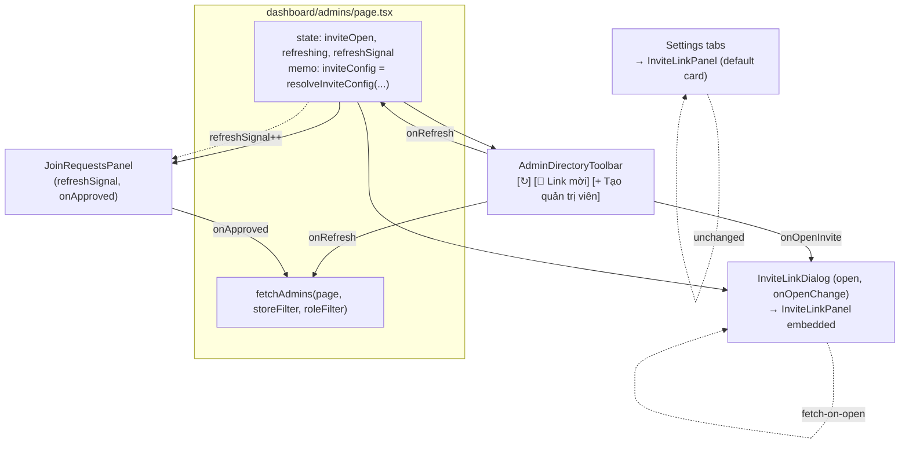
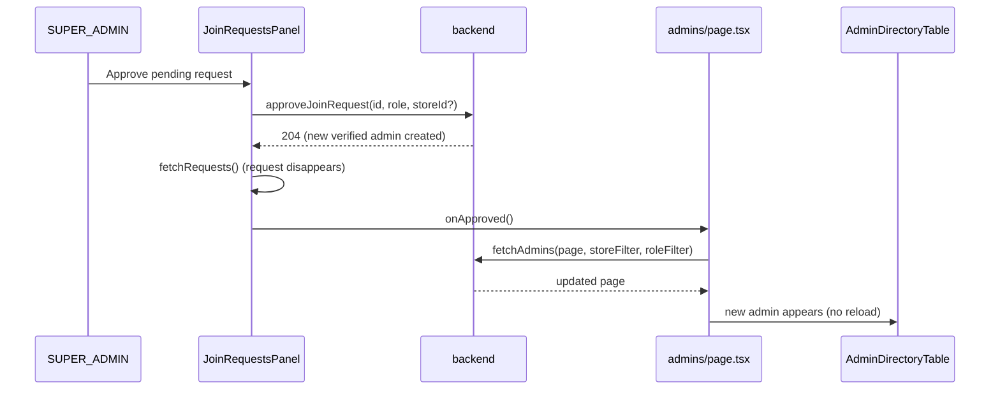

# Admin Management Invite Dialog & Auto-Refresh Spec

**Date:** 2026-06-13
**Status:** Draft — pending review
**Area:** Web admin dashboard (`features/admin`, `features/organization`, `dashboard/admins`)

## Summary

Three focused changes to the **Admin management** page (`dashboard/admins`):

1. **Invite link → dialog.** The always-visible `InviteLinkPanel` at the top of the page consumes
   a lot of vertical space. Move it behind a **`Link mời` trigger button** in the directory
   header row; the panel content renders inside a shadcn `Dialog`.
2. **Manual refresh button.** Add a `RefreshCcw` icon-button (the same affordance as the queue
   dashboard's reload control) that refreshes the **whole page** — the admin directory table *and*
   the pending join-requests panel — on demand.
3. **Auto-update after approving a member.** Today, when a SUPER_ADMIN approves a pending
   join request, the directory table below goes stale (the new verified admin doesn't appear until
   a full page reload). Wire approval to refetch the directory automatically.

All three are **frontend-only**. No backend, API, or schema change.

## Background — current behavior

### The page (`src/app/[locale]/dashboard/admins/page.tsx`)

`page.tsx` is a `"use client"` component using the app's manual `useState`/`useCallback` fetch
pattern (no React Query/SWR). It composes, top to bottom:

- One or two inline `<InviteLinkPanel>` blocks (lines 158–173): org invite for SUPER_ADMIN; store
  invite for a store manager whose store has no org (`storeOrgId === null`).
- `<JoinRequestsPanel>` — self-contained pending-request approvals.
- `<AdminDirectoryToolbar>` — title + (SUPER_ADMIN only) the `Tạo quản trị viên` button + filters.
- `<AdminDirectoryTable>`, pagination, and the create/assign/delete dialogs.

`fetchAdmins(page, storeFilter, roleFilter)` is the single directory fetch; mutations (delete,
assign, create) refetch by calling it again in their `onSuccess`.

### Issue 1 — the panel is large and permanent

`InviteLinkPanel` (`src/features/organization/invite-link-panel.tsx`) renders a full card:
title, description, URL + copy/regenerate buttons, expiry line, a warning box, and a "recent uses"
list. It is **always** mounted at the top of the admins page.

> **Critical constraint:** `InviteLinkPanel` is **also** used as the entire content of the
> **Organization settings** tab (`dashboard/settings/organization/page.tsx`) and as a section of the
> **Store settings** tab (`dashboard/settings/store/page.tsx`). It must keep working there unchanged.
> This spec does **not** retire or restructure the panel's default rendering.

### Issue 2 — no manual refresh

The directory only refetches on filter/page change or after a local mutation. There is no
equivalent to the queue dashboard's reload button (`src/features/queue/ticket-lookup.tsx`:
a `RefreshCcw` icon-button with `animate-spin` while `reloading`).

### Issue 3 — stale directory after approval

`JoinRequestsPanel.doApprove` (`join-requests-panel.tsx:53`) calls `approveJoinRequest(...)`, which
materializes a new **verified admin** server-side, then refetches only its *own* request list
(`fetchRequests()`). It never signals the parent, so the directory's `data` state is never
refetched — the new admin is missing from "Danh sách quản trị viên" until a hard reload.

The in-table shield-verify (`handleVerify`, `page.tsx:107`) already updates `data` optimistically
in place, so it is **not** affected and is **left untouched**.

## Decisions (confirmed with product owner)

1. **Refresh scope = whole page.** One button refreshes the directory table, the pending
   join-requests panel, and (implicitly, via fetch-on-open) the invite link's recent activity.
2. **Header layout = all three controls in the header row**, right-aligned next to the title, in
   order: `[↻ refresh]  [🔗 Link mời]  [+ Tạo quản trị viên]`.
3. **Keep `InviteLinkPanel`; add a presentation, don't replace one.** A single optional
   `embedded` prop lets the panel render chrome-less inside a dialog; both Settings tabs keep the
   default card rendering with **no call-site change**.

## Non-goals

- No change to the two **Settings** tabs that embed `InviteLinkPanel` (they keep the full card).
- No change to the in-table shield-verify flow (already updates optimistically).
- No change to backend, API routes, DTOs, or schema.
- No auto-polling / SSE for the admin directory — refresh stays **manual** (consistent with the
  app's design where SSE is queue/admin-only and this page polls on demand).
- No component-render test harness added (the web project is vitest-only; see **Testing**).

## Design

### Component & data-flow overview



### 1. `InviteLinkPanel` — add an `embedded` prop

Add one optional prop. Default `false` preserves today's rendering exactly, so **both Settings
call sites stay byte-for-byte identical** (they pass no new prop).

```tsx
interface InviteLinkPanelProps {
  fetchLink: () => Promise<InviteLinkState>;
  generateLink: () => Promise<InviteLinkState>;
  embedded?: boolean; // default false
}
```

Behavioral difference, isolated to the outer wrapper and the heading:

- **`embedded === false` (default):** unchanged — outer
  `<div className="rounded-xl border border-border bg-card p-4">`, then the `<h2>` title
  (`inviteLinkTitle`) and `<p>` description (`inviteLinkDesc`), then the body.
- **`embedded === true`:** wrap the body in a **plain `<div>` (no card chrome)** so it remains a
  single grid child of `DialogContent` (which is `grid gap-4`), and **omit** the `<h2>`/`<p>`
  heading block — the dialog header supplies the title and description.

Everything else — the fetch-on-mount `useEffect`, copy, expiry, warning box, recent-uses list, and
the nested regenerate `AlertDialog` — is unchanged and rendered in both modes. Concretely:

```tsx
const showHeading = !embedded;
const wrapperClass = embedded ? "" : "rounded-xl border border-border bg-card p-4";
return (
  <div className={wrapperClass}>
    {showHeading && (
      <>
        <h2 className="text-sm font-semibold">{tAdmins("inviteLinkTitle")}</h2>
        <p className="mt-1 mb-3 text-sm text-muted-foreground">{tAdmins("inviteLinkDesc")}</p>
      </>
    )}
    {/* ...existing body: loading / link / empty, recent uses, regenerate AlertDialog... */}
  </div>
);
```

> Note: `invite-link-panel.tsx` does **not** import `cn` today and its outer `<div>` uses a literal
> class string (`invite-link-panel.tsx:112`). Assign the ternary string directly
> (`className={wrapperClass}`) — no `cn`, no new import. An empty `className=""` yields a bare
> `<div>`, the desired chrome-less container.

### 2. `InviteLinkDialog` — new controlled wrapper

New file `src/features/organization/invite-link-dialog.tsx`. A thin controlled dialog that supplies
the header (title/description reuse the existing keys) and embeds the panel:

```tsx
"use client";

import { useTranslations } from "next-intl";
import {
  Dialog,
  DialogContent,
  DialogDescription,
  DialogHeader,
  DialogTitle,
} from "@/components/ui/dialog";
import { InviteLinkPanel } from "@/features/organization/invite-link-panel";
import type { InviteLinkState } from "@/types/organization";

interface InviteLinkDialogProps {
  open: boolean;
  onOpenChange: (open: boolean) => void;
  fetchLink: () => Promise<InviteLinkState>;
  generateLink: () => Promise<InviteLinkState>;
}

export function InviteLinkDialog({
  open,
  onOpenChange,
  fetchLink,
  generateLink,
}: InviteLinkDialogProps) {
  const tAdmins = useTranslations("admins");
  return (
    <Dialog open={open} onOpenChange={onOpenChange}>
      <DialogContent className="xs:max-w-lg">
        <DialogHeader>
          <DialogTitle>{tAdmins("inviteLinkTitle")}</DialogTitle>
          <DialogDescription>{tAdmins("inviteLinkDesc")}</DialogDescription>
        </DialogHeader>
        <InviteLinkPanel embedded fetchLink={fetchLink} generateLink={generateLink} />
      </DialogContent>
    </Dialog>
  );
}
```

Verified facts that make this work:

- The local `Dialog` (`@/components/ui/dialog`, wrapping `@base-ui/react/dialog`) is **controlled**
  via `open` / `onOpenChange` — confirmed in `dialog.tsx` and existing call sites
  (`CreateAdminDialog`, the panel's own `AlertDialog`). Base UI docs confirm the same props.
- `DialogTitle` / `DialogDescription` are exported and provide the accessible label/description
  Base UI dialogs expect.
- **Fetch-on-open:** Base UI's `Dialog.Portal`/`Popup` unmount their content when closed
  (no `keepMounted`), so `InviteLinkPanel` remounts on each open and its mount `useEffect` refetches
  — recent activity is always current when the dialog is viewed.
- **Width:** the default `DialogContent` is `xs:max-w-sm`; the long invite URL needs more room.
  `cn` is `twMerge(clsx(...))`, so passing `className="xs:max-w-lg"` resolves the `max-w` conflict
  in favor of `lg`.
- **Nested regenerate confirm:** the panel's regenerate `AlertDialog` becomes a dialog nested
  inside this `Dialog`. Base UI explicitly supports an `AlertDialog.Root` nested inside a
  `Dialog.Root` (documented "discard?" example, with `--nested-dialogs` stacking), so it layers
  correctly on top.

### 3. `resolveInviteConfig` module + `admins/page.tsx` wiring

The role/store → invite-link selection moves into a standalone, component-free module so it can be
unit-tested under the project's vitest setup (`environment: "node"`, `include: ["src/**/*.test.ts"]`,
no testing-library/jsdom). This follows the existing `approve-join-request-logic.ts` /
`approve-join-request-logic.test.ts` precedent (pure logic beside its component). **It must not live
in `page.tsx`** — a `.test.ts` importing a `"use client"` `.tsx` is unsupported here and
unprecedented in the repo.

New file `src/features/organization/invite-config.ts`:

```ts
import {
  getOrgInviteLink,
  getStoreInviteLink,
  rotateOrgInviteLink,
  rotateStoreInviteLink,
} from "@/features/organization/api";
import type { InviteLinkState } from "@/types/organization";

export interface InviteConfig {
  fetchLink: () => Promise<InviteLinkState>;
  generateLink: () => Promise<InviteLinkState>;
}

// Returns the fetch/generate pair for the applicable invite link, or null when none applies.
export function resolveInviteConfig(
  isSuperAdmin: boolean,
  adminStoreId: string | null,
  storeOrgId: string | null | undefined,
): InviteConfig | null {
  if (isSuperAdmin) {
    return { fetchLink: getOrgInviteLink, generateLink: rotateOrgInviteLink };
  }
  if (adminStoreId && storeOrgId === null) {
    return {
      fetchLink: () => getStoreInviteLink(adminStoreId),
      generateLink: () => rotateStoreInviteLink(adminStoreId),
    };
  }
  return null;
}
```

(Verified signatures, `api.ts:9–21`: `getStoreInviteLink(storeId)` / `rotateStoreInviteLink(storeId)`
take a store id; `getOrgInviteLink()` / `rotateOrgInviteLink()` take none.)

**Import changes in `page.tsx`:** add `useMemo` to the React import (currently only
`{ useCallback, useEffect, useState }`, `page.tsx:4`); **remove** the now-unused `InviteLinkPanel`
import (`page.tsx:21`) and the four `@/features/organization/api` invite imports (they relocate to
`invite-config.ts`); add imports for `InviteLinkDialog` and `resolveInviteConfig`.

**New state:**

```tsx
const [inviteOpen, setInviteOpen] = useState(false);
const [refreshing, setRefreshing] = useState(false);
const [refreshSignal, setRefreshSignal] = useState(0);
```

**Memoized invite config** (replaces the two inline `<InviteLinkPanel>` blocks, `page.tsx:158–173`):

```tsx
const inviteConfig = useMemo(
  () => resolveInviteConfig(isSuperAdmin, adminStoreId, storeOrgId),
  [isSuperAdmin, adminStoreId, storeOrgId],
);
```

> **Why `useMemo`:** the store-invite branch builds new closures each render. The embedded panel's
> fetch `useEffect` depends on `fetchLink`; memoizing keeps the reference stable so the open dialog
> fetches **once per open**, not on every parent re-render. (This also tightens today's behavior,
> where the inline arrow at `page.tsx:169` is recreated each render.)

**Refresh handler.** The directory table keeps showing existing rows during refetch (the skeleton
branch is `loading && !data`; data rows render from `data?.items` regardless of `loading`), so a
dedicated `refreshing` flag is only needed to spin the icon — no `silent` fetch variant required.
Unlike the queue dashboard's fixed 500ms spinner timer (`handleTicketReload`), `refreshing` is tied
to the actual `fetchAdmins` promise — a deliberate, tighter improvement:

```tsx
async function handleRefresh() {
  setRefreshing(true);
  setRefreshSignal((s) => s + 1); // triggers JoinRequestsPanel refetch
  try {
    await fetchAdmins(page, storeFilter, roleFilter);
  } finally {
    setRefreshing(false);
  }
}
```

**JSX changes:**

- Remove the two inline `<InviteLinkPanel>` blocks (`page.tsx:158–173`).
- Pass the new props to the toolbar:
  ```tsx
  <AdminDirectoryToolbar
    /* existing props */
    refreshing={refreshing}
    onRefresh={() => void handleRefresh()}
    showInviteButton={inviteConfig !== null}
    onOpenInvite={() => setInviteOpen(true)}
  />
  ```
- Extend the join-requests panel:
  ```tsx
  <JoinRequestsPanel
    isSuperAdmin={isSuperAdmin}
    stores={stores}
    refreshSignal={refreshSignal}
    onApproved={() => void fetchAdmins(page, storeFilter, roleFilter)}
  />
  ```
- Render the dialog (only when an invite applies):
  ```tsx
  {inviteConfig && (
    <InviteLinkDialog
      open={inviteOpen}
      onOpenChange={setInviteOpen}
      fetchLink={inviteConfig.fetchLink}
      generateLink={inviteConfig.generateLink}
    />
  )}
  ```

### 4. `AdminDirectoryToolbar` — refresh + invite trigger

The current header row holds the title and (SUPER_ADMIN only) the create button; the filter row is
also SUPER_ADMIN-only. Add the new controls grouped on the right of the **header row** so they show
for store managers too (who have neither filters nor a create button).

New props:

```tsx
type AdminDirectoryToolbarProps = {
  /* existing — retained: isSuperAdmin, onCreateAdmin, onRoleFilterChange,
     onStoreFilterChange, roleFilter, storeFilter, stores */
  refreshing: boolean;
  onRefresh: () => void;
  showInviteButton: boolean;
  onOpenInvite: () => void;
};
```

Header row becomes:

```tsx
<div className="flex items-center justify-between gap-3">
  <h1 className="text-xl font-bold l:text-2xl">{tAdmins("title")}</h1>
  <div className="flex items-center gap-2">
    <Button
      variant="outline"
      size="icon"
      disabled={refreshing}
      onClick={onRefresh}
      aria-label={tAdmins("refresh")}
    >
      <RefreshCcw aria-hidden="true" className={`size-4 ${refreshing ? "animate-spin" : ""}`} />
    </Button>
    {showInviteButton && (
      <Button variant="outline" onClick={onOpenInvite}>
        <Link2 className="mr-2 size-4" />
        {tAdmins("inviteLinkTitle")}
      </Button>
    )}
    {isSuperAdmin && (
      <Button onClick={onCreateAdmin} className="bg-primary text-primary-foreground hover:bg-primary-hover">
        <Plus className="mr-2 size-4" />
        {tAdmins("createButton")}
      </Button>
    )}
  </div>
</div>
```

New imports: `RefreshCcw`, `Link2` from `lucide-react` (verified exports; `RefreshCcw` already used
in `ticket-lookup.tsx`; `Plus` already imported). The `mr-2 size-4` icon spacing matches the
existing create-button idiom; the icon-only refresh button mirrors `ticket-lookup.tsx` exactly.

### 5. `JoinRequestsPanel` — signal refetch + approval callback

```tsx
interface JoinRequestsPanelProps {
  isSuperAdmin: boolean;
  stores: StoreDto[];
  refreshSignal: number;
  onApproved: () => void;
}
```

- Refetch on signal change via a **single combined effect**. This differs from the queue dashboard,
  which uses *two* effects — a `[fetchX]` mount-fetch plus a guarded `if (refreshSignal) …` signal
  effect that skips the initial `0`. Folding both into one unguarded effect is correct here because
  `fetchRequests` is a stable `useCallback([])`: it fires once on mount (signal `0`) and again on
  each bump, with no loop. **Do not add an `if (refreshSignal)` guard** — this single effect also
  owns the initial load, so a guard would suppress the mount fetch.
  ```tsx
  useEffect(() => {
    void fetchRequests();
  }, [fetchRequests, refreshSignal]);
  ```
  The early `return null` for an empty list does not affect the effect (hooks run before the early
  return; the component stays mounted by the page).
- Notify the parent after a successful approval (reject is unchanged — it removes a pending request
  but adds no admin, so the directory is unaffected):
  ```tsx
  async function doApprove(role: AdminRole, storeId?: string) {
    if (!approveTarget) return;
    try {
      await approveJoinRequest(approveTarget.requestId, role, storeId);
      toast.success(tAdmins("requestApprovedToast", { username: approveTarget.username }));
      await fetchRequests();
      onApproved(); // refetch the directory in the parent
    } catch (err) {
      /* unchanged */
      throw err;
    }
  }
  ```



### 6. i18n

The dialog title/description and the `Link mời` button label **reuse existing `admins` keys**
(`inviteLinkTitle`, `inviteLinkDesc`). Exactly **one new key** is required — the refresh button's
`aria-label`:

| Key | EN | VI |
|-----|----|----|
| `admins.refresh` | Refresh list | Tải lại danh sách |

Add it to **both** `en.json` and `vi.json` in the `admins` block (same position) — required by
`messages/parity.test.ts`, which asserts identical key sets and matching `<p>`/rich-text tags per
leaf (plain strings with no tags keep both assertions green). `admins.refresh` is a **new** key —
there is no existing `refresh` key to mirror; the closest analog is `queue.reloadTickets`
("Tải lại danh sách chờ"). The proposed VI drops the "chờ" (waiting) qualifier since this is not a
waiting list. **Pending VI approval per the Vietnamese-copy rule** before writing `vi.json`.

## Library / API verification (Context7 + source)

| Concern | Verified against | Result |
|---|---|---|
| `Dialog` controlled props | `dialog.tsx` source + Base UI docs | `open` / `onOpenChange` (boolean) — confirmed |
| `DialogTitle` / `DialogDescription` exist | `dialog.tsx` exports | confirmed |
| Nested `AlertDialog` inside `Dialog` | Base UI docs (`alert-dialog`) | documented & supported (`--nested-dialogs`) |
| Lazy mount on open / unmount on close (fetch-on-open) | Base UI docs ("children mounted lazily when the dialog opens"; `keepMounted` default `false`) | confirmed |
| `className` overrides default `max-w` | `lib/utils.ts` (`twMerge`) | confirmed |
| `Link2`, `RefreshCcw` icon names | lucide.dev (Context7) + `ticket-lookup.tsx` | confirmed |
| `useTranslations("admins")` + interpolation | next-intl docs (Context7) + existing usage | confirmed |

## Edge cases & integration concerns

- **Store manager (non-SUPER_ADMIN).** No filters, no create button. They see `[↻]` always and
  `[🔗 Link mời]` only when their store has no org (`storeOrgId === null`); when their store has an
  org, only `[↻]`. Driven by `showInviteButton = inviteConfig !== null`.
- **`storeOrgId` still loading (`undefined`).** `resolveInviteConfig` returns `null` until it
  resolves to `null` (no org), so the invite button does not flash in prematurely — matching the
  current panel's `storeOrgId === null` gate.
- **Refresh keeps rows visible.** Because the skeleton is gated on `loading && !data`, a manual
  refresh never blanks a populated table; rows swap when fresh data arrives.
- **No double activity flag.** `refreshing` drives only the icon spin; `loading` drives the
  first-load skeleton. They are independent.
- **Settings tabs.** Unaffected: both call `InviteLinkPanel` with no `embedded` prop (default
  card). Explicitly out of scope; verified there are exactly two such call sites.

## Testing

The web project runs **vitest only** — there is no `@testing-library/react`/jsdom harness; existing
tests are pure-logic (`lib/*.test.ts`, `store/*.test.ts`, `messages/parity.test.ts`). Tests stay
within that pattern:

- **`resolveInviteConfig` unit test** (new, in `features/admin` or `features/organization`):
  - SUPER_ADMIN → org config (`getOrgInviteLink`/`rotateOrgInviteLink`).
  - store manager + `storeOrgId === null` → non-null store config; assert the returned closures call
    the store API with the given `adminStoreId` (mock `@/features/organization/api`).
  - store manager + `storeOrgId === undefined` (loading) → `null`.
  - store manager + `storeOrgId === "<id>"` (has org) → `null`.
- **i18n parity:** adding `admins.refresh` to both locales is required for `messages/parity.test.ts`
  to pass (and satisfies the structural-mirroring rule).
- **Out of scope (known gap):** rendering/interaction coverage — dialog open/close, refresh icon
  spin, the approve → directory-refetch path, nested AlertDialog stacking — would require adopting
  `@testing-library/react` + jsdom. Noted here rather than silently assumed.

**Manual verification** (per repo flow): run **lint first, then type-check** —
`yarn lint` (biome) then the TypeScript check. **Do not run `yarn build`** (handled by the separate
audit flow). Smoke-check in the browser: open the invite dialog (org + store), copy/regenerate,
trigger a manual refresh (icon spins, rows persist), and approve a pending request (new admin
appears without reload).

## Files touched

**Frontend**
- `src/features/organization/invite-link-panel.tsx` — add `embedded?: boolean`; conditionally drop
  the card chrome and the `<h2>`/`<p>` heading.
- `src/features/organization/invite-link-dialog.tsx` — **new** controlled `InviteLinkDialog`.
- `src/features/organization/invite-config.ts` — **new** pure `resolveInviteConfig` + `InviteConfig`
  type (relocates the four invite-api imports out of `page.tsx`).
- `src/features/admin/admin-directory-toolbar.tsx` — add refresh icon-button + `Link mời` trigger;
  new props (`refreshing`, `onRefresh`, `showInviteButton`, `onOpenInvite`); import `RefreshCcw`,
  `Link2`.
- `src/features/admin/join-requests-panel.tsx` — add `refreshSignal` + `onApproved`; refetch on
  signal; call `onApproved()` after a successful approve.
- `src/app/[locale]/dashboard/admins/page.tsx` — add `useMemo` import; remove the unused
  `InviteLinkPanel` import + the four `@/features/organization/api` invite imports; add
  `InviteLinkDialog` + `resolveInviteConfig` imports; new state (`inviteOpen`, `refreshing`,
  `refreshSignal`); memoized `inviteConfig`; `handleRefresh`; wire toolbar / `JoinRequestsPanel` /
  `InviteLinkDialog`; remove the inline `InviteLinkPanel` blocks.
- `src/messages/en.json`, `src/messages/vi.json` — add `admins.refresh` to **both** (parity test).
- `src/features/organization/invite-config.test.ts` — **new** vitest unit test for
  `resolveInviteConfig` (mock `@/features/organization/api`; assert the org branch, the store branch
  with `storeOrgId === null`, and the `null` cases incl. `storeOrgId === undefined`).

**Untouched (verified)**
- `src/app/[locale]/dashboard/settings/organization/page.tsx`,
  `src/app/[locale]/dashboard/settings/store/page.tsx` — keep using `InviteLinkPanel` (default card).

**Docs**
- `docs/CHANGELOGS.md` — log all of the above, including the `embedded` prop and the explicitly
  unchanged Settings call sites (per repo convention to record skipped/declined items).

## Pre-implementation note

Per the repo's GitNexus workflow, before editing run `gitnexus_impact` (direction `upstream`) on
`InviteLinkPanel`, `JoinRequestsPanel`, and `AdminDirectoryToolbar` to confirm the blast radius
matches "Files touched" above (notably that `InviteLinkPanel`'s only consumers are the admins page
and the two Settings tabs), and run `gitnexus_detect_changes` before finishing.
