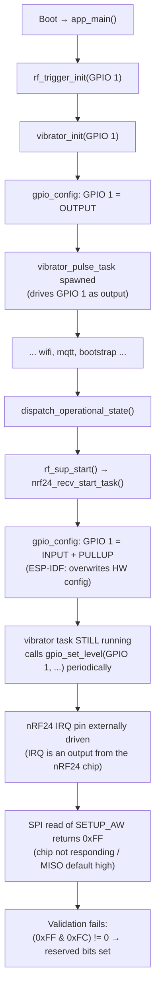

# Critical Bug Fixes Spec

Three critical bugs affecting store creation (backend) and post-provisioning device operation (receiver firmware). Each fix is independent.

## Bug 1: Store Creation NPE on `publicId`

### Symptom

`NullPointerException` when creating a store via the admin API.

### Root Cause

`StoreService.createStore()` calls `storeRepository.save(store)` on a new `Store` entity where `publicId` is `null`. Spring Data R2DBC's `save()` for a new entity executes an INSERT and uses `RETURNING` to populate the `@Id` column (`id`). However, `publicId` — generated server-side by PostgreSQL's `generate_store_public_id()` DEFAULT — is **not** an `@Id` column. R2DBC excludes null columns from the INSERT column list and does not map them back from the RETURNING result. The returned entity has `id` populated but `publicId` still `null`.

The crash occurs at `StoreService.kt:111` when `saved.toDto()` calls `publicId!!` in `Store.toDto()` (`Store.kt:47`).

Note: `updateStore()` at line 130 also calls `save(updated).toDto()` but does NOT crash, because the entity being saved already has `publicId` populated (from the initial `findById`). The `store.copy(...)` preserves it. This confirms the NPE is specific to INSERT (new entity), not UPDATE.

Note: `saved.id!!` at line 100 (used for StoreSettings and ServiceType inserts) works correctly because `id` is the `@Id` column and IS populated by R2DBC's RETURNING.

### Fix

Add a re-fetch after save, **only for the return value**. The existing StoreSettings and ServiceType inserts using `saved.id!!` are correct and unchanged.

**File:** `backend/src/main/kotlin/com/thomas/notiguide/domain/store/service/StoreService.kt`

```kotlin
// In createStore(), after the existing storeSettingsRepository.save() 
// and serviceTypeRepository.save() calls:

val complete = storeRepository.findById(saved.id!!)
    ?: throw IllegalStateException("Store not found after save")
return complete.toDto()
```

### Transactional Safety

`createStore()` is annotated `@Transactional`. All repository calls share the same R2DBC connection and transaction. PostgreSQL guarantees read-your-own-writes within a transaction, so `findById()` immediately sees the INSERT with all DB-generated columns including `publicId`. No delay is needed. The transaction commits only when `createStore()` returns successfully — if any step fails, everything rolls back.

Verified via Context7 (Spring Framework 6.2 docs): declarative `@Transactional` works on Kotlin suspend functions — Spring's coroutine support bridges the reactive transaction context into the coroutine context. This is already proven by the existing codebase (`AdminService`, `StoreService`, `QueueService` all use `@Transactional` on suspend functions successfully). Spring Boot 3.5 auto-configures `R2dbcTransactionManager` and `TransactionalOperator`. All `CrudRepository` methods participate in the outer transaction.

---

## Bug 2: nRF24 `invalid SETUP_AW: 0xff` After Receiver Provisioning

### Symptom

After provisioning succeeds and the receiver restarts, the nRF24 fails to initialize with:
```
E (75769) NRF24: nrf_bringup(225): invalid SETUP_AW: 0xff
```
The receiver cannot receive any RF codes.

### Root Cause

**GPIO pin collision** in `receiver-esp32/sdkconfig`:
```
CONFIG_RECEIVER_NRF24_IRQ=1
CONFIG_RECEIVER_VIBRATOR_GPIO=1
```

Both the nRF24 IRQ and the vibrator are assigned to GPIO 1. This was a typo — IRQ was intended for GPIO 10.

**Failure chain:**



**Why 0xFF:** The nRF24's IRQ pin is an open-drain output from the chip. When the ESP32-C3 externally drives this pin via the vibrator task, it creates electrical contention that prevents the nRF24 from operating correctly. All SPI register reads return 0xFF (MISO line pulled high / chip unresponsive).

**SETUP_AW register (per nRF24L01+ datasheet, register 0x03):** Bits [7:2] must be `000000` (reserved), bits [1:0] = address width. A return of 0xFF means all bits are set, failing the reserved-bits check at `nrf24_receiver.c:225`:
```c
(setup_aw & 0xFCU) == 0U  // fails: 0xFC != 0
```

**Transmitter is unaffected:** Its LED is on GPIO 1 but nRF24 IRQ is on GPIO 6 (no conflict).

Verified via Context7 (ESP-IDF v6.0 GPIO docs): `gpio_config()` overwrites existing pin configurations at the hardware level, but does not stop FreeRTOS tasks that reference the pin.

### Fix

**File:** `receiver-esp32/sdkconfig`

Change the nRF24 IRQ pin from GPIO 1 to GPIO 10:
```
CONFIG_RECEIVER_NRF24_IRQ=10
```

**Pin allocation after fix:**

| GPIO | Function |
|------|----------|
| 1 | Vibrator |
| 2 | nRF24 MISO |
| 3 | nRF24 CE |
| 5 | nRF24 CS |
| 6 | nRF24 SCK |
| 7 | nRF24 MOSI |
| 10 | nRF24 IRQ |

No code changes required — only the sdkconfig value changes. The nRF24 driver reads `CONFIG_RECEIVER_NRF24_IRQ` via the `IRQ_GPIO` macro at `nrf24_receiver.c:23`.

### Defense-in-depth: Explicit Vibrator Stop at Boot

Even with the GPIO fix, add a defensive `rf_trigger_stop_output()` call after `rf_trigger_init()` in `main.c` to guarantee the vibrator starts in a known-off state. Currently, `rf_trigger_stop_output()` returns early if `s_trigger.initialized` is false (checked at `rf_trigger.c:128`), but after `rf_trigger_init()` sets `s_trigger.initialized = true` (line 60), this guard passes and the call reaches `vibrator_set_pulsing(&s_vibrator, false)`.

**File:** `receiver-esp32/main/main.c`

After line 128 (`rf_trigger_init`), before `restore_trigger_state()`:
```c
ESP_ERROR_CHECK(rf_trigger_init((gpio_num_t)CONFIG_RECEIVER_VIBRATOR_GPIO));
rf_trigger_stop_output();  // ensure vibrator starts off
restore_trigger_state();
```

This is safe because:
- `rf_trigger_init()` at line 46-61 creates the mutex, initializes the vibrator, and sets `s_trigger.initialized = true`
- `rf_trigger_stop_output()` checks `s_trigger.initialized` (true after init) and calls `vibrator_set_pulsing(false)`
- `vibrator_set_pulsing(false)` at `vibrator.c:172-193` acquires the lock, sets `vibrator_pulsing = false`, and forces GPIO low if active

---

## Bug 3: Serial Provisioning Fails on ESP32-C3 Receiver

### Symptom

Web Serial provisioning fails on the ESP32-C3 receiver (no response to serial commands), while the same flow works correctly on the ESP32-C3 transmitter.

### Root Cause

The receiver's main task stack is 2 KB smaller than the transmitter's:

| | Receiver | Transmitter |
|-|----------|-------------|
| `CONFIG_ESP_MAIN_TASK_STACK_SIZE` | 6144 | 8192 |

The receiver's `app_main()` performs heavy operations on the main task stack during provisioning: HTTP server initialization, WiFi STA/SoftAP management, MQTT bootstrap, cJSON parsing, and NVS read/write. On the single-core ESP32-C3 with limited RAM, 6144 bytes is insufficient. When the main task overflows its stack, the ESP32-C3's hardware stack guard triggers a panic reboot (confirmed via Context7: ESP-IDF `CONFIG_ESP_SYSTEM_HW_STACK_GUARD`), or the main task hangs before reaching the provisioning flow. Either way, provisioning never completes and the serial session is interrupted by the crash/reboot cycle.

Note: The serial protocol task itself runs independently (4096-byte stack, created at `serial_protocol.c:377` before provisioning begins at `main.c:114`). The serial task is not directly corrupted — the failure is that the main task crashes during provisioning, causing the device to reboot before the provisioning response can be sent.

The serial protocol implementation is identical between transmitter and receiver: same USB Serial/JTAG driver, same task stack (4096), same buffer sizes (1024 line, 4096 TX/RX), same task priority (5).

### Fix

**File:** `receiver-esp32/sdkconfig`

Increase the main task stack to match the transmitter:
```
CONFIG_ESP_MAIN_TASK_STACK_SIZE=8192
```

This also requires updating the legacy alias on the same file:
```
CONFIG_MAIN_TASK_STACK_SIZE=8192
```

---

## Scope

| Fix | Files Modified | Risk |
|-----|---------------|------|
| Store NPE | `StoreService.kt` (replace 1 line with 3-line re-fetch) | Low — adds one SELECT within existing transaction |
| nRF24 GPIO | `receiver-esp32/sdkconfig` (1 value change) | Low — config-only, no code changes |
| Vibrator stop | `receiver-esp32/main/main.c` (1 line addition) | Low — calls existing API in safe state |
| Stack size | `receiver-esp32/sdkconfig` (2 value changes) | Low — matches proven transmitter config |

## Out of Scope

- **Transmitter LED pattern during pending activation** — needs further examination per user request. The LED starts with `SLOW_BLINK` at init and has no explicit pattern for the `PENDING_ACTIVATION` phase. Deferred to a separate investigation.
- **Transmitter nRF24** — no GPIO conflict exists on the transmitter (IRQ=GPIO 6, LED=GPIO 1).

## Verification

### Store NPE
1. Start backend with `./gradlew bootRun`
2. Create a store via admin API
3. Verify response includes a non-null `publicId`
4. Verify StoreSettings and ServiceType were created with correct `storeId`

### nRF24 + Vibrator
1. Build and flash receiver firmware
2. Provision via Web Serial
3. After restart, verify nRF24 initializes without `SETUP_AW` error in logs
4. Verify vibrator is silent after boot (no buzzing)
5. Verify RF code reception works

### Serial Provisioning
1. Build and flash receiver firmware (with stack size fix)
2. Connect via Web Serial
3. Send `ping` command — verify response
4. Complete full provisioning flow — verify success
