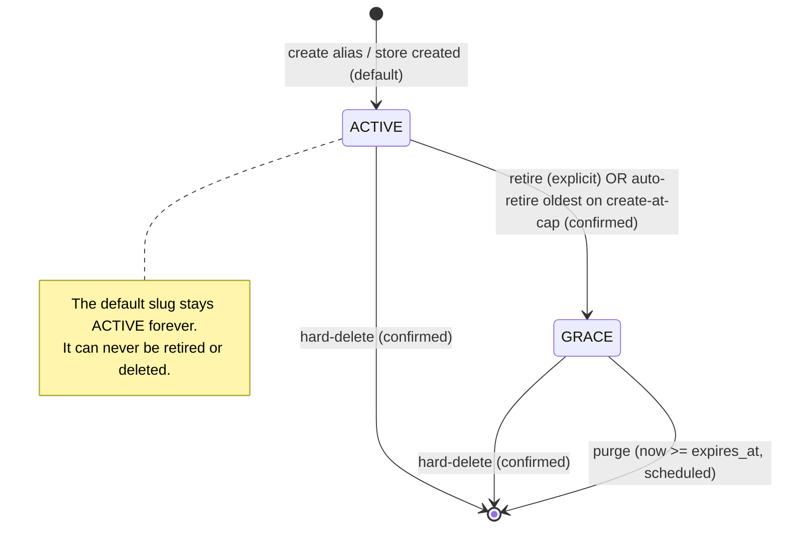

# Custom Store Slugs — Design Spec

**Status:** Approved design (2026-06-02)
**Scope:** Backend (Kotlin/Spring Boot), `client-web` (customer queue app), `web` (admin dashboard)
**Author:** Design captured via brainstorming session

---

## 1. Summary

Today every store has exactly one public identifier — `store.public_id`, an
immutable, system-generated 8-character string created at store creation. This
feature lets a store admin attach **custom vanity slugs** (admin-typed,
human-readable identifiers such as `JoesCoffee`) as additional public handles
for their store, while the original generated id remains the permanent default.

Customers reach the store's public queue through **any** of the store's slugs
(default or alias). A slug can be retired with a **30-day grace period** so that
printed QR codes and shared links keep working through a transition, or
hard-deleted immediately when the admin explicitly accepts breaking live links.
When the store is already at its active-slug limit, adding a new slug
**auto-retires the oldest active alias** into the grace period — but only after
the admin confirms (the dashboard names the slug that will be retired first).

Slugs follow the **GitHub model**: the admin's capitalization is preserved for
display, but uniqueness and resolution are **case-insensitive** — so a
case-variant of an existing slug can never be claimed (anti-impersonation), and
a customer who types any casing still reaches the right store (typo-tolerant).

## 2. Goals & Non-Goals

### Goals
- Store admins self-serve additional vanity slugs for their own store from the
  dashboard; SUPER_ADMIN can manage slugs for any store.
- Slugs are **globally unique** (DB-enforced, case-insensitive) with
  **case-preserving display**.
- A bounded namespace per store: at most **5 active** slugs (the default counts
  as one) and **5 in-grace** slugs — 10 resolving at most.
- Retiring a slug keeps it resolving for 30 days, then it is purged
  automatically. Hard-delete removes it immediately.
- Customer-facing URLs keep the alias the customer navigated to (no snap to the
  default).
- Zero disruption to the existing store / queue / ticket / device surfaces that
  depend on `store.public_id`.

### Non-Goals
- In-place editing of a slug's text (changing a slug = retire old + create new).
- Per-slug analytics events (the system emits no analytics events yet; out of
  scope here).
- A global slug-reuse quarantine (freed names return to the pool immediately).
- Redis caching of slug→store resolution (noted as a possible later
  optimization, not built now).
- Any change to device public IDs (a separate domain that is unaffected).

## 3. Terminology

| Term | Meaning |
|------|---------|
| **Default slug** | The system-generated `store.public_id`. Exactly one per store. Immutable; never retired or deleted. |
| **Alias** | An admin-typed vanity slug. Up to 4 active per store (5 active total including the default). |
| **Active** | A slug that resolves and occupies an active slot. |
| **Grace** | A retired alias that still resolves for 30 days before being purged. |
| **Hard-delete** | Immediate, confirmed removal of a slug from either state; frees its slot now, breaks live links now. |
| **Resolve** | Map an incoming public identifier (from a URL path) to a store. |

## 4. Data model

### 4.1 New table `store_public_id`

Single source of truth for resolution and for the global-uniqueness guarantee.
Holds **every** identifier — the default and the aliases — matching the
`store_id : public_id : is_default` shape originally envisioned, plus lifecycle
columns.

```sql
CREATE TYPE slug_status AS ENUM ('ACTIVE', 'GRACE');

CREATE TABLE store_public_id (
    id          UUID PRIMARY KEY DEFAULT gen_random_uuid(),
    store_id    UUID NOT NULL REFERENCES store(id) ON DELETE CASCADE,
    slug        VARCHAR(128) NOT NULL,
    is_default  BOOLEAN NOT NULL DEFAULT FALSE,
    status      slug_status NOT NULL DEFAULT 'ACTIVE',
    retired_at  TIMESTAMP WITH TIME ZONE,
    expires_at  TIMESTAMP WITH TIME ZONE,
    created_at  TIMESTAMP WITH TIME ZONE DEFAULT CURRENT_TIMESTAMP,
    CONSTRAINT chk_default_active   CHECK (NOT is_default OR status = 'ACTIVE'),
    CONSTRAINT chk_grace_timestamps CHECK (
        (status = 'GRACE' AND retired_at IS NOT NULL AND expires_at IS NOT NULL)
        OR (status = 'ACTIVE' AND retired_at IS NULL AND expires_at IS NULL)
    )
);

-- The global guarantee. Case-insensitive (functional), matching the resolver's
-- key. Spans the mixed-case defaults and the case-preserved aliases together.
CREATE UNIQUE INDEX uq_store_public_id_slug ON store_public_id (lower(slug));

-- Exactly one default per store.
CREATE UNIQUE INDEX uq_store_public_id_default
    ON store_public_id (store_id) WHERE is_default;

-- Fast cap counting per store/state.
CREATE INDEX idx_store_public_id_store_status ON store_public_id (store_id, status);

-- Fast purge scan.
CREATE INDEX idx_store_public_id_expiry
    ON store_public_id (expires_at) WHERE status = 'GRACE';
```

The `slug` value is stored **exactly as the admin typed it** (capitalization
preserved for display). Case folding happens only in the unique index and in the
resolver query — never in storage.

### 4.2 `store.public_id` is kept as an immutable mirror

`store.public_id` and its existing unique index are left intact. It continues to
hold the **default** slug and is written exactly once (at store creation) and
never updated, so there is no ongoing sync burden. Every existing consumer
(`StoreDto.publicId`, `StorePublicInfoResponse`, `IssueTicketResponse`,
`QueuePublicController`, the device domain, the admin/client UIs) keeps working
unchanged.

The existing DB default generator `generate_store_public_id()` is replaced so
future generated defaults avoid both `store.public_id` and `store_public_id.slug`
case-insensitively. Without this, a newly generated 8-character default could
match an existing vanity alias and fail the mirror trigger's global
`uq_store_public_id_slug` insert.

### 4.3 Mirroring trigger + backfill

A trigger keeps the default row in `store_public_id` in lockstep with store
creation, so the default can never be missing:

```sql
CREATE OR REPLACE FUNCTION mirror_store_default_public_id() RETURNS TRIGGER AS $$
BEGIN
    INSERT INTO store_public_id (store_id, slug, is_default, status)
    VALUES (NEW.id, NEW.public_id, TRUE, 'ACTIVE');
    RETURN NEW;
END;
$$ LANGUAGE plpgsql;

CREATE TRIGGER trg_mirror_store_default_public_id
    AFTER INSERT ON store
    FOR EACH ROW EXECUTE FUNCTION mirror_store_default_public_id();
```

The new objects (`slug_status` type, `store_public_id` table, indexes, function,
trigger) are added to `backend/src/main/resources/db/schema.sql` for
fresh-database initialization.

> **Deliverable — standalone backfill migration.** `schema.sql` only runs when a
> database is initialized from empty, so it does **not** touch existing/live
> databases. A separate, idempotent migration SQL file **must also be generated**
> to (a) create the new objects on an already-running database, (b) replace
> `generate_store_public_id()` so future defaults avoid aliases, and (c) backfill
> each existing store's current `public_id` as its default row in
> `store_public_id`. The project has no migration framework (Flyway/Liquibase),
> so this is a hand-applied SQL script — suggested location
> `backend/src/main/resources/db/migration/` (e.g.
> `001_store_public_id.sql`), to be run once against existing environments.

The backfill statement, idempotent via `ON CONFLICT` so it is safe to re-run:

```sql
INSERT INTO store_public_id (store_id, slug, is_default, status)
SELECT id, public_id, TRUE, 'ACTIVE' FROM store
ON CONFLICT (lower(slug)) DO NOTHING;
```

The standalone migration must also wrap `CREATE TYPE slug_status` in a
duplicate-safe `DO $$ ... EXCEPTION WHEN duplicate_object THEN null; END $$;`
block because PostgreSQL `CREATE TYPE` does not support `IF NOT EXISTS`.

## 5. Slug lifecycle & caps

### 5.1 State machine



Both retire paths set `retired_at = now`, `expires_at = now + 30d`.

### 5.2 Caps

- **Active cap = 5** per store, counting the default → at most **4 active
  aliases**.
- **Grace cap = 5** per store.
- **Maximum 10 resolving slugs** per store at any moment.

Capping the **grace** bucket is what closes the abuse loophole: because a
retired slug keeps occupying a (grace) slot until it is purged, an admin cannot
churn endlessly through global vanity names by parking old ones in grace — they
can hold at most 10 names, after which they must wait out a grace expiry or
hard-delete one of their own live links.

### 5.3 Transitions & preconditions

| Operation | Precondition | Effect |
|-----------|-------------|--------|
| **Create alias** (room) | active count < 5; passes validation (§6); slug globally free | inserts `ACTIVE` row |
| **Create alias** (at active cap, grace has room) | active count = 5; grace count < 5; valid + globally free; **`confirmAutoRetire = true`** | atomically auto-retires the **oldest active alias** (lowest `created_at`, never the default) → `GRACE`, then inserts the new `ACTIVE` row |
| **Create alias** (both buckets full) | active count = 5; grace count = 5 | rejected (`409`) — admin must hard-delete a link or wait for a grace expiry |
| **Retire alias** | target is a non-default `ACTIVE` alias; grace count < 5 | `ACTIVE → GRACE`, sets `retired_at = now`, `expires_at = now + 30d` |
| **Hard-delete** | target is a non-default alias (`ACTIVE` or `GRACE`); confirmed | deletes the row immediately |
| **Purge** | `status = 'GRACE'` and `now >= expires_at` | deletes the row (scheduled job) |

**Auto-retire semantics.** Adding never *silently* retires anything. The backend
performs the auto-retire only when the request carries `confirmAutoRetire = true`;
without it, a create at the active cap is rejected with a "confirmation required"
`409`. Validation and global-uniqueness checks run **before** the retire, so a
bad/taken new slug can never cost the admin an existing one. The oldest active
alias is recomputed server-side (single source of truth); the dashboard's
"will retire X" message is best-effort. There is **no** purely automatic
eviction — the consent gate is mandatory.

Cap and precondition checks run inside a `@Transactional` service method.
Uniqueness is guaranteed at the DB layer; the residual cross-request race on cap
counts (two concurrent creates for the same store) is an **accepted limitation**
— slug operations are rare, per-store, and typically driven by a single admin.
This matches the existing posture documented for the SUPER_ADMIN concurrent
deletion race.

The grace window length is **30 days**, exposed as a configurable property
(`slug.grace-period-days`, default `30`).

## 6. Validation rules

Applied on **create alias** (request DTO validation + service checks):

- **Format:** `^[A-Za-z0-9]+(?:-[A-Za-z0-9]+)*$` — alphanumeric segments joined
  by single hyphens; no leading/trailing hyphen, no consecutive hyphens.
  Uppercase is permitted for display.
- **Length:** 3–128 characters (`@Size(min = 3, max = 128)`).
- **Case (GitHub model):** stored exactly as typed; **uniqueness and resolution
  are case-insensitive**. A case-variant of an existing slug is rejected.
- **Reserved blocklist** (compared **case-insensitively**, configurable):
  `api, admin, public, store, stores, queue, queues, dashboard, login, logout,
  auth, www, app, assets, static, _next, health, actuator, favicon, robots,
  sitemap`, plus a profanity list and a well-known-brand list.
- **Uniqueness:** must not case-insensitively equal any existing slug (default
  or alias) in `store_public_id`. Enforced by `uq_store_public_id_slug`; the
  service also pre-checks to return a friendly 409 before hitting the
  constraint.
- The default slug is never creatable, mutable, or deletable through the API.

> **Why case-insensitive uniqueness + resolution (and case-preserving
> storage).** The unique-index key must match the resolver's lookup key, or the
> resolver can match two distinct rows (`JoesCoffee` and `joescoffee`) and
> resolution becomes ambiguous — also an impersonation vector. Folding case in
> both the index and the query keeps them aligned. Preserving the typed case in
> storage gives admins a nicely capitalized handle without expanding the
> namespace. Trade-off accepted: case-variants cannot coexist.

## 7. Resolution (backend)

`StoreService.getStoreByPublicId(input)` is updated to resolve through
`store_public_id`:

```mermaid
flowchart TD
    A[incoming identifier] --> B[trim]
    B --> C{lower-match in store_public_id\nstatus IN (ACTIVE, GRACE)?}
    C -- yes --> D[load store by store_id]
    C -- no --> E{valid UUID?}
    E -- yes --> F[load store by id]
    E -- no --> G[404 Not Found]
    F -- found --> D
    F -- not found --> G
    D --> H[return store + matchedSlug (canonical case) + isDefault]
```

- Match is **case-insensitive** (`WHERE lower(slug) = lower(:input)`), able to
  use the functional unique index.
- **Grace slugs resolve transparently** — identical behavior to active slugs;
  the customer sees no difference during the 30-day window.
- The UUID fallback (existing behavior) is retained for direct id access.
- The resolver returns the matched slug in its **canonical (stored) casing** and
  `isDefault` outward so the public `/info` endpoint can expose both the
  canonical default id and the registered casing of the matched alias
  (see §8.4, §10).
- Performance: a single-row hit on a unique index. Redis caching of
  slug→store_id is explicitly deferred.

A new repository, `StorePublicIdRepository`, owns these queries
(`findBySlug` (case-folded), `findByStoreId`, `countByStoreIdAndStatus`,
`findExpiredGrace`, etc.). `StoreRepository.findByPublicId` remains for any
default-specific paths but resolution flows through the new table.

### 7.1 Where resolution happens (no edge middleware)

The slug→store mapping is performed **entirely server-side, in the backend
resolver** (`StoreService.getStoreByPublicId` + `StorePublicIdRepository`).
This *is* the "middleware layer" from the original concept — it just lives in
the backend, not at the Next.js edge.

**No new `client-web` middleware is required.** The existing
`client-web/src/proxy.ts` (the only middleware) runs `next-intl` for locale
handling, its matcher excludes `api/_next/static`, and it does not touch the
`[storeId]` segment. The `[storeId]` route captures whatever slug is in the
path verbatim and the page forwards it to the backend `/info` call, which
resolves it.

```mermaid
sequenceDiagram
    participant U as Customer
    participant MW as proxy.ts (next-intl only)
    participant Pg as store/[storeId] page
    participant API as Backend /api/queue/public/{slug}
    participant DB as store_public_id (lower(slug))
    U->>MW: GET /en/store/JoesCoffee
    MW->>Pg: locale handled; slug passed through
    Pg->>API: GET /JoesCoffee/info
    API->>DB: WHERE lower(slug)=lower('JoesCoffee') AND status IN (ACTIVE,GRACE)
    DB-->>API: store_id (+ matchedSlug, isDefault)
    API-->>Pg: store info + canonicalId + matchedSlug
    Pg-->>U: render; keep alias in URL
```

A Next.js **edge** middleware that resolves slugs is deliberately avoided: it
would add a second backend round-trip per navigation, fight the
keep-alias-in-URL decision, and risk drifting from the backend's
single-source-of-truth namespace. The only `client-web`-side changes are inside
the store route (§10) — relaxing the redirect in the client content component,
the optional case normalization, and the `rel=canonical` tag emitted through
Next.js server metadata (not middleware).

## 8. Backend components

### 8.1 Entity
`StorePublicId` entity (`domain/store/entity/StorePublicId.kt`) mapping the new
table, with an enum `SlugStatus { ACTIVE, GRACE }`.

### 8.2 Repository
`StorePublicIdRepository : CoroutineCrudRepository<StorePublicId, UUID>` with
`@Query` methods for case-folded slug lookup, per-store listing, per-state
counting, and expired-grace scanning.

### 8.3 Service
`StoreSlugService` (new) owns alias lifecycle: `listSlugs`, `createAlias`,
`retireAlias`, `hardDeleteAlias`, plus the cap/validation/blocklist logic.
`StoreService.getStoreByPublicId` is updated to call the new repository.
Slug-name validation/blocklist lives in a small `SlugValidator` helper.

### 8.4 Controller
`StoreSlugController` exposes the admin API (§9), scoped via `StoreAccessUtil`.

### 8.5 Scheduler
`SlugGracePurgeScheduler` (`domain/store/service/`) — an `@Scheduled`
`runBlocking` component mirroring `ServingSetCleanupScheduler`. On each tick it
deletes `GRACE` rows whose `expires_at` has passed and logs the count
(SLF4J parameterized). Interval configurable
(`slug.grace-purge.fixed-delay-ms`, default `300000`).

### 8.6 DTOs / requests / responses
- `CreateSlugRequest { slug: String, confirmAutoRetire: Boolean = false }`
  (`slug`: `@Size(3,128)`, `@Pattern`). `confirmAutoRetire` authorizes the
  auto-retire-oldest path when the store is at the active cap (§5.3).
- `StoreSlugDto { slug, isDefault, status, retiredAt, expiresAt, createdAt }`
  (`slug` carries the canonical stored casing).
- `StoreSlugListResponse { items: List<StoreSlugDto>, activeCount, activeMax,
  graceCount, graceMax }`.
- `StorePublicInfoResponse` gains a `canonicalId` field (the default slug) so
  `client-web` can emit the canonical link through `generateMetadata`, and a
  `matchedSlug` field carrying the canonical (registered) casing of the slug the
  request resolved through — used only by the optional case-normalization
  refinement (§10); harmless to ignore otherwise.

## 9. Admin API

Mounted on the existing authenticated store surface — `/api/stores/...`, the
same base as `StoreController`/`ServiceTypeController` (there is no `/api/admin`
prefix in this codebase). Access is controlled by `StoreAccessUtil` — an
`ADMIN` may operate only on their own store; a `SUPER_ADMIN` may operate on any
store. All are subject to the caps in §5.

| Method | Path | Purpose |
|--------|------|---------|
| `GET` | `/api/stores/{storeId}/slugs` | List slugs + counts/limits |
| `POST` | `/api/stores/{storeId}/slugs` | Create an alias (`{ slug, confirmAutoRetire }`) |
| `POST` | `/api/stores/{storeId}/slugs/{slug}/retire` | Move `ACTIVE → GRACE` |
| `DELETE` | `/api/stores/{storeId}/slugs/{slug}` | Hard-delete (confirmed) |

Path `{slug}` is matched case-insensitively. Error responses use the existing
global `ExceptionHandler` shape:
- `409 Conflict` — slug taken (case-insensitive); both buckets full; create at
  active cap without `confirmAutoRetire`; grace cap reached on manual retire.
- `400 Bad Request` — format/length/blocklist violation.
- `403 Forbidden` — ADMIN targeting a store they don't own.
- `404 Not Found` — store or slug not found.
- Attempts to retire/delete the default → `409 Conflict` (or `400`), with a
  clear message that the default is immutable.

## 10. client-web changes

- **Relax the force-redirect** in `store/[storeId]/page.tsx`: keep the slug the
  customer navigated to in the URL when `/info` returns 200. Redirect to the
  canonical default (`canonicalId`) only when the URL param is a UUID
  (regex-detected) or on a 404. Ticket sub-routes already normalize via the
  default `publicId` returned by issue-ticket, so deep links stay consistent.
- **Optional case normalization (GitHub-faithful):** when the navigated slug
  resolves but differs from the matched slug only by casing, `router.replace`
  to the registered casing so the address bar shows the official capitalization.
  Resolution works regardless; this is cosmetic.
- Emit `<link rel="canonical" href="…/{locale}/store/{canonicalId}">` through
  the store route's Next.js `generateMetadata` return value
  (`alternates.canonical`), with a configured `metadataBase`, as cheap SEO
  hygiene.
- No new identifier semantics are exposed to customers — aliases and grace
  slugs behave exactly like today's public id.
- `client-web/src/types/store.ts` gains the `canonicalId` and `matchedSlug`
  fields.

## 11. Admin web (dashboard) UI

A **Slugs** panel within store settings, following
`docs/walkthrough/Web Styles.md` and the existing `features/store/` structure
(modular components, no single large file), **bilingual (EN + VI)**, shadcn/ui
only:

- A list of the store's slugs. Each row shows the slug (in its registered
  casing), a status badge (Active / Retiring · *expires in N days*), and the
  default row rendered as **locked** (no actions).
- An **Add slug** form with live client-side format validation. When the store
  is at the active cap **and** grace has room, the dialog shows an inline
  warning naming the oldest active alias that will be auto-retired (the "ask
  first" gate — submitting with the warning visible sends
  `confirmAutoRetire = true`). The Add action is disabled only when **both**
  buckets are full (with an explanatory message to remove a link or wait).
- A **Retire** action (moves to grace), disabled when the grace cap is reached.
- A **Remove now** destructive action behind a shadcn `AlertDialog`, matching
  the existing destructive-dialog convention in the repo and clearly stating
  that live links break immediately. Inline warning/status boxes elsewhere use
  the canonical warning pattern from `docs/walkthrough/Web Styles.md`.
- Counts/limits surfaced ("3 of 5 active · 1 of 5 retiring").
- New VI copy written natively (not translated from EN) per the project's
  Vietnamese copy rules; structurally mirrored between `en.json` and `vi.json`.

## 12. Security & abuse considerations

- **Squatting:** mitigated by the reserved/blocklist and the per-store cap (an
  admin can hold at most 4 active + 5 grace aliases). Not fully eliminated;
  SUPER_ADMIN can hard-delete any abusive slug.
- **Churn/hoarding:** closed by the capped grace bucket (§5.2).
- **Impersonation via casing:** **prevented** — case-insensitive uniqueness
  means `JoesCoffee` and `joescoffee` cannot coexist; the registered casing is
  the only resolvable handle. The blocklist is also matched case-insensitively
  to prevent casing bypass of reserved words.
- **Input validation:** strict format + length bounds; consistent with existing
  `@Size` validation conventions in the codebase.

## 13. Edge cases

- **Store deletion:** `ON DELETE CASCADE` removes all `store_public_id` rows.
- **Retire when grace full:** rejected (`409`); admin must hard-delete or wait.
- **Create when active full:** if grace has room, rejected (`409`) until the
  request carries `confirmAutoRetire = true`; with confirmation, auto-retires
  the oldest active alias and inserts the new one. If grace is also full,
  rejected (`409`).
- **Grace slug hard-deleted before expiry:** allowed; frees a grace slot now.
- **Backfill collisions:** the idempotent `ON CONFLICT (lower(slug)) DO NOTHING`
  guards re-runs; existing default ids are already unique via
  `store.public_id`'s constraint.
- **Default integrity:** `chk_default_active` + the partial unique default index
  guarantee exactly one always-active default per store.

## 14. Out of scope

- Redis caching of resolution.
- Slug-reuse quarantine.
- Slug-change analytics events.
- In-place slug text editing.
- Any device-domain change.

## 15. Documentation

- All file changes — including anything skipped from the eventual
  implementation plan — recorded in `docs/CHANGELOGS.md`.
- This spec lives at `docs/spec/Custom Store Slugs Spec.md`.
