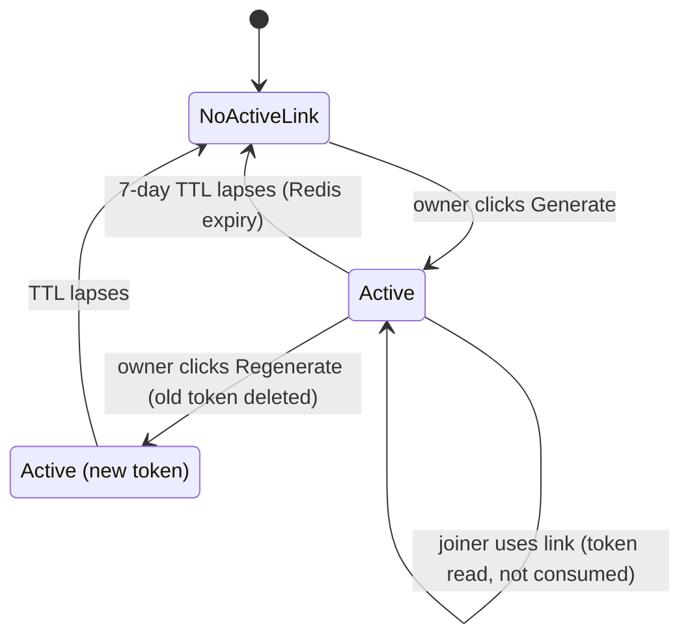
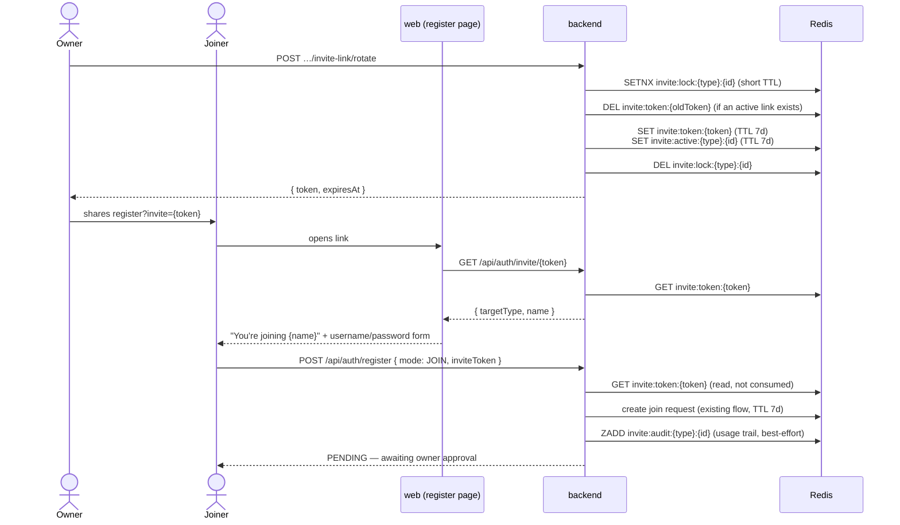

# Expiring Invite Links — Design Spec

**Status:** Approved design (2026-06-11); amended 2026-06-11 — usage audit trail moved into scope (§ 4.6)
**Scope:** Backend (Kotlin/Spring Boot), `web` (admin dashboard). No `client-web`, `receiver`, or `transmitter` changes.
**Author:** Design captured via brainstorming session

---

## 1. Summary

Today the only way to join an existing organization or independent store is the
**persistent join code** (`o_…` / `s_…`): an owner copies it from the settings
page and the joiner pastes it into the register form. The code lives until an
owner manually rotates it.

This feature adds **expiring, multi-use, revocable invite links** on top of the
join-code system — it does **not** replace it:

- An owner explicitly generates an **invite link** for their org or independent
store. The link embeds an opaque token (`i_…`) and looks like
`https://{host}/{locale}/register?invite=i_…`.
- The link is **valid for 7 days**, usable by **any number of people** while
valid (group-chat friendly), and is **revoked by regenerating** (one active
link per tenant) or by simply letting it expire.
- Opening the link lands the joiner directly on the **Join** registration view
with the target pre-resolved ("You're joining *Store X*") — no code to paste.
- Submitting still produces the same **pending join request** (Redis, 7-day
TTL, owner approval required) as the join-code path. The approval gate is
unchanged and remains the real security boundary.
- Each successful join **submission** via a link is recorded in a lightweight
per-tenant **usage trail** (username, time, link generation), shown to owners
alongside the link controls for 30 days (§ 4.6).

Decisions locked during brainstorming:

| Question                                       | Decision                                                                                                 |
| ---------------------------------------------- | -------------------------------------------------------------------------------------------------------- |
| Replace join codes with links?                 | No — links are a layer on top; the code stays for verbal/written sharing                                 |
| Auto-rotate the join code when a link is used? | No — burns group invites, cross-invalidates the code, DoS-able                                           |
| Single-use tokens?                             | No — multi-use while valid (middle ground chosen)                                                        |
| TTL refresh on use (sliding) or on idle?       | No — **hard expiry**, fixed at mint time; after 7 days the link is dead                                  |
| Auto-generation?                               | No — **on-demand only**, explicit admin action; `GET` never mints; the only automatic behavior is expiry |
| Use-count cap?                                 | Deferred (future work); structure extends naturally                                                      |
| Link-usage audit trail?                        | **In scope** (amended 2026-06-11) — join submissions only, 30-day rolling window, Redis-only (§ 4.6)     |

## 2. Goals & Non-Goals

### Goals

- Joiners can register through a tappable URL instead of copy-pasting a code.
- Links die on their own (7-day TTL) so a link leaked into chat history stops
working without anyone acting.
- One active link per tenant; regenerating instantly revokes the previous link.
- "No active link" is a meaningful, visible state: it tells the owner there are
no outstanding link invitations.
- The persistent join code, its rotate button, and the join-request approval
flow are completely untouched.
- No database migration — invite links live entirely in Redis, following the
exact patterns of `JoinRequestService` (`RedisKeyManager` + `RedisTTLPolicy`).
- Org-owned stores remain non-joinable directly (existing invariant carries
over: no invite links for them; people join the org instead).
- Owners can see **who recently joined via a link**: each successful join
submission through an invite link is recorded (username, time, link
generation) and shown with the link controls for 30 days (§ 4.6).

### Non-Goals

- No per-invitee / email-bound invitations.
- No use-count caps (Discord-style "7 days or 5 uses") — deferred.
- No sliding TTL or auto-renewal of any kind.
- No change to join-code semantics, generation, or storage.
- No recording of link **opens** (public resolves) or lifecycle events
(generate/regenerate) — the usage trail records **join submissions only**.
- The usage trail is informational, not a security control: it is
best-effort (§ 4.6) and never blocks or fails a registration.

## 3. Concepts & Lifecycle

- **Creation is always explicit.** `GET` endpoints report state and never mint.
- **Resolve never mutates.** Resolving a token is a plain read; the token is
never consumed. A successful join **submission** appends one entry to the
usage trail (§ 4.6) — the invite token keys themselves are untouched.
- **Expiry is the only automatic transition.** Redis TTL deletes both link
keys. (The usage trail is not part of the link lifecycle — it has its own
30-day window, § 4.6.)

End-to-end join flow via link:

## 4. Backend Design

### 4.1 Token format & generation

- Token = `i_` + 16 random bytes, Base64url-encoded without padding (≈22 chars
after the prefix; ~24 total). Generated with `SecureRandom`, same mechanism as
`JoinCodeGenerator`.
- `JoinCodeGenerator` gains an `INVITE_PREFIX = "i_"` constant and a
`generate(prefix: String, byteCount: Int)` overload (existing 9-byte call
sites unchanged).
- Tokens are stored raw (not hashed) as Redis key material — consistent with
the existing refresh-token (`refresh:{token}`) and join-request
(`join_request:{requestId}`) patterns.

### 4.2 Redis keys & values

New entries in `RedisKeyManager`:

| Key                                    | Value (JSON)                                                        | TTL         |
| -------------------------------------- | ------------------------------------------------------------------- | ----------- |
| `invite:token:{token}`                 | `{ targetType: "ORG"|"STORE", targetId: uuid, expiresAt: iso8601 }` | 7 days      |
| `invite:active:{ORG|STORE}:{targetId}` | `{ token: string, expiresAt: iso8601 }`                             | 7 days      |
| `invite:lock:{ORG|STORE}:{targetId}`   | regenerate mutex (opaque value)                                     | ~10 seconds |
| `invite:audit:{ORG|STORE}:{targetId}`  | ZSet — member `{ username, usedAt: iso8601, linkId }`, score = epoch ms | 30 days, refreshed on write (§ 4.6) |

- `RedisTTLPolicy` gains `INVITE_LINK = Duration.ofDays(7)` — deliberately
equal to the existing join-request TTL, so a request submitted on a link's
last valid day still fits the same approval window the system already uses —
and `INVITE_AUDIT = Duration.ofDays(30)` for the usage trail (§ 4.6).
- `expiresAt` is computed at mint time (`now + INVITE_LINK`) and **stored in
the payload** rather than read back from the key TTL — one round-trip, no
reliance on a TTL-read API, and the displayed expiry always equals what was
set. (Drift between payload expiry and actual Redis expiry is bounded by
request latency — irrelevant at a 7-day scale.)

### 4.3 `InviteLinkService`

New service in `domain/admin/service`, sibling of `JoinRequestService`, built
on the same `ReactiveRedisTemplate<String, String>` + `ObjectMapper`:

| Method                                                 | Behavior                                                                                                                                                                                         |
| ------------------------------------------------------ | ------------------------------------------------------------------------------------------------------------------------------------------------------------------------------------------------ |
| `getActive(targetType, targetId): InviteLinkResponse?` | `GET invite:active:…`; null when absent/expired. Never mints.                                                                                                                                    |
| `regenerate(targetType, targetId): InviteLinkResponse` | Under the per-tenant lock: read active entry → delete old `invite:token:{old}` → mint new token → `SET` token key → `SET` active key (overwrite) → release lock. Returns the new link.           |
| `resolve(token): InviteTarget?`                        | `GET invite:token:{token}`; null when unknown/expired. Redis-only. **Read-only — never consumes.**                                                                                               |
| `resolveForDisplay(token): InviteResolveResponse?`     | `resolve()` + repository name lookup (`OrganizationRepository` / `StoreRepository`, injected) + rejects org-owned or deleted targets. Null on **any** failure — backs the public endpoint's 404. |
| `recordUse(targetType, targetId, username, token)`     | Appends a usage-trail entry (§ 4.6). **Best-effort: catches and logs every failure, never throws.**                                                                                              |
| `getRecentUses(targetType, targetId): List<InviteLinkUse>` | Newest ≤ 20 trail entries, lazily pruning entries older than 30 days (§ 4.6).                                                                                                                 |

`InviteTarget` is a private data class inside the service (token payload
shape); the response DTOs live with their existing siblings — see § 10.

**Concurrency.** Regenerate acquires `invite:lock:{type}:{id}` via
`setIfAbsent` with a ~10-second TTL (the same mutex pattern
`JoinRequestService.approve` already uses) and returns 409 if the lock is
held. Without it, two overlapping regenerates could orphan a token that
resolves for its full TTL yet can never be revoked — the lock serializes them.

**Regenerate ordering & failure tolerance.** The two-key update is still not
atomic; the chosen order (delete old token key **before** writing the new
pair) makes every partial-failure state safe: a crash can leave either *no
valid link* (active key points at a deleted token — panel shows it, resolve
fails, owner regenerates again) or *a fresh link not yet recorded as active*
(orphan token key that Redis TTL clears within 7 days, mintable over). At no
point can a token revoked by a completed regenerate still resolve.

### 4.4 Endpoints

Mirroring the join-code endpoints' paths and auth shape (deliberately **not**
their lazy-mint behavior: the existing store join-code `GET` mints a code when
none exists, which would violate this spec's "GET never mints" decision):

| Endpoint                                                                                           | Auth                                                                             | Behavior                                                                                                                                    |
| -------------------------------------------------------------------------------------------------- | -------------------------------------------------------------------------------- | ------------------------------------------------------------------------------------------------------------------------------------------- |
| `GET /me/invite-link` (OrganizationController)                                                     | `requireOrgOwner` (SUPER_ADMIN)                                                  | Current org link state                                                                                                                      |
| `POST /me/invite-link/rotate` (OrganizationController)                                             | `requireOrgOwner`                                                                | Generate/regenerate org link                                                                                                                |
| `GET /{id}/invite-link` (StoreController)                                                          | `requireStoreAccess`                                                             | Current store link state; **409 `ConflictException` if the store is org-owned** (matching `getStoreJoinCode`'s existing behavior)           |
| `POST /{id}/invite-link/rotate` (StoreController)                                                  | `requireStoreAccess`                                                             | Generate/regenerate store link; **409 if org-owned**                                                                                        |
| `GET /api/auth/invite/{token}` (AuthController, which gains an `OrganizationRepository` injection) | **Public** (under existing `/api/auth/`** public matcher + auth-tier rate limit) | `resolveForDisplay` → `{ targetType, name }`, or **404** when the token is unknown/expired **or the target was deleted / became org-owned** |

Response DTO for the four owner endpoints — `InviteLinkResponse(token: String?, expiresAt: String?, recentUses: List<InviteLinkUse>)`, always HTTP
200; `token`/`expiresAt` both null means "no active link" (keeps the client
free of error-path handling for a normal state). `recentUses` (§ 4.6) is
populated on all four endpoints: the trail is per-tenant, so it accompanies
the "no active link" state too, and a rotate response simply carries the
unchanged trail. Controllers compose the response — link state from
`getActive` (nulls when absent), trail from `getRecentUses`.
`InviteLinkUse(username: String, usedAt: String, linkId: String)` lives
beside `InviteLinkResponse`. The public resolve endpoint uses 404 for
invalid/expired because for a *joiner* that genuinely is an error state.

The public resolve endpoint discloses only the tenant display name, to someone
who already holds a valid token — the same information they would learn on
approval. Unknown and expired tokens are indistinguishable (both 404).

### 4.5 Registration flow change

- `RegisterRequest` gains `inviteToken: String?` (`@Size(max = 64)`).
- In `RegistrationService.join()`: require **exactly one** of `joinCode` /
`inviteToken` (400 "Provide a join code or an invite link, not both" when
both; the existing "Join code is required" message generalizes when neither).
- Invite-token path: `inviteLinkService.resolve(token)` → 400 "Invalid or
expired invite link" when null → fetch the target org/store by ID (400 if it
was deleted while the link lived) and for `STORE` targets re-check
`store.orgId == null` (the same check the code path performs;
`RegistrationService` already injects both repositories) → call the **same**
`joinRequestService.create(username, passwordHash, targetType, targetId)` as
the code path. Username reservation, pending status, approval — all
unchanged. After `create` succeeds, the invite path additionally calls
`inviteLinkService.recordUse(…)` — best-effort, § 4.6; the join-code path
records nothing.
- The token is **not** consumed, deleted, or touched by registration.

### 4.6 Usage audit trail

Per-tenant record of join submissions made through invite links — the answer
to "has anyone actually used this link?". Scoped deliberately small:

- **What is recorded:** one entry per **successful** join submission via an
invite token. Link opens (public resolves), lifecycle events
(generate/regenerate), and join-code joins are **not** recorded (the first
two are future work, § 9).
- **Storage:** ZSet at `invite:audit:{ORG|STORE}:{targetId}` — member is the
JSON entry `{ username, usedAt: iso8601, linkId }`, score is the submission
epoch-millis. `linkId` is the token's **last 4 characters**: enough to
distinguish link generations after a regenerate without storing the secret.
- **Write path** (`recordUse`, called by `RegistrationService` right after
the join request is created): `ZADD` → `ZREMRANGEBYSCORE` (drop entries
older than 30 days) → `ZREMRANGEBYRANK` (cap at the 200 newest — pure
defense; the auth-tier rate limit and username reservation already throttle
growth) → `EXPIRE INVITE_AUDIT`. The TTL is refreshed on every write, so a
tenant with no link joins for 30 days loses the key entirely — which is
exactly the rolling window.
- **Best-effort:** `recordUse` catches and logs every failure and never
throws — a Redis hiccup must not fail a registration. The trail is
informational; the approval gate stays the security boundary.
- **Read path** (`getRecentUses`): lazy age-prune (`ZREMRANGEBYSCORE`), then
`ZREVRANGE` for the newest 20, each member parsed with `runCatching` and
malformed entries skipped — the same hydrate pattern `JoinRequestService`
uses for its indexes.
- **Lifetime:** the key is per-tenant, not per-token, so the trail
**survives link regeneration and expiry**; entries age out individually
after 30 days.

## 5. Frontend Design (`web`)

### 5.1 API additions

`features/organization/api.ts` (mirroring the join-code functions):
`getOrgInviteLink()`, `rotateOrgInviteLink()`, `getStoreInviteLink(id)`,
`rotateStoreInviteLink(id)` → `Promise<InviteLinkState>` where
`InviteLinkState = { token: string | null; expiresAt: string | null; recentUses: InviteLinkUse[] }`.
No additional API functions for the usage trail — the data rides on these
four.

`features/auth/api.ts`: `resolveInvite(token)` →
`Promise<{ targetType: "ORG" | "STORE"; name: string }>` (throws `ApiError` on
404).

All five calls route through `API_ROUTES` in `lib/constants.ts` like every
existing web API function — new entries `AUTH.INVITE`,
`ORGS.INVITE_LINK[_ROTATE]`, `STORES.INVITE_LINK[_ROTATE]`.

Types: `RegisterRequest` (`types/admin.ts`) gains `inviteToken?: string`;
`InviteLinkState` lives in `types/organization.ts` beside `JoinCodeResponse`,
which it mirrors, alongside
`InviteLinkUse = { username: string; usedAt: string; linkId: string }`.

**In-scope pre-existing fix.** The web `RegisterResponse` type declares
`outcome`, but the backend serializes the field as `status` and no mapping
exists — so the register page's `res.outcome === "PENDING"` branch never
fires and every pending join currently shows the "account created" screen.
This spec's joiner flow depends on the PENDING screen, so the fix is in
scope: rename the web field to `status` (matching the backend) and update the
register page branch.

### 5.2 `InviteLinkPanel` component

New file `features/organization/invite-link-panel.tsx` — a **sibling** of
`JoinCodePanel`, not an extension (one purpose per file). Same
dependency-injection shape: `{ fetchLink, generateLink }` props; pages supply
the API functions.

Two render states after load:

- **No active link** — description text + **Generate invite link** button.
- **Active link** — read-only input with the full URL, Copy button (existing
`navigator.clipboard` + sonner toast pattern), "Valid until {date}" line from
`expiresAt`, and a **Regenerate** button behind the same warning-styled
`AlertDialog` confirm the join-code rotate uses (regenerating kills the old
link).

The URL is built client-side:
`${window.location.origin}/${locale}/register?invite=${token}` (locale from
`useLocale()`). Panel copy includes one caution sentence: *anyone with this
link can request to join until it expires.* All alert/status styling follows
`docs/walkthrough/Web Styles.md` § "Status Alert Boxes".

**Usage trail block.** Below the link controls, a third block — "Recent joins
via invite link" — renders **only when `recentUses` is non-empty** (no
empty-state clutter, and no extra fetch: the data arrives with the link
state). It renders in **both** link states — history stays visible after a
link expired or was regenerated. Each row shows the username, the submission
time (fixed-locale formatting, same as `JoinRequestsPanel` — time display is
language-agnostic), and a small monospace chip with the entry's `linkId`.
When an active link exists and a chip matches its last 4 characters, the chip
uses a "current link" accent variant — after a regenerate it is immediately
visible which joins came through the old link.

### 5.3 Placement & visibility

| Page                              | Condition                                                                                                                                    | Link target |
| --------------------------------- | -------------------------------------------------------------------------------------------------------------------------------------------- | ----------- |
| `dashboard/settings/organization` | always (page is SUPER_ADMIN-scoped)                                                                                                          | org         |
| `dashboard/settings/store`        | existing `storeId && storeOrgId === null` gate, below `JoinCodePanel`                                                                        | store       |
| `dashboard/admins`                | `isSuperAdmin` → org link; else fetch the admin's store and show the store link only when **the store's** `orgId === null`; otherwise hidden | org / store |

The Admins page renders the panel **above `JoinRequestsPanel`** — invite and
approve in one workflow. All three placements render the same component with
different injected API functions.

**Why the store fetch is required:** `admin.orgId` is null for *every*
role-ADMIN account, including admins of org-owned stores — org membership for
ADMINs is derived through the store's `orgId`, never stored on the admin. So
the gate cannot be computed from the auth store alone; the Admins page must
determine store independence the same way the store settings page does
(fetch the store, check its `orgId`).

### 5.4 Register page deep link

`useSearchParams` in a statically prerendered client page **requires a
`<Suspense>` boundary** (verified against Next.js 16.1 docs — without it the
build fails). Therefore:

- Extract the current wizard body of `(auth)/register/page.tsx` into
`features/auth/register-wizard.tsx` (client component). The page keeps the
decorative shell (orbs, card, header) and wraps `<RegisterWizard />` in
`<Suspense>` (fallback: the card with no body, or null — implementer's
choice, it flashes for milliseconds).
- `RegisterWizard` reads `?invite=` via `useSearchParams`. When present it
skips the path selector, enters the JOIN view in **invite mode**, and calls
`resolveInvite(token)` on mount:
  - **Valid** → info alert "You're joining **{name}**"; the form shows only
  username + password (code field hidden); submit sends
  `{ mode: "JOIN", username, password, inviteToken }`.
  - **Invalid/expired** → warning alert "This invite link is invalid or has
  expired"; form falls back to the normal manual-code JOIN view (Back button
  to the path selector still available).
- `RegisterJoinForm` gains one optional prop:
`invite?: { token: string; targetName: string }`. When set, the join-code
field is not rendered and `inviteToken` is submitted instead of `joinCode`.
- **Token expires between page load and submit** → backend 400 ("invite
link") → the wizard **clears its invite state** (the `invite` prop becomes
undefined), shows the inline invalid-link error, and re-renders the manual
code field. Every subsequent submit is therefore a plain manual-code JOIN
submit — `joinCode` only, never the dead token, never both.

### 5.5 i18n

New keys, `en.json` + `vi.json`, structurally mirrored:

- `admins` namespace: `inviteLinkTitle`, `inviteLinkDesc`, `inviteLinkEmpty`,
`inviteLinkGenerate`, `inviteLinkRegenerate`, `inviteLinkRegenerateConfirm`,
`inviteLinkCopy`, `inviteLinkCopied`, `inviteLinkValidUntil`,
`inviteLinkCaution`, `inviteLinkUsageTitle`, `inviteLinkUsageDesc`,
`inviteLinkUsageCurrent`.
- `register` namespace: `joiningTarget` (rich text with `{name}`),
`inviteInvalid`.

**Terminology cleanup (in scope).** The existing EN register copy calls the
join *code* an "invite code" (`pathJoinDesc`, `joinCodeLabel`,
`joinCodeRequired`, `invalidJoinCode`, and `admins.joinCodeTitle`). With
"invite links" arriving as a distinct feature, that wording would read as the
same thing. Those strings are reworded to say **"join code"** (keys
unchanged), so "join code" = the persistent code and "invite link" = the
expiring URL, consistently. `vi.json` mirrors the rewording.

Per project copy rules, the Vietnamese strings will be drafted in chat for
approval during implementation — not written blind into `vi.json`.

## 6. Error Handling

| Scenario                                                             | Behavior                                                                                             |
| -------------------------------------------------------------------- | ---------------------------------------------------------------------------------------------------- |
| Resolve unknown/expired token (public endpoint)                      | 404; register page shows warning + manual-code fallback                                              |
| Register with expired/unknown `inviteToken`                          | 400 "Invalid or expired invite link"; wizard clears invite state, inline error + code-field fallback |
| Register with both `joinCode` and `inviteToken`                      | 400                                                                                                  |
| Mint invite link for an org-owned store                              | 409 `ConflictException` (matching the join-code endpoints)                                           |
| Use a link whose store became org-owned, or whose target was deleted | Public resolve → 404; registration → 400 (defensive re-check in `RegistrationService`)               |
| Regenerate partial failure (two-key update)                          | Safe by ordering — see § 4.3; worst case self-heals via TTL ≤ 7 days                                 |
| Concurrent regenerates for the same tenant                           | Serialized by the `invite:lock` mutex; loser gets 409, retries                                       |
| Two joiners use the link concurrently                                | Both succeed (multi-use, read-only resolve); username reservation already serializes duplicates      |
| Network failure resolving on register page                           | Same fallback as invalid token, generic error copy                                                   |
| Audit write (`recordUse`) fails during registration                  | Registration succeeds; warning logged; the entry is simply missing (best-effort trail, § 4.6)        |
| Malformed usage-trail entry on read                                  | Skipped via `runCatching` (same as join-request hydrate); remaining entries still returned           |

## 7. Security Considerations

- **The approval gate is the boundary.** A leaked link only allows *filing a
pending join request*; an owner must still approve it. This was the basis
for accepting link-shaped secrets at all.
- Token entropy (16 bytes, `SecureRandom`) exceeds the join code's 9 bytes;
both are far beyond guessability under the existing auth-tier rate limit on
`/api/auth/`**.
- Links in query strings appear in browser history, chat logs, and host access
logs — accepted, mitigated by the 7-day hard expiry and regenerate-to-revoke.
The panel caution sentence makes the exposure explicit to owners.
- `GET` endpoints have no side effects (no mint-on-read); creation always
requires an authenticated, role-checked `POST`.
- Public resolve discloses only the tenant name to a valid token holder;
unknown vs expired is indistinguishable.
- The usage trail is **owner-only** (served exclusively through the
authenticated, role-checked link endpoints) and stores no IPs or device
data — only usernames the owner already sees as join requests, timestamps,
and a 4-character link suffix that discloses nothing usable of the token.

## 8. Testing

Backend (`./gradlew test`):

- `InviteLinkServiceTest` — getActive empty/active, regenerate revokes old
token, regenerate overwrites active entry, concurrent regenerate (lock held
→ 409, no orphaned resolvable token), resolve valid/unknown, multi-use
(resolve twice), resolveForDisplay with deleted / org-owned target → null,
expiry semantics (TTL set on both keys), recordUse (appends entry, prunes
>30-day entries, caps at 200, refreshes key TTL, never throws on Redis
failure), getRecentUses (newest-first, limit 20, skips malformed entries).
- `RegistrationService` join-via-token — valid token → pending request;
expired/unknown → 400; both code+token → 400; neither → 400; token for
org-owned or deleted target → 400; token not consumed after successful
registration; successful token join records a trail entry; join-code join
records nothing; `recordUse` failure does not fail registration.
- Controller tests for the five endpoints following existing controller test
patterns (auth: SUPER_ADMIN-only org link, store access, org-owned-store
409, public resolve 200/404, owner responses carry `recentUses`).

Frontend: no test framework exists in `web/`; verification goes through the
project's audit flow. Manual scenarios for the auditor:

1. Generate org link → copy → open in incognito → "You're joining {org}" →
  register → request appears in JoinRequestsPanel.
2. Same for an independent store link.
3. Regenerate → old link shows invalid-link warning with manual-code fallback.
4. Expired/garbage token in URL → warning + manual fallback works.
5. Panel states: empty → generate → active with expiry date; admins-page
  visibility for SUPER_ADMIN / independent-store ADMIN / org-store ADMIN.
6. Pending join via link shows the **pending** screen, not "account created"
  (verifies the `status`/`outcome` fix from § 5.1).
7. Usage trail: join via link → row (username, time, `linkId` chip) appears
  in the panel; regenerate → old rows keep the old chip, the "current"
  accent applies only to joins made with the new link; trail remains
  visible in the "no active link" state after expiry.

## 9. Future Work (explicitly out of scope)

- Use-count caps (valid 7 days *or* N uses).
- Per-invitee email-bound invitations.
- Recording link **opens** (public resolves) and lifecycle events
(generate/regenerate) in the usage trail — it currently records join
submissions only (§ 4.6).

## 10. File Change Summary

| Area    | File                                                       | Change                                                                                            |
| ------- | ---------------------------------------------------------- | ------------------------------------------------------------------------------------------------- |
| backend | `core/tenant/JoinCodeGenerator.kt`                         | `INVITE_PREFIX`, `generate(prefix, byteCount)` overload                                           |
| backend | `core/redis/RedisKeyManager.kt`                            | `inviteToken(token)`, `inviteActive(targetType, targetId)`, `inviteLock(targetType, targetId)`, `inviteAudit(targetType, targetId)` |
| backend | `core/redis/RedisTTLPolicy.kt`                             | `INVITE_LINK = 7 days`, `INVITE_AUDIT = 30 days`                                                  |
| backend | `domain/admin/service/InviteLinkService.kt`                | NEW — getActive / regenerate / resolve / resolveForDisplay / recordUse / getRecentUses (private `InviteTarget` payload class) |
| backend | `domain/admin/service/RegistrationService.kt`              | JOIN via `inviteToken` (incl. deleted-target / org-owned re-checks) + best-effort `recordUse` call |
| backend | `domain/admin/request/RegisterRequest.kt`                  | `inviteToken` field                                                                               |
| backend | `domain/organization/controller/OrganizationController.kt` | 2 endpoints                                                                                       |
| backend | `domain/organization/response/InviteLinkResponse.kt`       | NEW — sibling of `JoinCodeResponse`; includes `recentUses` + `InviteLinkUse` DTO                  |
| backend | `domain/store/controller/StoreController.kt`               | 2 endpoints                                                                                       |
| backend | `domain/admin/controller/AuthController.kt`                | public `GET /api/auth/invite/{token}`; gains `OrganizationRepository`                             |
| backend | `domain/admin/response/InviteResolveResponse.kt`           | NEW — sibling of `RegisterResponse`                                                               |
| web     | `features/organization/invite-link-panel.tsx`              | NEW component (link controls + usage trail block)                                                 |
| web     | `features/organization/api.ts`                             | 4 functions                                                                                       |
| web     | `features/auth/api.ts`                                     | `resolveInvite`                                                                                   |
| web     | `lib/constants.ts`                                         | `API_ROUTES` entries: `AUTH.INVITE`, `ORGS.INVITE_LINK[_ROTATE]`, `STORES.INVITE_LINK[_ROTATE]`   |
| web     | `features/auth/register-wizard.tsx`                        | NEW — extracted wizard + invite mode                                                              |
| web     | `app/[locale]/(auth)/register/page.tsx`                    | shell + Suspense wrapper                                                                          |
| web     | `features/auth/register-join-form.tsx`                     | optional `invite` prop                                                                            |
| web     | `types/admin.ts`                                           | `RegisterRequest.inviteToken`; `RegisterResponse.outcome` → `status` (pre-existing fix)           |
| web     | `types/organization.ts`                                    | `InviteLinkState` (incl. `recentUses`) + `InviteLinkUse` beside `JoinCodeResponse`                |
| web     | settings org / settings store / admins pages               | render panel (admins page adds the store fetch for its gate)                                      |
| web     | `messages/en.json`, `messages/vi.json`                     | new keys (incl. usage-trail keys) + "invite code" → "join code" rewording (VI copy approved in chat first) |

