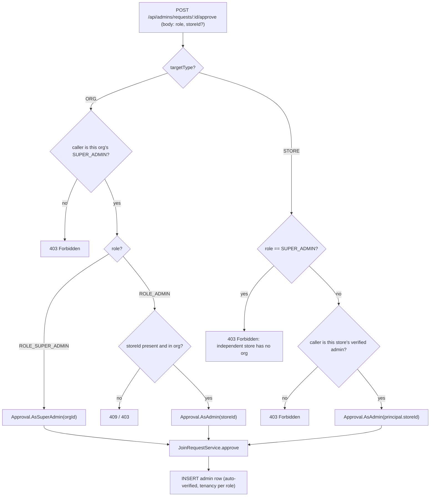

# Join Request Role Selection Spec

**Date:** 2026-06-13
**Status:** Draft — pending review
**Area:** Backend (`domain/admin`) + Web admin dashboard (`features/admin`)

## Summary

When a person requests to join an existing **organization** via an invite link, the
approving **SUPER_ADMIN** currently has no say over the new account's role — the join is
hard-wired to `ROLE_ADMIN`. This feature lets the approver choose, at approval time,
whether the joiner becomes a **store-scoped admin** (`ROLE_ADMIN`, assigned to a store) or
a **peer organization owner** (`ROLE_SUPER_ADMIN`, org-wide).

The choice is offered **only** on organization join requests. Independent-store join
requests stay `ROLE_ADMIN`-only because an independent store has no organization to own.

## Background — current behavior

Join requests are created (`RegistrationService.joinViaInviteToken`) as pending Redis
records with a `targetType` of `ORG` or `STORE`, then materialized into an `admin` row on
approval.

- `JoinRequestController.approve` resolves authorization and a target store, then calls
  `JoinRequestService.approve(requestId, assignStoreId, verifierId)`.
- `JoinRequestService.approve` constructs the `Admin` with `role = ROLE_ADMIN` **hard-coded**
  (`JoinRequestService.kt:124`), auto-verified (`isVerified = true`, `verifiedBy`,
  `verifiedAt`).
- The only path that produces `ROLE_SUPER_ADMIN` today is org creation
  (`RegistrationService.createOrg`, `RegistrationService.kt:65`).

### The tenancy invariant (drives the whole design)

A DB `CHECK` constraint (`backend/src/main/resources/db/schema.sql:156-158`,
`chk_admin_tenancy`) couples role to tenancy columns — they are **mutually exclusive shapes**,
not just permission levels:

| Role | `org_id` | `store_id` | Scope |
|------|----------|-----------|-------|
| `ROLE_SUPER_ADMIN` | **set** | **NULL** | Governs the whole org (all stores) |
| `ROLE_ADMIN` | **NULL** | set* | Scoped to one store |

\* An org admin belongs to the org transitively through its assigned store
(`store.org_id`), never via a direct `org_id`.

Consequence: promoting a joiner to `SUPER_ADMIN` means setting `org_id` and leaving
`store_id` NULL — so the "assign a store" step does not apply to that branch. No schema
change is required; we set the existing columns differently per role.

## Decisions (confirmed with product owner)

1. **`SUPER_ADMIN` = full org owner, no store.** The joiner becomes a peer owner with access
   to all stores. Matches the existing data model; **no schema change**.
2. **Scope = join-approval flow only.** The manual "Add admin" form (`POST /api/admins` →
   `AdminService.createAdmin`) stays `ROLE_ADMIN`-only; its existing guard
   (`AdminService.kt:92`) is left untouched.
3. **UX = default `ADMIN` + inline warning on `SUPER_ADMIN`.** The role picker defaults to
   `ROLE_ADMIN` (least privilege, preserves today's behavior). Selecting `SUPER_ADMIN`
   reveals a warning describing the grant. The approve dialog itself is the confirmation —
   no extra typed-confirmation step.

## Non-goals

- No change to independent-store (`STORE`-target) join approvals — they remain
  `ROLE_ADMIN`-only.
- No change to the manual "Add admin" endpoint/form.
- No post-creation role promotion/demotion endpoint (a joined `ADMIN` still cannot later be
  promoted in-product; out of scope).
- No schema migration.

## Design

### Approval decision flow



### Backend — API contract

`ApproveJoinRequest` gains a `role` field with an `ROLE_ADMIN` default, keeping existing
callers (which send only `storeId`, or nothing) backward compatible:

```kotlin
// domain/admin/request/ApproveJoinRequest.kt
data class ApproveJoinRequest(
    val storeId: UUID? = null,
    val role: AdminRole = AdminRole.ROLE_ADMIN,
)
```

`jackson-module-kotlin` is on the classpath (`build.gradle.kts:37`), so an omitted `role`
in the JSON body resolves to the Kotlin default `ROLE_ADMIN` rather than null — this is what
keeps existing/legacy callers (and the independent-store path) backward compatible. The
controller additionally reads `body?.role ?: ROLE_ADMIN` to cover a wholly absent body
(`@RequestBody(required = false)`).

### Backend — `JoinRequestService` (Approach A: typed decision)

Add a nested sealed `Approval` type (mirrors the existing `AdminService.VerifyScope`
sealed-interface convention) and change `approve` to take it. The Redis lock, the
`existsByUsername` re-check, `deleteKeys` cleanup, and auto-verification are **unchanged** —
only the role/tenancy columns of the constructed `Admin` differ per branch.

```kotlin
sealed interface Approval {
    data class AsAdmin(val storeId: UUID) : Approval
    data class AsSuperAdmin(val orgId: UUID) : Approval
}

@Transactional
suspend fun approve(requestId: String, approval: Approval, verifierId: UUID): Admin {
    val lockKey = RedisKeyManager.joinRequestLock(requestId)
    val locked = redis.opsForValue().setIfAbsent(lockKey, "1", Duration.ofSeconds(30)).awaitSingle()
    if (!locked) throw ConflictException("Join request is already being processed")
    val payload = get(requestId) ?: throw ConflictException("Join request not found or expired")
    try {
        if (adminRepository.existsByUsername(payload.username)) {
            throw ConflictException("Username '${payload.username}' is already taken")
        }
        val now = OffsetDateTime.now()
        val admin = adminRepository.save(
            when (approval) {
                is Approval.AsAdmin -> Admin(
                    username = payload.username,
                    passwordHash = payload.passwordHash,
                    role = AdminRole.ROLE_ADMIN,
                    storeId = approval.storeId,
                    orgId = null,
                    isVerified = true,
                    verifiedBy = verifierId,
                    verifiedAt = now,
                )
                is Approval.AsSuperAdmin -> Admin(
                    username = payload.username,
                    passwordHash = payload.passwordHash,
                    role = AdminRole.ROLE_SUPER_ADMIN,
                    storeId = null,
                    orgId = approval.orgId,
                    isVerified = true,
                    verifiedBy = verifierId,
                    verifiedAt = now,
                )
            }
        )
        deleteKeys(requestId, payload)
        return admin
    } finally {
        redis.delete(lockKey).awaitSingleOrNull()
    }
}
```

The sealed type makes the illegal "`SUPER_ADMIN` **and** a store" combination
unrepresentable, satisfying `chk_admin_tenancy` by construction.

### Backend — `JoinRequestController.approve`

The controller keeps doing authorization + validation (as today) and maps the request into
an `Approval`. **The invariant** — `SUPER_ADMIN` is only reachable from `ORG` targets — is
enforced server-side regardless of what the client sends:

```kotlin
@PostMapping("/{requestId}/approve")
suspend fun approve(
    @PathVariable requestId: String,
    @RequestBody(required = false) body: ApproveJoinRequest?,
    @AuthenticationPrincipal principal: AdminPrincipal,
): ResponseEntity<Void> {
    val payload = joinRequestService.get(requestId)
        ?: throw NotFoundException("JoinRequest", "id", requestId)
    val role = body?.role ?: AdminRole.ROLE_ADMIN

    val approval: JoinRequestService.Approval = when (payload.targetType) {
        JoinRequestService.TargetType.ORG -> {
            val orgId = principal.orgId?.takeIf { isSuperAdmin(principal) }
                ?: throw ForbiddenException("Only the organization owner can approve this request")
            if (UUID.fromString(payload.targetId) != orgId)
                throw ForbiddenException("Request is not for your organization")
            when (role) {
                AdminRole.ROLE_SUPER_ADMIN -> JoinRequestService.Approval.AsSuperAdmin(orgId)
                AdminRole.ROLE_ADMIN -> {
                    val storeId = body?.storeId
                        ?: throw ConflictException("Select a store in your organization to assign")
                    val store = storeRepository.findById(storeId)
                        ?: throw NotFoundException("Store", "id", storeId.toString())
                    if (store.orgId != orgId)
                        throw ForbiddenException("Store is not in your organization")
                    JoinRequestService.Approval.AsAdmin(storeId)
                }
            }
        }
        JoinRequestService.TargetType.STORE -> {
            // Invariant: an independent store has no org, so SUPER_ADMIN is impossible here.
            if (role == AdminRole.ROLE_SUPER_ADMIN)
                throw ForbiddenException("An independent store has no organization to own")
            val storeId = principal.storeId
                ?: throw ForbiddenException("Only the store's admin can approve this request")
            if (UUID.fromString(payload.targetId) != storeId)
                throw ForbiddenException("Request is not for your store")
            if (!principal.isVerified)
                throw ForbiddenException("Only a verified admin can approve co-owners")
            JoinRequestService.Approval.AsAdmin(storeId)
        }
    }
    joinRequestService.approve(requestId, approval, principal.id)
    return ResponseEntity.noContent().build()
}
```

`isSuperAdmin(principal)` already exists in the controller. The `reject` endpoint is
**unchanged** (it never assigned a role).

### Backend — error handling

Reuses existing exceptions and the global `@RestControllerAdvice` `ExceptionHandler`:

| Case | Exception | HTTP |
|------|-----------|------|
| `SUPER_ADMIN` requested on a `STORE` target | `ForbiddenException` | 403 |
| `ADMIN` on `ORG` target without a `storeId` | `ConflictException` | 409 |
| Store not in approver's org | `ForbiddenException` | 403 |
| Caller not the org's SUPER_ADMIN | `ForbiddenException` | 403 |
| Request id not found / expired | `NotFoundException` / `ConflictException` | 404 / 409 |
| Username taken between request and approval | `ConflictException` | 409 |

### Frontend — `ApproveJoinRequestDialog`

Replace the `requireStore` prop with **`allowRoleChoice`** (the org-owner case; "store
required" is now conditional, so the old prop name no longer describes its role). Add an
internal `role` state defaulting to `"ROLE_ADMIN"`, reset on each open exactly as `storeId`
is.

Rendering matrix:

| Condition | Role picker | Store select | Warning box |
|---|:---:|:---:|:---:|
| `allowRoleChoice` && role = `ROLE_ADMIN` | shown | **shown, required** | — |
| `allowRoleChoice` && role = `ROLE_SUPER_ADMIN` | shown | hidden | **shown** |
| `!allowRoleChoice` (independent store) | hidden | hidden | — |

- **Role `<Select>`** mirrors the file's existing controlled pattern
  (`value` + `onValueChange={(v) => v && setRole(v)}`, custom `<span>` inside
  `SelectTrigger`). Options: `ROLE_ADMIN` → `tAdmins("roleAdmin")`,
  `ROLE_SUPER_ADMIN` → `tAdmins("roleSuperAdmin")`. Label: `tAdmins("roleLabel")`.
- **Confirm enabled** when: `role === "ROLE_SUPER_ADMIN"`, **or**
  `role === "ROLE_ADMIN" && (!allowRoleChoice || storeId)`.
- **Warning box** follows the canonical Status Alert Box pattern in
  `docs/walkthrough/Web Styles.md` (transparent background, `text-warning`, `rounded-xl`,
  `dark:` overrides) — not ad-hoc inline classes.
- **`onConfirm` signature** changes from `(storeId?) => Promise<void>` to
  `(role: AdminRole, storeId?: string) => Promise<void>`.

### Frontend — wiring

- `JoinRequestsPanel`:
  - `doApprove(storeId?)` → `doApprove(role: AdminRole, storeId?)`, calling
    `approveJoinRequest(approveTarget.requestId, role, storeId)`.
  - Pass `allowRoleChoice={isSuperAdmin}` to the dialog (renamed from `requireStore`).
- `features/admin/api.ts`:
  ```ts
  export function approveJoinRequest(
    requestId: string,
    role: AdminRole,
    storeId?: string,
  ) {
    return post<void>(API_ROUTES.ADMINS.APPROVE_REQUEST(requestId), { role, storeId });
  }
  ```
  The backend's `role` default keeps the payload safe even when `storeId` is omitted
  (`SUPER_ADMIN` branch) — JSON `{ role, storeId: undefined }` serializes without `storeId`.

### Frontend — i18n

All role copy already exists in the `admins` namespace (used by the dialog). **Reused:**
`roleLabel`, `roleAdmin` ("Store manager" / "Quản lý cửa hàng"), `roleSuperAdmin`
("Organization owner" / "Chủ tổ chức"), `storePlaceholder`, `requestApproveStoreLabel`.

**One new key** — the existing `noteSuperAdmin` is unusable here because it states the
account still needs verifying, whereas join-approval auto-verifies:

| Key | EN | VI |
|-----|----|----|
| `admins.requestApproveSuperAdminNote` | Makes this person an organization owner — full access to every store and the ability to manage other admins. | Cấp quyền chủ tổ chức — có toàn quyền với mọi cửa hàng và quản lý các quản trị viên khác. |

`en.json` and `vi.json` are structurally mirrored: one new flat string key on each side,
same position in the `admins` block.

## Invariants & security

1. **`SUPER_ADMIN` only from `ORG` targets** — enforced in the controller for both
   target branches; the UI simply never offers the option for independent stores.
2. **Server does not trust the client** — role, store-membership, org ownership, and
   verification are all re-validated server-side; the UI default/warning are convenience
   only.
3. **`chk_admin_tenancy` honored by construction** — the sealed `Approval` type guarantees
   `SUPER_ADMIN` ⇒ no store and `ADMIN` ⇒ a store, so no DB constraint violation is
   reachable through this path.
4. **Auto-verification preserved** — both branches set `isVerified = true`,
   `verifiedBy = verifierId`, `verifiedAt = now`, matching today's approval and the
   `createOrg` precedent for owners.
5. **Last-super-admin guard unaffected** — this path only *adds* `SUPER_ADMIN`s; the
   existing deletion guard (`AdminService` `countByOrgIdAndRole`) continues to protect the
   floor.

## Testing

No existing test exercises `JoinRequestService.approve` (`JoinRequestServiceTest.kt` covers
only `usernameReserved`), so the signature change breaks nothing — the approve tests below
are net-new.

### Backend

Service tests added to `JoinRequestServiceTest.kt` (existing MockK + `runTest` style):

- `approve(AsSuperAdmin)` → saved row has `role = ROLE_SUPER_ADMIN`, `org_id` set,
  `store_id` null, `isVerified = true`, `verifiedBy` = verifier.
- `approve(AsAdmin)` → `role = ROLE_ADMIN`, `store_id` set, `org_id` null (today's behavior).
  Assert via captured `Admin` slot on the mocked `adminRepository.save`.

Controller tests in a new `JoinRequestControllerTest.kt`, following the `WebTestClient`
pattern already used by `AdminControllerTest.kt` / `OrganizationControllerTest.kt`:

- `ORG` target + `role = ROLE_SUPER_ADMIN` → service receives `AsSuperAdmin(orgId)`.
- `ORG` target + `role = ROLE_ADMIN` + valid `storeId` → `AsAdmin(storeId)`.
- `ORG` target + `role = ROLE_ADMIN` + missing `storeId` → 409.
- **Invariant**: `STORE` target + `role = ROLE_SUPER_ADMIN` → 403.
- Authorization regression: non-SUPER_ADMIN approving an `ORG` request → 403.
- Backward compatibility: body omitting `role` → treated as `ROLE_ADMIN`.

### Frontend

The web project runs **vitest only** — there is no `@testing-library/react` / jsdom harness,
and every existing test (`lib/*.test.ts`, `store/*.test.ts`, `messages/parity.test.ts`) is a
pure-logic test. To stay within the established pattern (and avoid pulling in a component-test
stack as undeclared scope), the dialog's decision logic is tested without rendering:

- **Extract the gating logic into pure helpers** in the dialog module (or a small sibling),
  e.g. `isStoreRequired(allowRoleChoice, role)` and
  `isConfirmEnabled(allowRoleChoice, role, storeId)`. Unit-test these with vitest:
  - default `role = ROLE_ADMIN` → store required when `allowRoleChoice`.
  - `role = ROLE_SUPER_ADMIN` → store not required; confirm enabled without a store.
  - `role = ROLE_ADMIN` + `allowRoleChoice` + no store → confirm disabled.
- **`approveJoinRequest`** unit test: mock `post` from `@/lib/api`, assert it posts
  `{ role, storeId }` to the approve route.
- **i18n parity** is enforced by the existing `messages/parity.test.ts`; adding
  `requestApproveSuperAdminNote` to **both** `en.json` and `vi.json` is required for it to
  pass (and satisfies the structural-mirroring rule).

Full render/interaction coverage of the dialog (toggling the role select, asserting the
warning is visible) would require adopting `@testing-library/react` + a jsdom environment;
that is **out of scope** for this feature and noted here as a known coverage gap rather than
silently assumed.

## Files touched

**Backend**
- `domain/admin/request/ApproveJoinRequest.kt` — add `role` field.
- `domain/admin/service/JoinRequestService.kt` — add `Approval` sealed type; change
  `approve` signature + body.
- `domain/admin/controller/JoinRequestController.kt` — map request → `Approval`, enforce
  invariant.
- `src/test/.../JoinRequestServiceTest.kt` — add `approve` service tests (existing file).
- `src/test/.../JoinRequestControllerTest.kt` — **new** WebTestClient controller test.

**Frontend**
- `src/features/admin/approve-join-request-dialog.tsx` — role picker, conditional store,
  warning, `onConfirm` signature, `allowRoleChoice` prop; export pure gating helpers
  (`isStoreRequired`, `isConfirmEnabled`) for unit testing.
- `src/features/admin/join-requests-panel.tsx` — pass `allowRoleChoice`, thread `role`
  through `doApprove`.
- `src/features/admin/api.ts` — `approveJoinRequest(requestId, role, storeId?)`.
- `src/messages/en.json`, `src/messages/vi.json` — add `requestApproveSuperAdminNote` to
  **both** (required by `messages/parity.test.ts`).
- `src/features/admin/*.test.ts` — **new** vitest unit tests for the gating helpers + the
  `approveJoinRequest` api call.

**Docs**
- `docs/CHANGELOGS.md` — log all of the above (including the prop rename and the unchanged
  manual "Add admin" path, per repo convention to record skipped/declined items).

## Pre-implementation note

Per the repo's GitNexus workflow, run `gitnexus_impact` on `JoinRequestService.approve` and
`JoinRequestController.approve` before editing, and `gitnexus_detect_changes` before
finishing, to confirm the blast radius matches "Files touched" above.
