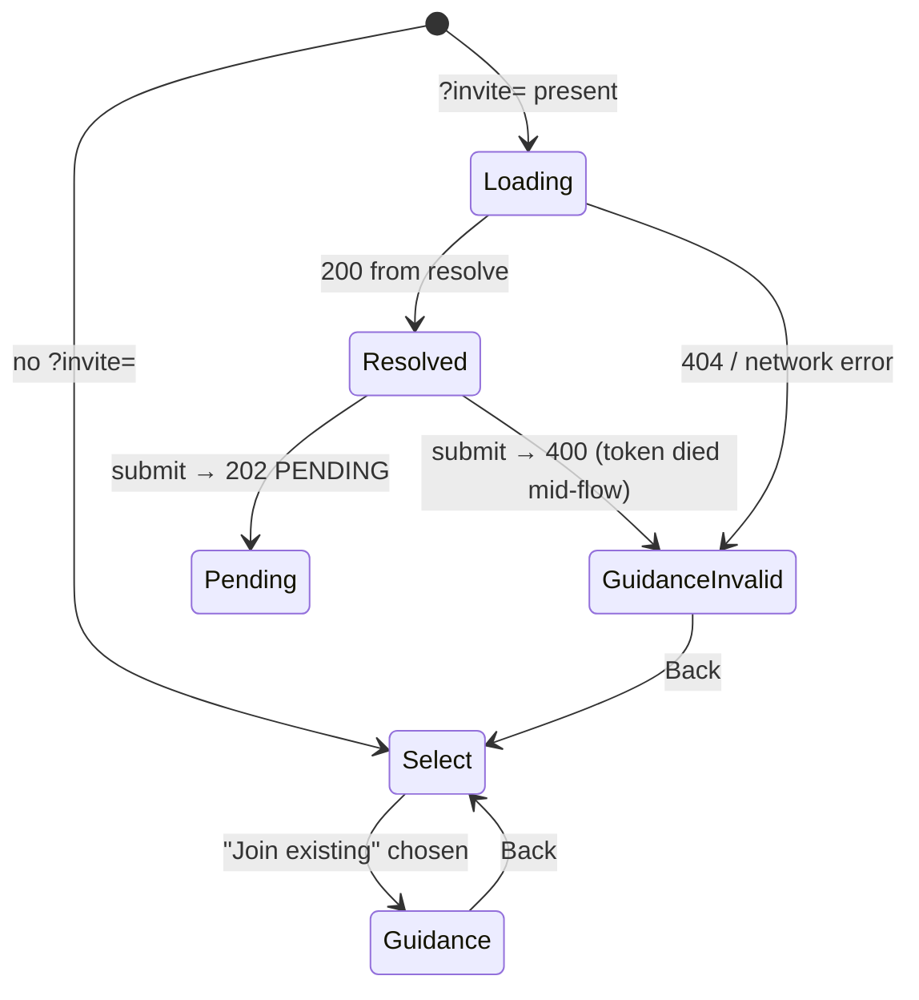

# Link-Only Invitations Spec (Join-Code Purge)

> Status: **Draft for plan-writing** · Supersedes **every statement in `docs/spec/Expiring Invite Links Spec.md` that assumes join codes exist** — the § 1 "Replace join codes with links? No" decision, the § 2 non-goals keeping the code/rotate UI, the auto-rotate question (moot), the "join code or invite link" message analysis, the § 5.5 "invite code"→"join code" rewording rows, and the entropy comparison against the 9-byte code. The invite-link *mechanics* in that spec (TTL, lock, trail, resolve semantics, endpoints) remain fully in force.

## 1. Summary

Join codes (`o_…` / `s_…`) are removed from the product entirely — backend, database, web UI, and i18n. **Expiring invite links become the only invitation mechanism.** The pending-join-request approval system (`JoinRequestService`, owner approval gate) is untouched: it is the destination of both former paths and remains the real security boundary.

Decisions locked during brainstorming (2026-06-12):

| Question | Decision |
|---|---|
| Staging | Single-pass purge — no deprecation window, no dormant code paths |
| Register "Join" view without a valid link | **Link-only, no input.** Guidance message ("ask your admin for an invite link"); no token-paste field |
| "Join existing" card on the path selector | **Stays visible** without a link; selecting it shows the guidance state (no username/password fields) |
| `join_code` DB columns | **Dropped fully** (both tables, both unique indexes); manual `ALTER` statements documented for existing deployments (§ 4.3) |
| Invite-link TTL | **Unchanged** — 7-day hard expiry; on-demand generation is the permanent-credential replacement |
| In-flight written codes | Not honored — anyone holding a code is sent a link instead |

## 2. Goals & Non-Goals

**Goals**

- No code path, schema column, API route, UI element, type, or i18n string related to join codes survives.
- The JOIN registration mode accepts exactly one credential: `inviteToken`.
- Error-message surface simplifies: the former "join code or invite link" wording disappears (this also dissolves the post-implementation audit's LOW-2 finding — the web error matcher's substring overlap).
- `JoinCodeGenerator` is renamed to reflect its only remaining job (minting invite tokens).

**Non-Goals**

- No changes to invite-link mechanics (TTL, lock, trail, resolve semantics, endpoints).
- No changes to the join-request approval flow, its Redis keys (`joinRequest*`), or `JoinRequestService.TargetType` (`ORG`/`STORE` — used by invite links and join requests, not just codes).
- No client-web (customer queue app) changes — it has no invitation surface.

## 3. Invariants (after the purge)

- A JOIN-mode registration without a resolvable invite token is always a 400; there is no second credential.
- `organization` and `store` rows carry no invitation credential; the only invitation state lives in Redis (`invite:*` keys).
- The register page's JOIN view renders a submittable form **only** when an invite token has been resolved successfully in the current page session.



`Guidance` = "joining requires an invite link" info state (no form). `GuidanceInvalid` = same state with the invalid/expired warning box above it. Neither renders username/password fields — submission is impossible without a token, so collecting credentials would be a dead end (and mid-flow token death does not preserve a useless form).

## 4. Backend changes

All paths relative to `backend/src/main/kotlin/com/thomas/notiguide/` (main) and `backend/src/test/kotlin/com/thomas/notiguide/` (test).

### 4.1 Registration (`domain/admin/`)

**`request/RegisterRequest.kt`** — remove the `joinCode` field (line ~39). `inviteToken` (`@field:Size(max = 64)`) remains and becomes the sole JOIN credential.

**`service/RegistrationService.kt`**

- `join(...)`: remove the `code` local, the both-provided guard, and the entire `when` over code prefixes (the four `"Invalid join code"` 400s go with it). New body: trim `inviteToken`; if null/blank → `400 "An invite link is required"`; else delegate to the existing `joinViaInviteToken` unchanged.
- Remove `generateUniqueOrgCode()` (line ~173) and the `joinCode = generateUniqueOrgCode()` argument at org creation (line ~60) — the `Organization` constructor loses that parameter (§ 4.3).
- Remove the now-unused `JoinCodeGenerator` import; `organizationRepository.findByJoinCode` / `existsByJoinCode` / `storeRepository.findByJoinCode` call sites disappear with the code branch.

The invite path (`joinViaInviteToken`, `recordUseSafely`) is untouched. Its `"Invalid or expired invite link"` 400s remain the only other JOIN-mode errors.

### 4.2 Endpoints & response DTOs removed

| Route | Where | Notes |
|---|---|---|
| `GET /api/orgs/me/join-code` | `organization/controller/OrganizationController.kt` (`getJoinCode`, line ~37) | delete |
| `POST /api/orgs/me/join-code/rotate` | same (`rotateJoinCode`, line ~43) | delete |
| `GET /api/stores/{id}/join-code` | `store/controller/StoreController.kt` (`getStoreJoinCode`, line ~125) | delete |
| `POST /api/stores/{id}/join-code/rotate` | same (`rotateStoreJoinCode`, line ~134) | delete |

With them:

- `organization/response/JoinCodeResponse.kt` — delete the file (its only consumers are the four endpoints above).
- `organization/service/OrganizationService.kt` — delete `rotateJoinCode(id)` and `generateUniqueJoinCode()`; remove the `JoinCodeGenerator` import. **Also delete `getOrganization(id)`**: its only caller is the removed `getJoinCode` endpoint, and with `rotateJoinCode` gone nothing produces an `OrganizationDto` anymore — so delete `organization/dto/OrganizationDto.kt` and the `Organization.toDto()` mapping function with it (the live `getMyOrg` endpoint returns `OrganizationPublicDto`, which is untouched). A purge leaves no orphaned dead-code chain behind.
- `store/service/StoreService.kt` — delete `rotateStoreJoinCode(storeId)`, `getStoreJoinCode(storeId)` (including its lazy-mint branch), and `generateUniqueStoreJoinCode()`; remove the `JoinCodeGenerator` import. In `createStore`, remove the `joinCode` computation (line ~104, `if (orgId == null) generateUniqueStoreJoinCode() else null`) and the `joinCode = joinCode` constructor argument.
- The invite-link endpoints added by the previous sprint (`/me/invite-link*`, `/{id}/invite-link*`, `/api/auth/invite/{token}`) are **not** touched.

**Message rewording (kept symbols):**

- `OrganizationController.requireOrgOwner` 403 (line ~76): `"Only organization owners can manage organization join codes"` → `"Only organization owners can manage organization invites"`.
- `StoreController.requireIndependentStore` 409 (line ~169): `"Org-owned stores are joined via the organization code"` → `"Org-owned stores are joined via the organization"`. Its KDoc (line ~166, `"… same 409 as the join-code endpoints"`) must be rewritten too — it will otherwise reference deleted endpoints. (The two identical `ConflictException` strings inside `StoreService.rotateStoreJoinCode`/`getStoreJoinCode` are deleted with their methods.)

### 4.3 Entities, DTOs, repositories, schema

- `organization/entity/Organization.kt` — remove the `@Column("join_code") val joinCode: String` property **and the whole `toDto()` function** (its product type `OrganizationDto` is deleted per § 4.2; the web `Organization` type never declared `joinCode`, so no web type change follows).
- `store/entity/Store.kt` — remove `@Column("join_code") val joinCode: String? = null`.
- `organization/repository/OrganizationRepository.kt` — remove `findByJoinCode` and `existsByJoinCode` (both `@Query`-annotated).
- `store/repository/StoreRepository.kt` — remove `findByJoinCode`.
- `src/main/resources/db/schema.sql` — remove `join_code TEXT NOT NULL` (organization, line ~23) + `CREATE UNIQUE INDEX uq_organization_join_code …` (line ~29), and `join_code TEXT` (store, line ~99) + the partial `CREATE UNIQUE INDEX uq_store_join_code …` (line ~105).

**Manual migration for existing deployments** (schema.sql is init-only; no migration framework). Postgres drops dependent indexes with the column:

```sql
ALTER TABLE organization DROP COLUMN join_code;
ALTER TABLE store DROP COLUMN join_code;
```

### 4.4 Generator rename

`core/tenant/JoinCodeGenerator.kt` → **`core/tenant/InviteTokenGenerator.kt`**:

```kotlin
object InviteTokenGenerator {
    const val PREFIX = "i_"

    private val secureRandom = SecureRandom()
    private val encoder = Base64.getUrlEncoder().withoutPadding()

    /** e.g. "i_…" — byteCount random bytes, base64url without padding, after the prefix. */
    fun generate(byteCount: Int): String {
        val bytes = ByteArray(byteCount)
        secureRandom.nextBytes(bytes)
        return PREFIX + encoder.encodeToString(bytes)
    }
}
```

Removed: `ORG_PREFIX`, `STORE_PREFIX`, `INVITE_PREFIX` (folded into `PREFIX`), the prefix parameter, the single-arg legacy overload, `DEFAULT_BYTE_COUNT`. Sole remaining caller is `InviteLinkService` (mint at `generate(TOKEN_BYTE_COUNT)`; prefix check in `resolve` becomes `InviteTokenGenerator.PREFIX`). After §§ 4.1–4.2 remove the other call sites, nothing else references the object — verify with a final grep before renaming.

### 4.5 Backend error surface after the purge (JOIN mode)

| Condition | Response |
|---|---|
| `inviteToken` absent/blank | 400 `"An invite link is required"` |
| Token unknown / expired / malformed / target deleted / store org-owned | 400 `"Invalid or expired invite link"` (unchanged) |
| Username taken / reserved | 409 (unchanged) |

Every JOIN-mode **credential** 400 now contains "invite link"; nothing contains "join code". (Bean-validation 400s on username/password are pre-existing, field-level, and never reach the form-level matcher.) The web matcher keeps working on the `"invite"` substring alone.

## 5. Web changes

All paths relative to `web/src/`.

### 5.1 Types, routes, API functions

- `types/admin.ts` — remove `joinCode?: string` from `RegisterRequest` (line ~88).
- `types/organization.ts` — delete the `JoinCodeResponse` interface.
- `lib/constants.ts` — remove `STORES.JOIN_CODE`, `STORES.JOIN_CODE_ROTATE` (lines ~43–44) and `ORGS.JOIN_CODE`, `ORGS.JOIN_CODE_ROTATE` (lines ~107–108).
- `features/organization/api.ts` — remove `getOrgJoinCode`, `rotateOrgJoinCode`, `getStoreJoinCode`, `rotateStoreJoinCode` and the `JoinCodeResponse` type import.

### 5.2 Panels

- Delete `features/organization/join-code-panel.tsx`.
- `app/[locale]/dashboard/settings/organization/page.tsx` — remove the `JoinCodePanel` block and its imports; `InviteLinkPanel` remains (now the page's only panel).
- `app/[locale]/dashboard/settings/store/page.tsx` — same removal inside the existing `storeId && storeOrgId === null` gate; the gate itself and `InviteLinkPanel` remain (the fragment wrapper can collapse to the single panel).
- `dashboard/admins/page.tsx` is unaffected (it never rendered `JoinCodePanel`).
- The recent error-toast amendments to `JoinCodePanel` die with the file; the identical pattern already lives in `InviteLinkPanel`.

### 5.3 Register flow

**`features/auth/register-join-form.tsx`** — the `invite` prop becomes **required** (`invite: { token: string; targetName: string }`). Remove: the `joinCode` state, the code `Input`/`Label` block, the `validateExtra` joinCode check, and the **entire `mapApiError` override** — both branches die: the `"join code"` branch loses its error source, and the `"invite"` branch becomes unreachable UI (on that same 400 the wizard's `submit` catch flips `invite` to `invalid`, which unmounts this form before any field/form error could render — the wizard's warning box is the user-visible message). `useRegisterForm`'s built-in 409/`errors.form` fallback continues to cover username conflicts and unexpected errors. `buildRequest` always submits `{ mode: "JOIN", username, password, inviteToken: invite.token }`.

**`features/auth/register-wizard.tsx`**

- `view === "JOIN"` now renders by `invite.kind`:
  - `loading` → existing spinner (unchanged).
  - `resolved` → `<RegisterJoinForm invite={…} />` (unchanged apart from the prop being required).
  - `none` (direct navigation from the selector) → **guidance state**: info box telling the user joining requires an invite link from their admin, plus the existing Back button to the selector. No form fields.
  - `invalid` (dead link on load, or token died mid-flow) → the existing canonical warning box (updated copy, § 5.4) above the same guidance state. The mid-flow death handler (`submit`'s catch setting `invite = { kind: "invalid" }`) keeps its code as-is — the state change now swaps the form out for guidance instead of revealing a code field. **Two stale comments in this file must be rewritten** (they describe the purged manual-code fallback and cite the old spec's section numbers): the resolve-failure comment ("warning + manual join-code form (spec § 6)", line ~51) and the mid-flow comment ("every subsequent submit is a plain manual-code JOIN submit (spec § 5.4)", line ~67).
- The guidance state reuses the path-selector Back affordance already present in `RegisterJoinForm` — extract or replicate the back-button row so the guidance state has one too (implementation detail for the plan; no new shadcn components needed).

### 5.4 i18n (EN + VI structural mirror)

**Removed keys** — `register`: `joinCodeLabel`, `joinCodePlaceholder`, `joinCodeRequired`, `invalidJoinCode`; `admins`: `joinCodeTitle`, `joinCodeDesc`, `joinCodeCopy`, `joinCodeCopied`, `joinCodeRotate`, `joinCodeRotateConfirm`. (`admins.copyFailed` stays — `InviteLinkPanel` uses it.)

**Reworked keys** (EN final; VI drafted below for approval at plan review):

- `register.pathJoinDesc`: `"Join an existing store or organization using a join code."` → `"Join an existing store or organization through an invite link."`
- `register.inviteInvalid`: `"This invite link is invalid or has expired. You can still join with a join code."` → `"This invite link is invalid or has expired. Ask your admin for a new one."`

**New keys** — `register.inviteRequiredTitle`: `"Joining needs an invite link"`; `register.inviteRequiredDesc`: `"Ask an admin of the store or organization to send you an invite link, then open it to continue."`

**VI drafts** (subject to user approval at plan review, per project rules):

- `pathJoinDesc`: `"Tham gia cửa hàng hoặc tổ chức có sẵn qua link mời."`
- `inviteInvalid`: `"Link mời không hợp lệ hoặc đã hết hạn. Hãy xin link mới từ quản trị viên."`
- `inviteRequiredTitle`: `"Cần link mời để tham gia"`
- `inviteRequiredDesc`: `"Hãy xin link mời từ quản trị viên của cửa hàng hoặc tổ chức, sau đó mở link để tiếp tục."`

`register.joiningTarget` and all `admins.inviteLink*` keys are unchanged. `src/messages/parity.test.ts` guards the mirror.

## 6. Error handling (web)

| Scenario | Behavior |
|---|---|
| Direct navigation to Join (no `?invite=`) | Guidance state, Back to selector |
| Dead/expired/garbage `?invite=` on load | Warning box (`inviteInvalid`) + guidance state |
| Token dies between load and submit | Backend 400 "invite" → invite state cleared → warning + guidance replace the form |
| Network failure during resolve | Same as dead link (existing behavior, unchanged) |
| Old bookmarked/written join code | No entry point exists; codes were never URLs, so no broken-URL handling is needed |
| Stale clients sending `joinCode` after deploy | Unknown JSON fields are ignored by Jackson; a JOIN submit carrying only `joinCode` gets 400 `"An invite link is required"` |

## 7. Security notes

- Removing the permanent credential strictly shrinks the attack surface: no long-lived guessable secret in the DB, and no API response carries an invitation credential at rest (`OrganizationDto`, the only DTO that exposed `joinCode`, is deleted outright per § 4.2).
- The approval gate (pending join requests) is unchanged and remains mandatory for every join.
- The four removed endpoints were authenticated owner endpoints; their removal needs no `SecurityConfig` change (no matcher referenced them specifically).

## 8. Testing

**Backend — modified tests**

- `JoinCodeGeneratorTest.kt` → `InviteTokenGeneratorTest.kt`: five of the eight tests touch removed symbols and need action — the org-prefix test (delete), the **store-prefix test** (delete), the legacy-9-byte single-arg test (delete), the uniqueness test currently built on `ORG_PREFIX` (port to `generate(byteCount)`), and the non-invite url-safe test built on `ORG_PREFIX` (port or fold into the invite url-safe test). The three invite-token tests (prefix, 24-char length, url-safe suffix) are kept, retargeted to `InviteTokenGenerator.generate(16)`.
- `RegistrationServiceTest.kt`: delete the join-code path tests (`join via a join code records nothing…`) and the both-provided test; rework the neither-provided test to pin `400 "An invite link is required"`; update `joinRequest(...)` helper (drop `joinCode` param) and remove `joinCode`-bearing `Organization(...)` constructions. Mocks for `findByJoinCode` go.
- `InviteLinkServiceTest.kt`: update `Organization(...)` constructions that pass `joinCode = "o_x"` (constructor parameter disappears).
- `OrganizationControllerTest.kt` / `StoreControllerTest.kt`: add route-gone assertions only if join-code endpoint tests exist (none do today — the files were created for invite links); no change expected beyond compilation.
- Full suite `./gradlew test` green is the gate.

**Web** — `yarn lint`, `yarn test` (parity test enforces the i18n changes in both languages). Manual scenarios for the audit flow: direct Join navigation → guidance; valid link → unchanged happy path; dead link → warning + guidance (no code field anywhere); settings pages show only `InviteLinkPanel`.

## 9. Future work (unchanged from invite-links spec)

Use-count caps, per-invitee invitations, link-open recording — all still deferred.

## 10. File change summary

| Area | File | Change |
|---|---|---|
| backend | `core/tenant/JoinCodeGenerator.kt` | **Renamed** → `InviteTokenGenerator.kt`; `PREFIX`, single `generate(byteCount)` |
| backend | `domain/admin/request/RegisterRequest.kt` | remove `joinCode` |
| backend | `domain/admin/service/RegistrationService.kt` | link-only `join()`; remove org-code minting + helper |
| backend | `domain/admin/service/InviteLinkService.kt` | rename call sites (`InviteTokenGenerator.PREFIX` / `.generate(TOKEN_BYTE_COUNT)`) |
| backend | `domain/organization/controller/OrganizationController.kt` | remove 2 endpoints; reword `requireOrgOwner` 403 |
| backend | `domain/organization/service/OrganizationService.kt` | remove `rotateJoinCode`, `generateUniqueJoinCode`, `getOrganization` (orphaned) |
| backend | `domain/organization/entity/Organization.kt` | remove `joinCode` + `toDto()` |
| backend | `domain/organization/dto/OrganizationDto.kt` | **Deleted** (orphaned with its endpoints) |
| backend | `domain/organization/repository/OrganizationRepository.kt` | remove `findByJoinCode`, `existsByJoinCode` |
| backend | `domain/organization/response/JoinCodeResponse.kt` | **Deleted** |
| backend | `domain/store/controller/StoreController.kt` | remove 2 endpoints; reword `requireIndependentStore` 409 |
| backend | `domain/store/service/StoreService.kt` | remove rotate/get/generate join-code methods + create-time minting |
| backend | `domain/store/entity/Store.kt` | remove `joinCode` |
| backend | `domain/store/repository/StoreRepository.kt` | remove `findByJoinCode` |
| backend | `src/main/resources/db/schema.sql` | drop both columns + both unique indexes; manual `ALTER`s documented (§ 4.3) |
| backend test | `JoinCodeGeneratorTest.kt` | **Renamed** → `InviteTokenGeneratorTest.kt`, reworked |
| backend test | `RegistrationServiceTest.kt`, `InviteLinkServiceTest.kt` | reworked per § 8 |
| web | `types/admin.ts`, `types/organization.ts` | remove `joinCode` field / `JoinCodeResponse` |
| web | `lib/constants.ts` | remove 4 join-code routes |
| web | `features/organization/api.ts` | remove 4 join-code functions |
| web | `features/organization/join-code-panel.tsx` | **Deleted** |
| web | `app/[locale]/dashboard/settings/organization/page.tsx` | drop `JoinCodePanel` |
| web | `app/[locale]/dashboard/settings/store/page.tsx` | drop `JoinCodePanel` |
| web | `features/auth/register-join-form.tsx` | `invite` required; code field removed |
| web | `features/auth/register-wizard.tsx` | guidance states for `none`/`invalid` |
| web | `messages/en.json`, `messages/vi.json` | § 5.4 key removals/reworks/additions |
| docs | `backend/README.md` | reword `core/tenant/` description ("org/store join codes" → "invite tokens") |
| docs | `docs/CHANGELOGS.md` | full log incl. migration `ALTER`s |
