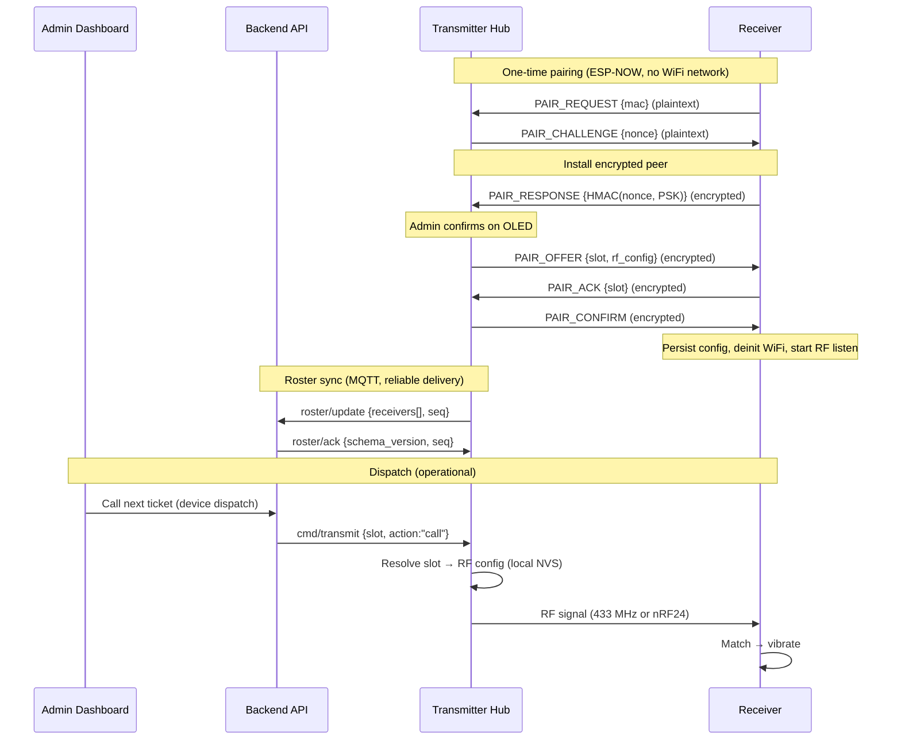
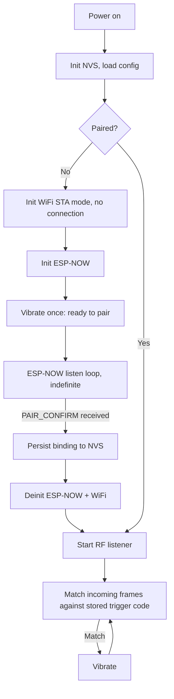
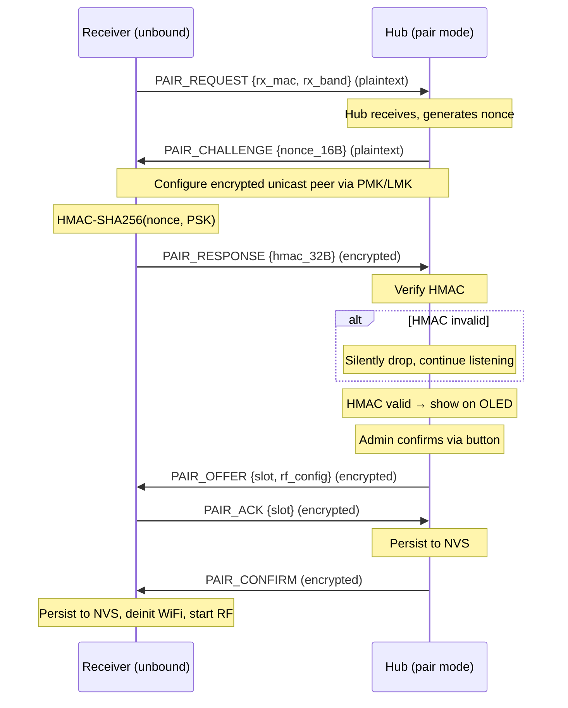

# Local Pairing & Hub-Managed Dispatch

Spec for migrating the receiver dispatch architecture from
server-mediated MQTT provisioning to local ESP-NOW pairing with
hub-managed dispatch. Receivers become passive RF pagers that pair
once with the transmitter hub and never contact the server.

**Date:** 2026-05-30

---

## 1. Problem Statement

The current dispatch architecture has a deep dependency chain for every
RF signal: admin dashboard &rarr; backend API &rarr; Redis election &rarr;
MQTT broker &rarr; transmitter hub WiFi &rarr; RF transmission. Each WiFi
hop (backend &harr; broker, broker &harr; hub) is a failure point.

Observed issues in production:

1. **`election_lost` warnings** &mdash; `TransmitterDispatchService`
   fires `DEVICE_CALL_REQUESTED` after `callNext` moves a ticket to
   CALLED. If the hub's heartbeat liveness key
   (`device:hub:alive:{deviceId}`, 30 s TTL) has expired,
   `TransmitterElectionService.electActive()` returns null. A second
   `election_lost` fires on `DEVICE_STOP_REQUESTED` when the ticket is
   served, even though the CALL dispatch never reached the device.

2. **Stale device-busy keys** &mdash; `handleCalledTicketDispatch`
   writes `device:busy:{deviceId}` with `TICKET_CALLED` TTL (30 min)
   *before* emitting the dispatch event. If election fails, the busy
   key is never cleaned up, making the device appear occupied.

3. **"Send via device" button stays disabled** &mdash; On
   `DEVICE_DISPATCH_FAILED` SSE, the frontend calls
   `fetchDispatchAvailability()`. If the hub is offline at that moment,
   `dispatchReady` becomes `false`. No mechanism re-enables it when the
   hub recovers via heartbeat. The button stays disabled until page
   refresh.

4. **Receiver provisioning complexity** &mdash; Each active receiver
   (ESP32-C3 or ESP-01) requires WiFi credentials, MQTT broker config,
   an enrollment token, a challenge-response activation, and an RF code
   push from the server. This is ~20 source files of firmware and
   multiple server-side services per receiver.

### Root cause

The receiver only needs an RF signal. It has no opinion about where
the signal came from. All the WiFi/MQTT/server machinery exists solely
to deliver an RF code to the hub at dispatch time. If the hub already
knows the RF code, the entire chain from MQTT broker through Redis
election to signed dispatch payloads is unnecessary.

---

## 2. Solution Overview

Move to **local ESP-NOW pairing** between the transmitter hub and
receivers. The hub becomes the owner of the receiver roster and
dispatches locally from cached RF configuration. The server's role
shrinks from per-dispatch orchestrator to roster mirror and lifecycle
coordinator.

### Architecture after migration



### What changes

| Component | Before | After |
|---|---|---|
| Receiver firmware | ~20 source files: WiFi, MQTT, bootstrap, identity, serial provisioning, lifecycle | ~5 source files: ESP-NOW pair loop, NVS, RF listen, vibrator |
| Hub firmware | Receives signed RF payload per dispatch via MQTT | Stores receiver roster in NVS, resolves slot &rarr; RF config locally |
| Backend dispatch | Builds `{rf_code_hex, band, bits, proto_any, signature}` per dispatch | Sends `{slot, action}` for hub-paired receivers |
| RF code on network | Transmitted in every signed dispatch MQTT payload | Never leaves the hub after local pairing |

### What stays unchanged

- **Passive PT2272 receivers** (`RECEIVER_433M_PASSIVE`): Registered
  through the admin dashboard with manual RF code entry. Dispatched via
  the existing `cmd/transmit` path with server-provided RF codes. No
  changes.
- **Hub provisioning**: The transmitter hub still provisions via
  SoftAP/USB, activates through the server, and maintains its MQTT
  connection for commands and heartbeat.
- **Frontend "Send via device" flow**: Admin picks a receiver from a
  list, issues a device-bound ticket, calls next. The device list now
  includes both hub-paired and passive receivers.

---

## 3. Receiver Firmware (New)

The receiver becomes a two-state machine. It is either pairing or
listening. It transitions once in its lifetime (or after a factory
reset).

### 3.1 Boot flow



The receiver blocks in the ESP-NOW listen loop indefinitely until
paired. There is no timeout. After pairing, WiFi is never initialized
again on subsequent boots.

### 3.2 NVS schema

Namespace: `pair`

| Key | NVS type | Size | Description |
|---|---|---|---|
| `slot_id` | `u8` | 1 | Hub-assigned slot number (1-based) |
| `hub_mac` | `blob` | 6 | Hub's WiFi MAC address for ESP-NOW unicast |
| `rf_code` | `blob` | &le;16 | Trigger code: 4 bytes for 433 MHz, 5 bytes for nRF24 address |
| `rf_bits` | `u8` | 1 | Bit width (32 for 433 MHz, 40 for 2.4 GHz) |
| `rf_band` | `u8` | 1 | `0` = 433 MHz, `1` = 2.4 GHz |

### 3.3 Removed modules

The following existing modules are removed entirely from the receiver
firmware (both ESP32-C3 and ESP8266 variants):

- `network/wifi.c` / `wifi.h` &mdash; WiFi STA/SoftAP management
- `network/mqtt.c` / `mqtt.h` &mdash; MQTT client, bootstrap, lifecycle
- `provision/http_server.c` / `http_server.h` &mdash; SoftAP provisioning
- `security/device_identity.c` / `device_identity.h` &mdash; ECDSA keypair, nonce, signing
- `serial/serial_protocol.c` / `serial_protocol.h` &mdash; USB provisioning protocol

### 3.4 Retained modules

- `config/device_config.c` / `device_config.h` &mdash; Rewritten to
  the minimal NVS schema in &sect;3.2. Factory reset erases the `pair`
  namespace and restarts (re-enters ESP-NOW pair loop).
- `rf/rf_data.c`, `rf/rf_receiver.c`, `rf/rf_common.h` &mdash;
  Unchanged (433 MHz ASK decoding).
- `nrf24/nrf24_receiver.c` / `nrf24_receiver.h` &mdash; Unchanged
  (ESP32-C3 only, nRF24 PRX mode).
- `trigger/rf_trigger.c` / `rf_trigger.h` &mdash; Unchanged.
- `trigger/rf_supervisor.c` / `rf_supervisor.h` &mdash; Unchanged.
- `vibrator/vibrator.c` / `vibrator.h` &mdash; Unchanged.

### 3.5 New module: `pair/espnow_pair.c`

Owns the ESP-NOW pairing state machine. Exports:

```c
// Block until paired. Returns ESP_OK when binding is persisted.
// Initializes WiFi (STA, no connection) and ESP-NOW internally.
// Deinitializes both before returning.
esp_err_t espnow_pair_wait(device_config_t *cfg);
```

**Channel scanning:** The receiver does not know which WiFi channel the
hub's STA connection is on. During the pair loop, the receiver cycles
through channels 1&ndash;13, listening for 300 ms on each channel
before advancing to the next. A full scan takes ~3.9 s. The cycle
repeats indefinitely until a hub's `PAIR_CHALLENGE` is received. Once
the receiver locks onto a channel (hub responded), it stays on that
channel for the remainder of the handshake.

```c
for (uint8_t ch = 1; ch <= 13; ch++) {
    esp_wifi_set_channel(ch, WIFI_SECOND_CHAN_NONE);
    // listen 300 ms for PAIR_CHALLENGE
    // if received → lock channel, proceed with handshake
}
// repeat from ch=1
```

### 3.6 ESP-NOW platform abstraction

The ESP-NOW callback signatures differ between platforms:

| Callback | ESP8266 RTOS SDK | ESP-IDF v6.0 (ESP32-C3) |
|---|---|---|
| Receive | `void (*)(const uint8_t *mac_addr, const uint8_t *data, int data_len)` | `void (*)(const esp_now_recv_info_t *info, const uint8_t *data, int data_len)` |
| Send | `void (*)(const uint8_t *mac_addr, esp_now_send_status_t status)` | `void (*)(const esp_now_send_info_t *info, esp_now_send_status_t status)` |

Both platforms share the same init/send/peer API:

```c
esp_err_t esp_now_init(void);
esp_err_t esp_now_send(const uint8_t *peer_addr, const uint8_t *data, size_t len);
esp_err_t esp_now_add_peer(const esp_now_peer_info_t *peer);
esp_err_t esp_now_set_pmk(const uint8_t *pmk);
```

The pairing module uses a thin `#ifdef` shim to normalize both
callbacks into a common `(mac, data, len)` / `(mac, status)` tuple.
This is the only platform-conditional code in the pairing module.

Common constants:

| Constant | Value | Both platforms |
|---|---|---|
| `ESP_NOW_MAX_DATA_LEN` | 250 bytes | Yes |
| `ESP_NOW_ETH_ALEN` | 6 bytes | Yes |
| `ESP_NOW_KEY_LEN` | 16 bytes | Yes |
| `ESP_NOW_MAX_TOTAL_PEER_NUM` | 20 | Yes |
| Max encrypted peers | 6 (ESP8266) / 17 (ESP32-C3) | Differs |

### 3.7 Factory reset

Triggered by a platform-specific mechanism (e.g., holding a GPIO low
during power-on, or a power-cycle sequence). Erases the `pair` NVS
namespace and restarts. The device re-enters the infinite ESP-NOW
pair loop.

Note: The old `serial/serial_protocol.c` (full USB provisioning
protocol) is removed (&sect;3.3). A minimal serial handler for factory
reset may be added if GPIO-based reset is impractical on a given
board, but this is a per-platform decision during implementation.

---

## 4. Hub Pairing Subsystem (New)

The transmitter hub gains three new capabilities: ESP-NOW pairing,
local receiver roster storage, and OLED-driven pairing UI.

### 4.1 Pair mode entry

The admin navigates to Screen 5 (Paired Receivers) via single-click
cycling, then **double-clicks** to enter pair mode. This overrides
the default double-click behavior (jump to dashboard) on Screen 5
only. All other screens retain the default double-click &rarr;
dashboard behavior. The 5 s long-press &rarr; recovery flow remains
unchanged on all screens including Screen 5.

The hub enters pair mode for a configurable window (default 60 s),
shown on the OLED with a countdown. The LED switches to fast blink.

**ESP-NOW lifecycle on the hub:** The hub is already running WiFi STA
(connected to the store's WiFi for MQTT). ESP-NOW runs simultaneously
with STA &mdash; MQTT stays connected throughout pair mode.

1. On pair mode entry: `esp_now_init()` &rarr; `esp_now_set_pmk()`
   &rarr; add broadcast peer. The hub broadcasts on its **current STA
   channel** (whatever the AP assigned).
2. During pair mode: hub listens for `PAIR_REQUEST` messages and
   exchanges the pairing protocol (&sect;4.2).
3. On pair mode exit (timeout, cancel, or successful pair):
   `esp_now_deinit()`. Back to normal MQTT-only operation.

If a receiver responds during the window, the OLED shows the
receiver's MAC and band. The admin confirms with a button press to
accept the pairing. The hub can reject by letting the countdown expire
or pressing the button again to cancel.

### 4.2 Pairing protocol

Six-message handshake over ESP-NOW. `PAIR_REQUEST` and
`PAIR_CHALLENGE` are plaintext bootstrap messages because an unbound
receiver cannot decrypt hub unicast traffic until it learns the hub MAC
and installs the LMK. After the challenge is sent, both sides configure
the encrypted peer with the deployment LMK; `PAIR_RESPONSE`,
`PAIR_OFFER`, `PAIR_ACK`, and `PAIR_CONFIRM` use ESP-NOW CCMP
encryption. All messages use a shared build-time PSK for receiver
verification.

**ESP-NOW channel:** The hub uses its current Wi-Fi channel during pair
mode. Receivers scan the supported 2.4 GHz channels and skip any
channel that `esp_wifi_set_channel()` rejects under the active country
policy. After discovery, peer entries use channel `0` so ESP-NOW follows
the current STA channel.

**Message flow:**



### 4.3 Receiver verification (build-time PSK)

Both the receiver and transmitter firmware share a 32-byte pre-shared
key (PSK) configured via **Kconfig** (`CONFIG_NOTIGUIDE_PAIR_PSK`).
The same Kconfig option exists in both `receiver-esp32/`,
`receiver-esp8266/`, and `transmitter/` projects. Builds for the same
deployment must use the same PSK value.

During pairing, the hub sends a random 16-byte nonce. The receiver
computes `HMAC-SHA256(nonce, PSK)` and returns the 32-byte digest. The
hub verifies independently. This proves the device runs official
firmware built with the matching PSK.

The PSK is identical across all devices of the same deployment.
Combined with the OLED physical-presence confirmation, this provides
sufficient assurance for a store pager system. An attacker would need
to extract the PSK from a firmware dump AND be within ESP-NOW range
(~200 m) AND have the admin confirm the rogue device on the OLED.

**Rejection behavior:** If a device sends a `PAIR_RESPONSE` with an
invalid HMAC (wrong PSK or not a genuine receiver), the hub silently
drops the response and continues listening in pair mode. Pair mode is
not aborted &mdash; a rogue device cannot denial-of-service the
pairing window. The OLED confirm overlay is only shown after
successful HMAC verification.

ESP-NOW's built-in CCMP encryption (AES-128 via PMK/LMK) protects the
post-challenge pairing messages in transit. The plaintext bootstrap
messages carry only receiver metadata and nonce material; the PSK is
never sent over the air, and the encrypted `PAIR_RESPONSE` authenticates
the receiver before any RF code is offered.

### 4.4 RF config assignment

The hub decides what RF configuration the receiver gets, based on the
band reported in `PAIR_REQUEST`:

**433 MHz receivers:**
- Hub generates a random 32-bit code (4 bytes).
- The `PAIR_OFFER` includes `{rf_code: [4 bytes], rf_bits: 32}`.
- The receiver stores this as its trigger pattern for 433 MHz ASK
  frame matching.

**2.4 GHz receivers (nRF24):**
- Hub generates a random 5-byte nRF24 RX address.
- The `PAIR_OFFER` includes `{rf_code: [5 bytes], rf_bits: 40, nrf24_channel, nrf24_data_rate}`.
- The receiver configures its nRF24 PRX pipe with this address.

The hub stores the same RF config in its own NVS so it can transmit to
the receiver without server involvement.

**Receiver naming:** The hub generates a default name based on the
slot number (e.g., `RX-01`, `RX-02`) and stores it in NVS
(`rx_{slot}_name`). This default name is included in the roster sync
to the backend and appears in the admin dashboard. The admin can
rename the device from the dashboard at any time &mdash; the backend
pushes the new label to the hub via `cmd/label` (&sect;7.5), and the
hub updates its NVS. The receiver device itself never knows its
name.

**Forbidden pattern check (hub-side):** The backend currently rejects
degenerate RF codes via `RfCodeForbiddenSet` (e.g., all-same-nibble
for 433 MHz, low-entropy patterns for nRF24). Since RF codes are now
generated on the hub, the hub must implement equivalent checks when
generating random codes during pairing. Specifically:
- 433 MHz: reject codes where all hex nibbles are identical (e.g.,
  `0x11111111`, `0xAAAAAAAA`).
- nRF24: reject all-zero, all-one, and low-transition addresses.
If the generated code is rejected, regenerate until a valid code is
produced.

### 4.5 Hub NVS roster storage

Namespace: `roster`

| Key pattern | NVS type | Description |
|---|---|---|
| `rx_count` | `u8` | Number of paired receivers (max 32) |
| `rx_{slot}_mac` | `blob(6)` | Receiver's WiFi MAC address |
| `rx_{slot}_band` | `u8` | `0` = 433 MHz, `1` = 2.4 GHz |
| `rx_{slot}_code` | `blob(&le;16)` | Assigned RF trigger code or nRF24 address |
| `rx_{slot}_bits` | `u8` | Bit width (32 for 433 MHz, 40 for 2.4 GHz) |
| `rx_{slot}_name` | `string(&le;96)` | Admin-assigned label (set via backend) |
| `rx_{slot}_at` | `i64` | Pairing timestamp (epoch ms) |
| `roster_seq` | `u32` | Monotonic sequence number for roster sync |
| `roster_pending` | `u8` | `1` if a roster update is awaiting backend ACK |

Slot numbers are 1-based, allocated sequentially, and reused after
unpairing.

### 4.6 Unpairing

Unpairing is managed from the **admin dashboard**, not the OLED
(the hub button's long-press is reserved for the recovery/factory-
reset flow and cannot be reused). The admin deletes a hub-paired
device from the device management page. The backend publishes a
`cmd/unpair` message to the hub:

**Topic:** `{prefix}/transmitter/hub/{publicId}/cmd/unpair`

```json
{
  "schema_version": 1,
  "slot": 3
}
```

On receipt, the hub erases the slot's NVS keys, decrements
`rx_count`, increments `roster_seq`, sets `roster_pending = 1`, and
publishes a roster update to the backend confirming removal.

The receiver itself is unaware it has been unpaired. It continues
listening on RF but will no longer receive signals for its trigger
code. Factory-resetting the receiver clears its NVS binding and puts
it back in the ESP-NOW pair loop for re-pairing.

### 4.7 OLED UI (128&times;64 monochrome, SSD1306)

Follows the existing OLED conventions from
`docs/done/Transmitter OLED, Button & LED Plan.md`: fixed 12 px
status bar at top, 52 px content area below. LVGL 8.3 labels with
fixed `lv_obj_set_pos()` positioning.

**Real-device layout constraints** (verified from deployed hardware):
the monospace font fits ~26&ndash;28 characters per line. The content
area accommodates 5 visible rows comfortably; a 6th row is partially
clipped. All mockups below are designed to fit within these
constraints. Long names are truncated with ellipsis on the display.

**Required fix &mdash; status bar spacing:** The `ACTIVE` state label
and the uptime clock currently render with no gap (e.g.,
`ACTIVE00:01`). This must be fixed in `display_screens.c` as part of
this rework: either shorten the state label (e.g., `ACT` / `SUS` /
`DEC`) or adjust the label x-positions to guarantee at least 1
character gap before the right-aligned time field.

#### Screen 5 &mdash; Paired Receivers (new, added to button cycle)

```
· MQTT ⌃ WiFi ACTIVE 00:42
───────────────────────────
Receivers         3/32
1:Table 3       433M  ●
2:Counter A     2.4G  ●
3:RX-03         433M  ○
```

- Header row shows count and max (compact, no extra spacing).
- Each row: slot, name (truncated if &gt;10 chars), band, status dot
  (`●` = dispatched within 60 s, `○` = idle).
- If more than 3 receivers paired, single-click pages through groups
  of 3. Header shows page indicator (e.g., `1/4 3/32`).
- If no receivers paired, show `No receivers` centered.

**Data sources:** All from hub NVS roster. Names come from either the
hub-generated default (`RX-01`) or admin-assigned labels pushed via
`cmd/label` (&sect;7.5).

#### Pair Mode Overlay (transient, auto-shown)

Appears when the admin enters pair mode from Screen 5 via
double-click. Replaces the content area.

```
· MQTT ⌃ WiFi ACTIVE 00:42
───────────────────────────
◉ Pair Mode
Scanning...           0:45

Press to cancel
```

- Countdown timer (configurable, default 60 s).
- Single-click cancels pair mode and returns to Screen 5.
- LED switches to `LED_PATTERN_FAST_BLINK` during pair mode.

#### Pair Confirm Overlay (transient, auto-shown)

Appears when a receiver responds during pair mode. Replaces the pair
mode content.

```
· MQTT ⌃ WiFi ACTIVE 00:42
───────────────────────────
Receiver found!
AA:BB:CC:DD:EE:FF
Band:433M   Slot:4
Click=pair  Wait=skip
```

- Single-click confirms pairing (sends `PAIR_OFFER`, continues
  protocol).
- If no button press within 10 s, the receiver is skipped and pair
  mode continues listening for another receiver.
- On successful pair, brief `Paired! Slot 4` toast (2 s), then
  return to Screen 5.

### 4.8 Hub module layout

New files added to `transmitter/main/`:

| File | Responsibility |
|---|---|
| `pair/espnow_pair.c` / `.h` | ESP-NOW init, pair-mode state machine, PSK verification |
| `pair/roster.c` / `.h` | NVS roster CRUD, slot allocation, roster read for dispatch |
| `pair/roster_sync.c` / `.h` | MQTT roster publish, ACK handling, retry timer |

Existing files modified:

| File | Change |
|---|---|
| `dispatch/dispatch.c` | Extend `dispatch_handle_transmit_json()` to detect and handle slot-based payloads |
| `display/display_screens.c` | Add pair-mode screen, receiver list screen |
| `controls/controls.c` | Override double-click on Screen 5 to enter pair mode; add single-click handler for pair confirm/cancel overlays |
| `network/mqtt.c` | Subscribe to `roster/ack`, `cmd/label`, and `cmd/unpair` topics post-activation. No new dispatch subscription needed (slot payloads arrive on existing `cmd/transmit`). |

---

## 5. Roster Sync Protocol

The hub publishes its receiver roster to the backend via MQTT. Sync is
event-driven (not periodic) with reliable delivery via ACK/retry.

### 5.1 Topics

| Direction | Topic | QoS |
|---|---|---|
| Hub &rarr; Backend | `{prefix}/transmitter/hub/{publicId}/roster/update` | 1 |
| Backend &rarr; Hub | `{prefix}/transmitter/hub/{publicId}/roster/ack` | 1 |

Where `{prefix}` is the configured MQTT topic prefix (default:
`notiguide`).

### 5.2 Roster update payload

```json
{
  "schema_version": 1,
  "seq": 3,
  "receivers": [
    {
      "slot": 1,
      "band": "433M",
      "label": "Table 3",
      "paired_at": "2026-05-30T10:00:00Z"
    },
    {
      "slot": 2,
      "band": "2_4G",
      "label": null,
      "paired_at": "2026-05-30T10:05:00Z"
    }
  ]
}
```

### 5.3 ACK payload

The ACK is signed with the backend's ECDSA key (P-256,
SHA256withECDSA) &mdash; the same key used for `cmd/transmit` and
`cmd/deact`. The hub verifies the signature using the pinned backend
public key (`CONFIG_TRANSMITTER_BACKEND_PUBKEY_B64`) via the existing
`device_identity_verify_text()` function before clearing
`roster_pending`.

```json
{
  "schema_version": 1,
  "seq": 3,
  "issued_at": "2026-05-30T12:00:01Z",
  "signature_b64": "base64..."
}
```

**Signature canonical:**

```
roster-ack-v1|{hubPublicId}|{seq}|{issuedAt}
```

This reuses the existing ECDSA signing infrastructure on the backend
(`DeviceCommandSigner`) and existing verification on the hub. No new
crypto code is needed.

### 5.4 Retry logic (hub-side)

1. After publishing a roster update, start a retry timer (30&ndash;60 s
   configurable via Kconfig).
2. If no ACK matching the current `seq` arrives before timeout,
   republish the same payload with the same `seq`.
3. Retry indefinitely with the timer period as the interval. No
   exponential backoff (the roster is small and infrequent).
4. On boot, if `roster_pending == 1` in NVS, republish immediately
   after MQTT connects.
5. On ACK received: verify the ECDSA signature via
   `device_identity_verify_text()`. If valid, clear `roster_pending`
   in NVS and stop the retry timer. If invalid, ignore the ACK (retry
   will fire).

### 5.5 Backend roster processing

The backend subscribes to `roster/update` and publishes the ACK back
to `roster/ack` after processing:

1. Parse the roster payload.
2. Upsert device records in PostgreSQL for each receiver in the
   roster (see &sect;7.2).
3. Remove any device records whose slot no longer appears (device was
   unpaired from the hub).
4. Publish the ACK with the received `seq` to the hub's `roster/ack`
   topic.

### 5.6 Idempotency

The backend uses `seq` for duplicate detection. If it receives a
roster update with a `seq` it has already processed (hub retried), it
re-publishes the ACK without re-processing. The last processed `seq`
per hub is stored in a column on the `device` table for the hub
record, or in Redis as a lightweight key
(`hub:{hubDeviceId}:roster_seq`).

---

## 6. Dispatch Protocol (New Slot-Based Path)

Hub-paired receivers use a new lightweight payload shape on the
**same `cmd/transmit` topic**. The hub distinguishes between the two
payload formats by checking for the presence of `slot` (hub-paired)
vs `rf_code_hex` (server-managed passive). No new MQTT topic is
needed.

### 6.1 Slot-based dispatch payload

**Topic:** `{prefix}/transmitter/hub/{publicId}/cmd/transmit` (existing topic)

**Payload:**

```json
{
  "schema_version": 1,
  "dispatch_id": "a1b2c3d4-...",
  "slot": 2,
  "action": "call",
  "issued_at": "2026-05-30T12:00:00Z",
  "signature_b64": "base64..."
}
```

**Actions:**
- `call` &mdash; Activate the receiver (vibrate).
- `stop` &mdash; Deactivate the receiver. Used when a ticket is served,
  cancelled, or no-showed. Both 433 MHz and nRF24 receivers use toggle
  semantics (`vibrator_toggle_pulsing`) &mdash; the hub re-transmits the
  same RF code/packet to toggle the vibrator off. No separate detoggle
  code is needed for hub-paired receivers. (The PT2272 toggle/detoggle
  channel byte in `DeviceCommandSigningProperties` is only used for
  passive receivers on the existing `cmd/transmit` path.)

### 6.2 Signature canonical

```
dispatch-v1|{hubPublicId}|{dispatchId}|{slot}|{action}|{issuedAt}
```

The hub verifies this signature using its stored backend public key,
the same ECDSA verification used for the existing `cmd/transmit` path.

### 6.3 Hub dispatch handling

The existing `dispatch_handle_transmit_json()` in `dispatch/dispatch.c`
is extended to detect the payload format:

1. Parse the JSON root. If `slot` field is present, handle as
   slot-based dispatch. If `rf_code_hex` is present, handle as the
   existing full-payload dispatch.
2. **Slot-based path:**
   a. Verify signature using `dispatch-v1|...` canonical (&sect;6.2).
   b. Look up slot in NVS roster &rarr; get `rf_code`, `rf_bits`,
      `rf_band`.
   c. If slot not found or roster empty: reject with
      `"slot_not_found"`.
   d. Transmit via `radio_tx_send()` (same as today).
   e. Publish ACK on the existing `ack` topic with
      `ack_for: "transmit"`.
3. **Full-payload path:** Existing logic, unchanged.

### 6.4 Dispatch path selection (backend)

`TransmitterDispatchService` determines which path based on whether
the device has a `hub_slot`:

| Condition | Dispatch path |
|---|---|
| `hubSlot != null` | Build slot-based payload with `{slot, action}`. No RF code lookup needed. |
| `hubSlot == null` | Build full payload with RF code from `device_rf_code` table (existing path for passive receivers). |

### 6.5 Coexistence on single topic

Both payload formats share the same `cmd/transmit` MQTT topic, the
same `radio_tx_send()` function, the same dispatch ring, and the same
ACK publisher. The hub distinguishes payloads by JSON field presence:

- `slot` field present &rarr; slot-based dispatch (hub-paired
  receivers).
- `rf_code_hex` field present &rarr; full-payload dispatch (passive
  receivers, existing path).

---

## 7. Backend Changes

### 7.1 Schema changes

**New columns on `device` table:**

```sql
ALTER TABLE device ADD COLUMN hub_slot SMALLINT;
ALTER TABLE device ADD COLUMN last_roster_seq INT;
```

- `hub_slot` &mdash; Populated for hub-paired receivers only. Stores
  the slot number assigned by the hub during pairing. When
  `hub_slot IS NOT NULL`, the device is hub-paired; when `NULL`, it is
  server-managed. This replaces the need for a separate
  `hub_slot` column.
- `last_roster_seq` &mdash; Populated for `TRANSMITTER_HUB` devices
  only. Stores the last processed roster `seq` for idempotent sync.

**No changes** to `device_kind` enum, `device_hardware_model` enum, or
`device_rf_code` table. Hub-paired receivers use existing kinds
(`RECEIVER_433M`, `RECEIVER_2_4G`) distinguished by `hub_slot`
presence.

### 7.2 Entity changes

`Device` entity gains two nullable fields:

```kotlin
@Column("hub_slot")
val hubSlot: Short? = null,

@Column("last_roster_seq")
val lastRosterSeq: Int? = null
```

A device is hub-paired when `hubSlot != null`. No separate
registration source field is needed.

### 7.3 Roster listener

New handler in `TransmitterOperationalListener` (or a new
`RosterSyncListener` component):

1. Subscribe to `{prefix}/transmitter/hub/+/roster/update`.
2. On message:
   a. Parse roster payload, validate `schema_version == 1`.
   b. Resolve the hub device from the topic's `publicId`.
   c. Check `last_roster_seq` on the hub record. If `seq &le;
      last_roster_seq`, re-ACK without processing.
   d. For each receiver in the roster:
      - Find existing device by `hub_slot` and `storeId` (hub's store).
      - If exists: update `assignedName` from label, update
        `lastSeenAt`.
      - If not exists: insert new `Device` with `kind` derived from
        `band` (`433M` &rarr; `RECEIVER_433M`, `2_4G` &rarr;
        `RECEIVER_2_4G`), `hubSlot = slot`, `status = ACTIVE`,
        `storeId` = hub's store.
   e. Delete any device records in this store where `hub_slot IS NOT
      NULL` and the `hubSlot` value is not in the received roster
      (unpaired devices).
   f. Update `last_roster_seq = seq` on the hub record.
   g. Sign the ACK using `DeviceCommandSigner` with canonical
      `roster-ack-v1|{hubPublicId}|{seq}|{issuedAt}`.
   h. Publish the signed ACK to
      `{prefix}/transmitter/hub/{publicId}/roster/ack`.

### 7.4 Dispatch service changes

**`TransmitterDispatchService.handle()`** &mdash; Currently builds a
`TransmitEnvelope` with `{rf_code_hex, band, bits, proto_any,
signature}` for every dispatch. After migration:

1. Load the device record for `event.deviceId`.
2. If `hubSlot != null` (hub-paired):
   - Build a `SlotDispatchEnvelope` with `{slot, action, signature}`.
   - Sign using `dispatch-v1|...` canonical (&sect;6.2).
   - Publish to `cmd/transmit` topic (same topic, different payload
     shape).
   - Skip `DeviceRfCodeRepository.findDecryptedPayload()` entirely.
3. If `hubSlot == null` (server-managed / passive):
   - Follow the existing full RF code `cmd/transmit` path unchanged.

**`DeviceDispatchService.getAvailableDevices()`** &mdash; No change to
the query logic. Hub-paired receivers appear in the list alongside
passive receivers. The `isBusy()` check and `isDispatchableDevice()`
filter work identically (both use `device.status`, `device.storeId`,
`device.kind`).

### 7.5 Receiver label push

**Topic:** `{prefix}/transmitter/hub/{publicId}/cmd/label`

**Payload:**

```json
{
  "schema_version": 1,
  "slot": 2,
  "label": "Table 5"
}
```

When an admin renames a hub-paired receiver in the dashboard:

1. Backend updates `device.assigned_name` in PostgreSQL.
2. Backend publishes the label command to the hub's `cmd/label` topic.
3. Hub updates the label in NVS (`rx_{slot}_name`).

No signature required &mdash; label changes are non-security-critical
and the MQTT connection is already authenticated.

### 7.6 Services unchanged

- `PassiveDeviceRegistrationService` &mdash; Unchanged. Passive
  receivers are still registered through the admin dashboard.
- `DeviceActivationService` &mdash; Unchanged for hub activation. No
  longer called for hub-paired receivers (they never activate through
  the server).
- `RfCodeService` &mdash; Unchanged. Only used for server-provisioned
  and passive devices.
- `DeviceLifecycleService` &mdash; Unchanged for hubs. Hub-paired
  receiver lifecycle is managed through the hub (unpair = decommission).

---

## 8. Frontend Changes

Minimal changes to the admin dashboard.

### 8.1 Device list

Add a visual indicator on device cards/rows distinguishing hub-paired
devices (`hubSlot != null`) from server-managed ones. Hub-paired
devices cannot have their RF code edited or rotated (it is managed
locally on the hub).

### 8.2 "Send via device" dialog

No change. `getAvailableDevices()` returns all dispatchable receivers
regardless of whether they are hub-paired or server-managed. The
dialog works identically.

### 8.3 Pairing management

Pairing is a physical action at the hub (button + OLED). The web
dashboard does not initiate pairing. It shows the result (roster) as
device records after the hub syncs.

### 8.4 Device rename

The existing device rename endpoint in `DeviceAdminController` is
extended: after updating the DB, if the device has `hubSlot != null`,
publish a `cmd/label` MQTT message to the hub (&sect;7.5).

---

## 9. Device Taxonomy (Post-Migration)

| Kind | `hub_slot` | Pairing method | Dispatch path | Server involvement |
|---|---|---|---|---|
| `RECEIVER_433M_PASSIVE` | `NULL` | Admin dashboard (manual RF code entry) | `cmd/transmit` full payload (server provides RF code) | Full: server stores RF code, builds signed payload |
| `RECEIVER_433M` | set | ESP-NOW local pair | `cmd/transmit` slot payload (hub resolves locally, 32-bit code) | Roster mirror only |
| `RECEIVER_2_4G` | set | ESP-NOW local pair | `cmd/transmit` slot payload (hub resolves locally, nRF24 address) | Roster mirror only |
| `TRANSMITTER_HUB` | `NULL` | Server provisioning (SoftAP + MQTT bootstrap) | N/A | Full: server manages lifecycle |

`RECEIVER_433M` and `RECEIVER_2_4G` are existing `DeviceKind` values.
After migration, new records of these kinds will have `hub_slot`
populated. Legacy records with `hub_slot = NULL` may still exist from
previous firmware. They are not dispatchable after the receiver
firmware is reflashed. Mark as `DECOMMISSIONED` during migration.

---

## 10. Sub-project Decomposition

This spec covers a large architectural change. Implementation is split
into five sub-projects, each with its own plan cycle.

| # | Sub-project | Depends on | Scope |
|---|---|---|---|
| 1 | Receiver firmware rewrite | None | New minimal firmware for both ESP32-C3 and ESP8266: ESP-NOW pair loop, NVS binding, RF listen, vibrate. Remove WiFi/MQTT/bootstrap/identity. |
| 2 | Hub pairing subsystem | #1 (for end-to-end testing) | ESP-NOW pair mode, PSK verification, NVS roster CRUD, OLED pairing UI, button callbacks. |
| 3 | Hub roster sync + slot dispatch | #2 | MQTT roster publish with ACK/retry, slot-based payload handling in `dispatch.c`, `cmd/label` handler, dispatch ring integration. |
| 4 | Backend refactoring | #3 (to test end-to-end) | `hub_slot` schema migration, roster listener, slot-based dispatch in `TransmitterDispatchService`, label push, signed roster ACK. |
| 5 | Frontend adjustments | #4 | Hub-paired badge on device list, suppress RF code editing for hub-paired devices, label push on rename. |

---

## 11. Migration Path

1. **Reflash receivers** with new firmware. Old firmware is
   incompatible (no WiFi/MQTT). This is a clean break.
2. **Update hub firmware** with pairing + roster sync + slot dispatch.
   The hub keeps backward compatibility: it handles both `cmd/transmit`
   (both payload formats use the same `cmd/transmit` topic for
   receivers).
3. **Deploy backend** with schema migration and new dispatch path. Old
   `RECEIVER_433M` / `RECEIVER_2_4G` records with
   `hub_slot = NULL`) should be marked `DECOMMISSIONED`.
4. **Deploy frontend** with hub-paired indicators.
5. **Pair receivers** at the hub. New device records appear in the
   dashboard via roster sync.

---

## 12. Security Considerations

| Concern | Mitigation |
|---|---|
| Rogue device pairing | Build-time PSK + HMAC verification + OLED physical confirmation |
| RF code interception during pairing | ESP-NOW CCMP encryption (AES-128 via PMK/LMK) protects all post-challenge pairing messages; plaintext bootstrap messages carry no RF code |
| RF code never on network | After local pairing, RF codes exist only in hub NVS and receiver NVS. Never transmitted over MQTT or stored in PostgreSQL for hub-paired devices. |
| Hub NVS as single source of truth | If hub NVS corrupts, all pairings are lost. Mitigation: backend stores the roster as a mirror (slot + band + label). Re-pairing is physical but straightforward. |
| PSK extraction from firmware dump | Acceptable risk for a store pager system. Can be hardened later with ESP32-C3 secure boot + flash encryption if needed. |
| Slot dispatch signature verification | Same ECDSA verification as existing `cmd/transmit`. The canonical format changes but the crypto is identical. |

---

## 13. References

### Codebase (current state)

| File | Role in current architecture |
|---|---|
| `backend/.../TransmitterDispatchService.kt` | Builds signed RF payload, publishes `cmd/transmit` via MQTT |
| `backend/.../TransmitterElectionService.kt` | Redis-based hub liveness election (`device:hub:alive:{id}`, 30 s TTL) |
| `backend/.../DeviceDispatchService.kt` | Pre-dispatch checks, busy key, ticket issuance |
| `backend/.../DeviceDispatchEventBroadcaster.kt` | Reactor Sinks.Many for dispatch events |
| `backend/.../TransmitterOperationalListener.kt` | MQTT heartbeat/ack handler, hub liveness |
| `backend/.../PassiveDeviceRegistrationService.kt` | Admin dashboard passive device registration (PT2272, 16-bit code) |
| `backend/.../entity/Device.kt` | Device entity (no `hub_slot` yet) |
| `backend/.../types/DeviceKind.kt` | `RECEIVER_433M`, `RECEIVER_433M_PASSIVE`, `RECEIVER_2_4G`, `TRANSMITTER_HUB` |
| `backend/.../types/DeviceHardwareModel.kt` | `ESP_01`, `ESP32_C3`, `PT2272` |
| `backend/.../db/schema.sql` | `device` and `device_rf_code` tables |
| `transmitter/main/dispatch/dispatch.c` | `dispatch_handle_transmit_json()`, signature verification, dispatch ring |
| `transmitter/main/dispatch/radio_supervisor.c` | `radio_tx_send()` &mdash; dual-band RF transmit |
| `transmitter/main/controls/controls.c` | Button callbacks, LED pattern engine |
| `transmitter/main/config/device_config.h` | Hub NVS schema (provisioning, activation, lifecycle) |
| `receiver-esp32/main/main.c` | Receiver boot orchestration (WiFi &rarr; MQTT &rarr; bootstrap &rarr; RF) |
| `receiver-esp8266/main/main.c` | ESP8266 receiver boot orchestration (same pattern) |
| `web/src/app/[locale]/dashboard/queue/page.tsx` | "Send via device" button, `dispatchReady` state, SSE handling |
| `web/src/features/queue/device-dispatch-dialog.tsx` | Device selection dialog for dispatch |

### Implementation plans

| # | Plan | Scope | Status |
|---|------|-------|--------|
| 1 | `docs/done/Receiver ESP32-C3 Local Pairing Plan.md` | ESP-NOW pair loop, NVS binding, RF listen (433 MHz + nRF24), vibrate. Removes WiFi/MQTT/bootstrap/identity. | Done |
| 2 | `docs/done/Receiver ESP8266 Local Pairing Plan.md` | Same two-state machine as #1 adapted for ESP8266 RTOS SDK. 433 MHz only. | Done |
| 3 | `docs/done/Transmitter Local Pairing & Roster Plan.md` | ESP-NOW pair host, NVS roster CRUD, MQTT roster sync with signed ACK, slot-based dispatch, OLED pairing UI, strategic logging. | Done |
| 4 | `docs/planned/Backend & Frontend Local Pairing Plan.md` | `hub_slot` schema migration, `RosterSyncListener`, slot-based dispatch in `TransmitterDispatchService`, label push, unpair command, frontend hub-paired indicators. | Planned |

### External documentation

- [ESP-NOW API &mdash; ESP-IDF v6.0 (ESP32-C3)](https://docs.espressif.com/projects/esp-idf/en/release-v6.0/esp32c3/api-reference/network/esp_now.html)
- [ESP-NOW header &mdash; ESP8266 RTOS SDK](https://github.com/espressif/ESP8266_RTOS_SDK/blob/master/components/esp8266/include/esp_now.h)
- [ESP-NOW example &mdash; ESP8266 RTOS SDK](https://github.com/espressif/ESP8266_RTOS_SDK/tree/master/examples/wifi/espnow)
