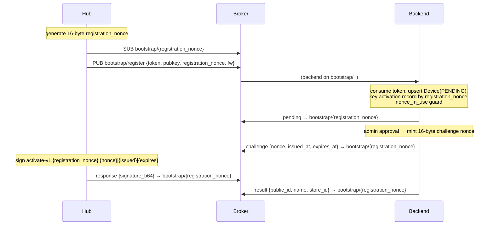

# MQTT Bootstrap Re-Key & Transmitter-Side Signing Spec

**Status:** Design approved (brainstorming), pending implementation plan
**Date:** 2026-07-09
**Scope:** Backend (`domain/device`, `core/device`, `core/redis`) + transmitter firmware (`transmitter/main/network/mqtt.c`, `heartbeat.c`, ack publish sites). No web/client-web changes.

---

## 1. Summary

Two independent-but-cohesive hardening changes to the **backend ↔ transmitter-hub** MQTT channel:

- **Part A — Bootstrap topic re-keying.** Replace the backend-minted `challenge_id` with the hub-generated `registration_nonce` as the bootstrap reply-topic identifier. The hub knows its `registration_nonce` before it publishes `register`, so it subscribes to its own reply topic (`bootstrap/{registration_nonce}`) from the start and **never subscribes to the shared `bootstrap/+` wildcard**. `challenge_id` ceases to exist system-wide.
- **Part B — Transmitter-side signing.** The hub signs its device→backend messages (`roster/update`, `ack`, `heartbeat`) with its EC P-256 private key; the backend verifies against the per-device public key it already stores. This gives the hub keypair a durable operational purpose beyond one-time activation and closes the device→backend authenticity gap (notably, liveness/election spoofing).

Both ship as a **hard cutover**: this is dev-phase, every hub is reflashed, backend + firmware deploy in lockstep. **No backward-compatibility / dual-path code, and no version bumps** — all version tags stay `v1` (`activate-v1`, `schema_version = 1`), with the contract tightened in place.

---

## 2. Motivation

- The hub currently subscribes to `bootstrap/+` and receives **every** hub's `register` (which carries enrollment tokens) and `pending`/`challenge`, filtering by `registration_nonce` in firmware. This is unnecessary subscription scope + processing burden, and it exposes other hubs' bootstrap traffic to any bootstrapping hub. Re-keying the reply topic to `registration_nonce` lets the hub subscribe only to its own topic.
- The hub keypair is currently used **only** for the one-time activation challenge; after activation it is referenced nowhere. Device→backend messages (`roster/update`, `ack`, `heartbeat`) are unsigned, so their authenticity rests entirely on the broker knowing who published — which the backend, as a subscriber, cannot see (MQTT does not forward the publisher's client-id). Signing gives the keypair an ongoing role and lets the backend cryptographically authenticate each message.

---

## 3. Goals / Non-Goals

**Goals**
- Hub subscribes only to `bootstrap/{registration_nonce}` during bootstrap; no wildcard subscription on the device.
- Remove `challenge_id` from the entire system (topic, Redis keys, canonical string, envelope bodies, firmware state).
- Hub signs `roster/update`, `ack`, `heartbeat`; backend verifies and drops unverified messages.
- No version bumps; `v1` tags and `schema_version = 1` retained.

**Non-Goals**
- Broker-ACL-enforced topic isolation / per-device broker credentials (Part A isolation is obscurity-based; see §4.5). Out of scope.
- Signing `cluster/roster` (hub↔hub): peers do not hold each other's keys; hub-to-hub election integrity is a separate trust model. Out of scope.
- Backward compatibility with unsigned/legacy firmware (hard cutover).

---

## 4. Part A — Bootstrap topic re-keying

### 4.1 Topic scheme

`pending` / `challenge` / `result` / `rejected` (backend→hub) and `response` (hub→backend) move from `bootstrap/{challenge_id}` to **`bootstrap/{registration_nonce}`**. The shared inbox `bootstrap/register` is unchanged (backend-subscribe path).



### 4.2 `registration_nonce`

- Firmware generates **16 random bytes** (128-bit, `SecureRandom`-equivalent), encoded **base64url without padding** (22 chars, alphabet `[A-Za-z0-9-_]` — MQTT-topic-safe: no `/`, `+`, `#`).
- Backend validation floor raised from ≥8 bytes to **≥16 bytes** (`DeviceRegistrationService.isValidRegistrationNonce`).

### 4.3 `challenge_id` removal — blast radius

| File | Change |
|---|---|
| `core/device/DeviceCanonical.kt` | `activate(...)` keeps the **`activate-v1`** name; first field `challengeId: UUID` → `registrationNonce: String` |
| `core/redis/RedisKeyManager.kt` | `deviceActivation(challengeId)` → keyed by `registrationNonce`: `device:activation:{registration_nonce}` |
| `domain/device/redis/DeviceActivationByDeviceRecord.kt` | `challengeId: UUID` → `registrationNonce: String` (deviceId→session pointer used by approve/reject) |
| `domain/device/service/DeviceRegistrationService.kt` | Remove `challengeId = UUID.randomUUID()`; key activation by `registration_nonce`; add **`nonce_in_use`** collision guard; nonce floor ≥16B |
| `domain/device/service/DeviceApprovalService.kt` | `readActivationByDevice`→`readActivationRecord` chain uses `registrationNonce`; `publishChallenge(...)` targets `bootstrap/{registration_nonce}`. **Approval stays keyed by `deviceId`** |
| `domain/device/service/DeviceActivationService.kt` | `onResponse(payload, registrationNonce)` (from topic); verify `activate-v1\|{registrationNonce}\|{nonce}\|…`; use new `DeviceSignatureVerifier` (Part B) |
| `core/device/DeviceMqttPublisher.kt` | All bootstrap publishes target `bootstrap/{registration_nonce}`; **strip `registration_nonce` echo from `pending`+`challenge` bodies**; remove any `challenge_id` from `result`/`rejected` bodies |
| `domain/device/listener/TransmitterBootstrapListener.kt` | Route `response` by `registration_nonce` parsed from topic; keep `bootstrap/+` subscription |
| `domain/device/listener/DeviceBootstrapListener.kt` | Mirror the same (unused receiver path, kept consistent) |
| `transmitter/main/network/mqtt.c` | Subscribe `bootstrap/{registration_nonce}` upfront (no `+`/narrow); drop `challenge_id`/`challenge_topic` session state; sign `activate-v1\|{registration_nonce}\|…`; `pending`/`challenge`/`result` handlers no longer read/echo `challenge_id` |

### 4.4 `activate-v1` canonical (unchanged name, changed first field)

```
activate-v1|{registration_nonce}|{nonce}|{issued_at}|{expires_at}
```
Where `nonce` is the backend-minted **16-byte challenge nonce** (base64url, generated at approval), and `issued_at`/`expires_at` are ISO-8601 `Instant`s. `registration_nonce` (client-generated handle) replaces the former `challenge_id` (server UUID).

### 4.5 `nonce_in_use` collision guard

`registration_nonce` is client-chosen, so it is not collision-proof by construction the way a server-minted `challenge_id` was. In `onRegister`, **before consuming the enrollment token**, if an **unexpired** activation record already exists for the presented `registration_nonce`, publish `rejected` with reason **`nonce_in_use`** (on `bootstrap/{registration_nonce}`) and return **without consuming the token**.

The pre-consume ordering is load-bearing: the enrollment token is single-use, so rejecting *after* consumption would leave the hub unable to retry (its token would already be spent → `invalid_token`). Rejecting *before* consumption lets the hub retry with a fresh nonce and re-present the same token (§4.9). The existence check is a plain `GET` (no reservation) — at 128-bit nonce entropy the check-then-write race is negligible, and avoiding a `SET NX` reservation prevents an unauthenticated `register` from parking Redis keys. Impact of any collision is bounded regardless: the authoritative device identity remains `deviceId`↔`publicKeyDer` (the device row is keyed by public key), and `registration_nonce` is only the transient client-facing handle.

### 4.6 Envelope body changes

Because every backend→hub bootstrap message is now delivered on the hub's own `bootstrap/{registration_nonce}` topic, the in-body `registration_nonce` echo (previously used for wildcard filtering) is redundant:

- `pending`: strip `registration_nonce` and `challenge_id`. Becomes a minimal "registered, pending approval" status signal.
- `challenge`: strip `registration_nonce` and `challenge_id`. Carries only `type`, `nonce` (16-byte challenge), `issued_at`, `expires_at`.
- `result` / `rejected`: strip `challenge_id`.
- `response` (hub→backend): carries `type` + `signature_b64` only.

### 4.7 Web Serial path — no changes required

The web frontend has **zero** `challenge_id` references. USB provisioning writes creds over serial and triggers auto-approval **by `deviceId`** (`POST /api/devices/{id}/approve`), the same entry point as manual approval — both flow through `DeviceApprovalService.approve(deviceId, …)`, which resolves the activation session by `deviceId` and never exposes `challenge_id` to the client. Updating that shared service (§4.3) is sufficient; nothing Web-Serial-specific breaks.

### 4.8 Security note (honest caveat)

The hub no longer receives any other hub's bootstrap traffic (no cross-hub `register`/token exposure, no filtering burden). Isolation here is **obscurity-based** (128-bit unguessable topic), **not** broker-ACL-enforced. Full per-tenant enforcement would require per-device broker credentials + `read resp/%c`-style ACLs, which are explicitly out of scope. Token-harvesting is closed because devices no longer subscribe to any shared topic; the `register` inbox remains a backend-subscribe path.

### 4.9 `nonce_in_use` auto-retry (firmware)

A `nonce_in_use` rejection is self-healing on the hub. The firmware generates a **fresh** `registration_nonce` on every register attempt, so self-collision cannot occur; `nonce_in_use` only arises from a (astronomically rare) cross-device collision or an adversarial squat. On receiving `rejected`, the firmware branches on `reason`:

- **`nonce_in_use`** → auto-retry: `esp_mqtt_client_unsubscribe(bootstrap/{old_nonce})`, generate a new 16-byte nonce, subscribe `bootstrap/{new_nonce}`, reset the register-published guard, and re-publish `register` with the **same enrollment token** (intact because the backend rejects pre-consume, §4.5). Repeat until `pending`.
- **Any other reason** (`invalid_token`, `hub_cap_reached`, `model_radio_mismatch`, `admin_rejected`) → **terminal**: reset the bootstrap session and surface the error (existing behavior). Not retried — a new nonce would not change the outcome.

The old nonce's subscription is **always cancelled before** the new one is used, so a late duplicate `rejected` on the stale topic is never received. To avoid a hot loop against a pathological backend/adversary, immediate retries are capped (default **5**); on exceeding the cap the hub backs off briefly and **restarts the whole bootstrap cycle** (fresh nonce again) rather than giving up — so it keeps trying until registration succeeds, without a tight loop. The `rejected` envelope already carries `reason`, which is the branch discriminator.

---

## 5. Part B — Transmitter-side signing

### 5.1 Canonical strings (new, all `v1`, fields inlined)

Each device→backend signature binds `public_id` (prevents replay under another hub's topic) + a freshness/anti-replay element + the message content. Fields are inlined into one delimited string (ECDSA SHA-256's the whole string; no separate content digest). **Firmware and backend must build these byte-identically** (field order, separators, null handling).

| Message | Canonical | Anti-replay |
|---|---|---|
| `roster/update` | `roster-update-v1\|{pid}\|{seq}\|{slot}:{band}:{label}\|…` | `seq` (backend rejects `seq ≤ last_roster_seq`) |
| `ack` | `ack-v1\|{pid}\|{ack_for}\|{id}\|{status}` | unique `dispatch_id`/`command_id` + idempotent reconciliation |
| `heartbeat` | `heartbeat-v1\|{pid}\|{issued_at}\|{heap_pct}\|{rssi}\|{uptime_ms}\|{disp_d}\|{disp_t}\|{ip}` | `issued_at` + freshness window (±120s of server time) |

Only `heartbeat` binds a timestamp: it has no other anti-replay element (a captured signed heartbeat could otherwise be replayed to fake liveness). `roster/update` and `ack` rely on their existing anti-replay (`seq`; unique `dispatch_id`/`command_id`), so no `issued_at` is bound — and no new `issued_at` field is added to `roster/update`.

**Null/ordering/format conventions (must match byte-for-byte on both sides):**
- `roster/update`: receivers **sorted by `slot` ascending**; `band` is the string form as in the envelope (e.g., `433M`); null `label` → empty string. Zero receivers → canonical ends at `{seq}` with no receiver segments.
- `ack`: `id` = `dispatch_id` when `ack_for == "transmit"`, `command_id` when `ack_for == "deact"`.
- `heartbeat`: null `rssi`/`ip` → empty string; `issued_at` uses the same `Instant.toString()` form (`2026-07-09T09:15:00Z`) as the existing canonicals.

**Heartbeat clock dependency:** the `±120s` freshness check assumes the hub's wall clock is SNTP-synced. That holds here — a hub sending MQTT heartbeats is online, and it already emits an `issued_at` wall-clock today. If device-time reliability is ever a concern, the fallback is per-hub **monotonic `issued_at`** (reject `issued_at ≤ last-seen`), which needs only monotonicity, not absolute accuracy. To be finalized in the plan; default is the ±120s window.

### 5.2 Envelope changes

- `roster/update` gains `signature_b64` (no new `issued_at` field — see §5.1).
- `ack` gains `signature_b64`.
- `heartbeat` gains `signature_b64` (already has `issued_at`).
- `schema_version` stays **`1`** on all three; the backend now **requires** a valid `signature_b64` on `schema_version == 1` for these messages.

### 5.3 Backend verification

- Extract `DeviceActivationService.verifyResponse`'s EC-verify logic into a reusable **`DeviceSignatureVerifier`** (`core/device/`): `verify(publicKeyDer: ByteArray, canonical: String, signatureB64: String): Boolean` (load EC public key, `SHA256withECDSA`). `DeviceActivationService` switches to it.
- `RosterSyncListener`: extend `lookupHub` to also `SELECT public_key_der`; build `roster-update-v1` canonical; verify; drop on failure (roster not applied — hub retries next sync).
- `TransmitterOperationalListener`:
  - `handleAck`: add a hub lookup (`public_id → public_key_der`) + verify at the top, before routing transmit/deact. Drop on failure (transmit reconciliation times out → `failDispatch`; safe).
  - `handleHeartbeat`: extend `touchHub` (or a lookup) to fetch `public_key_der`; verify `heartbeat-v1` + freshness window; drop on failure (liveness not refreshed — hub looks offline). Verify **before** touching liveness/diagnostics.
- **Optional optimization (not required):** in-memory cache `pid → public_key_der` (heartbeats are ~every 15–30s per hub; DB load is low).

### 5.4 Firmware signing

Each publish point builds its canonical, calls the existing **`device_identity_sign_text()`** (already used for the activation response), and adds `signature_b64`:
- `roster/update` — `roster_sync_publish()` (`mqtt.c`).
- `heartbeat` — `heartbeat.c` (publish at L121).
- `ack` — `dispatch.c`: `publish_transmit_ack()` (L233) and `publish_deact_ack()` (L270).

The signer already holds the private key in NVS and is proven by the activation flow; this is additive.

### 5.5 Failure handling

Missing / invalid signature → **drop + `warn` log** (optionally a metric). No rejection ACK (device→backend; the backend simply ignores). Downstream effects are safe: roster retried, dispatch reconciliation times out, heartbeat liveness lapses.

---

## 6. Cutover & compatibility

Hard cutover. Firmware + backend deploy together; every hub is reflashed. No dual-path/accept-unsigned code. No `schema_version` bump and no `-v2` canonical tags — `v1` contracts tighten in place. Bootstrap re-keying (Part A) only affects **new** provisioning; already-activated hubs are unaffected by Part A but must be reflashed for Part B (signed telemetry).

---

## 7. Testing strategy

- **Backend unit:** `DeviceSignatureVerifier` (valid/invalid/malformed sig, wrong key); `DeviceCanonical` new strings (ordering, null handling); `nonce_in_use` guard; freshness-window rejection for heartbeat.
- **Backend integration:** bootstrap end-to-end on `bootstrap/{registration_nonce}` (register→pending→approve→challenge→response→result) with no `challenge_id`; `roster/update`/`ack`/`heartbeat` accepted with valid signature, dropped without.
- **`nonce_in_use` retry:** backend rejects a colliding nonce **without consuming the token** (a subsequent register with the *same* token + a fresh nonce then succeeds to `pending`); firmware regenerates the nonce, re-subscribes to the new topic, and re-registers; terminal reasons (`invalid_token`, `hub_cap_reached`, …) do **not** retry.
- **Firmware:** provisioning against a re-keyed backend; signed telemetry accepted; verify canonical byte-match against backend (a golden-string cross-check test is recommended given the byte-identical contract).
- Lint before build/type-check per repo convention. No build performed by the implementer (separate audit flow).

---

## 8. File-touch summary

**Backend:** `DeviceCanonical.kt`, `DeviceSignatureVerifier.kt` (new), `RedisKeyManager.kt`, `DeviceActivationByDeviceRecord.kt`, `DeviceRegistrationService.kt`, `DeviceApprovalService.kt`, `DeviceActivationService.kt`, `DeviceMqttPublisher.kt`, `TransmitterBootstrapListener.kt`, `DeviceBootstrapListener.kt`, `RosterSyncListener.kt`, `TransmitterOperationalListener.kt`.

**Firmware:** `transmitter/main/network/mqtt.c`, `transmitter/main/network/heartbeat.c`, `transmitter/main/dispatch/dispatch.c` (`publish_transmit_ack`, `publish_deact_ack`).

**Docs:** `docs/CHANGELOGS.md` (log on implementation); relevant `docs/walkthrough/*` updated to reflect the re-keyed topic + device-signed telemetry.

---

## 9. Decisions settled during design

- Signing coverage: **all three** (`roster/update` + `ack` + `heartbeat`).
- Rollout: **hard cutover**, reflash, no back-compat.
- `challenge_id`: **removed entirely**; `registration_nonce` absorbs its roles.
- Version tags: **stay `v1`**; `schema_version` stays `1`.
- `heartbeat` binds `diag` inline (diagnostic-spoofing closed).
- Authoritative identity unchanged: device row keyed by `publicKeyDer`.
- `nonce_in_use` is **self-healing**: firmware auto-retries with a fresh nonce; the backend rejects **pre-token-consume** so the token survives the retry. Other rejections are terminal. Immediate retries capped (default 5), then backoff-and-restart the bootstrap cycle.
