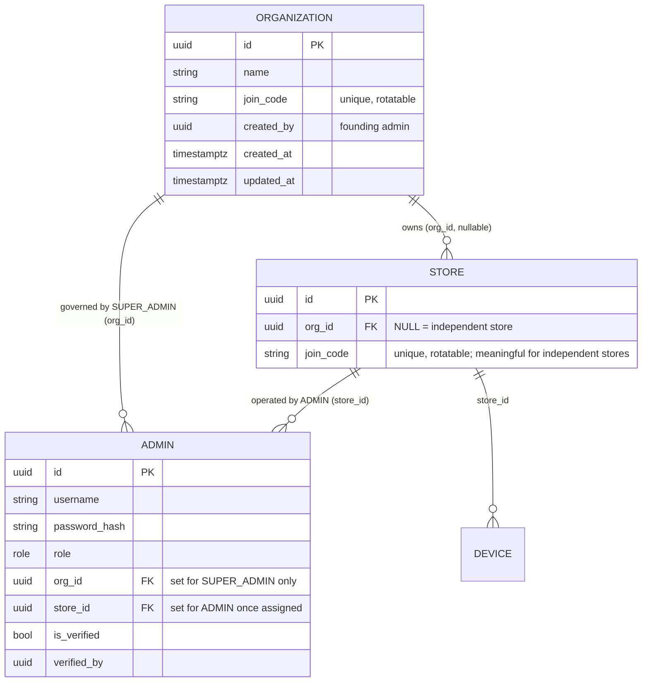
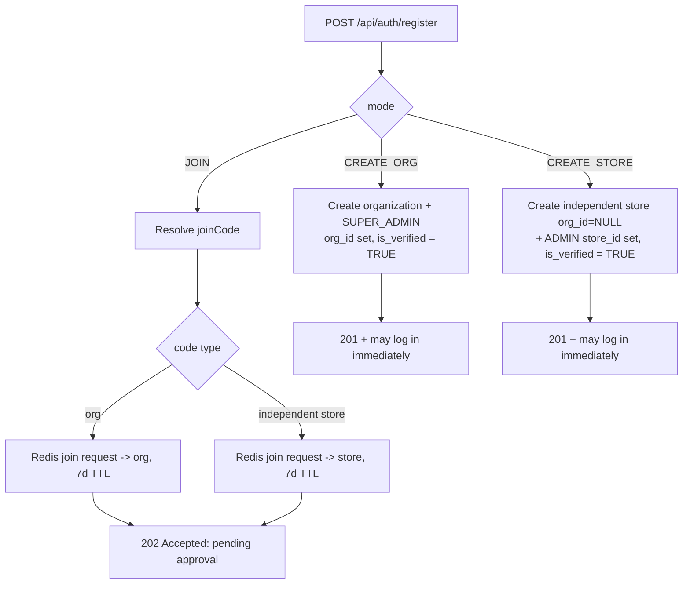
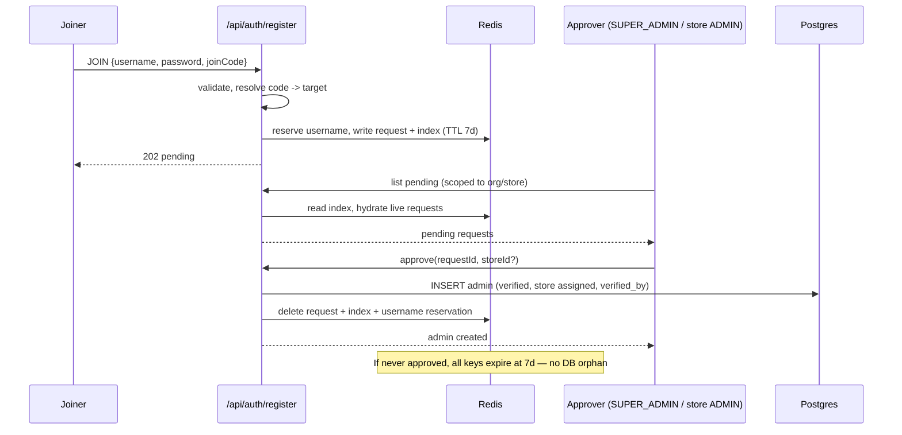

# Organization Tenancy & Self-Registration — Design Spec

**Status:** Approved design (2026-06-03)
**Scope:** Backend (Kotlin/Spring Boot), `web` (admin dashboard). No `client-web` or `receiver` changes.
**Author:** Design captured via brainstorming session

---

## 1. Summary

Today `notiguide` has two global roles: **SUPER_ADMIN** (no store, full read/write
over *every* store, admin, and device in the system) and **ADMIN** (scoped to a
single store). Accounts can only be created by an existing SUPER_ADMIN; there is
no public registration.

This feature introduces a top-level **Organization** tenant and opens **public
self-registration** beside the existing login page. The organization makes
self-registration safe: a SUPER_ADMIN is now bound to **one organization** and
governs only the stores **inside that org** — so "register as SUPER_ADMIN" means
"start my own isolated organization," not "seize the whole platform."

Four registration paths are supported:


| #   | Who registers | Action                                                          | Becomes                            | Activation                                                       |
| --- | ------------- | --------------------------------------------------------------- | ---------------------------------- | ---------------------------------------------------------------- |
| 1   | SUPER_ADMIN   | Create a new organization                                       | Org owner (governs all its stores) | **Auto** (org founder)                                           |
| 2   | ADMIN         | Create an independent store                                     | Owner of an org-less store         | **Auto** (store founder)                                         |
| 3   | ADMIN         | Join an existing **independent store** (co-owner) via join code | Co-owner of that store             | Verified by an existing ADMIN of that store                      |
| 4   | ADMIN         | Join an existing **organization** via join code                 | ADMIN inside that org              | Verified by a SUPER_ADMIN of that org (who also assigns a store) |


The guiding rule: **the approver is whoever owns the thing you are joining** —
peer ADMINs own an independent store; a SUPER_ADMIN owns an org.

## 2. Goals & Non-Goals

### Goals

- A new **Organization** entity sits at the top of the tenancy tree. SUPER_ADMIN
is org-scoped; it sees and manages only the stores/admins/devices in its org.
- Public, rate-limited **self-registration** for all four paths above.
- **Owner-issued join codes** (on each org and each independent store) are the
only discovery mechanism for joining — no browsable tenant directory.
- Paths 1 & 2 activate immediately (a self-registered owner controls only their
own isolated tenant). Paths 3 & 4 stay pending until the owner approves.
- An ADMIN always belongs to **exactly one store** — today's single
`admin.store_id` is preserved (no membership join table).
- Join requests are **ephemeral**: held in Redis with a **7-day TTL**, never
materializing an `admin` row until approved.
- The authorization core (`StoreAccessUtil`) becomes an injectable, **org-aware**
service, fencing each SUPER_ADMIN to its own org across every store-scoped
endpoint.
- Zero behavioral regression for existing data via a migration that folds all
current stores and SUPER_ADMINs into one **default organization**.
- Both ADMIN and SUPER_ADMIN retain full device management within their scope
(already true; this spec must not regress it).

### Non-Goals

- No platform-level "god" account above organizations. Cross-org / vendor
operations are out-of-band (DB / infra), not an in-app role. *(Decided.)*
- No multi-store ADMIN. One ADMIN → one store. *(Decided.)*
- No durable audit table of join requests (Redis-ephemeral; promotion to a table
is a noted future option, not built now).
- No "upgrade an independent store into an org" / "absorb a store into an org"
flow.
- No email/SMS verification, password reset, or external IdP — registration is
username + password only, mirroring the existing login.
- No org-level branding/billing/settings beyond name + join code.
- No changes to the customer queue app (`client-web`) or device firmware.

## 3. Terminology


| Term                   | Meaning                                                                                                                    |
| ---------------------- | -------------------------------------------------------------------------------------------------------------------------- |
| **Organization (org)** | Top-level tenant. Owns 0..N stores. Governed by its SUPER_ADMIN(s).                                                        |
| **SUPER_ADMIN**        | Org owner/operator. Bound to one org (`admin.org_id`), no store. Full control of every store/admin/device **in that org**. |
| **ADMIN**              | Store operator/co-owner. Bound to one store (`admin.store_id`).                                                            |
| **Independent store**  | A store with `org_id = NULL`. Created by a self-registered ADMIN; lives outside any org.                                   |
| **Org-owned store**    | A store with `org_id` set. Created by a SUPER_ADMIN under its org.                                                         |
| **Join code**          | Opaque, rotatable, owner-issued credential identifying a join target (an org or an independent store).                     |
| **Join request**       | An ephemeral, Redis-held registration awaiting owner approval (paths 3 & 4). Never an `admin` row until approved.          |
| **Materialize**        | Create the real `admin` row at approval time from a join request.                                                          |


## 4. Domain model




### 4.1 New table `organization`


| Column                      | Type                                              | Notes                                       |
| --------------------------- | ------------------------------------------------- | ------------------------------------------- |
| `id`                        | UUID PK                                           |                                             |
| `name`                      | text NOT NULL                                     | `@Size` bounded, mirroring store name rules |
| `join_code`                 | text NOT NULL UNIQUE                              | opaque, rotatable (see §6)                  |
| `created_by`                | UUID NULL REFERENCES admin(id) ON DELETE SET NULL | founding SUPER_ADMIN                        |
| `created_at` / `updated_at` | timestamptz                                       | `@CreatedDate` / `@LastModifiedDate`        |


### 4.2 `store` changes

- Add `org_id UUID NULL REFERENCES organization(id) ON DELETE RESTRICT`
(`NULL` ⇒ independent). Index `idx_store_org` on `org_id`.
- Add `join_code text NULL UNIQUE` for independent stores. (Org-owned stores are
staffed through the org join code, so their `join_code` may be `NULL`.)

### 4.3 `admin` changes

- Add `org_id UUID NULL REFERENCES organization(id) ON DELETE RESTRICT` — set for
SUPER_ADMIN, the org it owns; always `NULL` for ADMIN (an ADMIN's org is
*derived* through `store.org_id`).
- **Replace** the existing `chk_superadmin_no_store` CHECK with:
  ```
  (role = 'ROLE_SUPER_ADMIN' AND org_id IS NOT NULL AND store_id IS NULL)
  OR
  (role = 'ROLE_ADMIN'       AND org_id IS NULL)
  ```
  *(ADMIN.store_id stays nullable: an unassigned ADMIN is an existing, legitimate
  state — a SUPER_ADMIN can provision an ADMIN via the authenticated
  `createAdmin` flow and assign a store later — and the device layer already
  handles it with "Store-scoped admins need an assigned store." Self-registration
  paths 2/3/4 always materialize an ADMIN with a store, so they never produce
  this state.)*
- No `requested_org_id` / `requested_store_id` columns and **no `admin` row for
pending joins** — that state lives entirely in Redis (§7).

### 4.4 Roles & UI labels

The `admin_role` enum is unchanged (`ROLE_SUPER_ADMIN`, `ROLE_ADMIN`). The
frontend presents friendlier labels so users never see raw role names:


| Role                                          | UI label (EN)      | UI label (VI)    |
| --------------------------------------------- | ------------------ | ---------------- |
| `ROLE_SUPER_ADMIN`                            | Organization owner | Chủ tổ chức      |
| `ROLE_ADMIN` (independent founder / co-owner) | Store manager      | Quản lý cửa hàng |


*(VI copy is indicative; finalize against the Vietnamese copy rules in CLAUDE.md
during implementation.)*

## 5. Registration flow

Public endpoint **`POST /api/auth/register`** (under the already-public
`/api/auth/**`), rate-limited by the existing `auth` tier. In the current
filter, `/api/auth/**` is limited to 10 req/min/IP, which is more restrictive
than the named `strict` tier. Body is discriminated by
`mode`. Username/password validation reuses the constraints already on
`CreateAdminRequest` (username `^[a-zA-Z0-9_]+$`, 3–100; password upper+lower+
digit+special, 8–128).




### 5.1 Request contracts

```jsonc
// mode = CREATE_ORG  -> ROLE_SUPER_ADMIN
{ "mode": "CREATE_ORG", "username": "...", "password": "...", "orgName": "..." }

// mode = CREATE_STORE -> ROLE_ADMIN, independent store
{ "mode": "CREATE_STORE", "username": "...", "password": "...", "storeName": "...", "storeAddress": "..."? }

// mode = JOIN -> ROLE_ADMIN, pending
{ "mode": "JOIN", "username": "...", "password": "...", "joinCode": "..." }
```

### 5.2 Outcomes

- **CREATE_ORG** (201): `organization` row created; SUPER_ADMIN created with
`org_id` = new org, `is_verified = TRUE`, `created_by` = self. Org `join_code`
generated. Caller may log in immediately.
- **CREATE_STORE** (201): independent `store` (`org_id = NULL`) created with its
default settings + "General" service type (reusing `StoreService.createStore`),
plus a store `join_code`. ADMIN created with `store_id` = new store,
`is_verified = TRUE`. Caller may log in immediately.
- **JOIN** (202): `joinCode` resolved to an org or independent store. A Redis
join request is created (§7). **No `admin` row yet.** Response signals
"pending approval"; the caller cannot log in until approved.

### 5.3 Why paths 1–2 auto-verify

A self-registered owner controls only their **own isolated** tenant; nothing
pre-existing is exposed. Abuse is bounded to junk orgs/stores, mitigated by the
existing 10 req/min/IP `auth` rate-limit tier. Therefore no human gate is needed
for paths 1 & 2.
Paths 3 & 4 touch a **pre-existing** tenant, so the owner must approve.

## 6. Join codes

- Generated on org creation (path 1) and independent-store creation (path 2).
- **Opaque, URL-safe, random**, globally unique. A short type prefix routes the
register endpoint without a cross-table scan: `o`_ for org codes, `s_` for
independent-store codes (e.g. `o_7Gk2…`, `s_9Qm4…`).
- **Rotatable** by the owner (SUPER_ADMIN for the org; the store's ADMIN for an
independent store). Rotation issues a new code; old code stops resolving for
*new* requests. In-flight Redis requests already created against the old code
are unaffected (they reference the resolved target id, not the code).
- Endpoints:
  - `GET /api/orgs/me/join-code` · `POST /api/orgs/me/join-code/rotate` (SUPER_ADMIN's own org, resolved from the authenticated principal).
  - `GET /api/stores/{id}/join-code` · `POST /api/stores/{id}/join-code/rotate` (ADMIN/owner of that independent store; rejected for org-owned stores).

## 7. Join requests (Redis, 7-day TTL)

A JOIN registration creates **no relational row**. The full request lives in
Redis and self-expires.

### 7.1 Keys (follow existing `RedisKeyManager` conventions)


| Key                                       | Type   | Contents                                                                                       | TTL               |
| ----------------------------------------- | ------ | ---------------------------------------------------------------------------------------------- | ----------------- |
| `join_request:{requestId}`                | Hash   | `username`, `password_hash` (Argon2), `target_type` (`ORG`|`STORE`), `target_id`, `created_at` | 7d                |
| `join_request:index:org:{orgId}`          | ZSET   | members = `requestId`, score = `created_at` epoch                                              | n/a (lazy-pruned) |
| `join_request:index:store:{storeId}`      | ZSET   | members = `requestId`, score = `created_at` epoch                                              | n/a (lazy-pruned) |
| `join_request:username:{lower(username)}` | String | `requestId` (reservation; blocks duplicate pending usernames)                                  | 7d                |


`requestId` is a random opaque token. Index ZSETs are **lazily pruned** on read:
when listing, hydrate each candidate `requestId`; entries whose hash has expired
are dropped from the index. (Same lazy pattern already used elsewhere; no new
scheduler required, though the existing key-expiration listener may also prune.)

### 7.2 Lifecycle




### 7.3 Uniqueness & races

- At registration, reject if the username already exists in `admin`
(case-insensitive, existing `LOWER(username)` index) **or** has a live
`join_request:username:`* reservation. The reservation must be created with an
atomic Redis `SET NX`/`setIfAbsent` operation; a pre-check alone is not enough.
- At approval, re-check username uniqueness against `admin` inside the
materialize transaction; if it was taken meanwhile, fail with `409` and leave
the request for the owner to retry/reject (or let it expire).

## 8. Approval & verification

- **Path 3 (independent store co-owner):** approver must be a **verified ADMIN of
that store** (`principal.storeId == request.target_id`). On approve →
materialize ADMIN with `store_id = target_id`, `is_verified = TRUE`,
`verified_by = approver`.
- **Path 4 (org join):** approver must be a **SUPER_ADMIN of that org**
(`principal.orgId == request.target_id`), and supplies a `storeId` belonging to
that org. On approve → materialize ADMIN with `store_id = chosen store`,
`is_verified = TRUE`, `verified_by = approver`. If the org has no stores yet,
the approve dialog has nothing to assign and prompts the SUPER_ADMIN to create
a store first (the request waits in Redis until then or expires at 7d).
- **Reject:** delete the Redis request + index + username reservation. (No
notification in scope.)
- The existing `PATCH /api/admins/{id}/verify` keeps working for any SUPER_ADMIN-
created-then-unverified rows, but its authority widens (see §9) so a store
ADMIN can verify co-owners of its own store. New approval/reject endpoints
operate on `requestId` (Redis), e.g. under `/api/admins/requests`.
Deletion of SUPER_ADMIN accounts keeps a last-owner guard per organization; it
must not use a global `ROLE_SUPER_ADMIN` count once multiple orgs exist.

## 9. Authorization refactor (the risky core)

Measured surface: `StoreAccessUtil.requireStoreAccess` is called from **~30 sites
across 7 controllers and 6 device services**; there are **49** SUPER_ADMIN-gate
references. `gitnexus_impact` MUST be run on `StoreAccessUtil` and
`AdminPrincipal` before editing (HIGH-impact; per repo rules).

### 9.1 `StoreAccessUtil` → `StoreAccessService` (injectable bean)

```
SUPER_ADMIN: allowed iff  store.org_id == principal.orgId
ADMIN:       allowed iff  principal.storeId == storeId
```

Because a SUPER_ADMIN may reach many stores, the principal cannot carry every
store id; the service resolves `store.org_id` on demand through the indexed
`store.org_id` column. No cache is required in v1; ADMIN hot paths remain
in-memory (`principal.storeId == storeId`), and SUPER_ADMIN checks are less
frequent. All ~30 direct call sites switch from the static
`StoreAccessUtil.requireStoreAccess(...)` to the injected
`storeAccess.requireStoreAccess(...)`.

### 9.2 `AdminPrincipal` gains `orgId`

Sourced from `admin.org_id` (non-null only for SUPER_ADMIN). Authorities still
come from the DB `role` (unchanged). JWT carries no new claim — `orgId` is read
from the entity when the principal is built, consistent with the existing
"authorities from DB, not JWT" rule.

### 9.3 Listing endpoints scope to the org

These flip from "SUPER_ADMIN sees all" to "SUPER_ADMIN sees its org":


| Endpoint                        | New SUPER_ADMIN behavior                                |
| ------------------------------- | ------------------------------------------------------- |
| `GET /api/stores`               | stores where `org_id = principal.orgId`                 |
| `GET /api/admins` (no storeId)  | admins in the org (its stores + the org's SUPER_ADMINs) |
| `GET /api/devices`              | devices of the org's stores                             |
| `GET /api/devices/hub-health`   | hub health across the org's stores                      |
| Enrollment-token list/issue/revoke | enrollment tokens only for stores in the org         |
| Analytics overview / comparison | org's stores only                                       |


Independent stores (and their ADMINs/devices) belong to **no org**, so they are
invisible to every SUPER_ADMIN — preserving isolation.

### 9.4 Store creation rules

- **SUPER_ADMIN** `POST /api/stores`: creates a store with
`org_id = principal.orgId` (no longer org-less).
- **ADMIN**: may create exactly **one independent store**, and only via path 2
at registration (an already-assigned ADMIN has a `store_id` and cannot create
more). The authenticated `POST /api/stores` remains SUPER_ADMIN-only.

### 9.5 Verify authority widens

`verifyAdmin` (and the new request-approval endpoints) accept either:

1. a SUPER_ADMIN of the target's org, or
2. a verified ADMIN of the target independent store.

The last-SUPER_ADMIN delete guard and self-verify guard are retained.
The last-SUPER_ADMIN guard is evaluated inside the caller's org, not globally.

## 10. Login changes

- Unchanged for verified accounts.
- Paths 1 & 2 are `is_verified = TRUE` → log in immediately.
- **Pending-join feedback (required).** A pending JOIN has **no `admin` row**, so
  a naive login returns the generic "invalid username or password," leaving a
  legitimate requester unsure whether their submission even landed. The login
  flow is extended: when `adminRepository.findByUsername` finds nothing, it
  checks for a live `join_request:username:{lower(username)}` reservation and, if
  present, **verifies the submitted password against the join request's stored
  Argon2 hash** (same `passwordEncoder.matches` used for real accounts). Only on a
  password match does login return a distinct **"join request awaiting approval"**
  outcome; any password mismatch — or no reservation at all — falls through to the
  existing generic invalid-credentials response.
- **Why password-gated:** revealing pending status on a bare username match would
  be a username-enumeration oracle. Requiring the correct password means only the
  genuine requester — who already knows their own submission — sees the helpful
  message, preserving anti-enumeration parity with today's login.
- **Response shape:** modeled on the existing `UnverifiedAdminException` → `403`
  path. A new `PendingJoinRequestException` (`403`, with a distinct
  marker/message) lets the login page show a dedicated **"awaiting approval"**
  banner (bilingual; see §11.1), separate from the existing not-verified banner.
  This outcome issues **no** `Set-Cookie`, session, refresh token, or abort
  artifact — it is a terminal informational response, not a partial login.
- **Cost/abuse:** the extra Argon2 verification runs only when a reservation
  exists for the typed username, and the whole endpoint is already behind the
  `auth` rate-limit tier, so it adds no new unbounded work.

## 11. Frontend (`web/`)

Follow `docs/walkthrough/Web Styles.md` (alerts, hyperlinks), shadcn/ui only,
bilingual EN/VI with mirrored structure, modular components, CSS in separate
files when lengthy.

### 11.1 Register page

- New route `web/src/app/[locale]/(auth)/register/page.tsx`, visually a sibling
of the login page (same glass card, orbs, language/theme toggles).
- Login page gains a "Create an account" link; register page links back to login.
(Both follow the canonical hyperlink pattern.)
- Login page gains an **"awaiting approval"** banner: when login returns the
  pending-join outcome (§10), it renders a dedicated status alert (canonical
  warning-box pattern, bilingual), distinct from the existing not-verified banner.
- Modular pieces under `web/src/features/auth/`:
  - `register-path-selector.tsx` — three compact option rows/buttons: **Start an organization**,
  **Open my own store**, **Join with a code**.
  - `register-create-org-form.tsx`, `register-create-store-form.tsx`,
  `register-join-form.tsx` — per-mode forms; password reuses the existing
  `password-validation-checklist`.
  - `register-pending-screen.tsx` — post-JOIN "awaiting approval" state.
  - `features/auth/api.ts` gains `register(...)`.

### 11.2 Approval surface (dashboard)

- Extend `web/src/app/[locale]/dashboard/admins/page.tsx` with a **Pending
requests** view:
  - SUPER_ADMIN: org join requests → approve (pick a store in the org) / reject.
  - Independent-store ADMIN: co-owner requests for its store → approve / reject.
  - New `features/admin/` components (e.g. `pending-requests-table.tsx`,
  `approve-request-dialog.tsx`) reusing existing table patterns and the repo's
  `AlertDialog` confirmation convention for both approve and reject.

### 11.3 Join-code management

- A **Join code** panel in settings: SUPER_ADMIN sees the org code; an
independent-store ADMIN sees the store code. View + copy + rotate (rotate
behind a confirm dialog, since it invalidates the shared code).

### 11.4 i18n

- Add mirrored keys to `web/src/messages/en.json` and `vi.json` for register,
pending, approval, and join-code surfaces. VI copy authored per CLAUDE.md's
Vietnamese copy rules; propose non-trivial phrasings in chat before writing.

## 12. Migration

This change alters the database model substantially (one new table, three new
columns across two tables, a swapped CHECK constraint, and a one-time data
backfill). It therefore requires **two coordinated SQL deliverables**, matching
the convention established by the Custom Store Slugs spec — the project has **no
migration framework** (Flyway/Liquibase), so both are hand-written, plain SQL.

> **Deliverable 1 — `schema.sql` edits (fresh instantiation).**
> `backend/src/main/resources/db/schema.sql` is the canonical schema for a
> brand-new database and only runs against an empty DB. It MUST be updated so a
> fresh install already has the final shape:
>
> - `CREATE TABLE organization (...)` (with `idx`/UNIQUE on `join_code`).
> - `store`: add `org_id UUID NULL REFERENCES organization(id) ON DELETE RESTRICT`,
> `join_code text NULL UNIQUE`, and `idx_store_org`.
> - `admin`: add `org_id UUID NULL REFERENCES organization(id) ON DELETE RESTRICT`;
> **replace** `chk_superadmin_no_store` with the new tenancy CHECK (§4.3).
> - A fresh DB has **no rows**, so it needs **no default-org backfill** — the
> first account is created through the normal registration flow.

> **Deliverable 2 — standalone idempotent migration (existing environments).**
> A separate, **idempotent**, **re-runnable** script in
> `backend/src/main/resources/db/migration/` following the numbered convention
> (e.g. `002_organization_tenancy.sql`; pick the next free number at
> implementation time), to be run once against each existing environment. It
> must:
>
> 1. **DDL (idempotent):** `CREATE TABLE IF NOT EXISTS organization`;
>   `ALTER TABLE ... ADD COLUMN IF NOT EXISTS` for `store.org_id`,
>    `store.join_code`, `admin.org_id`; `CREATE INDEX IF NOT EXISTS idx_store_org`;
>    and swap the CHECK via `ALTER TABLE admin DROP CONSTRAINT IF EXISTS  chk_superadmin_no_store; DROP CONSTRAINT IF EXISTS chk_admin_tenancy; ADD  CONSTRAINT chk_admin_tenancy CHECK (...)`.
> 2. **One-time data backfill (guarded):** insert **one default organization**
>   (name e.g. "Default Organization") with a backfilled `join_code`; set
>    `org_id` = that org on **every existing store** and **every existing
>    SUPER_ADMIN**.
>    **The entire backfill block MUST be guarded so it is a no-op on re-run** —
>    e.g. wrap it in `IF NOT EXISTS (SELECT 1 FROM organization) THEN …`. Without
>    this guard, a second run after the feature ships would wrongly fold
>    *later-created independent stores* (`org_id IS NULL` by design) into the
>    default org. The guard makes "no organization yet" the one-time trigger.

Result: today's SUPER_ADMINs governed everything → now they govern the default
org, which contains every current store. Existing ADMINs are untouched (org
derived via their store). Existing stores become org-owned (their `join_code`
stays `NULL`; they are staffed via the org code). **No behavioral regression.**

## 13. Security considerations

- **Self-registration is bounded by org isolation** — a malicious self-registered
SUPER_ADMIN affects only its own (empty) org. The existing `auth` rate-limit
tier curbs mass account/org creation.
- **No tenant enumeration**: joining requires an owner-issued code; there is no
searchable directory and no endpoint that lists other tenants.
- **Approval is the real gate**: a known/guessed join code only lets someone
*submit* a request; membership requires explicit owner approval.
- **No DB orphans**: abandoned join requests expire in Redis at 7 days.
- **Password hashes in Redis** are Argon2 (same sensitivity as the DB column),
internal-only, and short-lived (≤7d).
- **Authorization fencing**: `StoreAccessService` is the single chokepoint; every
store-scoped operation routes through it, so org isolation cannot be bypassed
per-endpoint. Device helper methods that previously short-circuited SUPER_ADMIN
access must route store-owned devices through this service too.
- Retain existing guards: last-SUPER_ADMIN delete guard, self-verify guard,
case-insensitive username uniqueness, password length cap.

## 14. Decisions log (from brainstorming)

1. **Organization is the top tenant; no in-app god account.** SUPER_ADMIN is
  org-scoped.
2. **Independent (org-less) stores exist.** ADMIN "create my own store" = an
  independent store. A SUPER_ADMIN governs an org, not arbitrary stores.
3. **One ADMIN → one store.** Keep single `admin.store_id`; no membership table.
  Path 4 = SUPER_ADMIN verifies, then assigns a store (mirrors today's
   `verifyAdmin` + `updateAdminStore`).
4. **Owner-issued join codes** are the join-discovery mechanism.
5. **Join requests live in Redis with a 7-day TTL** and materialize an `admin`
  row only on approval (chosen over a dedicated table for ephemerality and
   zero-orphan cleanup; table is the noted fallback for durable audit).
6. `**StoreAccessUtil` becomes an injectable, org-aware `StoreAccessService`.**

## 15. Out of scope / future

- Durable join-request audit table.
- Org-level settings, branding, billing.
- Converting an independent store into an org / merging stores into orgs.
- Inviting an existing account (vs. registering a new one) into an org/store.
- Email/SMS verification, password reset, external IdP.
- Multi-store ADMINs / regional-manager role.
