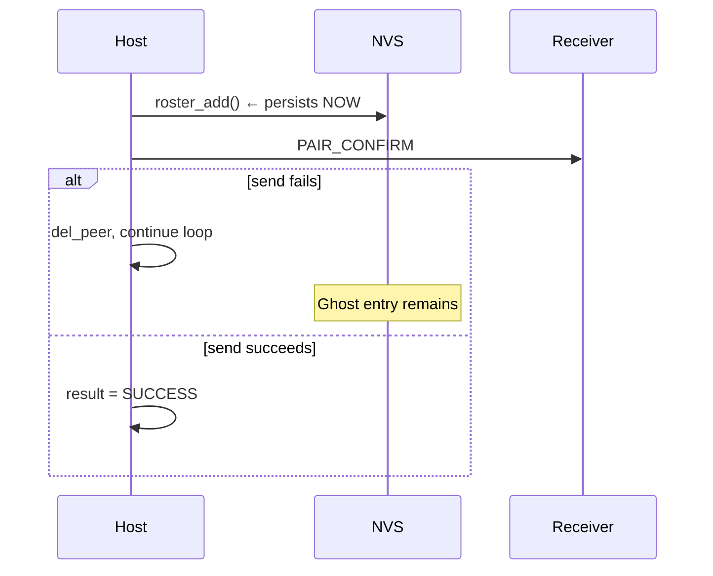
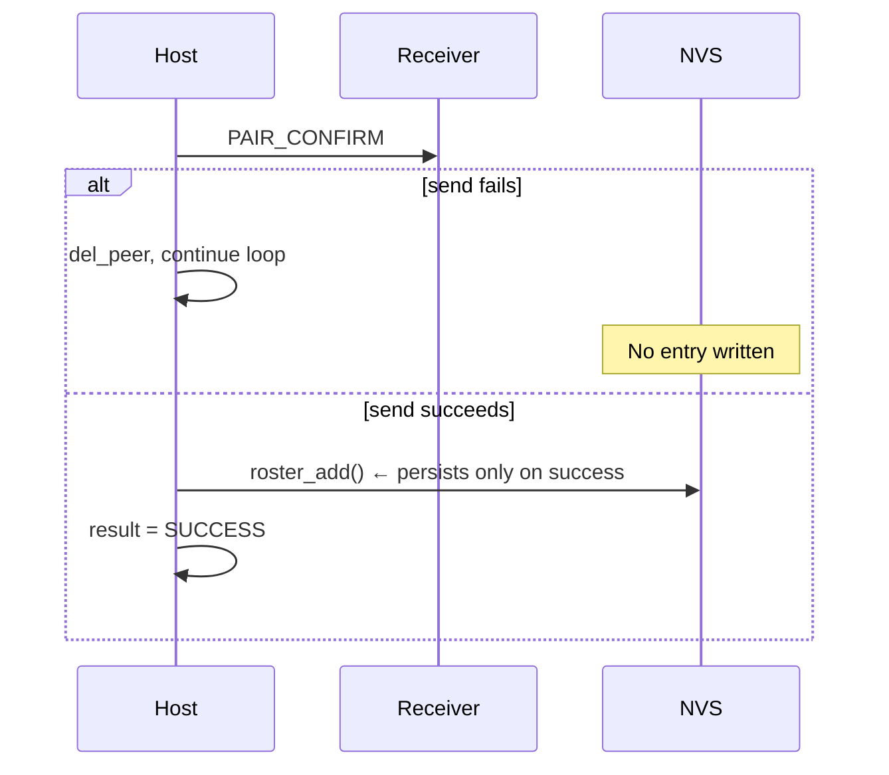

# Pairing & Dispatch Firmware Robustness Fixes

Spec for four firmware-level fixes to the ESP-NOW pairing protocol,
identified during cross-repo code review of the local pairing
implementation.

**Date:** 2026-06-01

---

## 1. Problem Statement

The ESP-NOW pairing handshake and receiver firmware have four
robustness gaps that can cause ghost roster entries, pairing retry
failures, or incompatible pairing acceptance. All are independent,
surgical fixes that harden the existing protocol without changing the
message format or architecture.

---

## 2. Fix 1 — Pairing Commit Ordering (transmitter)

### Problem

The host persists a new roster entry (`roster_add()`) at
`espnow_pair_host.c:462` after receiving PAIR_ACK but before sending
PAIR_CONFIRM. `esp_now_send()` success confirms layer-2 delivery, not
application-level receipt. If PAIR_CONFIRM fails to reach the
receiver, the hub has a roster entry for a receiver that never saved
its pairing.

### Impact

Ghost slot in roster — visible in the admin dashboard via roster
sync, but dispatch to that slot fails silently because the receiver
is still in its pair loop waiting for PAIR_CONFIRM.

### Fix

Move the `roster_add()` / `roster_update_existing()` block from after
PAIR_ACK to after PAIR_CONFIRM send success.

**File:** `transmitter/main/pair/espnow_pair_host.c`

**Current flow (lines 462–489):**



**Fixed flow:**



If `roster_add()` itself fails after PAIR_CONFIRM succeeds, the hub
retries the entire offer on the next loop iteration. The receiver has
saved the pairing, so the hub's `find_roster_entry_by_mac_band()` will
detect it as an existing entry and call `roster_update_existing()`
instead of `roster_add()`.

---

## 3. Fix 2 — Pair ACK Slot Validation (transmitter)

### Problem

The ACK handler at `espnow_pair_host.c:231–241` accepts any PAIR_ACK
from the current MAC without checking the `slot` field in the ACK
payload. A late ACK from an earlier offer (different slot or earlier
pairing attempt) could satisfy the current offer's wait.

### Impact

Theoretical ghost pairing or slot mismatch. Low practical risk since
each pairing session targets one MAC and retries use the same slot,
but defense-in-depth is straightforward.

### Fix

Store the received `pair_ack_t` data in the pairing context. After
`PAIR_BIT_ACK` is set in the main loop, compare the received ACK's
slot against the offered slot. If they differ, log a warning and treat
as no-ACK (delete peer, continue retry loop).

**File:** `transmitter/main/pair/espnow_pair_host.c`

**Changes:**

1. Add `pair_ack_t rx_ack` field to `s_ctx` (the pairing context
   struct).
2. In the `PAIR_MSG_ACK` handler (line 231–241), after MAC check,
   copy the full ACK data into `s_ctx.rx_ack` before setting
   `PAIR_BIT_ACK`.
3. In the main loop after `PAIR_BIT_ACK` fires, check:

```c
portENTER_CRITICAL(&s_ctx_mux);
uint8_t ack_slot = s_ctx.rx_ack.slot;
portEXIT_CRITICAL(&s_ctx_mux);

if (ack_slot != offer.slot) {
    ESP_LOGW(TAG, "PAIR_ACK slot mismatch: expected=%u got=%u",
             offer.slot, ack_slot);
    (void)esp_now_del_peer(rx_mac);
    continue;
}
```

The `offer.slot` variable is either `next_slot` (new entry) or
`existing_entry->slot` (re-pair), both available in the enclosing
scope.

---

## 4. Fix 3 — Encrypted Peer Cleanup on Retry (receiver-esp32, receiver-esp8266)

### Problem

Both receiver pairing modules add the hub as an encrypted ESP-NOW
peer after receiving PAIR_CHALLENGE (ESP32:
`espnow_pair.c:338`, ESP8266: `espnow_pair.c:380`). If any subsequent
step fails, the code `continue`s back to the channel scan without
deleting the encrypted peer. On the next scan iteration, the receiver
broadcasts a plaintext PAIR_REQUEST, but the hub's MAC is still
registered as an encrypted peer. ESP-NOW may reject or fail to deliver
a new plaintext PAIR_CHALLENGE from that MAC because the peer entry
expects encryption.

### Impact

Pairing retry failure after a post-challenge abort. The receiver
appears stuck scanning even though the hub is in pair mode. Requires a
power cycle to clear. This is the highest-priority firmware fix — it
causes real user-visible failures.

### Fix

Add `esp_now_del_peer(hub_mac)` before every `continue` that follows
`add_hub_peer()` in both receiver codebases. Use a local boolean to
track whether the peer was added, so `del_peer` is not called when it
was not.

**Files:**

- `receiver-esp32/main/pair/espnow_pair.c`
- `receiver-esp8266/main/pair/espnow_pair.c`

**Implementation pattern:**

```c
bool hub_peer_added = false;

// After add_hub_peer() succeeds:
hub_peer_added = true;

// Before each continue that follows add_hub_peer():
if (hub_peer_added) {
    (void)esp_now_del_peer(s_hub_mac);
    hub_peer_added = false;
}
continue;
```

**ESP32 failure paths needing cleanup** (after line 338):

| Line | Failure | Current behavior |
|------|---------|-----------------|
| 344–346 | HMAC computation fails | `continue` without del_peer |
| 353–354 | PAIR_RESPONSE send fails | `continue` without del_peer |
| 362–363 | PAIR_OFFER timeout | `continue` without del_peer |
| 369–370 | PAIR_OFFER invalid | `continue` without del_peer |
| 378–380 | PAIR_ACK send fails | `continue` without del_peer |
| 387–390 | PAIR_CONFIRM timeout | `continue` without del_peer |

**ESP8266 failure paths needing cleanup** (after line 380):

| Line | Failure | Current behavior |
|------|---------|-----------------|
| 395–396 | HMAC computation fails | `continue` without del_peer |
| 402–404 | PAIR_RESPONSE send fails | `continue` without del_peer |
| 409–410 | PAIR_OFFER timeout | `continue` without del_peer |
| 417–418 | PAIR_OFFER invalid | `continue` without del_peer |
| 430–432 | PAIR_ACK send fails | `continue` without del_peer |
| 438–439 | PAIR_CONFIRM timeout | `continue` without del_peer |

**On successful pairing:** The hub peer remains registered — the
receiver deinitializes ESP-NOW entirely (`wifi_deinit_all()`) after
saving the pairing, so the peer list is discarded.

---

## 5. Fix 4 — ESP8266 Offer Band Validation (receiver-esp8266)

### Problem

`validate_offer()` at `espnow_pair.c:260` does not check
`offer->rf_band`. The ESP8266 has only a 433 MHz radio and cannot
receive 2.4 GHz transmissions. A hub firmware misconfiguration or
future protocol extension could send a 2.4G offer to an ESP8266
receiver.

### Impact

The receiver would save an incompatible pairing and never trigger on
dispatches. The receiver appears paired but non-functional — no
error or indication.

### Fix

Add `offer->rf_band != 0` rejection in `validate_offer()`. Band
`0` = 433 MHz per the NVS schema in the local pairing spec §3.2.

**File:** `receiver-esp8266/main/pair/espnow_pair.c`

**Change:** Insert after the `slot == 0` check, before the existing
`rf_bits` check:

```c
if (offer->rf_band != 0) {
    ESP_LOGE(TAG, "Pairing offer has unsupported band=%u "
             "(ESP8266 is 433M only)", offer->rf_band);
    return ESP_ERR_NOT_SUPPORTED;
}
```

---

## 6. Repos Affected

| Repo | Fixes | Files |
|------|-------|-------|
| `transmitter` | 1 (commit ordering), 2 (ACK slot validation) | `main/pair/espnow_pair_host.c` |
| `receiver-esp32` | 3 (peer cleanup) | `main/pair/espnow_pair.c` |
| `receiver-esp8266` | 3 (peer cleanup), 4 (band validation) | `main/pair/espnow_pair.c` |

---

## 7. Testing

All fixes are in ESP-NOW pairing code which requires two physical
devices (hub + receiver). Testing is on hardware:

| Fix | Test procedure |
|-----|---------------|
| 1 (commit ordering) | Pair a receiver normally — verify roster entry appears. Kill receiver power between PAIR_ACK and PAIR_CONFIRM (disconnect antenna or Faraday) — verify no ghost roster entry on hub. |
| 2 (ACK slot validation) | Normal pairing should work unchanged. Stale-ACK injection requires a modified receiver and is not practical to test manually — verify via code review. |
| 3 (peer cleanup) | Enter pair mode on hub, let receiver discover hub (challenge received), then power off hub before PAIR_OFFER. Power hub back on, re-enter pair mode. Verify receiver re-discovers and pairs without needing a power cycle. |
| 4 (band validation) | Requires a modified hub that sends `rf_band=1` in the offer. Verify ESP8266 rejects and logs the error. Normal 433M pairing should work unchanged. |

---

## 8. Dependencies

These fixes are independent of each other and independent of the
Backend & Frontend Local Pairing Plan. They can be implemented in any
order and deployed as separate firmware updates.

The fixes apply to firmware implemented in:

- `docs/done/Transmitter Local Pairing & Roster Plan.md`
  (transmitter fixes 1, 2)
- `docs/done/Receiver ESP32-C3 Local Pairing Plan.md`
  (ESP32 fix 3)
- `docs/done/Receiver ESP8266 Local Pairing Plan.md`
  (ESP8266 fixes 3, 4)

---

## 9. Companion Backend Fixes

Two backend-side fixes from the same code review are folded into the
existing `docs/planned/Backend & Frontend Local Pairing Plan.md`
rather than this spec:

- **Dispatch ACK rejection reaction** — `TransmitterOperationalListener`
  reacts to rejected transmit ACKs by emitting `DEVICE_DISPATCH_FAILED`
  and releasing the device busy key.
- **Masked RF collision check** — `DeviceRfCodeRepository` collision
  query compares masked low bits instead of exact byte equality, to
  prevent cross-trigger between codes of different bit widths in the
  same store.
