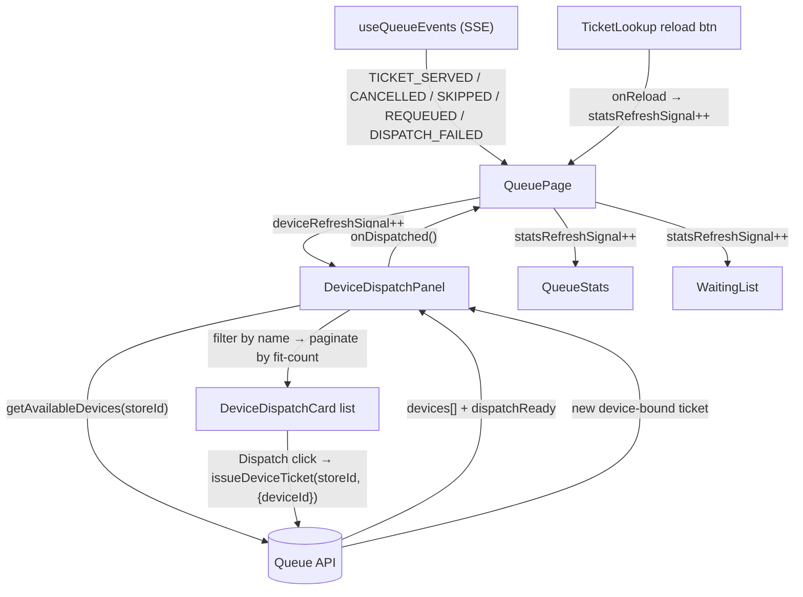

# Queue Device Dispatch Panel — Spec

**Status:** Draft for review
**Date:** 2026-06-08
**Area:** `web/` admin dashboard — Queue management screen
**Scope:** Frontend only (no backend or API changes)

---

## 1. Summary

Replace the hidden **"Gửi qua thiết bị" (Dispatch via device)** dialog on the queue
management screen with an always-visible **Receivers panel** that fills the currently
empty left-column space below the "Currently serving" card. Each available receiver is
shown as a compact card with a one-click **Phát vé / Dispatch** button, mirroring the
visual pattern of the "Vé đang chờ" (waiting list) panel. The panel paginates to fit the
viewport so the queue screen does not scroll on the desktop (≥`2xl`) layout.

This is a pure UX-surfacing change: the data source (`getAvailableDevices`) and the
dispatch action (`issueDeviceTicket`) are unchanged — they are simply promoted from a
modal behind a button to an inline, browsable list.

---

## 2. Background & motivation

Today, dispatching a device-bound ticket requires: click **Gửi qua thiết bị** in the
header → a dialog opens → pick a receiver from a `Select` dropdown → confirm. The device
list is buried two interactions deep.

Meanwhile, the queue screen's left column (`2xl:col-span-2`) contains only two cards —
the stats/Call-Next bar and the "Currently serving" card — leaving a large empty region
below them (the area the user circled). That space is unused.

**Goal:** surface the receiver list directly in that empty space so an admin can glance
at a device and dispatch in a single click.

### Existing behavior we are building on (verified)

- **Data source —** `getAvailableDevices(storeId)` → `AvailableDevicesResponse { devices: DeviceDto[], dispatchReady: boolean, error: string | null, maxHubsPerStore: number | null }`.
  - The backend (`DeviceDispatchService.getAvailableDevices`) already returns **only
    dispatch-eligible receivers**: `device.storeId == storeId && !kind.isHub() && status == ACTIVE && (rfCode != null || hubSlot != null) && !isBusy`.
  - This is **independent of `dispatchReady`** — devices are returned even when no hub is
    elected. `dispatchReady` is `true` only when an active transmitter hub exists for the store.
  - Because busy devices are filtered out, **dispatching a device removes it from the
    list** (it becomes busy) until its ticket is served/cancelled, at which point it
    reappears. This is desirable feedback and requires no extra logic.
- **Dispatch action —** `issueDeviceTicket(storeId, { deviceId })` → `TicketDto`. Issues a
  new WAITING ticket bound to the device (it then appears in the waiting list with a
  device badge). Throws `ApiError` with `error` codes `no_active_transmitter`,
  `device_busy`, plus generic codes.
- **`<main>` is the scroll container —** the dashboard layout is
  `flex h-screen overflow-hidden`; `<main id="main-content" class="flex-1 overflow-y-auto …">`
  fills the viewport below the topbar. This makes a viewport-bounded, flex-fill layout feasible.
- **Custom breakpoints —** `2xl = 64rem (1024px)` is where the 3-column grid
  (`2xl:grid-cols-3`) activates. The dynamic-fit/no-scroll behavior is a ≥`2xl` feature.

---

## 3. Goals / non-goals

**Goals**
1. Remove the `Gửi qua thiết bị` header button and the `DeviceDispatchDialog`.
2. Add an inline **Receivers panel** in the left column below "Currently serving".
3. One-click dispatch per receiver card (button labelled **Phát vé / Dispatch**).
4. Panel header: title (left) + reload button + device search box (right).
5. When no hub is ready (`dispatchReady === false`): still list devices, show a warning
   between the title row and the first card, and disable every Dispatch button with a
   no-hub tooltip.
6. Fixed-height, paginated list — dynamically compute how many cards fit so the desktop
   queue screen does not scroll.
7. Keep the original header reload, **repurposed** as a **waiting-list reload**, placed to
   the **right** of the "Tìm theo số vé" ticket search box.

**Non-goals**
- No backend / API / DTO changes.
- No change to how device-bound tickets are served/cancelled (handled by `ServingDisplay`).
- No change to the waiting-list card behavior beyond adding the reload control.
- Showing busy/inactive receivers (greyed out) — out of scope; the list shows only
  available receivers, consistent with the dialog it replaces.

---

## 4. Wireframes (for re-verification)

> These are the approved dot-dash wireframes, included verbatim so the implementation can
> be checked against them. (Per repo convention, structural/flow diagrams elsewhere in
> this doc use Mermaid; these layout sketches are intentionally kept as the approved
> dot-dash form.)

### 4.1 Normal state — hub ready, queue empty

```
······································································  ·······························
·  Hàng đợi — SOICT Coffee                  [⏸ Tạm dừng] [🗑 Xóa vé cũ] ·   ← only queue-control buttons
······································································  ·······························

.----------------------------------------------------------.   .-------------------------------.
|  0         Hàng đợi dịch vụ              [  Gọi tiếp  N ] |   |  Tìm vé                       |
|  ĐANG CHỜ  [ General ▾ ]                                 |   |  [ 🔍 Tìm theo số vé .... ] [⟳]|  ← reload RIGHT
'----------------------------------------------------------'   |                               |    of ticket search
                                                               |  Vé đang chờ                  |
.----------------------------------------------------------.   |  ...........................   |
|              Hiện không có vé đang phục vụ               |   |  (Không có vé trong hàng đợi) |
|         Nhấn Gọi tiếp để phục vụ khách kế tiếp           |   |                               |
'----------------------------------------------------------'   |                               |
                                                               |                               |
.----------------------------------------------------------.   |                               |
|  Thiết bị nhận               [⟳] [ 🔍 Tìm thiết bị .... ]|   |                               |  ← device reload
|  ------------------------------------------------------- |   |                               |    LEFT of device
|  .------------------------------------------------------.|   |                               |    search
|  | (((•)))  Bàn 1          RECEIVER_433M    [ Phát vé ] ||   |                               |
|  '------------------------------------------------------'|   |                               |
|  .------------------------------------------------------.|   |                               |   fixed-height
|  | (((•)))  Bàn 2          RECEIVER_2_4G    [ Phát vé ] ||   |                               |   list — N cards
|  '------------------------------------------------------'|   |                               |   fit viewport,
|  .------------------------------------------------------.|   |                               |   no page scroll
|  | (((•)))  Quầy bar       RECEIVER_433M    [ Phát vé ] ||   |                               |
|  '------------------------------------------------------'|   |                               |
|  ------------------------------------------------------- |   |                               |
|                              ‹  Trang 1 / 3  ›           |   |                               |  ← pagination footer
'----------------------------------------------------------'   '-------------------------------'
        LEFT COLUMN  (2xl:col-span-2)                                 RIGHT COLUMN
```

### 4.2 No hub ready (`dispatchReady === false`)

```
.----------------------------------------------------------.
|  Thiết bị nhận               [⟳] [ 🔍 Tìm thiết bị .... ]|
|  ------------------------------------------------------- |
|  ⚠  Chưa có bộ phát đang hoạt động cho cửa hàng này      |   ← canonical text-warning banner,
|  ------------------------------------------------------- |     between title row and first card
|  .------------------------------------------------------.|
|  | (((•)))  Bàn 1        RECEIVER_433M  [ Phát vé ]🚫  || |   ← disabled + no-hub tooltip
|  '------------------------------------------------------'|
|  .------------------------------------------------------.|
|  | (((•)))  Bàn 2        RECEIVER_2_4G  [ Phát vé ]🚫  || |
|  '------------------------------------------------------'|
|                              ‹  Trang 1 / 2  ›           |
'----------------------------------------------------------'
```

### 4.3 Ticket called (one in service, others waiting)

The serving card is populated and taller, so under the no-scroll constraint the device
list's available height shrinks → fewer cards per page → pagination adjusts (e.g. `1 / 4`).

```
.----------------------------------------------------------.   .-------------------------------.
|  3         Hàng đợi dịch vụ              [  Gọi tiếp  N ] |   |  Tìm vé                       |
|  ĐANG CHỜ  [ General ▾ ]                                 |   |  [ 🔍 Tìm theo số vé .... ] [⟳]|
'----------------------------------------------------------'   |  Vé đang chờ                  |
.----------------------------------------------------------.   |  .--------------------------. |
|  [ Đã gọi ]                                              |   |  | #43        15:42   [Gọi] | |
|     # 42                                                 |   |  '--------------------------' |
|   Đã phát        Đã gọi                                  |   |  .--------------------------. |
|   15:38          15:41                                   |   |  | #44        15:43   [Gọi] | |
|   [ ✓ Phục vụ  S ]   [ Hủy  C ]                          |   |  '--------------------------' |
'----------------------------------------------------------'   |  .--------------------------. |
.----------------------------------------------------------.   |  | #45        15:45   [Gọi] | |
|  Thiết bị nhận               [⟳] [ 🔍 Tìm thiết bị .... ]|   |  '--------------------------' |
|  ------------------------------------------------------- |   |                               |
|  | (((•)))  Bàn 1          RECEIVER_433M    [ Phát vé ] ||   |                               |
|  | (((•)))  Bàn 2          RECEIVER_2_4G    [ Phát vé ] ||   |                               |
|  ------------------------------------------------------- |   |                               |
|                              ‹  Trang 1 / 4  ›           |   |                               |
'----------------------------------------------------------'   '-------------------------------'
```

> Note the label disambiguation: the serving card's serve action stays **`Phục vụ`**; the
> new device-card action is **`Phát vé` / Dispatch**. Two distinct actions, two distinct words.

### 4.4 Empty state (no available receivers)

Card area shows a centered muted message (mirroring the waiting list's empty text); **no
pagination footer**. The reload + search controls remain. If `dispatchReady === false`,
the warning banner still shows above the empty message.

```
.----------------------------------------------------------.
|  Thiết bị nhận               [⟳] [ 🔍 Tìm thiết bị .... ]|
|  ------------------------------------------------------- |
|                                                          |
|            Không có bộ thu khả dụng                      |   ← centered muted, py-6
|                                                          |
'----------------------------------------------------------'
```

---

## 5. Component architecture

All new files live under `web/src/features/queue/` and `web/src/hooks/`, following the
existing feature-folder convention. Components are split so each file has one clear job
(keeps files small and individually testable).

### 5.1 New files

| File | Responsibility |
|------|----------------|
| `features/queue/device-dispatch-panel.tsx` | Orchestrator. Fetches `getAvailableDevices`, owns search query, current page, fit-count, and the dispatch handler. Renders header (title + reload + search), no-hub warning, card list, and pagination footer. |
| `features/queue/device-dispatch-card.tsx` | One receiver row: radio icon, name (`assignedName \|\| publicId`), kind label, and the Dispatch button (with disabled + tooltip when no hub). Pure presentational + `onDispatch` callback. |
| `hooks/use-fit-count.ts` | `useFitCount(containerRef, slotPx, { enabled, fallback })` → number of items that fit the container's measured height. ResizeObserver-based. |
| `hooks/use-media-query.ts` | `useMediaQuery(query)` → boolean. Used to enable fit-measurement only at ≥`2xl` (`(min-width: 64rem)`). **SSR-safe:** initialize state to `false` and set the real value in a mount effect via `window.matchMedia` (guard `typeof window`), subscribing to `change`. |

### 5.2 Modified files

| File | Change |
|------|--------|
| `app/[locale]/dashboard/queue/page.tsx` | Remove the dispatch button (enabled + disabled/tooltip branches), the standalone header reload, `dispatchDialogOpen`/`dispatchReady`/`hasAvailableDevices`/`dispatchRefreshing` state and `fetchDispatchAvailability`, and the `<DeviceDispatchDialog>`. Add `deviceRefreshSignal` state, bumped by SSE events and after dispatch. Render `<DeviceDispatchPanel>` in the left column below `<ServingDisplay>`. Add ≥`2xl` height-bounded flex wrappers (see §7). Pass a `onReload` handler to `<TicketLookup>` that bumps `statsRefreshSignal`. |
| `features/queue/ticket-lookup.tsx` | Add an optional reload button to the **right** of the search input (`onReload`, `reloading` props). Layout becomes a `flex items-center gap-2` row: search `flex-1` + reload `Button size="icon"`. |
| `features/queue/api.ts` | No change (both functions already exist). |
| `styles/queue.css` | Add a fixed device-card height rule (`.queue-device-card`) and list gap so the fit math is deterministic (see §6.4). |
| `messages/en.json`, `messages/vi.json` | i18n key changes (see §8). |

### 5.3 Deleted files

| File | Reason |
|------|--------|
| `features/queue/device-dispatch-dialog.tsx` | Replaced by the inline panel. **Before deletion, grep for importers** — it is currently imported only by `queue/page.tsx`. |

### 5.4 Data flow



---

## 6. Behavior specification

### 6.1 Fetching & refresh

- The panel fetches `getAvailableDevices(storeId)` on mount, whenever `storeId` changes,
  and whenever its `refreshSignal` prop increments. This mirrors the `WaitingList` /
  `refreshSignal` pattern already in the page.
- `QueuePage` increments `deviceRefreshSignal` on the same SSE events that previously
  triggered `fetchDispatchAvailability`: `DEVICE_DISPATCH_FAILED`, `TICKET_SERVED`,
  `TICKET_CANCELLED`, `TICKET_SKIPPED`, `TICKET_REQUEUED` (the last four free a busy
  device, returning it to the list).
- The panel's **reload button** re-fetches immediately and shows a spinning `RefreshCcw`
  while in flight (replacing the page's old `dispatchRefreshing` indicator).
- **Single refetch path:** the panel only ever fetches on mount / `storeId` change /
  `refreshSignal` increment — there is no separate self-refetch. On a successful dispatch
  the panel calls `onDispatched()`; the page then bumps **both** `deviceRefreshSignal`
  (so the panel re-fetches — the dispatched device is now busy and drops off) **and**
  `statsRefreshSignal` (refreshing `QueueStats` and `WaitingList`, where the new
  device-bound ticket now appears).

### 6.2 Dispatch action

- Clicking **Phát vé / Dispatch** on a card calls `issueDeviceTicket(storeId, { deviceId })`.
- While in flight, that card's button shows a spinner and is disabled; other cards remain
  clickable (per-card loading state, keyed by device id).
- **Success:** toast `dispatch.successToast` (`"Device-bound ticket #{number} issued"`),
  then `onDispatched()` (the page bumps `deviceRefreshSignal` + `statsRefreshSignal`,
  which re-fetches the panel and refreshes stats / waiting list — see §6.1).
- **Error (`ApiError`):** map by `error` code, reusing existing copy —
  `no_active_transmitter` → `dispatch.errorNoActiveTransmitter`;
  `device_busy` → `dispatch.errorDeviceBusy`; otherwise `translateCommonApiError`.
  Network error → `translateNetworkError`. (Same mapping the dialog used.)

### 6.3 No-hub state (`dispatchReady === false`)

- Devices are still listed.
- A warning banner renders **between the title row and the first card** using the
  canonical warning pattern (see §9.1), text = `dispatch.disabledNoHub`.
- Every card's Dispatch button is `disabled` and wrapped in a `Tooltip` whose content is
  `dispatch.disabledNoHub`. (Reuses the existing tooltip + disabled-button pattern from the
  old header button.)

### 6.4 Search

- A search input (top-right of the panel, left of which sits the reload button) filters
  the fetched devices **client-side** by name: case-insensitive substring match against
  `assignedName ?? publicId ?? ""`.
- Receivers only — guaranteed by the data source (`getAvailableDevices` already excludes
  hubs); no client-side kind filtering is needed.
- Changing the query resets the current page to `0`.

### 6.5 Pagination & dynamic fit (no page scroll)

- The card list is a fixed-height, flex-filled region. Card height and gap are fixed so
  the visible count is computable:
  - **`.queue-device-card` height = 3.5rem (56px)**, list **gap = 0.5rem (8px)** →
    **slot = 64px** (`DEVICE_CARD_SLOT_PX = 64`).
- `useFitCount(listRef, 64, { enabled: is2xlUp, fallback: DEFAULT_PAGE_SIZE })` returns
  `pageSize = max(1, floor(listClientHeight / 64))` when measurement is enabled.
  - `is2xlUp = useMediaQuery("(min-width: 64rem)")`.
  - Below `2xl` (stacked single-column, page scrolls naturally), measurement is disabled
    and `pageSize = DEFAULT_PAGE_SIZE` (constant, `5`).
- Total pages = `ceil(filtered.length / pageSize)`. The footer (prev `‹`, indicator
  `Trang {current} / {total}`, next `›`) renders only when `totalPages > 1`.
- Clamp the current page into range whenever `filtered.length` or `pageSize` changes (so a
  shrinking list / growing serving card never strands the view on an empty page).
- The visible slice is `filtered.slice(page * pageSize, (page + 1) * pageSize)`.
- **No observer feedback loop:** the list region's height is **flex-determined**
  (`flex-1 min-h-0 overflow-hidden`, see §7), not content-determined. Rendering a different
  number of cards therefore does not change `clientHeight`, so `useFitCount` cannot
  oscillate. The list region carries **no vertical padding** (inter-card spacing comes from
  the flex `gap`), so `clientHeight` equals the usable height for the `/64` division.

### 6.6 Waiting-list reload (ticket search row)

- `TicketLookup` gains a reload button to the right of its search input.
- Clicking it calls `onReload`, which in `QueuePage` increments `statsRefreshSignal` —
  `WaitingList` already re-fetches on that signal, and `QueueStats` refreshes too.
- The button shows a brief spinning state (local `reloading` flag cleared after the
  signal-driven refresh, or after a short minimum for feedback).

---

## 7. Layout & the no-scroll mechanism

**Chosen approach — viewport-bounded flex-fill at ≥`2xl` (recommended).**

Flexbox computes the available height; the fit hook only reads the final container height
(`clientHeight`). No magic pixel constants for "distance to viewport bottom."

At ≥`2xl`, make the queue content fill `<main>` and never overflow:

- The queue content wrapper becomes a bounded flex column at `2xl`:
  `2xl:flex 2xl:h-full 2xl:min-h-0 2xl:flex-col 2xl:overflow-hidden` (below `2xl`: unchanged
  document flow, scrolls).
- The 3-column grid gets `2xl:flex-1 2xl:min-h-0`; each column gets `2xl:min-h-0`.
- The left column becomes `2xl:flex 2xl:flex-col 2xl:min-h-0`. Stats and `ServingDisplay`
  keep natural height; the `DeviceDispatchPanel` wrapper gets `2xl:flex-1 2xl:min-h-0`.
- The **right column** gets `2xl:min-h-0 2xl:overflow-y-auto` so that a long waiting list
  scrolls *inside its own column* rather than forcing the whole page to scroll. Without
  this, the no-scroll guarantee would only hold for the left column; the waiting list could
  still push the page past the viewport. (The ticket search scrolls with the column, which
  is acceptable; isolating it is a future refinement, out of scope here.)
- Inside the panel: `flex flex-col`. Header + warning are natural height; the **card-list
  region** is `flex-1 min-h-0 overflow-hidden` and carries the measured `listRef`; the
  pagination footer is natural height.
- The `.queue-page-shell` min-height bleed trick (`min-height: calc(100% + …)`, with
  per-breakpoint bumps) must be replaced by a **definite** height at ≥`2xl`, otherwise the
  inner `h-full` / `flex-1` chain has no definite ancestor height to resolve against and
  silently collapses (a percentage/`h-full` height resolves only when an ancestor has a
  definite height — `min-height` alone does **not** establish one). `<main>` *is* definite
  (`flex-1` inside `h-screen overflow-hidden`), so set the shell to inherit it. Do this
  **directly in `queue.css`** (not via a `2xl:*` utility, which would lose the specificity
  battle against the existing `.queue-page-shell` media-query rules):

  ```css
  @media (min-width: 64rem) {
    .queue-page-shell {
      height: 100%;     /* definite — resolves against <main>'s definite height */
      min-height: 0;    /* drop the calc(100% + …) bleed bump at this breakpoint */
    }
  }
  ```

  The gradient still bleeds via the existing negative-margin padding. Below `2xl` the shell
  is unchanged. Verify the resolved height against `<main>` in DevTools during implementation.

When the serving card grows (a ticket is called), flex redistributes, the list region's
`clientHeight` shrinks, the `ResizeObserver` fires, `pageSize` drops, and pagination
recomputes — automatically, no extra wiring.

**Alternative considered (not chosen): viewport-distance measurement.** Keep the layout
untouched and have the panel self-measure `window.innerHeight − listTop − footer − padding`,
capping its own list height. Lighter-touch (one component, no page restructure) but
depends on magic constants (footer px, `<main>` bottom padding) and a manual recompute on
window resize + serving-card height change. Rejected for maintainability — the flex
approach lets the browser own the math.

---

## 8. Internationalization

`en.json` and `vi.json` must stay structurally mirrored (same keys). Net change: **+7 added,
−6 retired**, parity preserved (805 → 806 each). All keys live under `queue.dispatch`
except the waiting-list reload label under `queue`.

### 8.1 Added

| Key | EN | VI (proposed) |
|-----|----|----|
| `queue.dispatch.panelTitle` | Receivers | Thiết bị nhận |
| `queue.dispatch.searchPlaceholder` | Search devices | Tìm thiết bị |
| `queue.dispatch.dispatchButton` | Dispatch | **Phát vé** (user-confirmed) |
| `queue.dispatch.pageIndicator` | Page {current} / {total} | Trang {current} / {total} |
| `queue.dispatch.prevPage` | Previous page | Trang trước |
| `queue.dispatch.nextPage` | Next page | Trang sau |
| `queue.reloadTickets` | Reload waiting list | Tải lại danh sách chờ |

### 8.2 Repurposed (no text change, new usage site)

| Key | Used for now |
|-----|--------------|
| `queue.dispatch.refresh` | Panel reload button `aria-label` |
| `queue.dispatch.disabledNoHub` | No-hub warning banner text **and** disabled-button tooltip |
| `queue.dispatch.disabledNoDevice` | Empty-state message ("No receivers available …"). **Must be kept** — also referenced by `features/device/usb-dispatch-dialog.tsx`. |
| `queue.dispatch.successToast`, `errorNoActiveTransmitter`, `errorDeviceBusy`, `badgeLabel` | Unchanged |

### 8.3 Retired (dialog removed — verify no other references first)

`queue.dispatch.action`, `queue.dispatch.dialogTitle`, `queue.dispatch.dialogDescription`,
`queue.dispatch.deviceLabel`, `queue.dispatch.cancel`, `queue.dispatch.confirm`.

**Verified safe to retire:** `action` is referenced only by the removed header button
(`queue/page.tsx`); the other five are referenced only by the deleted
`device-dispatch-dialog.tsx`. (Grep confirmed no other usages.)

> **VI copy gate:** Per the project's Vietnamese copy rules, the new VI strings in §8.1
> (other than the user-confirmed `Phát vé`) are *proposals*. They are concise and
> native-sounding, but must be confirmed at the spec-review step before being written to
> `vi.json`. `pageIndicator` uses plain `{current}`/`{total}` interpolation (verified
> next-intl 4.x syntax — `t(key, {current, total})`); no ICU plural is required.

---

## 9. UI rules adherence

Strictly follows `docs/walkthrough/Web Styles.md` and the `CLAUDE.md` UI rules.

### 9.1 Warning box (canonical, codebase-aligned)

Mirrors the adjacent **queue paused banner** for visual coherence on the same screen:

```
flex items-center gap-2.5 rounded-xl border border-warning/40 bg-warning/15
px-3 py-2.5 text-xs text-warning dark:border-warning/50 dark:bg-warning/20
```

Icon: `<AlertTriangle aria-hidden="true" className="size-4 shrink-0 text-warning" />`
(`AlertTriangle` is the lucide-react icon already used for warnings in the codebase, e.g.
`slug-add-dialog.tsx`; `shrink-0` prevents flex-collapse — universal in the codebase;
`text-warning` matches the paused-banner precedent). Uses `text-warning` (never
`text-warning-foreground`); always includes `dark:` overrides.

> **Style-doc reconciliation (separate task):** `docs/walkthrough/Web Styles.md`
> § "Status Alert Boxes" → "Rules" omits `shrink-0` and forbids re-applying the icon color,
> which contradicts the codebase. That doc will be updated to (a) require `size-… shrink-0`
> on alert-box icons and (b) note that the severity color is normally inherited but may be
> applied explicitly (as the queue paused banner does). The class table is already correct.

### 9.2 Hyperlinks

If any card element links to a device detail page, it uses the inline-link pattern
(`text-primary underline decoration-primary/30 underline-offset-4 transition-colors
hover:decoration-primary/70`) — never bare `hover:underline`. (The current device-bound
badge in `WaitingList`/`ServingDisplay` uses `hover:text-primary` on a `Badge`; this spec
does not add new device-detail links to the cards, so no new link styling is required —
noted for completeness.)

### 9.3 Glass panels, buttons, components

- Cards reuse the waiting-list card style: `glass-panel glass-panel-primary` with
  `rounded-lg`, plus the fixed `.queue-device-card` height.
- **Dispatch button** mirrors the waiting-list "Gọi" call button family
  (`size="sm"`, `bg-action text-action-foreground hover:bg-action-hover`) — both are
  "issue a ticket" actions, so sharing the action color keeps the screen coherent and
  visually distinct from the green `Phục vụ`/serve and red `Hủy`/cancel actions.
- Reload buttons reuse the existing icon-button pattern (`variant="outline" size="icon"`,
  `RefreshCcw`, `animate-spin` while loading) from the old header refresh.
- **shadcn/ui only** — all primitives already exist in `components/ui/`
  (`Button`, `Input`, `Badge`, `Tooltip`, `Skeleton`). No new UI primitives; no other UI
  framework. Pagination arrows use `Button` + `lucide-react` `ChevronLeft`/`ChevronRight`.
- Bilingual (EN/VI) throughout; time/number display unchanged.
- Any non-trivial CSS goes to `styles/queue.css` (the fixed card height + list gap), not
  long inline Tailwind.

---

## 10. Edge cases & error handling

| Case | Behavior |
|------|----------|
| No store assigned | Page already renders the "no store" guard; panel not shown. |
| Fetch fails | Treat as empty list (silent, matches `WaitingList`); reload button lets the user retry. |
| Empty list (no available receivers) | Centered muted `disabledNoDevice` message; no footer. Warning still shows if `!dispatchReady`. |
| Search yields zero matches | Same empty message; no footer. |
| Device becomes busy elsewhere | SSE bump re-fetches; it drops off the list. A dispatch race returns `device_busy` → mapped toast, then re-fetch. |
| Page out of range after shrink | Current page clamped into `[0, totalPages−1]`. |
| `pageSize` changes (resize / serving card grows) | Recompute pages; clamp current page. |
| Below `2xl` | Fixed `DEFAULT_PAGE_SIZE` (5), page scrolls normally. |
| Loading | Show 3 skeleton cards (reusing `WaitingList`'s skeleton approach) on first load. |

---

## 11. Integration & verification notes

- **Impact analysis (project rule):** before editing, run `gitnexus_impact` on the symbols
  this touches — `QueuePage`, `TicketLookup`, and the page's SSE `useQueueEvents` handler —
  and report blast radius. Run `gitnexus_detect_changes()` before any commit.
- **Verification order (project rule):** lint first, then type-check/build —
  `cd web && yarn lint` then `yarn build`. Do **not** auto-build as part of implementation;
  the project has a separate audit flow. Confirm `en.json`/`vi.json` parity after i18n edits.
- **Changelog:** record all file changes (including the dialog deletion and the style-doc
  edit) in `docs/CHANGELOGS.md`.
- No git commit steps are prescribed here — the executor decides when to commit.

---

## 12. Open questions

1. **VI copy approval (§8.1):** confirm `Thiết bị nhận`, `Tìm thiết bị`,
   `Trang {current} / {total}`, `Trang trước`, `Trang sau`, `Tải lại danh sách chờ`.
   (`Phát vé` is already confirmed.)
   - **Terminology note:** the existing dispatch copy calls a receiver `bộ thu` and a
     transmitter `bộ phát`. The approved wireframe titled the panel `Thiết bị nhận`
     ("receiving device"), which reads more naturally as a section heading but differs from
     `bộ thu`. Decide whether to keep `Thiết bị nhận` (matches the approved wireframe) or
     switch to `Bộ thu` for strict terminology consistency. The empty-state reuses the
     existing `bộ thu` copy regardless.
2. **Header reload removal:** confirmed earlier — the standalone header `⟳` is removed
   (its function moves into the panel + the ticket-search reload). Flagged here for the record.
