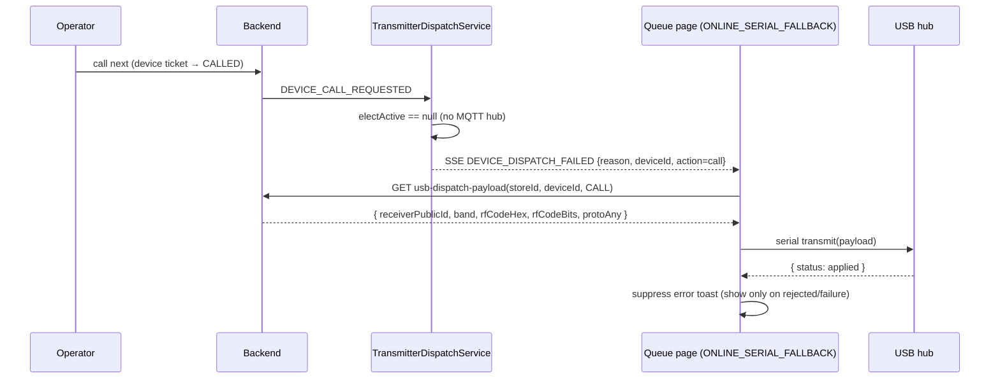
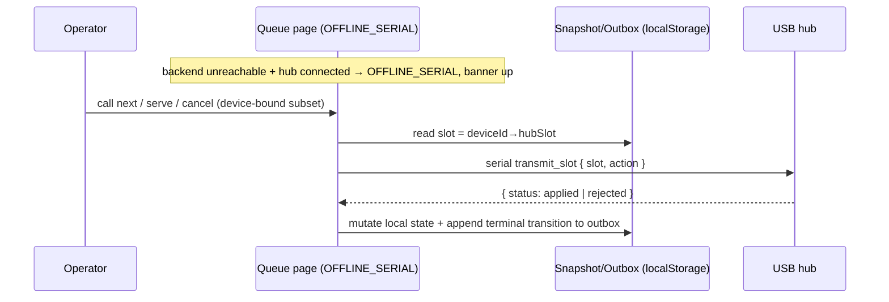
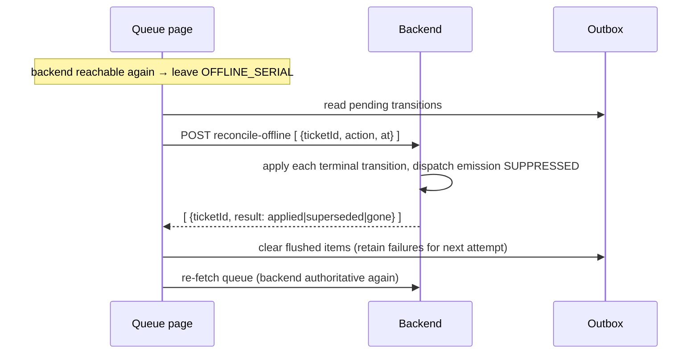

# Resilient USB Dispatch — Design Spec

**Date:** 2026-06-24
**Status:** Approved design (pre-implementation)
**Repos touched:** `backend/` (Kotlin/Spring), `web/` (Next.js admin), `transmitter/` (ESP-IDF firmware)
**Spec type:** Combined two-tier feature (single spec, two implementation phases)

---

## 1. Background & Problem

The admin **queue dispatch panel** enables a device's "Dispatch" button only when the backend reports `dispatchReady = true`, which is computed purely from MQTT **transmitter election** (`DeviceDispatchService.getAvailableDevices` → `TransmitterElectionService.electActive`). When no hub is sending MQTT heartbeats, the panel shows `dispatch.disabledNoHub` and disables dispatch.

Meanwhile, the **device detail page** (`devices/[id]`) already exposes a working **USB test-dispatch** path over Web Serial that transmits straight to a USB-connected hub, bypassing MQTT election entirely. The result is a contradiction: a hub physically connected over USB can dispatch from the device page while the queue panel simultaneously reports "no hub."

This spec resolves that contradiction and, more broadly, makes dispatch **resilient to two distinct failure modes**:


| Failure mode            | What's down                                   | What still works                       |
| ----------------------- | --------------------------------------------- | -------------------------------------- |
| **MQTT-only outage**    | hub ↔ broker (WiFi/MQTT)                      | Dashboard ↔ backend (HTTPS + SSE)      |
| **Backend unreachable** | store internet → backend *and* MQTT both gone | Only the browser ↔ USB-hub serial link |


These map to the two tiers below. Both ride on the **same serial transmit primitive** already proven by the device-page USB dispatch.

---

## 2. Goals / Non-Goals

### Goals

- **Tier 1 — online serial fallback:** when the backend is reachable but no MQTT hub is elected, and a matching hub is connected over USB, the queue panel lifts the restriction and dispatches CALL/STOP RF over serial. The backend stays authoritative for ticket lifecycle, numbering, and state.
- **Tier 2 — offline queue continuation:** when the backend is unreachable, continue **calling/stopping device-bound tickets that already exist** in the queue, fully over USB, then reconcile their terminal outcomes to the cloud on reconnect.
- Mode is **auto-detected** and surfaced via a persistent banner (no manual toggle).
- A manual **"re-page over USB"** recovery control on serving device tickets (safety valve for both tiers).

### Non-Goals

- Issuing **new** tickets while the backend is unreachable (avoids offline ticket-numbering/collision — out of scope; see §11).
- Offline operation for **non-device** tickets or **standalone (non-hub-paired) receivers** (see §11).
- Replacing MQTT as the primary transport. MQTT remains primary and authoritative; serial is fallback only.

---

## 3. Architecture

### 3.1 Dispatch-mode state machine

The queue page derives a single **dispatch mode** from two signals — *backend reachability* and *serial-hub presence* (plus the existing `dispatchReady`). Everything hangs off the mode; it is never manually toggled.

```mermaid
stateDiagram-v2
    [*] --> ONLINE_MQTT
    ONLINE_MQTT: ONLINE_MQTT — backend up, active MQTT hub. Dispatch via backend→MQTT (today's normal path).
    ONLINE_SERIAL: ONLINE_SERIAL_FALLBACK (Tier 1) — backend up, no MQTT hub, USB hub connected. Backend issues tickets; CALL/STOP RF goes over serial, triggered by DEVICE_DISPATCH_FAILED.
    OFFLINE_SERIAL: OFFLINE_SERIAL (Tier 2) — backend unreachable, USB hub connected. Local snapshot + transmit_slot + outbox.
    DISABLED: DISABLED — no viable path; restriction stands (today's behavior).

    ONLINE_MQTT --> ONLINE_SERIAL: MQTT hub lost, USB hub present
    ONLINE_MQTT --> DISABLED: MQTT hub lost, no USB hub
    ONLINE_SERIAL --> ONLINE_MQTT: MQTT hub back
    ONLINE_SERIAL --> OFFLINE_SERIAL: backend unreachable
    OFFLINE_SERIAL --> ONLINE_MQTT: backend back + reconcile outbox
    OFFLINE_SERIAL --> DISABLED: USB hub unplugged
    DISABLED --> ONLINE_SERIAL: USB hub connected
```




Mode-derivation truth table (priority top-down):


| Backend reachable | `dispatchReady` | Hub on serial (matches store, `op_state` ACTIVE) | Mode                     |
| ----------------- | --------------- | ------------------------------------------------ | ------------------------ |
| no                | —               | yes                                              | `OFFLINE_SERIAL`         |
| no                | —               | no                                               | `DISABLED`               |
| yes               | yes             | —                                                | `ONLINE_MQTT`            |
| yes               | no              | yes                                              | `ONLINE_SERIAL_FALLBACK` |
| yes               | no              | no                                               | `DISABLED`               |


Mode is a **pure derivation** of the three signals (recomputed each render), not a stored state; the diagram above illustrates common signal-change transitions, not a memoryful machine. **Reconciliation is triggered by the backend-reachability rising edge whenever the outbox is non-empty** — independently of whether the resulting mode is `ONLINE_MQTT` or `ONLINE_SERIAL_FALLBACK`.

### 3.2 Layering

- **Shared primitive:** the queue page owns a `useSerial` connection plus a `useSerialDispatch` helper. Both tiers transmit through it.
- **Tier 1** keeps the backend authoritative; it only *borrows* the serial port to emit RF when MQTT can't. Ticket numbering and state stay server-side.
- **Tier 2** makes the **browser + hub** authoritative for the duration of the outage over a **bounded working set** (device-bound tickets already in the queue), then replays terminal outcomes on reconnect. It uses `transmit_slot` (hub-roster dispatch) so it needs nothing from the backend mid-outage.

### 3.3 Key security property

Tier 2 dispatch uses the hub's own NVS roster (band + RF code + bits per slot; `roster.h`). **RF codes never leave the hub** — the browser only ever sends `{slot, action}`. Consequently the client-persisted snapshot/outbox contains **no sensitive RF material** (only ticket IDs, numbers, `deviceId`, `hubSlot`, status), so `localStorage` persistence is acceptable.

---

## 4. Components

Each unit is framed as *what it does / how it's used / what it depends on*.

### 4.1 Frontend (`web` — queue page)


| Unit                                                                            | What it does                                                                                                                                                                                                                                                                                                                                                                                                    | Depends on                           |
| ------------------------------------------------------------------------------- | --------------------------------------------------------------------------------------------------------------------------------------------------------------------------------------------------------------------------------------------------------------------------------------------------------------------------------------------------------------------------------------------------------------- | ------------------------------------ |
| `useBackendReachability` *(new hook)*                                           | One signal: is the backend reachable? Derived from `useQueueEvents` SSE connection state (`onopen`/`onerror` + `readyState`) plus admin-API failures, debounced so a brief blip doesn't flip modes. Emits a `reachable` rising-edge (the reconcile trigger).                                                                                                                                                    | extended `useQueueEvents`            |
| `useQueueEvents` *(modified)*                                                   | Add an optional `onConnectionChange(state: "open" | "closed")` callback driven by `EventSource` `onopen`/`onerror`. Existing behavior unchanged when the callback is omitted.                                                                                                                                                                                                                                   | `EventSource`                        |
| `useSerial` *(existing, reused)*                                                | Owns the USB-hub connection on the queue page; exposes `sendCommand`, `portState`, `identifyPayload`, `connect`, `reconnectKnownPort`.                                                                                                                                                                                                                                                                          | Web Serial                           |
| `useDispatchMode` *(new hook)*                                                  | Derives the mode per §3.1 from reachability + `dispatchReady` + serial presence + hub-matches-store. Single source of truth.                                                                                                                                                                                                                                                                                    | the hooks above, `dispatchReady`     |
| `useSerialDispatch` *(new hook)*                                                | Thin wrapper over `sendCommand` that **chooses the transport by receiver type, mirroring the backend MQTT path** (`TransmitterDispatchService`: slot vs full-payload by `hubSlot`): hub-paired receivers (`hubSlot != null`) → `transmitSlot({ slot, action })`; standalone receivers → fetch payload → `transmit(fullPayload)`. Used by **both** tiers. Returns `{ status: "applied" | "rejected"; reason? }`. | `useSerial`, `getUsbDispatchPayload` |
| `DispatchModeBanner` *(new component)*                                          | Renders the banner; text is a pure function of mode. Canonical warning alert-box pattern (see §7.1). Bilingual. Only rendered for serial modes.                                                                                                                                                                                                                                                                 | mode                                 |
| `DeviceDispatchPanel` *(modified)*                                              | Readiness becomes `mode !== "DISABLED"`. Passes `allowSerialFallback: true` to `issueDeviceTicket` in serial modes. In `OFFLINE_SERIAL`, new-ticket issuance is **disabled** with an explanatory line — only existing-queue controls drive calls.                                                                                                                                                               | `useDispatchMode`                    |
| `useOfflineQueueSnapshot` *(new zustand store)*                                 | Maintains the working set of device-bound tickets (`{ ticketId, number, status, deviceId, hubSlot, serviceTypeId }`) from already-loaded waiting/serving data while online; authoritative when `OFFLINE_SERIAL`. Persisted to `localStorage` (manual helper, mirroring `store/queue.ts`) so it survives a reload mid-outage.                                                                                    | queue/device data                    |
| `useDispatchOutbox` *(new zustand store)*                                       | Append-only `localStorage`-persisted log of offline terminal transitions `{ ticketId, action, at, serialResult }`. Flushed on reconnect.                                                                                                                                                                                                                                                                        | `localStorage`                       |
| Tier-1 SSE retry handler *(modified `queue/page.tsx`)*                          | On `DEVICE_DISPATCH_FAILED`/`no_active_transmitter`: if `ONLINE_SERIAL_FALLBACK`, resolve the failed `deviceId`'s `hubSlot` from loaded device data and dispatch via `useSerialDispatch` (slot or full-payload) → suppress the error toast on `applied`. Replaces today's unconditional toast (`queue/page.tsx:127-140`). De-dupes on `(ticketId, dispatchAction, timestamp)`.                                  | `useSerialDispatch`                  |
| Queue action controls *(modified — `serving-display`, call-next, serve/cancel)* | In `OFFLINE_SERIAL`, call-next / serve / cancel operate on the **local snapshot** and dispatch via `useSerialDispatch` (`transmit_slot`) + append to the outbox, instead of hitting the backend. In online modes they behave exactly as today.                                                                                                                                                                  | `useDispatchMode`, snapshot, outbox  |
| Re-page control *(new, on serving device tickets)*                              | Manual "re-page over USB" safety valve; re-emits CALL via `useSerialDispatch` in either serial mode.                                                                                                                                                                                                                                                                                                            | `useSerialDispatch`                  |


### 4.2 Backend (Kotlin/Spring)


| Unit                                                                                | Change                                                                                                                                                                                                                                                                                                                                                                                                                                                                                                                                                                                                                                   |
| ----------------------------------------------------------------------------------- | ---------------------------------------------------------------------------------------------------------------------------------------------------------------------------------------------------------------------------------------------------------------------------------------------------------------------------------------------------------------------------------------------------------------------------------------------------------------------------------------------------------------------------------------------------------------------------------------------------------------------------------------- |
| `QueueSseEvent` *(modified, `core/sse/QueueEventBroadcaster.kt`)*                   | Add `deviceId: UUID? = null` and `dispatchAction: String? = null`. Mirror in the TS `QueueSseEvent` type.                                                                                                                                                                                                                                                                                                                                                                                                                                                                                                                                |
| `TransmitterDispatchService.emitDispatchFailed` *(modified)*                        | Populate `deviceId = event.deviceId` and `dispatchAction = event.type → "call"/"stop"` on the broadcast `QueueSseEvent`.                                                                                                                                                                                                                                                                                                                                                                                                                                                                                                                 |
| `IssueDeviceTicketRequest` + `DeviceDispatchService.issueDeviceTicket` *(modified)* | Add `allowSerialFallback: Boolean = false`. When `true`, the `no_active_transmitter` hard-block (`DeviceDispatchService.kt:41-42`) becomes a soft path: still reserve `device:busy` + issue the ticket. Thread the flag through `QueueAdminController.issueDeviceTicket`.                                                                                                                                                                                                                                                                                                                                                                |
| `UsbDispatchPayloadService` *(reused, unchanged)*                                   | Tier 1 + the manual re-page valve fetch CALL/STOP payloads here (`POST /api/admin/.../devices/usb-dispatch-payload`).                                                                                                                                                                                                                                                                                                                                                                                                                                                                                                                    |
| `OfflineReconciliationService` + endpoint *(new)*                                   | `POST /api/queue/admin/{storeId}/reconcile-offline` taking a batch of terminal transitions. **Forces the terminal disposition idempotently from any source state** (a ticket called offline may still be `WAITING` server-side, so reconcile must not require `CALLED`), **with device-dispatch emission suppressed** (RF already went over serial → no double-page), broadcasting the normal `TICKET_SERVED`/`TICKET_CANCELLED` SSE for display sync + clearing `device:busy`. Already-terminal → `superseded`; absent/TTL-expired → `gone`. Returns per-item results. Auth: `storeAccess.requireStoreAccess` (mirrors the controller). |


**Reconciliation integration note.** The terminal handlers `handleTerminalDeviceDispatch` / `handleNoShowDeviceDispatch` (`QueueService.kt:939-995`) emit `DEVICE_STOP_REQUESTED`. Reconciliation must use a code path that performs the Redis terminal transition + `device:busy` cleanup + normal queue SSE **without** calling `emitDeviceDispatchEvent`. Implement as a dedicated `QueueService.reconcileTerminalTransition(storeId, ticketId, action)` (or a `suppressDeviceDispatch` flag on the existing terminal path) that `OfflineReconciliationService` invokes.

### 4.3 Firmware (`transmitter`)


| Unit                                                               | Change                                                                                                                                                                                                                                                                                                                                                                                                                                          |
| ------------------------------------------------------------------ | ----------------------------------------------------------------------------------------------------------------------------------------------------------------------------------------------------------------------------------------------------------------------------------------------------------------------------------------------------------------------------------------------------------------------------------------------- |
| `dispatch_slot_execute` *(new shared core, `dispatch/dispatch.c`)* | Extract the **post-validation** slot RF execution from `dispatch_handle_slot` (the `OP_STATE_ACTIVE` gate at `dispatch.c:422-432`, `roster_find_slot` at `:434-443`, and the subsequent build+`radio_tx_send`) into `dispatch_slot_execute(uint8_t slot, const char *action, transmit_result_t *out)` returning `{status, reason, applied_at_ms}` and **owning no ack channel**.                                                                |
| `dispatch_handle_slot` *(refactored, MQTT path)*                   | Keeps `parse_slot_from_root` → `verify_slot_signature` → dedup ring → `dispatch_slot_execute` → `publish_transmit_ack` (MQTT) + `post_dispatch_event`. Behavior unchanged.                                                                                                                                                                                                                                                                      |
| `handle_transmit_slot` *(new, `serial/serial_protocol.c`)*         | New `transmit_slot {slot, action}` serial command: validate slot (1..`CONFIG_TRANSMITTER_PAIR_MAX_RECEIVERS`) + action (`call`/`stop`), **no signature verification** (consistent with the unsigned serial `transmit`), call `dispatch_slot_execute`, reply synchronously via `serial_send_response` (`{status: applied/rejected, reason?}`). Tag `source="usb"`. Routed beside `transmit` in the command dispatcher (`serial_protocol.c:756`). |


**Impact-analysis gate (firmware).** Per `transmitter/CLAUDE.md`, run `gitnexus_impact({target: "dispatch_handle_slot"})` (and on `slot_to_transmit_cmd`) before the extraction refactor, and report blast radius. The MQTT dispatch path must remain behaviorally identical.

---

## 5. Data flows

### 5.1 Flow A — Tier 1, online serial fallback (CALL shown; STOP identical with `action=stop`)




The `GET usb-dispatch-payload` + `transmit` steps shown apply only to **standalone** receivers; for **hub-paired** receivers (`hubSlot != null`) the handler skips the payload fetch and sends `transmit_slot { slot, action }` instead (see `useSerialDispatch`, §4.1) — mirroring the backend's slot-vs-full-payload branching.

Issuance in this mode sends `allowSerialFallback=true` so binding a pager isn't blocked. The ticket's lifecycle/state remains fully backend-authoritative.

### 5.2 Flow B — Tier 2, offline (CALL / STOP)




The CALL/serve/cancel actions are driven by the **queue action controls** (call-next button, serving display, serve/cancel) operating on the local snapshot — not the dispatch panel, whose issuance is disabled offline. No backend calls occur during the outage. Calling a **non-device** ticket has no RF effect and no display update (the public display is backend-driven) — an accepted boundary.

### 5.3 Flow C — Reconciliation (reconnect)




Conflicts (backend already moved the ticket, or it TTL-expired) → backend wins; item dropped with `superseded`/`gone`.

---

## 6. Error handling & edge cases

### Mode detection

- **Flapping connectivity:** `useBackendReachability` debounces — declare offline only after N failed reconnects / T seconds; return online immediately on a successful SSE reconnect. Never flip mode during an in-flight serial write.
- **MQTT recovers mid-session:** Tier 1 is failure-triggered, so once MQTT works `DEVICE_DISPATCH_FAILED` stops firing → serial path goes dormant. **No double-send.**
- **Hub unplugged during outage:** `OFFLINE_SERIAL → DISABLED`; banner switches to "no hub"; **outbox preserved** for later reconcile.

### Tier 1

- **Serial transmit fails** (port closed / hub `rejected`): show the otherwise-suppressed error toast. Ticket is already CALLED server-side; recover via the manual **re-page over USB** control.
- **At-least-once SSE / duplicates:** client de-dupes on `(ticketId, dispatchAction, timestamp)` with a short-lived seen-set.
- **Cross-store / wrong hub:** guarded by `identify` (hub `op_state` ACTIVE + store match) before any transmit.

### Tier 2

- `**transmit_slot` rejected** (`slot_not_found` = receiver unpaired from hub, or hub not ACTIVE): show "receiver not reachable on hub"; the ticket stays callable and can still be served/cancelled (records a terminal transition; no RF needed).
- **Slot drift** (receiver re-paired to a different slot while the snapshot went stale): on entering `OFFLINE_SERIAL`, validate the snapshot's slots against a fresh `roster.list`; flag mismatches.
- **Tab reload mid-outage:** snapshot + outbox live in `localStorage` and restore; the previously-granted port reopens via `getPorts()`/`reconnectKnownPort` (no new permission prompt).
- **Multiple offline operators:** two offline dashboards could double-call a ticket (pager beeps twice) and produce conflicting outboxes — **accepted limitation** (offline distributed coordination is impractical); reconciliation resolves to a single terminal state.

### Reconciliation

- **Suppress dispatch emission (critical):** the reconcile path updates queue/terminal state + clears `device:busy` **without** broadcasting `DEVICE_STOP_REQUESTED`; otherwise a recovered MQTT hub re-pages. Asserted by test.
- **Any source state:** a ticket called offline may still be `WAITING` server-side (the call never reached the backend), so reconcile forces the terminal disposition from any non-terminal state rather than requiring `CALLED`.
- **In-progress at reconnect:** a ticket called offline but not yet finished carries **no outbox entry** (only terminal transitions are logged); it simply resumes under the now-authoritative backend and is served/cancelled through the normal online path.
- **Idempotent / superseded:** re-applied item → no-op; ticket already terminal → `superseded`; **TTL-expired during a long outage (>30 min CALLED TTL)** or otherwise absent → `gone`. Best-effort; analytics may undercount for very long outages — **accepted**, noted as a future enhancement (§11).
- **Partial flush failure:** per-item results; failed items stay in the outbox and retry on the next `reachable` edge (safe because idempotent).

### Security

- `reconcile-offline` requires admin auth + store access; offline actions are attributed to the authenticated admin on reconnect.
- `transmit_slot` is **unsigned**, exactly like the existing serial `transmit`; the firmware `OP_STATE_ACTIVE` gate is the guard. No new attack surface beyond what serial `transmit` already exposes, and **RF codes never leave the hub** (improvement over the full-payload `transmit`).

---

## 7. UI specification (adheres to `docs/walkthrough/Web Styles.md` + `CLAUDE.md`)

**Component library:** shadcn/ui only — no new component families. Reuse existing `Button`, `Tooltip`, `Badge`, `Dialog`. CSS stays token-based (`text-warning`, `bg-action`, etc.); no hardcoded hex.

### 7.1 `DispatchModeBanner` — canonical warning alert box

Uses the canonical **Warning** pattern (Web Styles §"Status Alert Boxes"). Transparent-background alert → `text-warning` (never `text-warning-foreground`), `rounded-xl`, with `dark:` overrides; icon carries `shrink-0`; `gap-2.5`; padding `px-3.5 py-3`.

```tsx
// Rendered only for ONLINE_SERIAL_FALLBACK and OFFLINE_SERIAL.
<div className="flex items-center gap-2.5 rounded-xl border border-warning/40 bg-warning/15 px-3.5 py-3 text-sm text-warning dark:border-warning/50 dark:bg-warning/20">
  <Usb aria-hidden="true" className="size-4 shrink-0" />
  <span>{tQueue(`dispatch.banner.${mode === "OFFLINE_SERIAL" ? "offline" : "serialFallback"}`)}</span>
</div>
```

This matches the existing no-hub warning in `DeviceDispatchPanel` (`device-dispatch-panel.tsx:176-184`), which is itself canonical.

### 7.2 Buttons

- **Re-page over USB** (recovery valve on serving device tickets): shadcn `Button` `variant="outline"` `size="sm"` with `Radio`/`Usb` icon — same affordance style as the device-page "test dispatch" trigger (`devices/[id]/page.tsx:395-404`). Not an `action`-colored primary (it's a recovery action, not the main flow).
- **Dispatch** button unchanged: `bg-action text-action-foreground hover:bg-action-hover` (`device-dispatch-card.tsx:46`); now enabled whenever `mode !== "DISABLED"`.
- Disabled states keep the existing `Tooltip` + disabled `Button` pattern (`device-dispatch-card.tsx:56-71`); tooltip text becomes mode-specific.

### 7.3 Links

No new hyperlinks are introduced. If any explanatory link is added later, it must follow Web Styles §"Hyperlink Patterns" (persistent `decoration-primary/30 underline-offset-4 transition-colors hover:decoration-primary/70`; never bare `hover:underline`).

### 7.4 Bilingual copy (i18n)

All new copy is added to **both** `en.json` and `vi.json` under the existing `queue.dispatch` namespace, mirrored structurally. Time/number formatting stays language-agnostic per project convention.

> **Vietnamese copy is PROPOSED below and pending native review** per `CLAUDE.md` ("propose the copy in plain text in chat and get approval before writing to `vi.json`"). Do not write `vi.json` until approved.


| Key                              | EN                                                                                          | VI (proposed — pending review)                                                              |
| -------------------------------- | ------------------------------------------------------------------------------------------- | ------------------------------------------------------------------------------------------- |
| `dispatch.banner.serialFallback` | "Transmitter offline — dispatching over USB."                                               | "Bộ phát ngoại tuyến — đang phát tín hiệu qua USB."                                         |
| `dispatch.banner.offline`        | "No connection — running the queue locally over USB. Changes sync when you're back online." | "Mất kết nối — đang chạy hàng đợi cục bộ qua USB. Thay đổi sẽ đồng bộ khi có mạng trở lại." |
| `dispatch.offlineIssueDisabled`  | "Can't add new pagers while offline. You can still call and finish current ones."           | "Không thể cấp thiết bị mới khi ngoại tuyến. Vẫn có thể gọi và phục vụ khách hiện tại."     |
| `dispatch.rePageUsb`             | "Re-page over USB"                                                                          | "Gọi lại qua USB"                                                                           |
| `dispatch.errorReceiverNotOnHub` | "Receiver isn't paired to this hub."                                                        | "Bộ thu chưa ghép nối với bộ phát này."                                                     |
| `dispatch.syncedToast`           | "Synced {count} offline updates."                                                           | "Đã đồng bộ {count} cập nhật ngoại tuyến."                                                  |


---

## 8. Testing

### Backend (Kotlin)

- `issueDeviceTicket`: `allowSerialFallback=true` issues + reserves `device:busy` with no active transmitter; default still throws `no_active_transmitter`.
- `OfflineReconciliationService`: idempotent re-apply; **asserts no `DeviceDispatchEvent` is broadcast** (suppression); TTL-expired/absent ticket → `gone`; already-terminal → `superseded`.
- `emitDispatchFailed` populates `deviceId` + `dispatchAction` on the SSE event.

### Frontend (`web`, vitest)

- `useDispatchMode`: full truth-table coverage of `(reachable, dispatchReady, serialPresent, storeMatch)` → expected mode.
- `useBackendReachability`: debounce (no flap on a single blip); rising-edge fires once.
- Tier-1 SSE handler: transmits on `no_active_transmitter`, suppresses toast on `applied`, shows on `rejected`, de-dupes duplicates.
- `useSerialDispatch`: emits correct `transmit` vs `transmit_slot` message shapes.
- Outbox/snapshot stores: append/persist/flush/partial-retry + `localStorage` round-trip and restore-after-reload.
- `DispatchModeBanner`: correct bilingual copy per mode; **asserts the canonical warning classes** (`text-warning`, `rounded-xl`, `dark:` overrides, icon `shrink-0`).

### Firmware (`transmitter`, host unit + on-device)

- Unit: `handle_transmit_slot` parses `{slot, action}`; rejects bad slot/action; rejects when `op_state != ACTIVE`; routes valid input through `dispatch_slot_execute`.
- Regression: `dispatch_handle_slot` (MQTT path) behavior unchanged after the extraction.
- On-device/loopback: real `transmit_slot` → RF emitted + `applied`; unpaired slot → `slot_not_found`.

### Cross-layer integration

- **Tier 1 drill:** no hub heartbeat + serial hub connected → issue & call a device ticket → assert RF over serial + no error toast.
- **Tier 2 drill:** mock backend/SSE failure → call/serve snapshot tickets → assert `transmit_slot` + outbox entries → restore backend → assert reconcile POST, queue refresh, **no double-page**.
- Manual QA: hardware outage drill + Vietnamese banner copy review per the i18n copy rules.

---

## 9. Lint / build order

Per project convention, verification runs **lint first, then type-check/build**: `yarn lint` (Biome) → `yarn build` for `web`; `./gradlew test` for `backend`; ESP-IDF build for `transmitter`. No build is performed during implementation — a separate audit flow handles that.

---

## 10. Codebase integration checklist

- **Frontend:** new hooks/stores under `web/src/hooks`, `web/src/store`, `web/src/features/queue`; mirror `store/queue.ts` manual-persistence style; reuse `lib/serial/`*. New serial message types added to `lib/serial/types`. `QueueSseEvent` TS type gains `deviceId`/`dispatchAction`.
- **Backend:** `QueueSseEvent` (`core/sse`), `IssueDeviceTicketRequest` (`domain/queue/request`), `DeviceDispatchService.issueDeviceTicket`, `QueueAdminController` (new `reconcile-offline` mapping under `/api/queue/admin/{storeId}`), new `OfflineReconciliationService` + request/response DTOs in `domain/queue`. Add the new route to `web/src/lib/constants` `API_ROUTES`.
- **Firmware:** `dispatch.c` extraction (`dispatch_slot_execute`), `serial_protocol.c` new handler + dispatcher branch. Run `gitnexus_impact` before editing `dispatch_handle_slot`.
- **CHANGELOGS:** implementation changes (not this spec) are logged in `docs/CHANGELOGS.md` per `CLAUDE.md`, including any skipped items.

---

## 11. Accepted limitations & future enhancements

- **No new tickets offline** (Tier 2). Walk-ins can't get a pager while the backend is down; deferred to avoid offline numbering/collision. *Future:* reserve a ticket-number block while online.
- **Hub-paired (slot) receivers only** offline. Standalone full-payload receivers (`hubSlot == null`) can't be paged offline (they'd need cached codes — rejected for security). 
- **Non-device queue** is backend-dependent offline (public display is backend-driven).
- **Long outage > 30 min** may lose reconcile fidelity for CALLED tickets that TTL-expired. *Future:* reconcile writes an audit record even when the ticket is gone, so analytics stay accurate.
- **Multiple concurrent offline operators** may double-page; accepted (no offline coordination).

---

## 12. Open questions

- **Reachability thresholds:** exact debounce N/T for `useBackendReachability` (proposed: offline after 2 failed SSE reconnects or ~8s; online immediately on reconnect). Tunable; finalize in the plan.
- **Reconcile scope:** core reconciles **terminal** dispositions (served/cancelled/no-show). Whether to also replay CALL events for analytics timestamps is deferred (YAGNI) unless analytics accuracy during outages is a stated requirement.

