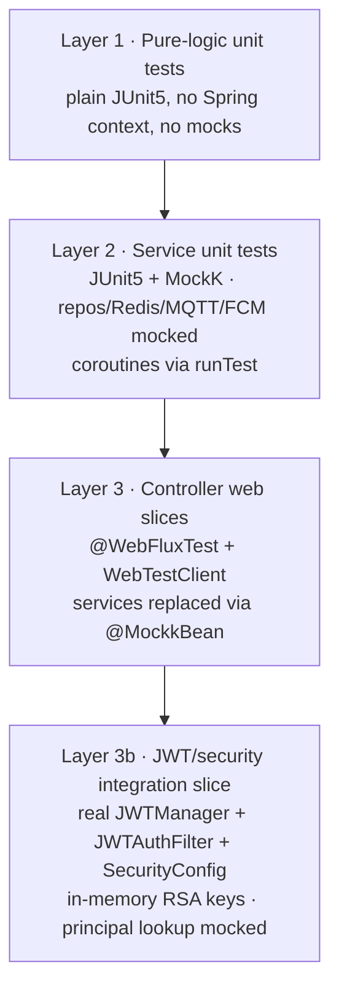

# Test Coverage Spec

**Status**: Approved design — ready for implementation planning
**Created**: 2026-06-08
**Scope**: `backend/` (Kotlin/Spring Boot) + `web/` and `client-web/` (Next.js)
**Source plan**: `docs/planned/Backend Remaining Plan.md` → "P2 — Test Coverage"

---

## 1. Overview

The codebase is feature-complete across backend, both frontends, and firmware, but has **zero automated tests** — `backend/src/test/` is empty and neither Next.js app has a test runner installed. This spec defines a professional, maintainable unit-test suite that completes the SDLC.

The single hard constraint that shapes every decision: **tests must not touch real infrastructure**. No PostgreSQL/TimescaleDB, no Redis, no MQTT broker, no Firebase, no TestContainers. All I/O collaborators are mocked. Tests are fast, deterministic, and runnable anywhere with no `docker compose up`.

### Goals

- A representative, high-value unit suite — every pure-logic class plus the highest-risk services and controllers.
- Fully DB-free / infra-free via mocking.
- Coverage reporting wired up (Kover for backend, Vitest V8 for frontends), generated on demand.
- Foundations that make adding future tests trivial (test harness, helpers, naming conventions).

### Non-goals

- No end-to-end / browser automation (no Playwright, Cypress).
- No DOM-rendering component tests on the frontend (logic, stores, and i18n parity only).
- No firmware tests — the three ESP32/ESP8266 codebases are out of scope.
- No hard coverage threshold that fails the build (reporting only; a gate can be added later).
- No exhaustive 1:1 test-per-class mandate — trivial CRUD pass-throughs and DTO/entity data classes are skipped deliberately.

---

## 2. Principles & Constraints

- **Mock at the I/O boundary.** Services are tested with their repositories, `ReactiveRedisTemplate`, MQTT publisher, and FCM service replaced by MockK mocks. Pure-logic classes are tested directly with no mocks.
- **Coroutines, not Mono/Flux.** All services use `suspend` functions, so tests use `kotlinx-coroutines-test` (`runTest`) and MockK's coroutine API (`coEvery` / `coVerify`). Both dependencies are already present in `build.gradle.kts`.
- **Representative over exhaustive.** Coverage targets are chosen by risk and complexity (see §3.3, §3.4), not by counting classes.
- **Match existing conventions.** Test packages mirror `main`; Kotlin tests use backtick descriptive names; frontend follows existing Biome formatting (2-space indent, organized imports).
- **No new UI components and no UI changes.** This work adds tests only; it does not alter any runtime code. (If a test reveals a genuine bug, that is reported separately — not silently patched inside this effort.)

---

## 3. Backend Test Architecture (Kotlin / Spring Boot / WebFlux)

### 3.1 Tooling additions

Already declared (no change needed): `spring-boot-starter-test`, `reactor-test`, `kotlin-test-junit5`, `kotlinx-coroutines-test`, `spring-security-test`, `junit-platform-launcher`.

Three additions to `backend/build.gradle.kts`, verified against current releases via Context7:

```kotlin
plugins {
    // ...existing plugins...
    id("org.jetbrains.kotlinx.kover") version "0.9.8" // pin to latest 0.9.x at install
}

dependencies {
    // ...existing testImplementation entries...
    testImplementation("io.mockk:mockk:1.13.13")            // latest stable 1.13.x at install
    testImplementation("com.ninja-squad:springmockk:5.0.1") // 5.x targets Spring Boot 3.4+/3.5
}
```

> **Version verification note (carry into the plan):** confirm the latest stable versions at install time. `springmockk` 5.x is the line compatible with Spring Boot 3.4+/3.5 (the project is on 3.5); 4.x targets 3.0–3.3 and must **not** be used here. Kover task names (`koverHtmlReport`, `koverXmlReport`, `koverVerify`, `koverLog`) and the `kover { reports { filters { … } } }` DSL below were verified against Kover 0.9.x.

> **JDK-proxy caveat:** if any slice test needs to spy on a JDK dynamic proxy, MockK requires `--add-opens java.base/java.lang.reflect=ALL-UNNAMED` on the test task. Add this to `tasks.test { jvmArgs(...) }` only if a proxy-spy test actually needs it — not pre-emptively.

### 3.2 The three layers



### 3.3 Layer 1 — pure-logic unit tests

No Spring, no mocks (or trivial mocks only). Highest value per line.

| Target | What is asserted |
| --- | --- |
| `core/jwt/JWTManager` | issue → verify round-trip (RS512); verify uses the public key only; expired/tampered/wrong-key tokens rejected. `issue(id: UUID, roles: List<String>)` and `verify(token)` are both `suspend`. `RSAKeyProperties` is **mocked** with an in-test-generated RSA-2048 keypair — no PEM files needed. |
| `core/jwt/TokenHashUtil` | `object` with `sha256(token): String` — stable hashing, equal input → equal hash, different input → different hash. |
| `core/security/Argon2PwdEncoder` | This is a `@Configuration`; test the `passwordEncoder(): Argon2PasswordEncoder` bean it produces — `encode` → `matches` round-trip, wrong password rejected. (Thin; confirms our encoder choice works.) |
| `core/device/DeviceCommandSigner` | ECDSA P-256 (`SHA256withECDSA`, **non-deterministic**) — `sign(canonical)` returns a Base64 signature that **verifies** against the matching public key. Assert verify (not equality, since ECDSA is randomized). Uses a test EC keypair from `src/test/resources`. |
| `core/device/DeviceCanonical` | `object`; canonical strings are exact, stable, pipe-delimited (e.g. `activate(...)` → `"activate-v1\|$challengeId\|$nonce\|$issuedAtInstant\|$expiresAtInstant"`) and differ per input. |
| `core/device/DevicePublicIdMinter` | `suspend fun mint(kind: DeviceKind)` → prefix by kind (`rcv`/`pas`/`hub`) + 5-char Crockford suffix; mocked `DeviceRepository.existsByPublicId`; all-collision path throws `IllegalStateException`. |
| `core/tenant/JoinCodeGenerator` | `object`; `generate(prefix)` → starts with prefix (`o_`/`s_`), expected length, url-safe charset, distinct across calls. |
| `core/redis/RedisKeyManager` | `object`; exact key strings (`queue(id)` → `store:$id:queue`, `ticket(id,t)` → `ticket:$id:$t`, …) and round-trips (`parseTicketKey(ticket(...))`, `isTicketKey`). |
| `core/redis/RedisTTLPolicy` | `object` with `Duration` constants: `TICKET_WAITING`=12h, `TICKET_CALLED`=30min, `TICKET_TERMINAL`=2h, `FCM_TOKEN`=12h, `REFRESH_TOKEN`=7d, `JOIN_REQUEST`=7d. |
| `domain/queue/service/NoShowPolicy` | the package-level `internal fun resolveApplicableNoShowSettings(store: Store?, settings: StoreSettings?): StoreSettings?` — returns `settings` only when `store?.allowNoShow == true`, else `null` (covers null store/settings). (`internal` is visible from the test source set.) The SKIP/REQUEUE decision itself lives in `QueueService.handleNoShow`, which is Lua-backed — §3.7. |
| `domain/store/service/SlugValidator` | `object`; `validate(slug)` throws `IllegalArgumentException` for length `<3`/`>128`, bad pattern (leading/trailing/double hyphen, non-alnum), and reserved words (`api`, `admin`, …); valid slugs pass. |

> JWT test keys: `RSAKeyProperties` is mocked and an RSA-2048 keypair is generated in-test (`KeyPairGenerator`), so no PEM fixtures are required for JWT. The `DeviceCommandSigner` test is the only one needing a fixture — a test EC P-256 keypair under `src/test/resources/rsa/`. Production keys are never used in tests.

### 3.4 Layer 2 — service unit tests (MockK)

Each service is constructed with MockK mocks for its collaborators. Skeleton (illustrative — the exact stubs and verifications depend on the code path under test; assertions use AssertJ, which `spring-boot-starter-test` already bundles):

```kotlin
@ExtendWith(MockKExtension::class)
class QueueServiceTest {

    // QueueService has 15 collaborators; @InjectMockKs wires every @MockK field into it.
    // Redis-backed repositories are stubbed with coEvery; broadcasters/notifiers are relaxed.
    @MockK lateinit var redisQueueRepository: RedisQueueRepository
    @MockK lateinit var storeSettingsRepository: StoreSettingsRepository
    @RelaxedMockK lateinit var queueEventBroadcaster: QueueEventBroadcaster
    // ...remaining collaborators declared the same way...

    @InjectMockKs lateinit var service: QueueService

    @Test
    fun `cleanupServingSet removes orphaned tickets`() = runTest {
        // cleanupServingSet is plain Kotlin over the repos (no Lua) — a good unit target
        every { redisQueueRepository.getServingTickets(storeId) } returns flowOf(ghostId.toString())
        coEvery { redisTicketRepository.exists(storeId, ghostId) } returns false
        coEvery { redisQueueRepository.removeFromServing(storeId, ghostId) } returns 1L

        val cleaned = service.cleanupServingSet(storeId)

        assertThat(cleaned).isEqualTo(1)
        coVerify { redisQueueRepository.removeFromServing(storeId, ghostId) }
    }
}
```

> `QueueService`'s constructor takes 15 dependencies (`StoreRepository`, the three Redis repositories, `ReactiveRedisTemplate`, `ObjectMapper`, optional `MqttPublisher`/`FcmNotificationService`/`AnalyticsEventService`/`AnalyticsQueryService`, `QueueEventBroadcaster`, `DeviceDispatchEventBroadcaster`, `DeviceQueryService`, `StoreSettingsRepository`, `ServiceTypeRepository`). `@InjectMockKs` is the pragmatic way to wire them; `ObjectMapper` may be passed real rather than mocked. The optional (`= null`) collaborators can be left null when a path does not exercise them.

Target services (risk-ranked; **bold = must cover**):

- **`QueueService`** — only the **non-Lua, Kotlin-logic** methods are unit-tested: `getQueueState`/`setQueueState`, `getQueueSize`, `getTicketStatus`, `listWaitingTickets`, `cleanupServingSet`, `getTicketDto`. The Lua-backed lifecycle methods (`issueTicket`, `callNext`, `callSpecificTicket`, `handleNoShow`) are covered only at the wrapper level (§3.7) — their core logic runs inside Redis.
- **`AdminAuthService`** — implements `ReactiveUserDetailsService.findByUsername(username): Mono<UserDetails>`; returns the `AdminPrincipal` when the username exists (regardless of `isVerified` — verification is enforced downstream) and an empty `Mono` when not. Full login orchestration lives in `AuthController` (tested at the slice layer).
- **`SessionService`** — `createSession`, `listSessions`, `revokeSession`, `revokeAllOtherSessions`, `isRevoked`, cleanup. Mock `AdminSessionRepository`, `ReactiveRedisTemplate`, `JWTProperties`.
- **`RegistrationService`** / **`JoinRequestService`** — registration modes, join-code create/approve/reject flow, username-reservation. (Both are `@Transactional`; transactions are a no-op under mocks.)
- **Device services** — `HubDiagnosticsService.loadDiagnostics`/`recordMqttDiagnostics` (Redis-backed, mockable). `getHubHealthSummary` uses R2DBC `DatabaseClient` directly and is **not** unit-tested DB-free (§3.7). `EnrollmentTokenService` issue/consume (Redis + signing). `DeviceDispatchService` depends on `QueueService` and is descoped from unit tests.
- **`AnalyticsQueryService`** — `getRealtimeStats` and the period/range query methods: map repository rows + Redis counts to the response DTOs (mock `AnalyticsEventRepository`/`RedisQueueRepository`/`RedisCounterRepository`/`StoreRepository`/`ReactiveRedisTemplate` to return canned values).
- `AdminService`, `StoreService`, `StoreSlugService` — non-trivial branches only (validation, guards, pagination math); skip pure pass-throughs.

Skipped on purpose: schedulers that only wrap a repository call on a cron (`*CleanupScheduler`) beyond a single "delegates + handles empty" test; entities/DTOs/request records (no logic).

### 3.5 Layer 3 — controller web slices

`@WebFluxTest(controllers = [XController::class])` + `WebTestClient`, with services replaced by `@MockkBean`. Asserts routing, request/response JSON (de)serialization, bean-validation rejections (400), and error mapping through the global `@RestControllerAdvice`.

**Integration concern that MUST be handled (flagged for the plan):** the WebFlux test slice includes `WebFilter` beans in its component filter, and the app declares `JWTAuthFilter` and `RateLimitFilter` as `@Component` `CoWebFilter`s (a `CoWebFilter` *is* a `WebFilter`). The slice therefore instantiates them, and they transitively require infrastructure: `JWTAuthFilter` → `JWTToPrincipal` → `AdminRepository` (DB), and `RateLimitFilter` → `RateLimiter` → `ReactiveRedisTemplate` (Redis). The app's `SecurityConfig` (a `@Configuration`) is **not** auto-loaded by the slice, but Spring Security auto-config still applies a default chain. Left unmanaged, the context fails to start because the two filters' dependencies can't be satisfied.

Resolution (chosen approach):

1. **Exclude the two custom filters** from the slice so their Redis/DB dependencies are never created:
   `@WebFluxTest(controllers = [XController::class], excludeFilters = [ComponentScan.Filter(type = FilterType.ASSIGNABLE_TYPE, classes = [JWTAuthFilter::class, RateLimitFilter::class])])`.
2. Import a permissive test `SecurityWebFilterChain` via a `@TestConfiguration` (`authorizeExchange { anyExchange().permitAll() }` + CSRF disabled) so the default auto-config chain does not 401 everything.
3. For authority-gated endpoints, inject auth per-request with reactive `spring-security-test` — `webTestClient.mutateWith(SecurityMockServerConfigurers.mockAuthentication(adminPrincipalAuthToken))` — exercising SUPER_ADMIN vs ADMIN without a real JWT or DB lookup.
4. Any remaining required collaborator beans are supplied as `@MockkBean`.

Public endpoints (`/api/auth/**`, `/api/queue/public/**`) are tested without auth; protected endpoints with the mocked authentication. Rate-limit behavior itself is **not** asserted at this layer (it requires Redis — see §3.7).

Controllers to cover: `AuthController`, `AdminController`, `QueuePublicController`, `QueueAdminController`, `DeviceAdminController`, `AnalyticsController`, `StoreSlugController`. (`JoinRequestController`, `EnrollmentTokenController`, `StoreController` if time permits — same pattern.)

### 3.6 Layer 3b — JWT / security integration slice

One focused integration test that wires the **real** `JWTManager` + `JWTToPrincipal` + `JWTAuthFilter` into a **test `SecurityWebFilterChain` that mirrors `SecurityConfig`'s rules** (permit `/api/auth/**` + `/api/queue/public/**`, authenticate the rest, add `jwtAuthFilter` at `AUTHENTICATION` order), fronting a tiny stub controller (one public route, one authenticated route, one role-gated route).

Why a mirrored chain instead of importing the real `SecurityConfig` bean: `SecurityConfig`'s constructor also requires `RateLimitFilter` (→ `RateLimiter` → `ReactiveRedisTemplate`), which would drag Redis into the test. The mirrored chain reproduces the auth behavior without the rate-limit filter. `JWTAuthFilter`'s real constructor is `(AppProperties, JWTManager, JWTToPrincipal, ObjectMapper, SessionService)` and it skips `/api/auth/login|logout|refresh`. Mocks: `RSAKeyProperties` (in-test RSA keypair), `AdminRepository` (the principal lookup inside `JWTToPrincipal`), and `SessionService` (`isRevoked` → false) — so **no DB and no Redis**.

Assertions:

- Public route reachable without a token.
- Authenticated route → 401 without/with invalid token, 200 with a valid issued token.
- Authorities are sourced from the (mocked) DB role, **not** from JWT claims — a token whose `roles` claim disagrees with the mocked DB role is authorized by the DB role (regression guard for audit round 4).
- `JWTAuthFilter` writes a structured JSON error and does **not** continue the chain on failure.

### 3.7 Known limitations (documented, not worked around)

- **Redis Lua scripts are not executed.** `RateLimiter` and the queue repositories run atomic logic inside Redis via Lua. Without Redis those scripts cannot run, so tests cover the **Kotlin wrappers** (key construction, ARGV assembly, tier selection, result mapping) with a mocked `ReactiveRedisTemplate`, not the Lua semantics themselves. This boundary is stated explicitly in the test files.
- **Scheduler timing** (`@Scheduled`) is not exercised; scheduler *logic* is tested by calling the method directly.
- **FCM/MQTT network behavior** is mocked; only the call contract (right payload, right topic/token, right trigger point) is asserted.
- **R2DBC `DatabaseClient` queries are not unit-tested.** Methods that build SQL through `DatabaseClient` directly (e.g. `HubDiagnosticsService.getHubHealthSummary`, and `DeviceDispatchService`'s `QueueService` dependency) can't run DB-free without mocking an entire fluent SQL chain; they are descoped from unit tests and noted in the affected test files.

### 3.8 Layout & naming

```
backend/src/test/kotlin/com/thomas/notiguide/
├── core/jwt/JWTManagerTest.kt
├── core/redis/RedisKeyManagerTest.kt
├── domain/queue/service/QueueServiceTest.kt
├── domain/queue/controller/QueueAdminControllerTest.kt
├── domain/admin/service/AdminAuthServiceTest.kt
├── security/JwtSecurityIntegrationTest.kt
└── ... (mirrors main package; suffix *Test.kt)
```

Optional shared helpers under `src/test/kotlin/.../support/` (e.g. `TestRsaKeys`, `TestSecurityConfig`, fixture builders). The empty `contextLoads()`-style application test is **not** added — it would boot the full context and pull in Redis/DB, contradicting the no-infra constraint.

---

## 4. Frontend Test Architecture (Vitest — both apps)

The Vitest **setup** (config, scripts, deps) is identical in `web/` and `client-web/`; the **targets differ per app**. Both are Next.js 16 / React 19 / TypeScript 5, Biome-formatted, Yarn 4 (`node-modules` linker), and both use the `@/* → ./src/*` path alias. Critically, the two apps have very different surface area: `web` (admin) has the rich module set (`password-validation`, `api-error`, `user-agent`, `serial/`, and `auth`/`queue`/`layout` stores; messages use rich-text tags). `client-web` (client) currently has only a `ticket` store, `types/api` error classes, and message catalogs (plain strings, **no** rich-text tags). The plan's targets reflect what each app actually ships — verified against source.

### 4.1 Tooling

```jsonc
// devDependencies added to each app's package.json (pin to latest stable at install)
"vitest": "^3",
"@vitest/coverage-v8": "^3",   // MUST match the vitest major version exactly
"vite-tsconfig-paths": "^5"     // resolves the "@/" alias inside Vitest
```

The chosen scope (pure logic + zustand stores + i18n parity) needs **no DOM**, so the default test environment is `node` — no `jsdom`, no `@testing-library/*` required for this round. Testing Library / jsdom are intentionally deferred: they are only needed if component-rendering tests are added later, which is out of scope here. (This keeps the dependency footprint honest; the selected "Vitest + Testing Library" runner is satisfied by Vitest, with Testing Library held in reserve for a future component-test round.)

### 4.2 Config

`vitest.config.ts` in each app root, verified against Vitest 3.x:

```ts
import { defineConfig } from "vitest/config";
import tsconfigPaths from "vite-tsconfig-paths";

export default defineConfig({
  plugins: [tsconfigPaths()], // make "@/..." imports resolve to ./src/...
  test: {
    environment: "node",
    include: ["src/**/*.test.ts"],
    coverage: {
      provider: "v8",
      include: ["src/lib/**", "src/store/**", "src/types/**"],
    },
  },
});
```

`package.json` scripts added to each app:

```jsonc
"test": "vitest run",
"test:watch": "vitest",
"test:coverage": "vitest run --coverage"
```

> Biome already lints `*.ts`, so `*.test.ts` files are covered by `yarn lint` with no extra config. Existing `useIgnoreFile`/`.gitignore` behavior is unaffected.

### 4.3 Targets — `web` (admin)

**Pure modules** (`src/lib/**`):
- `password-validation` — `getPasswordRequirementStatuses(password)` (all four `reqUppercase`/`reqLowercase`/`reqDigit`/`reqSpecial` statuses across inputs) and `getFirstMissingPasswordRequirementKey(password)` (first miss / `null` when all pass).
- `api-error` — `translateCommonApiError(error, tErrors)` and `translateNetworkError(tErrors)`: pass a fake `tErrors` spy and assert the right error key is chosen per `ApiError.code`/`error`.
- `user-agent` — `parseUserAgent(ua)` → `{ browser, os, isMobile }` for known UA strings + the `null` input case.
- `serial/serial-protocol` — `SerialProtocol` is a stateful class whose methods need a `SerialPort`; unit scope is limited to construction and the `events` `EventTarget` surface (full protocol exchange needs a mock serial port and is descoped). The companion `serial/support` helper (capability check) is the higher-value pure target if present.

**Zustand stores** (`src/store/**`): `useAuthStore`, `useQueueStore`, `useLayoutStore` (named exports). Tested via `useXStore.getState()` + actions, capturing the initial state and restoring it with `setState(initial, true)` between tests — no React render. Assert action reducers and state transitions (e.g. `login(response)` sets `isAuthenticated`/`isSuperAdmin`; `addServingTicket`/`removeServingTicket`/`clearServing`; `setPageGradientClass`/`clearPageGradientClass`).

**i18n parity** — load `src/messages/{en,vi}.json` and enforce the CLAUDE.md mirroring rule: identical deep key sets; and for every leaf, equal `<p>` block count and the same rich-text tags (`<bold>`, `<shield>`, …) in each language. `web` messages **do** contain these tags.

### 4.3b Targets — `client-web` (client)

- **`useTicketStore`** (`src/store/ticket.ts`, named export, `zustand/middleware` persist `name: "notiguide-ticket"`): `setTicket(storeId, ticket)`, `updateStatus(status)`, `clearTicket()`, `hasActiveTicket(storeId)`. Reset persisted state between tests via `useTicketStore.setState(initial, true)` and clear the storage key.
- **`types/api` error classes**: `ApiError(code, error, message, path?)`, `NotFoundError`, `RateLimitError(message, retryAfterSeconds, path?)`, `NetworkError` — assert field assignment, `instanceof` inheritance (`NotFoundError`/`RateLimitError` are `ApiError`; `NetworkError` is `Error`), and `message` propagation.
- **i18n parity** — identical deep key sets, **and** matching ICU `{placeholder}` tokens per corresponding leaf. `client-web` messages contain **no** rich-text tags, so the parity test for this app omits the `<p>`/tag checks (only keys + placeholders).

The parity helper is shared in shape but parameterized per app (web adds tag/`<p>` assertions; client-web adds `{placeholder}` assertions). Both enforce *structure*, not wording — Vietnamese phrasing quality stays a human-review concern.

### 4.4 Layout & naming

Co-located `*.test.ts` next to source. Examples — `web`: `src/lib/password-validation.test.ts`, `src/store/auth.test.ts`, `src/messages/parity.test.ts`. `client-web`: `src/store/ticket.test.ts`, `src/types/api.test.ts`, `src/messages/parity.test.ts`. Matches the flat, feature-local structure already used in the apps.

---

## 5. Coverage Tooling

- **Backend (Kover 0.9.x):** apply the plugin; reports via `./gradlew koverHtmlReport` / `koverXmlReport`. Exclude no-logic classes so the number reflects meaningful coverage:

  ```kotlin
  kover {
      reports {
          filters {
              excludes {
                  classes(
                      "com.thomas.notiguide.*.entity.*",
                      "com.thomas.notiguide.*.dto.*",
                      "com.thomas.notiguide.*.request.*",
                      "com.thomas.notiguide.*.response.*",
                  )
                  annotatedBy("org.springframework.context.annotation.Configuration")
              }
          }
      }
  }
  ```

- **Frontend (Vitest V8):** `yarn test:coverage` per app, scoped to `src/lib/**` + `src/store/**` (see §4.2).
- **No failing gate.** Reports are informational. `koverVerify` / Vitest `coverage.thresholds` are left unconfigured; a gate can be added later without rework.

---

## 6. Verification Commands

Lint-first, per standing project preference (lint → then test/build):

| Scope | Command sequence |
| --- | --- |
| Backend | `cd backend && ./gradlew test` then (optional) `./gradlew koverHtmlReport` |
| `web` | `cd web && yarn lint && yarn test` then (optional) `yarn test:coverage` |
| `client-web` | `cd client-web && yarn lint && yarn test` then (optional) `yarn test:coverage` |

These commands are **documented for the project's existing audit/verification flow** — this effort does not auto-run builds after writing tests (per project convention that a separate audit flow owns building/running).

---

## 7. Process & Conventions

- **No git commits** are part of this work or the resulting plan — the executor decides when to commit.
- **No commit steps in the implementation plan.**
- **CHANGELOGS:** every file added/changed (including any deliberately skipped target) is logged in `docs/CHANGELOGS.md` during implementation.
- **No runtime code changes.** Tests only. A bug surfaced by a test is reported, not silently fixed within this scope.
- **Bilingual / UI rules:** no user-facing UI is produced, so the bilingual-copy, alert-box, hyperlink, and Web Styles rules do not apply to this work. The one place i18n is touched — the parity test — *enforces* the existing `en.json`/`vi.json` mirroring rule rather than adding copy.
- **Docs:** Mermaid (not ASCII) for any diagrams, consistent with repo convention.

---

## 8. Risks & Open Considerations

| Risk | Mitigation |
| --- | --- |
| `springmockk` version vs Spring Boot 3.5 | Use the 5.x line (targets Spring Boot 3.4+); confirm the exact latest at install. If an incompatibility surfaces, pin the springmockk version its release notes confirm for Spring Boot 3.5 — do **not** switch to Spring's `@MockitoBean`, which is Mockito-based and conflicts with the MockK approach. |
| WebFlux slice pulling in Redis/DB-backed filters | Permissive `@TestConfiguration` security chain + `@MockkBean` collaborators (see §3.5). This is the main setup risk; prototype one controller slice first to validate the harness before fanning out. |
| Vitest not resolving `@/` alias | `vite-tsconfig-paths` plugin (verified); fall back to explicit `resolve.alias` if needed. |
| `@vitest/coverage-v8` major-version mismatch with `vitest` | Pin both to the same major (`^3`). |
| Frontend module presence differs between apps | The plan verifies each target module exists per app and skips/notes absent ones (e.g. serial module may be `web`-only). |
| MockK + coroutine `runTest` interplay | Use `coEvery`/`coVerify` for all `suspend` collaborators; `kotlinx-coroutines-test` already present. |

---

## 9. Success Criteria

1. `backend/src/test/` contains the three-layer suite; `./gradlew test` passes with **no infrastructure running** (no Docker, no Redis, no DB).
2. Both `web` and `client-web` have a working `vitest run` (node environment, no DOM/runtime services) covering each app's actual modules — `web`: lib + the three stores + i18n parity; `client-web`: the `ticket` store + `types/api` + i18n parity.
3. The i18n parity test fails loudly if `en.json` and `vi.json` diverge — for `web`, on key-set / `<p>` / rich-text-tag mismatch; for `client-web`, on key-set / ICU `{placeholder}` mismatch (proven by a temporary divergence during development, then reverted).
4. Coverage reports generate on demand for backend (Kover) and both frontends (Vitest V8).
5. Every added file is reflected in `docs/CHANGELOGS.md`.
6. No runtime/production code was modified to make tests pass.
