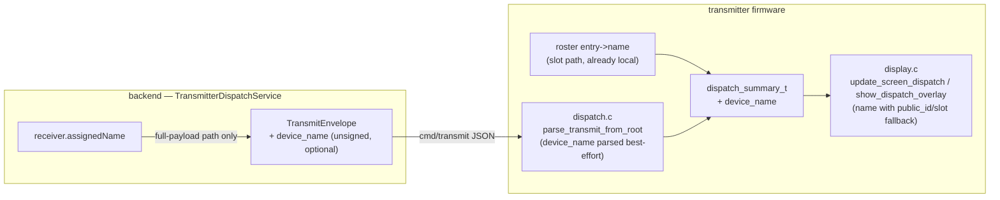

# Transmitter Dispatch Device Name — Spec

**Status:** Approved design, ready for implementation planning
**Scope:** `backend/` (Kotlin/Spring Boot) + `transmitter/` firmware (ESP-IDF v6.0, LVGL on SSD1306 128×64 OLED)
**Date:** 2026-06-09

---

## 1. Overview

When a ticket is dispatched, the transmitter's OLED currently identifies the target receiver by its opaque `public_id` (full-payload path) or `slot-N` (hub-paired path). This spec adds the receiver's human-readable name (`device.assigned_name`, e.g. `Table 5`) to that display, for **both** dispatch paths.

The change is deliberately **incremental and non-breaking**: it does **not** bump the wire protocol version, does **not** alter the command signature, and requires **no lockstep firmware/backend deploy**. Old firmware tolerates the new field; new firmware tolerates its absence.

### Two dispatch paths (recap)

The hub receives both kinds of dispatch on `…/transmitter/hub/{hubPublicId}/cmd/transmit`:

| Path | Selector | Receiver name available where? |
|---|---|---|
| **Slot-based** (hub-paired receivers, `hub_slot != null`) | `SlotDispatchEnvelope` (`slot`, `action`) | **Already local** — the hub's roster (`roster_entry_t.name`) is kept in sync by the backend via the separate `…/cmd/label` topic. The slot handler already fetches the matching `roster_entry_t` at dispatch time. |
| **Full-payload** (non-paired receivers, `public_id`, no `hub_slot`) | `TransmitEnvelope` (`rf_code_hex`, `band`, …) | **Not local** — no roster entry exists. The name must travel in the packet. |

This asymmetry drives the design: the slot path reads the name it already holds (zero backend/protocol change), and only the full-payload path gains a new packet field.

## 2. Goals / Non-goals

**Goals**

- Show `assigned_name` on the OLED dispatch detail screen (`update_screen_dispatch`) and the transient dispatch overlay (`show_dispatch_overlay`), for both paths.
- Fall back to the existing identifier (`public_id` / `slot-N`) when no name is present.
- Preserve full backward and forward compatibility across mixed backend/firmware versions.

**Non-goals**

- No change to the signed canonical or signature verification (`device_name` is **display-only / unauthenticated** — see §6).
- No change to the slot dispatch wire format (`SlotDispatchEnvelope`).
- No change to the backend→firmware ack payloads (`device_name` is not echoed in acks).
- No change to RF behavior, dispatch tracking, or the `cmd/label` roster-name sync mechanism.

## 3. Approved decisions

| Decision | Choice |
|---|---|
| Source of the name | `Device.assignedName` (DB column `device.assigned_name`) of the **target receiver**. |
| Slot-based path | **No packet/backend change.** Firmware copies the name it already holds in the roster entry into the dispatch summary. |
| Full-payload path | Backend adds an optional `device_name` field to the `cmd/transmit` JSON; firmware parses it best-effort. |
| Signing | **Unsigned / display-only.** `device_name` is **not** added to `DeviceCanonical.transmit(...)` and **not** passed to the signer. No `schema_version` bump (stays `1`); canonical tag stays `transmit-v1`. |
| Name length bound | `DISPATCH_DEVICE_NAME_MAX_LEN = 48` on the firmware (roster permits 96, OLED truncates to ~12; 48 is ample and keeps the in-process event struct small). Backend does not truncate; oversize names are truncated by `strlcpy` on ingest. |
| Display fallback | Show `device_name` when non-empty; otherwise the existing `receiver_public_id` / `slot-N`. |

## 4. Data flow



## 5. Detailed changes

### 5.1 Backend — `TransmitterDispatchService.kt` (full-payload path only)

Add an optional, display-only field to the `TransmitEnvelope` data class (promoting it from `private` to `internal` for testability — see §8). Place it **outside** the signed canonical.

```kotlin
import com.fasterxml.jackson.annotation.JsonInclude   // new named import
import com.fasterxml.jackson.annotation.JsonProperty   // existing

// Promoted from `private` to `internal` so the same-module serialization test (§8) can
// construct and serialize it. Still not part of the public API.
internal data class TransmitEnvelope(
    @field:JsonProperty("schema_version")
    val schemaVersion: Int = 1,
    @field:JsonProperty("dispatch_id")
    val dispatchId: UUID,
    @field:JsonProperty("receiver_public_id")
    val receiverPublicId: String,
    val band: String,
    @field:JsonProperty("rf_code_hex")
    val rfCodeHex: String,
    @field:JsonProperty("rf_code_bits")
    val rfCodeBits: Int,
    @field:JsonProperty("proto_any")
    val protoAny: Boolean,
    @field:JsonProperty("issued_at")
    val issuedAt: String,
    @field:JsonProperty("device_name")
    @field:JsonInclude(JsonInclude.Include.NON_NULL)
    val deviceName: String?,
    @field:JsonProperty("signature_b64")
    val signatureB64: String
)
```

In `buildPayload(...)`, set `deviceName = receiver.assignedName` (the `receiver: Device` is already in scope). **Do not** add the name to `DeviceCanonical.transmit(...)` and **do not** pass it to `signer.sign(...)` — the signed canonical is unchanged:

```kotlin
return TransmitEnvelope(
    dispatchId = dispatchId,
    receiverPublicId = requireNotNull(receiver.publicId),
    band = patched.band,
    rfCodeHex = rfCodeHex,
    rfCodeBits = patched.bits,
    protoAny = patched.protoAny,
    issuedAt = issuedAt.toInstant().toString(),
    deviceName = receiver.assignedName,   // unsigned, omitted from JSON when null
    signatureB64 = signer.sign(canonical) // canonical unchanged
)
```

> `@field:JsonInclude(JsonInclude.Include.NON_NULL)` is verified current API (Jackson 2.x/3.x, `jackson-databind`). When `assignedName` is null the key is omitted entirely; the firmware treats absence and empty string identically.

**`SlotDispatchEnvelope`, `DeviceCanonical`, `DeviceCommandSigner`: unchanged.**

### 5.2 Firmware — shared constant & summary struct (`events/transmitter_events.h`)

```c
#define DISPATCH_DEVICE_NAME_MAX_LEN 48

typedef struct {
    char receiver_public_id[48];
    char band[8];
    int  rf_code_bits;
    bool proto_any;
    char status[16];
    char reason[32];
    int64_t applied_at_ms;
    char source[8];
    char device_name[DISPATCH_DEVICE_NAME_MAX_LEN];   // new, display-only
} dispatch_summary_t;
```

`dispatch_summary_t` is passed by value through `esp_event_post(..., &summary, sizeof(summary), ...)` and read from the same header, so producers and consumers stay in lockstep automatically. `dispatch.c` already includes `events/transmitter_events.h`, so the constant is shared.

> **The struct has more than one producer/consumer; appending a trailing member is safe for all and only `dispatch.c` changes.** Producers: `dispatch.c` `post_dispatch_event` (MQTT — edited here) and `serial_protocol.c` (serial/USB dispatch — `summary = { 0 }`, no name source, stays empty → falls back to `public_id`, intentionally unchanged). Consumers: `display.c` (whole-struct `memcpy`), `dispatch_counters.c` (counts named fields), `serial_protocol.c` (reads named fields into a serial event), and `controls.c` (reacts to the event id only). All zero-initialize and use `sizeof(...)`; none serializes the struct by fixed byte length, so the size change is absorbed automatically.

### 5.3 Firmware — `dispatch.c`

1. Add the field to `transmit_cmd_t`:

```c
typedef struct {
    char dispatch_id[48];
    char receiver_public_id[48];
    char band[8];
    char rf_code_hex[16];
    char issued_at[40];
    char signature_b64[DEVICE_IDENTITY_SIGNATURE_B64_MAX_LEN];
    char device_name[DISPATCH_DEVICE_NAME_MAX_LEN];   // new
    int rf_code_bits;
    bool proto_any;
    bool has_dispatch_id;
} transmit_cmd_t;
```

2. In `parse_transmit_from_root`, parse `device_name` **best-effort, outside the required-field `&&` chain** so a missing field never fails the parse and the signed fields are untouched. The struct is `memset` to zero at the top, so absence leaves an empty string:

```c
    cmd->has_dispatch_id = cmd->dispatch_id[0] != '\0';
    // Optional, display-only; intentionally NOT part of `ok` and NOT in the canonical.
    (void)json_copy_string(root, "device_name", cmd->device_name, sizeof(cmd->device_name));
    return ok;
```

3. `verify_transmit_signature` is **unchanged** — it reconstructs `transmit-v1|…|issued_at` without `device_name`, so signatures from any backend (with or without the field) still verify.

4. In `slot_to_transmit_cmd`, populate the name from the roster entry the handler already resolved:

```c
    if (entry != NULL) {
        strlcpy(tx_cmd->device_name, entry->name, sizeof(tx_cmd->device_name));
    }
```

5. In `post_dispatch_event`, carry the name into the summary:

```c
    strlcpy(summary.device_name, cmd->device_name, sizeof(summary.device_name));
```

> This routes through both paths: the full-payload handler fills `cmd->device_name` from JSON; the slot handler fills it via `slot_to_transmit_cmd` from the roster. Reject/best-effort paths leave it empty, which the display treats as "no name."

### 5.4 Firmware — `display.c`

**Dispatch detail screen — `update_screen_dispatch` (~L801).** Prefer the name, fall back to the id:

```c
    const char *to = s_last_dispatch.device_name[0]
                       ? s_last_dispatch.device_name
                       : s_last_dispatch.receiver_public_id;
    (void)snprintf(buf, sizeof(buf), "To:   %s", to);   // buf is char[64]
```

**Dispatch overlay — `show_dispatch_overlay` (~L1349).** Show a truncated name when present, else the existing 8-char id. Widen the short buffer from `char[9]`/`%.8s` to `char[13]`/`%.12s`:

```c
    char receiver_short[13];
    if (summary->device_name[0]) {
        (void)snprintf(receiver_short, sizeof(receiver_short), "%.12s", summary->device_name);
    } else {
        (void)snprintf(receiver_short, sizeof(receiver_short), "%.8s",
                       summary->receiver_public_id[0] ? summary->receiver_public_id : "--");
    }
```

The downstream `tx_line` (`char[64]`, format `">TX %s %s [%s]"`) comfortably fits a 12-char name + band + short source tag.

## 6. Security considerations

`device_name` is **not authenticated**. It is excluded from the canonical, so the signature does not cover it. Accepted because:

- All RF-critical fields (`receiver_public_id`, `band`, `rf_code_hex`, `rf_code_bits`, `proto_any`, `issued_at`) remain signed. A tampered name **cannot** change which RF code is transmitted or to which receiver.
- The only realistic tamper vector is a malicious/compromised MQTTS broker rewriting an in-flight, already-signed packet's name field — a cosmetic label swap with no functional effect.
- The slot path's name comes from the locally-held roster (synced over the authenticated `cmd/label` channel), not from the dispatch packet, so it carries the same trust as today's roster labels.

Signing the name would require a `transmit-v2` canonical on both sides shipped together (a breaking, lockstep deploy) — explicitly rejected as out of scope for this incremental change.

## 7. Compatibility matrix

| Backend | Firmware | Result |
|---|---|---|
| with `device_name` | with parse support | Name shown; signature verifies (canonical excludes name). ✅ |
| with `device_name` | **old** (no parse) | Extra JSON key ignored by cJSON; required fields unaffected; signature verifies. Falls back to `public_id`. ✅ |
| **old** (no field) | with parse support | `device_name` absent → empty after `memset` → falls back to `public_id`/`slot-N`. ✅ |
| old | old | Unchanged behavior. ✅ |

Slot path is identical across all combinations (name sourced locally; no wire dependency).

## 8. Testing & verification

**Backend (automated, JUnit):**

- **Primary test — serialization shape.** Assert that `TransmitEnvelope` emits `"device_name":"<assignedName>"` when set and **omits** the key when `assignedName` is null. `TransmitEnvelope` is currently file-`private`; to make this unit-testable, promote it to `internal` (visible to the same Gradle module's test source set, still not part of the public API) so a same-module test can construct and serialize it with the real `ObjectMapper`. This is the test that actually exercises this change on the backend.
- **Signature exclusion is structurally guaranteed, not test-enforced.** `DeviceCanonical.transmit(...)` has no `deviceName` parameter and `buildPayload` does not pass the name to `signer.sign(...)`, so it is impossible by construction to pull the name into the signed canonical — the type system enforces it. No assertion is required for this invariant; the existing `core/device/DeviceCanonicalTest.kt` already pins the canonical string format and needs no change. (Optional belt-and-suspenders: a one-line assert in the serialization test that the bytes fed to the signer in a service-level test exclude the name — only worth adding if a `TransmitterDispatchService` test harness is stood up, which does not exist today.)

**Firmware (manual / on-device):** the transmitter app code has **no host unit-test harness** (only third-party `managed_components` ship tests), so firmware changes are verified through the existing build + audit flow and on-device observation:

- Full-payload dispatch with a named receiver → OLED dispatch screen shows `To: <name>`; overlay shows the truncated name.
- Full-payload dispatch from a backend **without** the field → falls back to `public_id` (no regression, signature still verifies).
- Slot dispatch → OLED shows the roster name; unchanged-name receivers behave as before.

> Per project rules: do **not** build as part of implementation — the separate audit flow owns build/verification.

## 9. Relationship to in-flight work

The **Transmitter OLED Header & Clock Rework** (`docs/spec/Transmitter OLED Header & Clock Rework Spec.md`, same date) also edits `display.c`, but in disjoint regions — it touches the **header/status bar**, **Network Info screen**, and **time/NTP plumbing**, whereas this spec touches **`update_screen_dispatch`** and **`show_dispatch_overlay`**. No logical conflict is expected; the executor should still expect a textual merge in `display.c` if both land independently and should sequence/rebase accordingly.

## 10. Files touched

| File | Change |
|---|---|
| `backend/.../domain/device/service/TransmitterDispatchService.kt` | Add optional `device_name` to `TransmitEnvelope` (promote it `private`→`internal` for testability); set from `receiver.assignedName`; canonical/signer unchanged. |
| `backend/.../domain/device/service/` (new test) | Serialization test: `device_name` present when set, omitted when `assignedName` is null. |
| `transmitter/main/events/transmitter_events.h` | Add `DISPATCH_DEVICE_NAME_MAX_LEN`; add `device_name` to `dispatch_summary_t`. |
| `transmitter/main/dispatch/dispatch.c` | Add `device_name` to `transmit_cmd_t`; parse best-effort; populate slot path from roster; carry into summary. |
| `transmitter/main/display/display.c` | Name-with-fallback in `update_screen_dispatch` and `show_dispatch_overlay`. |
| `docs/CHANGELOGS.md` | Log all changes, including the deliberately-skipped slot-path backend change. |

## 11. Out of scope

- Authenticating the name (would force `transmit-v2`, breaking/lockstep).
- Echoing the name in acks or diagnostics/logs.
- Showing names on any screen other than the dispatch detail screen and overlay.
- Any change to the `cmd/label` roster-name sync mechanism.
