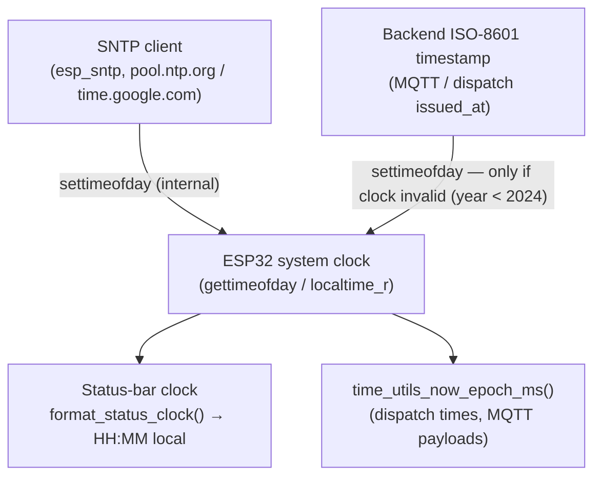

# Transmitter OLED Header & Clock Rework — Spec

**Status:** Approved design, ready for implementation planning
**Scope:** `transmitter/` firmware (ESP-IDF v6.0, LVGL on SSD1306 128×64 OLED)
**Date:** 2026-06-09

---

## 1. Overview

Three related changes to the transmitter's OLED UI, plus the time plumbing behind the status-bar clock:

1. **Header bar** — declutter the status bar, move connectivity to icons, and show a real-time clock instead of time-since-boot.
2. **Network Info screen** — remove the duplicated `Hub:` row and let the remaining rows breathe, so nothing is clipped.
3. **Clock source** — replace the `esp_timer` uptime readout with **real local time** synchronized from the internet over NTP (SNTP), unified with the firmware's existing system-clock-based time helpers.

### Current problems (baseline)

The Network Info screen + header, in Wi-Fi mode (no wired host):

- **Clock clipped** — the uptime label sits at `x=104`; `00:00` runs past the 128px right edge. It also shows *time since boot*, not wall-clock time.
- **"Wired" clipped** — Network Info has 5 rows; the 5th (`Wired:`) falls off the bottom of the 52px content area.
- **Header crowded right** — `MQTT` / `WiFi` spelled out as words consume ~70px, forcing `WiFi`/`ACT`/clock into the right half with dead space on the left.

The `Hub:` row on Network Info is redundant — the hub's `public_id` is also rendered on the Device Info screen (`update_screen_device()` shows `device_name + public_id`), so removing it loses no information.

---

## 2. Approved decisions

| Decision | Choice |
|---|---|
| Clock time source | **NTP/SNTP sets the ESP32 system clock**; `time_utils` already reads the system clock first, so dispatch timestamps + MQTT payloads benefit too. Backend ISO-8601 sync remains the offline fallback. |
| Timezone | **`CONFIG_TRANSMITTER_DEVICE_TIMEZONE`** Kconfig (POSIX TZ string), default **`ICT-7`** (UTC+7, no DST). |
| Clock format | `HH:MM`, 24-hour, **local** time. `--:--` until the clock is valid. |
| Header style | **C′ (Hybrid)** — keep the `MQTT` word; WiFi + wired become icons; keep the `ACT/SUS/DEC` state; right-aligned clock. |
| Network style | **N1** — remove `Hub:`; keep `Wired:` as a text label with its session detail; add vertical breathing room. |
| Clock-set robustness | Backend ISO-8601 sync **also** sets the system clock via `settimeofday()`, **guarded** so it only bootstraps when the clock is not already valid (never overrides a good NTP sync). |

---

## 3. Time architecture

### 3.1 Sources and unification

The firmware will have a single authoritative wall clock — the **ESP32 system clock** — written by two independent sources and read by everyone:



- **Primary:** SNTP. `esp_sntp_init()` runs the lwIP SNTP client, which sets the system clock on each successful sync (the default sync mode applies the received time directly).
- **Bootstrap/fallback:** the backend ISO-8601 sync. `time_utils_sync_from_iso8601()` already runs on MQTT bootstrap and every dispatch command. It will additionally seed the system clock — but only when the clock is not yet valid — so a device that receives a backend timestamp before NTP responds still shows correct time, and NTP cleanly takes over once it syncs.
- **Reader (header):** a new `format_status_clock()` reads the system clock directly and is agnostic to which source set it.

`time_utils.c` already prefers `gettimeofday()` over its backend offset when the system clock reads `>= 2024-01-01`, so once either source sets the clock, all epoch-based displays converge automatically. No change to `time_utils_now_epoch_ms()` is required.

### 3.2 SNTP bring-up

Initialize SNTP **once**, on the first `IP_EVENT_STA_GOT_IP`, from `wifi.c`'s existing event handler (network is guaranteed up at that point, and this precedes MQTT connect, so the timezone is set before any backend timestamp arrives).

`main/network/wifi.c` — in `wifi_event_handler`, `IP_EVENT_STA_GOT_IP` branch:

```c
/* file-scope */
static bool s_sntp_started;

/* inside the IP_EVENT_STA_GOT_IP branch, before posting TX_EVENT_WIFI_CONNECTED */
if (!s_sntp_started) {
    time_sync_init();      /* sets TZ, starts SNTP polling (non-blocking) */
    s_sntp_started = true;
}
```

Add `#include "time/time_sync.h"` to `wifi.c`. The handler fires on every got-IP (including reconnects); the static guard keeps SNTP init to once. SNTP continues polling across reconnects with no restart needed.

> **No blocking wait.** We do **not** call `time_sync_wait()`. The clock shows `--:--` until the first sync lands (seconds after Wi-Fi connects), then real local time.

### 3.3 Timezone

Add to `main/Kconfig.projbuild`, **inside the existing `menu "Transmitter Hub Firmware"`** and following the established `TRANSMITTER_` prefix convention (every other symbol in the file uses it):

```kconfig
config TRANSMITTER_DEVICE_TIMEZONE
    string "Device POSIX timezone (TZ) for the OLED clock"
    default "ICT-7"
    help
      POSIX TZ string used to render local time on the OLED status-bar
      clock. Default "ICT-7" is Vietnam Indochina Time (UTC+7, no DST).
      POSIX offsets are sign-inverted: UTC+7 is written "-7".
```

Because a `string` Kconfig symbol is always defined, the sample's `#ifdef CONFIG_TRANSMITTER_DEVICE_TIMEZONE` branch always uses the configured value (the `#else "UTC"` branch becomes dead but is harmless; may be left as-is).

**Set the timezone early and unconditionally** (decoupled from SNTP). The status-bar clock is the only `localtime`-based consumer (`time_utils` formats with `gmtime_r`/UTC), so apply `TZ` once in `display_init()` — before its 1 s refresh timer is created — via:

```c
setenv("TZ", CONFIG_TRANSMITTER_DEVICE_TIMEZONE, 1);
tzset();
```

This guarantees correct local-time rendering regardless of *which* source sets the clock or *when* (NTP on got-IP vs. a backend `settimeofday` that could, in an unusual wired-only/pre-Wi-Fi path, set the clock before SNTP's TZ setup runs). `time_sync_init()` also calls `setenv`+`tzset` on got-IP — idempotent and harmless. Add `#include <stdlib.h>` to `display.c` for `setenv` (it is not currently included).

### 3.4 The dropped-in sample (`main/time/time_sync.{c,h}`)

Adapt the sample with minimal changes:

- **Add to build:** append `"time/time_sync.c"` to `SRCS` in `main/CMakeLists.txt`, **and add `lwip` to `PRIV_REQUIRES`**. The sample's `#include "esp_sntp.h"` (legacy SNTP API) is part of the **`lwip`** component (verified against ESP-IDF v6.0 docs) — *not* `esp_netif` (that component owns the newer `esp_netif_sntp.h`). `lwip` is reachable transitively today via `esp_wifi`/`esp_netif`, but declaring it explicitly is correct and removes reliance on transitive propagation. *(Alternative, Espressif-recommended: migrate the sample to `esp_netif_sntp_init()` from `esp_netif_sntp.h`, which needs no new dependency since `esp_netif` is already required. More churn to "those codes"; not chosen, but noted.)*
- **Rename the include guard** `DOORBELL_TIME_SYNC_H` → `TRANSMITTER_TIME_SYNC_H` (copy-paste leftover; matches repo convention `TRANSMITTER_*`).
- **Rename the TZ macro** the sample reads: `CONFIG_DEVICE_TIMEZONE` → `CONFIG_TRANSMITTER_DEVICE_TIMEZONE` (both the `#ifdef` and the `setenv` argument), to match the new Kconfig symbol (§3.3). The sample is the only consumer of this macro.
- **Used surface:** only `time_sync_init()` is called by the firmware. `time_sync_wait()`, `get_unix_timestamp*()`, `time_is_synced()`, and the `unix_to_human_*` helpers + `time_buffer` global are unused by this feature. Leave them (harmless, may aid logging) — do not expand their use. The header clock deliberately reads the system clock directly rather than calling `time_is_synced()`, so it reflects *either* source.
- **API note (verified, ESP-IDF v6.0):** the sample's calls are all current — `esp_sntp_setoperatingmode(SNTP_OPMODE_POLL)`, `esp_sntp_setservername()`, `esp_sntp_init()`, `esp_sntp_get_sync_status()` → `SNTP_SYNC_STATUS_COMPLETED`, `sntp_set_time_sync_notification_cb()`. Optional polish: `SNTP_OPMODE_POLL` is an alias; the canonical enum is `ESP_SNTP_OPMODE_POLL`.

### 3.5 Guarded `settimeofday` in `time_utils.c`

In `time_utils_sync_from_iso8601()`, after computing `epoch_ms` and updating the existing offset/reference, seed the system clock only if it isn't already valid:

```c
s_backend_epoch_offset_us = epoch_ms * 1000LL - esp_timer_get_time();
s_have_backend_reference = true;

/* Bootstrap the system clock from the backend ONLY if it isn't already set
   (year < 2024). NTP owns the clock once it syncs; never override it here. */
struct timeval tv_now;
if (gettimeofday(&tv_now, NULL) != 0 || tv_now.tv_sec < 1704067200LL) {
    struct timeval tv = {
        .tv_sec  = (time_t)(epoch_ms / 1000LL),
        .tv_usec = (suseconds_t)((epoch_ms % 1000LL) * 1000LL),
    };
    (void)settimeofday(&tv, NULL);
}
```

`<sys/time.h>` is already included in `time_utils.c`. `1704067200` (2024-01-01T00:00:00Z) matches the existing threshold used in `time_utils_now_epoch_ms()`, keeping the "is the clock real?" definition consistent across the codebase.

---

## 4. Header bar (style C′)

A persistent status bar on `lv_layer_top()`, 12px tall, unified across both connectivity modes (today the two modes use inconsistent styles). Left → right:

| Element | Connected | Disconnected / hidden | Notes |
|---|---|---|---|
| MQTT | `● MQTT` (`LV_SYMBOL_BULLET " MQTT"`) | `o MQTT` | Word kept — no intuitive icon for a broker. |
| WiFi | `LV_SYMBOL_WIFI` icon | `LV_SYMBOL_CLOSE` (`✕`) | Replaces the `WiFi` word. |
| Wired (USB) | `LV_SYMBOL_USB` icon | hidden | Shown only when a wired host is connected. Replaces the `Wired` word. |
| State | `ACT` / `SUS` / `DEC` / `WAIT` / `BOOT` | — | Text retained. |
| Clock | `HH:MM` local | `--:--` | Right-aligned. Replaces uptime. |

### 4.1 Glyph rendering (verified)

All glyphs resolve through the **existing font-fallback chain** — no new asset, no font regeneration:

- `proggy_clean_12` is built `--range 32-127` (ASCII only) and sets `.fallback = &lv_font_montserrat_10`.
- `lv_font_montserrat_10` is compiled in (`CONFIG_LV_FONT_MONTSERRAT_10=y`) and ships LVGL's full symbol set.
- The current `↑` (`LV_SYMBOL_UP`, U+F077) and `✕` (`LV_SYMBOL_CLOSE`, U+F00D) already render via this fallback. `LV_SYMBOL_WIFI` (U+F1EB) and `LV_SYMBOL_USB` (U+F287) are in the identical set, so they render the same way. Confirmed against `managed_components/lvgl__lvgl/src/font/lv_symbol_def.h`.
- **Visual note:** symbols come from Montserrat-10 (proportional), not ProggyClean — exactly like the current `↑`/`✕`, so the look is consistent with what's already on screen. The WiFi glyph is ~12–14px wide vs the arrow's ~6px; positions below account for this.
- **Contingency (low risk):** if a symbol renders as a placeholder box, the Montserrat-10 build lacks it; fall back to regenerating `proggy_clean_12` with the symbols merged (`--range 0x20-0x7F,0x2022,0xF00D,0xF077,0xF1EB,0xF287`). Not expected, since `↑`/`✕` already render via this path.

### 4.2 Layout & positions

Positions are **approximate** for the ProggyClean advance (~5px/char) and Montserrat icon widths; **tune on-device**. Following the existing code pattern, `update_status_bar()` keeps two position sets (Wi-Fi mode vs wired mode):

- **Wi-Fi mode (no wired host):** `MQTT` word `x=0`; WiFi icon `x≈38`; state `x≈58`; clock right-aligned. USB icon hidden.
- **Wired host connected:** `MQTT` word `x=0`; WiFi icon `x≈38`; USB icon `x≈54`; state `x≈72`; clock right-aligned. USB icon shown.

**Clock placement:** align flush-right so digit width never clips — `lv_obj_align(s_status_bar.lbl_clock, LV_ALIGN_TOP_RIGHT, -2, 0)`. Both `HH:MM` and `--:--` are 5 chars, so a fixed right alignment is stable.

Width budget (wired mode, the tightest): `● MQTT` (~33px) + WiFi icon (~13px) + USB icon (~10px) + `ACT` (~15px) + `12:34` (~25px) ≈ 96px of glyphs across 128px — fits with breathing room.

### 4.3 Clock rendering function

New static helper in `display.c`, replacing the status-bar use of `format_status_uptime()`:

```c
static void format_status_clock(char *buf, size_t sz)
{
    struct timeval tv;
    if (gettimeofday(&tv, NULL) == 0 && tv.tv_sec >= 1704067200LL) { /* >= 2024-01-01 UTC */
        struct tm local_tm;
        localtime_r(&tv.tv_sec, &local_tm);
        (void)snprintf(buf, sz, "%02d:%02d", local_tm.tm_hour, local_tm.tm_min);
    } else {
        (void)snprintf(buf, sz, "--:--");
    }
}
```

Add `#include <sys/time.h>` to `display.c` (`<time.h>` is already included). `format_status_uptime()` is removed (it was status-bar-only). The longer `format_uptime()` used by the **Dashboard** `Uptime:` row stays unchanged — uptime is preserved there, only relocated out of the header.

---

## 5. Network Info screen (style N1)

`screens_create_network_info()` / `update_screen_network()`:

- **Remove** the `Hub:` row: delete `lbl_hub_id` from `screen_network_t`, its creation in `screens_create_network_info()`, and its update block in `update_screen_network()`.
- **Four rows remain:** `IP:` / `RSSI:` / `AP: … Ch:` / `Wired: <session status>`. The `Wired:` row keeps its text label and full session detail (`Session active` / `No session` / `---`), consistent with the other word labels.
- **Breathing room:** increase the content container `pad_row` from `1` to ~`3` (tune on-device). The font's `line_height` is 10px; four rows (40px) + `pad_top` (2px) + three gaps (~9px) ≈ 51px fit within the 52px content area, where the previous five rows (~56px) overflowed and clipped `Wired:`.

No other Network Info content changes (IP, RSSI quality bands, AP/channel formatting all unchanged).

---

## 6. Files touched

| File | Change |
|---|---|
| `main/CMakeLists.txt` | Add `"time/time_sync.c"` to `SRCS`; add `lwip` to `PRIV_REQUIRES` (provides the legacy `esp_sntp.h`). |
| `main/time/time_sync.h` | Rename include guard `DOORBELL_TIME_SYNC_H` → `TRANSMITTER_TIME_SYNC_H`. |
| `main/time/time_sync.c` | Rename TZ macro `CONFIG_DEVICE_TIMEZONE` → `CONFIG_TRANSMITTER_DEVICE_TIMEZONE` (`#ifdef` + `setenv`). Otherwise used as-is via `time_sync_init()`. |
| `main/utils/time_utils.c` | Guarded `settimeofday()` bootstrap in `time_utils_sync_from_iso8601()`. |
| `main/Kconfig.projbuild` | Add `config TRANSMITTER_DEVICE_TIMEZONE` (default `ICT-7`) inside the existing menu. |
| `main/network/wifi.c` | Include `time/time_sync.h`; call `time_sync_init()` once on first got-IP (static guard). |
| `main/display/display_screens.h` | `status_bar_t.lbl_uptime` → `lbl_clock`; remove `screen_network_t.lbl_hub_id`. |
| `main/display/display_screens.c` | Status bar: WiFi → icon, `lbl_usb` → `LV_SYMBOL_USB` icon (hidden by default), `lbl_clock` initial `--:--`. Network screen: remove `Hub:` row, increase `pad_row`. |
| `main/display/display.c` | Add `<sys/time.h>` and `<stdlib.h>`. `display_init()`: set `TZ` once (`setenv`+`tzset`) before the refresh timer. `update_status_bar()`: C′ layout for both modes, WiFi/USB icons, right-aligned clock via `format_status_clock()`; add `format_status_clock()`, remove `format_status_uptime()` and its forward declaration. `update_screen_network()`: drop hub update. |
| `docs/CHANGELOGS.md` | Log all changes, including anything skipped. |

---

## 7. Edge cases & error handling

- **No Wi-Fi / NTP unreachable:** clock shows `--:--`. If a backend timestamp has arrived, the guarded `settimeofday` will have set the clock, so it shows real time even without NTP. By design.
- **Clock not yet synced at activation:** the status bar only renders post-`SPLASH_DONE`; before the first sync it shows `--:--`, then switches to real time on the next 1s refresh tick after sync.
- **Reconnects:** `s_sntp_started` guard prevents re-init; lwIP SNTP keeps polling.
- **Timezone before clock-set:** `TZ` is applied in `display_init()` (early, before the refresh timer and before any clock source runs), so `localtime_r()` is correctly zoned no matter which source sets the clock first — including the unusual wired-only/pre-Wi-Fi path where a backend `settimeofday` could land before SNTP's own TZ setup.
- **USB-only / no Wi-Fi deployment:** out of the assumed operating model (device always joins a Wi-Fi station); clock stays `--:--` unless a backend timestamp bootstraps it.

---

## 8. Verification

Per repo conventions, **no build is performed at implementation time** (separate audit/flash flow). Before editing, implementation runs `gitnexus_impact` (upstream) on `update_status_bar`, `update_screen_network`, `screens_create_status_bar`, `screens_create_network_info`, and the affected struct fields, and reports blast radius; `gitnexus_detect_changes` is run before finishing to confirm only expected scope changed.

On-device acceptance checks:

1. Header clock shows `--:--` immediately after boot, then real local time (`HH:MM`, ICT) within seconds of Wi-Fi connecting.
2. Header is uncluttered and **nothing is clipped** in both Wi-Fi mode and wired-host mode; WiFi and USB render as icons; `MQTT` word and state text present; clock flush-right.
3. Network Info shows four rows — `IP` / `RSSI` / `AP+Ch` / `Wired: <status>` — with visible spacing and **no clipping**; the `Hub:` row is gone.
4. Device Info still shows the hub `public_id` (the row removed from Network Info).
5. Dashboard still shows the `Uptime:` row.

---

## 9. Out of scope

- Other screens (Dashboard, Dispatch detail, Device Info, Receivers) beyond the two listed changes.
- 12-hour format, seconds, or a date display.
- Backend- or web-side changes; runtime/provisioned timezone (Kconfig default only).
- The web frontend UI rules (Web Styles, shadcn/ui, bilingual i18n, alert/hyperlink patterns) — these govern the Next.js dashboard, not firmware OLED rendering, and do not apply here.

---

## 10. Audit log

Self-audit performed after first draft (logical errors, flow consistency, UI-rules adherence, codebase integration). Issues found and amended inline:

1. **SNTP component was wrong (integration, would risk build).** Draft claimed `esp_sntp.h` is provided by `esp_netif`. Verified via ESP-IDF v6.0 docs that the legacy `esp_sntp.h` is in the **`lwip`** component; `esp_netif` owns the newer `esp_netif_sntp.h`. Fixed: add `lwip` to `PRIV_REQUIRES` (§3.4, §6); noted the `esp_netif_sntp` alternative.
2. **Kconfig naming broke convention (integration).** Every symbol in `main/Kconfig.projbuild` uses the `TRANSMITTER_` prefix inside `menu "Transmitter Hub Firmware"`; draft introduced bare `DEVICE_TIMEZONE`. Fixed: `CONFIG_TRANSMITTER_DEVICE_TIMEZONE`, placed in the menu, with the matching rename in the sample's `#ifdef`/`setenv` (§2, §3.3, §3.4, §6).
3. **Timezone-ordering bug (logical).** Binding `TZ` setup to `time_sync_init()` (got-IP) left a gap where a backend `settimeofday` in a wired-only/pre-Wi-Fi path could set the clock before `TZ`, rendering UTC instead of local. Fixed: apply `TZ` early and unconditionally in `display_init()`, decoupled from SNTP (§3.3, §7).
4. **Overstated SNTP default (accuracy).** Softened the `IMMED` default-sync-mode assertion to a verifiable statement (§3.1).
5. **Incomplete cleanup (integration).** Noted removal of the `format_status_uptime()` forward declaration and the `<stdlib.h>` include needed for `setenv` (§6).

UI-rules check: the web-frontend rules (Web Styles, shadcn/ui, bilingual i18n, alert/hyperlink patterns) are out of scope for firmware OLED and are explicitly excluded (§9). Documentation conventions that do apply are met: diagram uses **Mermaid** (not ASCII art), spec lives in `docs/spec/`, and no git-commit steps are embedded.
