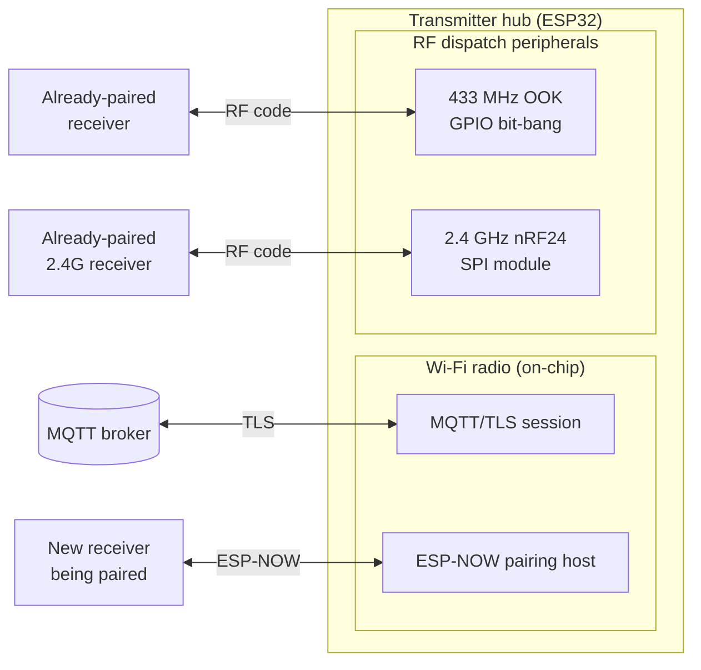
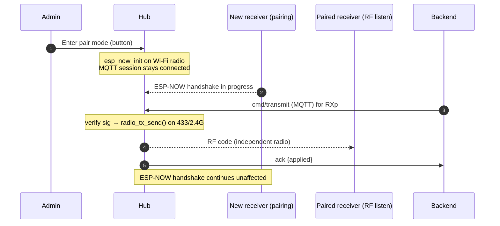

# ESP‑NOW Pairing & Dispatch Concurrency

**Question answered:** During ESP‑NOW pairing mode, what happens when a dispatch is called?
Can dispatch and pairing run at the same time?

**Short answer:** Yes. On the transmitter hub, pairing and dispatch use **independent
radio subsystems** and there is **no software interlock** between them. A dispatch to an
already‑paired receiver is processed and transmitted normally while a *new* receiver is
being paired. The only coupling is over‑the‑air (both pairing and 2.4 GHz dispatch share
the 2.4 GHz band) and the Wi‑Fi channel constraint described in §4.

> Companion doc: [ESP-NOW Pairing Discrimination](ESP-NOW%20Pairing%20Discrimination.md)
> (how multiple receivers/transmitters are told apart). MQTT dispatch itself is detailed in
> [MQTT Communication Walkthrough](MQTT%20Communication%20Walkthrough.md).

---

## 1. Two radio planes on the hub

The transmitter hub runs two completely separate radio subsystems at once:



- **Pairing** (`espnow_pair_host.c`) runs on the **Wi‑Fi radio** via ESP‑NOW. It teaches a
  new receiver its slot + RF code; it never carries dispatches.
- **Dispatch** (`dispatch.c` → `radio_supervisor.c`) drives the **433 MHz OOK output** and
  the **nRF24 SPI module** — separate silicon from the Wi‑Fi radio.
- **The command that triggers a dispatch** arrives over **MQTT** (`cmd/transmit`), i.e. on
  the Wi‑Fi radio, while the hub stays connected.

Because pairing and RF transmit live on different peripherals, they are not mutually
exclusive.

---

## 2. The dispatch path has no pairing gate

`dispatch_handle_transmit_json()` (`transmitter/main/dispatch/dispatch.c`) does **not**
check `espnow_pair_host_is_active()` anywhere. Its guards are:

1. shape/JSON parse,
2. width validation (`band` vs `bits`),
3. **backend signature** verification (`transmit-v1…` / `dispatch-v1…`),
4. `dispatch_id` de‑duplication (idempotency ring),
5. `op_state == ACTIVE` (not suspended/decommissioned),
6. `radio_tx_send(band, …)`.

None of these consult pairing state. The only place `espnow_pair_host_is_active()` gates
behavior is (a) the Wi‑Fi reconnect loop in `main.c` and (b) cosmetic display overlays —
never the dispatch pipeline.

`radio_tx_send()` (`radio_supervisor.c`) takes a **`s_radio_mtx` mutex**, but that mutex
only serializes the **433 MHz vs nRF24** peripherals against *each other* so two dispatches
don't collide. It is unrelated to ESP‑NOW. Pairing never takes this mutex.

---

## 3. What actually happens, per actor



- **Already‑paired receiver (dispatch target):** it sits in normal RF‑listen mode. It is
  completely unaware another receiver is pairing. The hub receives the MQTT command,
  verifies the signature, and keys the RF module. **Dispatch succeeds.**
- **Hub:** services MQTT and the ESP‑NOW pairing task concurrently (FreeRTOS tasks; the
  pairing task is a bounded state machine, priority 5). RF transmit is a short blocking
  operation under its own mutex.
- **New receiver (the one being paired):** it is inside the blocking `espnow_pair_wait()`
  loop and is **not yet paired**, so by definition no dispatch targets it. It has torn down
  normal operation to scan channels; it cannot receive an RF dispatch until pairing
  finishes and it reboots into operational mode. This is expected, not a conflict.

So "a dispatch during pairing" only meaningfully means "a dispatch to some *other*,
already‑paired receiver," and that path is unaffected.

---

## 4. The one real coupling: Wi‑Fi channel & the 2.4 GHz band

Two honest caveats:

1. **Wi‑Fi channel is pinned during pairing.** ESP‑NOW requires the receiver to find the
   hub's Wi‑Fi channel; the receiver scans channels 1–13 and the hub answers on its current
   channel. `main.c` therefore **skips Wi‑Fi reconnect while pairing is active** so a
   channel scan doesn't hop the radio mid‑handshake:

   ```c
   if (espnow_pair_host_is_active()) {
       continue;   // don't reconnect mid-pair; pairing is short-lived
   }
   ```

   Consequence: if Wi‑Fi *drops* during pairing, MQTT (and therefore new dispatch
   *delivery*) pauses until pairing ends. An **already‑connected** MQTT session keeps
   delivering commands normally throughout pairing — the hub does not disconnect MQTT to
   pair.

2. **2.4 GHz airspace is shared.** ESP‑NOW (Wi‑Fi radio) and a 2.4 GHz nRF24 dispatch both
   emit in the 2.4 GHz ISM band. They are independent peripherals with no software
   serialization, so a simultaneous ESP‑NOW exchange and an nRF24 burst can contend for
   *airtime* (possible interference), though each side has its own retry/robustness.
   A **433 MHz** dispatch is on an entirely different band and has zero RF overlap with
   pairing.

---

## 5. Summary

| Question | Answer |
|---|---|
| Can dispatch run during pairing? | **Yes** — different radio subsystems, no interlock. |
| Is the dispatch pipeline gated on pairing state? | **No** — `dispatch.c` never checks `espnow_pair_host_is_active()`. |
| Does the radio mutex block pairing? | **No** — `s_radio_mtx` only arbitrates 433 vs nRF24. |
| Does pairing drop MQTT? | **No** — an established session keeps delivering; only Wi‑Fi *reconnect* is deferred. |
| Any interference risk? | Only 2.4 GHz airtime contention (ESP‑NOW vs nRF24); 433 MHz is fully independent. |
| Can the receiver *being paired* be dispatched? | **No** — it isn't paired yet, so nothing targets it; it's in the blocking pair loop. |
