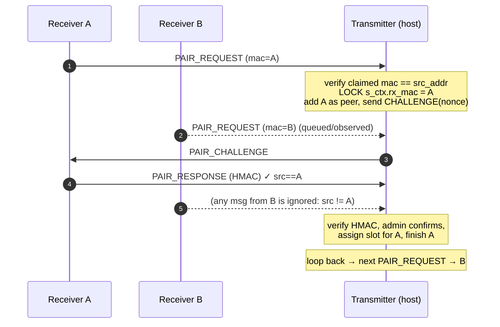
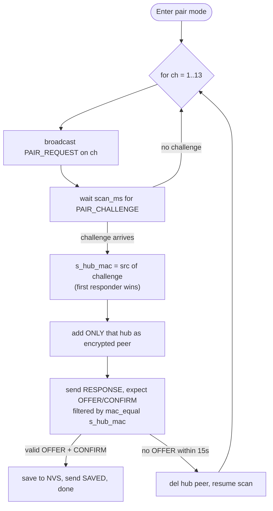

# ESP‑NOW Pairing Discrimination

**Questions answered:**

1. How does ESP‑NOW distinguish multiple **receivers** pairing to one transmitter?
2. What happens when a receiver's scan detects **multiple transmitters** available for
   pairing during the initial pair?

Sources: `transmitter/main/pair/espnow_pair_host.c` (the host/transmitter side) and
`receiver-esp32/main/pair/espnow_pair.c` (the receiver side). Companion docs:
[ESP-NOW Pairing & Dispatch Concurrency](ESP-NOW%20Pairing%20%26%20Dispatch%20Concurrency.md)
and [Key Generation Walkthrough](Key%20Generation%20Walkthrough.md) (the pairing PSK).

---

## 0. Who broadcasts, who listens

A common misconception: the transmitter does **not** broadcast. The roles are:

- **Receiver = initiator/broadcaster.** It broadcasts `PAIR_REQUEST` to
  `ff:ff:ff:ff:ff:ff` while sweeping Wi‑Fi channels 1–13.
- **Transmitter (host) = passive listener.** It waits for a `PAIR_REQUEST` and replies with
  a **unicast** `PAIR_CHALLENGE` to that receiver's MAC.

So "multiple transmitters broadcasting for pairing" really means "multiple transmitters are
in pair‑host mode at once, and more than one answers the receiver's broadcast."

### The 6‑message handshake (reference)

| # | Msg | Dir | Addressing | Encryption |
|---|---|---|---|---|
| 1 | `PAIR_REQUEST` (mac, band) | RX → TX | broadcast | none |
| 2 | `PAIR_CHALLENGE` (16‑byte nonce) | TX → RX | unicast | none |
| 3 | `PAIR_RESPONSE` (HMAC‑SHA256(nonce, PSK)) | RX → TX | unicast | **CCMP (LMK)** |
| 4 | `PAIR_OFFER` (slot, band, rf_code) | TX → RX | unicast | CCMP |
| 5 | `PAIR_ACK` (slot, nonce_tag) | RX → TX | unicast | CCMP |
| 6 | `PAIR_CONFIRM` | TX → RX | unicast | CCMP |
| 7 | `PAIR_SAVED` (slot, nonce_tag) | RX → TX | unicast | CCMP |

(Message 1 is followed by an admin **physical confirm** on the hub before message 4.)

---

## 1. Distinguishing multiple receivers at one transmitter

The discriminator is the receiver's **station MAC address**, reinforced by per‑peer
encryption, a nonce tag, and a strict one‑at‑a‑time state machine.

Mechanisms, in order of importance:

1. **MAC lock, one receiver per iteration.** On `PAIR_REQUEST` the host records
   `s_ctx.rx_mac`. Every later message (`RESPONSE`, `ACK`, `SAVED`) is accepted **only** if
   `memcmp(src_addr, rx_mac) == 0`. The state machine runs a full handshake for that one
   MAC, then loops to wait for the next request. Two receivers are handled **sequentially**,
   never interleaved.
2. **MAC anti‑spoof.** The `rx_mac` field inside `PAIR_REQUEST` must equal the actual
   ESP‑NOW `src_addr`, else the request is dropped (`"PAIR_REQUEST MAC mismatch"`).
3. **Per‑peer CCMP encryption.** After the challenge, the host re‑adds the receiver as an
   **encrypted** peer using the LMK (bytes 16–31 of the PSK). From `RESPONSE` on, each
   receiver's unicast traffic is CCMP‑encrypted and MAC‑addressed — no cross‑talk.
4. **Nonce tag.** `PAIR_ACK`/`PAIR_SAVED` echo `nonce_tag` = first 4 bytes of the host's
   per‑session nonce; the host rejects mismatches, tying those messages to the exact
   challenge it issued to that receiver.
5. **Slot identity in the roster.** An existing `mac+band` entry re‑uses its slot
   (idempotent re‑pair); a new receiver gets `roster_next_free_slot()`. Slot `0` means the
   roster is full (`PAIR_HOST_RESULT_FULL`).
6. **Human confirm.** Before the `OFFER`, the admin must press confirm on the hub — the
   `receiver_found_cb` shows the candidate; only then does pairing proceed. This is the
   backstop that enforces "one deliberate receiver at a time."

### Honest edge case — two receivers requesting at once

`recv_cb` overwrites the shared `s_ctx.rx_mac` on **any** incoming `PAIR_REQUEST` while
active. If receiver B requests *in the middle* of A's handshake, it can clobber the locked
MAC; A's next message then fails the `src == rx_mac` check and A's iteration times out
(≤5–10 s), after which the loop picks up B. Net effect is still strictly one‑at‑a‑time, but
simultaneous requests can make the first receiver time out and retry.

> **Operational guidance:** pair receivers **one at a time** — put a single receiver into
> pair mode, confirm it on the hub, then start the next. Don't power a whole batch into pair
> mode simultaneously.

---

## 2. A receiver seeing multiple transmitters

The receiver commits to **exactly one** transmitter — the first whose `PAIR_CHALLENGE` it
captures — and ignores all others for the rest of the handshake.

How it behaves when several hubs are in pair‑host mode:

1. **First responder wins.** The receiver sweeps channels 1→13. On the first channel where
   *any* `PAIR_CHALLENGE` arrives within `scan_ms`, `recv_cb` sets `s_hub_mac` to that
   challenge's source and stops the scan for that pass. The challenge handler does **not**
   filter by MAC — it binds to whichever hub answered.
2. **Then it locks.** The receiver adds **only** `s_hub_mac` as an encrypted peer, and every
   subsequent `OFFER`/`CONFIRM` is accepted only from `s_hub_mac`
   (`mac_equal(s_hub_mac, src)`). Other hubs' offers are silently ignored.
3. **No "strongest hub" logic.** Selection is by *timing/channel order*, not RSSI. There is
   no scan‑all‑then‑choose step.
4. **Self‑healing if the bound hub goes quiet.** If the chosen hub doesn't deliver a valid
   `OFFER` within 15 s (e.g. the admin confirmed on a *different* hub), the receiver deletes
   that peer and resumes scanning, eventually pairing with a hub that completes the flow.

### Honest edge case — two challenges on the same channel

If two hubs answer on the same channel inside one wait window, `recv_cb` runs for both and
the **last** one processed before the main task reads `s_nonce`/`s_hub_mac` wins — the event
bit only signals "a challenge arrived," so which hub you bind to is a race, not
deterministic.

> **Operational guidance:** put **only one** transmitter into pair‑host mode at a time. The
> system assumes a single hub is pairing (a store usually has one hub; multi‑hub clusters
> should be paired sequentially). The hub's physical confirm is the human backstop — the
> admin only confirms on the hub that actually shows the candidate receiver.

---

## 3. Why the receiver sweeps channels (and whether ESP‑NOW can be pinned)

§2 shows the receiver broadcasting `PAIR_REQUEST` across Wi‑Fi channels 1–13. That sweep is
not arbitrary — it falls out of how ESP‑NOW shares the radio.

### Why the sweep is necessary

ESP‑NOW is not a separate radio or band; it is a connectionless frame type on the **2.4 GHz
Wi‑Fi PHY**. A frame is received only if the receiving radio is **tuned to the same channel**
as the sender at that instant — there is no channel negotiation and no beacon to lock onto.

Where each side's channel comes from:

- **The hub** is a Wi‑Fi **STA associated with the store's router** (it needs that association
  for MQTT). On the ESP32 the STA link and ESP‑NOW **share one radio**, so the hub's ESP‑NOW
  channel is *forced to equal the AP's channel* — whatever channel that store's router picked
  (and routers auto‑select, so it isn't predictable). The hub never changes channel while
  pairing; `main.c` even defers Wi‑Fi reconnect so a scan can't hop it away mid‑handshake.
- **The receiver** is a pure RF/ESP‑NOW device. During `espnow_pair_wait()` it calls
  `wifi_init_sta_no_connect()` — it brings Wi‑Fi up but **never associates with an AP**, so it
  has no channel reference at all.

An offline receiver that cannot know the AP's channel has one option: **try every channel**,
broadcasting a request on each and waiting `CONFIG_RECEIVER_PAIR_CHANNEL_SCAN_MS` for a
challenge, until it lands on the hub's channel.

### Can ESP‑NOW be pinned to a fixed channel?

In a **pure ESP‑NOW fleet** (no Wi‑Fi association anywhere), yes — pin every device to a
build‑time channel and skip discovery entirely. That is the standard ESP‑NOW pattern. Here it
is constrained because the hub must stay on the AP's channel for MQTT. Pinning is still
possible, but each route has a cost:

| Approach | How | Trade‑off |
|---|---|---|
| **Pin the router + hardcode the channel** | Lock the store AP to a fixed channel and bake it into receiver firmware | Brittle: breaks on multi‑store deployments, auto‑channel/DFS routers, or any channel change — and fails *silently* (the receiver sweeps a channel the hub isn't on). Couples firmware to one network. |
| **Take the hub off Wi‑Fi to pair** | Hub drops the AP, both sides move to a hardcoded ESP‑NOW channel, pair, then reconnect | Loses concurrent MQTT during pairing (contradicts the "MQTT stays up while pairing" design — see [ESP-NOW Pairing & Dispatch Concurrency](ESP-NOW%20Pairing%20%26%20Dispatch%20Concurrency.md) §4) and re‑introduces channel‑hop coordination. |

You **cannot** simply call `esp_wifi_set_channel()` to a different channel while the hub stays
associated — the driver holds the radio on the AP's channel, and forcing it would drop the
MQTT link.

### Why the sweep was chosen

It is the **network‑agnostic** option: zero channel coordination, works against any store
router on any channel, and keeps the hub online for MQTT throughout. The cost is discovery
latency — up to ~13 × the per‑channel dwell per pass. Two cheap optimizations if that matters:

- **Scan 1 / 6 / 11 first** (the common non‑overlapping channels) before the rest — most APs
  sit there.
- **Cache the last successful channel** in NVS and try it first on re‑pair (helps re‑pairing,
  not the first pair).

Regional note: the loop scans 1–13 (ETSI). In FCC regions the router won't use 12–13, so those
passes just waste dwell time (and `esp_wifi_set_channel` may reject them depending on the
country config) — harmless but slightly slower.

---

## 4. Why this is "enough" security‑wise

Neither side authenticates the *other's* MAC cryptographically before message 3 — MAC
addresses are trivially spoofable. The assurance comes from the layers that follow:

- **PSK‑gated HMAC (message 3).** The host accepts a receiver only if it returns
  `HMAC‑SHA256(nonce, PSK)`; the PSK is compiled into official firmware and never sent OTA.
  A device without the PSK can't produce a valid response.
- **CCMP encryption (messages 3–7).** ESP‑NOW AES‑128 CCMP with the LMK protects the slot
  and RF code from eavesdropping/tampering.
- **Physical confirmation.** The admin presses confirm on the hub for the specific receiver
  shown — no silent auto‑pairing.
- **Bounded session + nonce tags.** Short per‑step timeouts and per‑session nonce tags limit
  replay and cross‑session confusion.

For a store pager system this is the intended trade‑off; see the PSK notes in
[Key Generation Walkthrough](Key%20Generation%20Walkthrough.md) for the residual risk
(firmware‑embedded PSK) and hardening options (secure boot + flash encryption).

---

## 5. Summary

| Question | Answer |
|---|---|
| How are multiple receivers told apart at the hub? | By **station MAC**, one at a time (MAC‑locked state machine), plus per‑peer CCMP, nonce tag, slot assignment, and human confirm. |
| MAC spoofing in the request? | Rejected — claimed `rx_mac` must equal the ESP‑NOW `src_addr`. |
| Two receivers request simultaneously? | Still handled sequentially; the first may time out and retry. Pair one at a time. |
| Receiver sees multiple transmitters? | **First responder wins** (by channel/timing, not RSSI); the receiver locks to one hub's MAC and ignores the rest. |
| Two hubs answer on the same channel? | Non‑deterministic race for which one binds; self‑heals via 15 s OFFER timeout + rescan. |
| Recommended practice | Exactly **one** transmitter in pair mode, **one** receiver at a time, confirm on the hub. |
