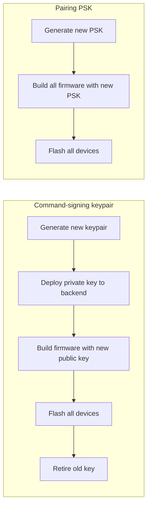

# Key Generation Walkthrough

All cryptographic keys used by notiguide, how to generate them, and where each one goes.

> **Prerequisites:** OpenSSL 3.x installed (`openssl version` to check).

---

## Key Inventory

| Key | Algorithm | Used By | Purpose |
|---|---|---|---|
| JWT signing keypair | RSA 4096, PKCS#8 encrypted | Backend | Admin auth tokens |
| Device command-signing keypair | EC P-256 (ECDSA) | Backend + all firmware | Sign/verify RF-code, dispatch, and roster ACK commands |
| RF code encryption key | pgcrypto PGP symmetric (passphrase) | Backend | Encrypt RF code data at rest (server-managed devices only) |
| Pairing PSK | 256-bit symmetric (HMAC-SHA256) | All firmware | Verify receiver identity during ESP-NOW local pairing |
| MQTT CA certificate | X.509 (ISRG Root X1) | All firmware | Verify MQTT broker TLS |

Device identity keys (EC P-256) are auto-generated on each device's first boot and stored in NVS. No manual generation needed.

### Current Status

| Key | Status | Location |
|---|---|---|
| JWT private key | Generated (dev + prod) | `backend/src/main/resources/rsa/notiguide.pem`, `backend/notiguide/rsa/notiguide.pem` |
| JWT public key | Generated (dev + prod) | `backend/src/main/resources/rsa/notiguide-pub.pem`, `backend/notiguide/rsa/notiguide-pub.pem` |
| Device command-signing private key | Generated (dev + prod) | `backend/src/main/resources/rsa/notiguide-sign.pem`, `backend/notiguide/rsa/notiguide-sign.pem` |
| Device command-signing public key (dev) | Generated | `backend/src/main/resources/rsa/notiguide-sign-pub.pem` (reference only) |
| Device command-signing public key (ESP32) | Configured | `CONFIG_RECEIVER_BACKEND_PUBKEY_B64` in sdkconfig |
| Device command-signing public key (ESP8266) | Configured | `CONFIG_RECEIVER_BACKEND_PUBKEY_B64` in sdkconfig |
| Device command-signing public key (Transmitter) | Configured | `CONFIG_TRANSMITTER_BACKEND_PUBKEY_B64` in sdkconfig |
| Pairing PSK (Transmitter) | Configured | `CONFIG_TRANSMITTER_PAIR_PSK` in sdkconfig |
| Pairing PSK (ESP32-C3 Receiver) | Configured | `CONFIG_RECEIVER_PAIR_PSK` in sdkconfig |
| Pairing PSK (ESP8266 Receiver) | Configured | `CONFIG_RECEIVER_PAIR_PSK` in sdkconfig |
| RF code encryption passphrase | Generated (dev + prod) | `DEVICE_RF_CODE_ENCRYPTION_KEY` in `backend/.env` and `backend/notiguide/.env` |
| MQTT CA certificate (ESP32) | Present | `receiver-esp32/main/network/certs/mqtt_ca.pem` |
| MQTT CA certificate (ESP8266) | Present | `receiver-esp8266/main/network/certs/mqtt_ca.pem` |
| MQTT CA certificate (Transmitter) | Present | `transmitter/main/network/certs/mqtt_ca.pem` |
| Firebase credentials | Present (dev + prod) | `backend/src/main/resources/firebase/`, `backend/notiguide/firebase/` |

---

## 1. JWT Signing Keypair (RSA 4096)

Used by the backend to sign and verify admin auth JWTs (`SHA512withRSA`).

### Generate

```bash
# Choose a strong password when prompted — this is JWT_PRIVATE_KEY_PASSWORD
openssl genpkey -algorithm RSA \
  -pkeyopt rsa_keygen_bits:4096 \
  -aes-256-cbc \
  -out notiguide.pem

# Extract public key
openssl pkey -in notiguide.pem -pubout -out notiguide-pub.pem
```

### Verify the pair

```bash
# Sign a test message, then verify — should print "Verified OK"
echo "test" | openssl dgst -sha512 -sign notiguide.pem -out /tmp/test.sig
echo "test" | openssl dgst -sha512 -verify notiguide-pub.pem -signature /tmp/test.sig
rm /tmp/test.sig
```

### Where they go

**Development:** place both files in `backend/src/main/resources/rsa/`.

```
backend/src/main/resources/rsa/
  notiguide.pem        # encrypted private key
  notiguide-pub.pem    # public key
```

`application-dev.yaml` already points to `classpath:rsa/notiguide.pem` and `classpath:rsa/notiguide-pub.pem`, so no extra config is needed for local development.

**Production:** mount the key files into the container and set these env vars:

| Env var | Value |
|---|---|
| `JWT_PRIVATE_KEY` | `file:/app/rsa/notiguide.pem` (or any mounted path) |
| `JWT_PUBLIC_KEY` | `file:/app/rsa/notiguide-pub.pem` |
| `JWT_PRIVATE_KEY_PASSWORD` | The password you chose during generation |

> **Never commit the private key to source control.** The dev key in `src/main/resources/rsa/` is acceptable for local development only.

---

## 2. Device Command-Signing Keypair (EC P-256)

Used by the backend to sign MQTT command payloads (`cmd/transmit`, `cmd/deact`, `roster/ack`). Firmware devices verify these signatures using the embedded public key.

### Generate

```bash
# Private key (PEM, unencrypted — backend needs raw PEM)
openssl ecparam -name prime256v1 -genkey -noout -out cmd_signing_priv.pem

# Public key in PEM (for reference)
openssl pkey -in cmd_signing_priv.pem -pubout -out cmd_signing_pub.pem

# Public key as base64-DER (for firmware Kconfig)
openssl pkey -in cmd_signing_priv.pem -pubout -outform DER | base64 -w0
```

Save the base64 output from the last command — it goes into firmware builds.

### Where it goes

**Backend** — set `DEVICE_CMD_SIGNING_PK` to one of:

| Format | Example |
|---|---|
| File path | `/app/secrets/cmd_signing_priv.pem` |
| Inline base64 | `base64:<base64-encoded-pem-contents>` |

**Firmware** — paste the base64-DER public key into the Kconfig setting for each device:

| Device | Kconfig variable |
|---|---|
| receiver-esp32 | `CONFIG_RECEIVER_BACKEND_PUBKEY_B64` |
| receiver-esp8266 | `CONFIG_RECEIVER_BACKEND_PUBKEY_B64` |
| transmitter | `CONFIG_TRANSMITTER_BACKEND_PUBKEY_B64` |

Set via `idf.py menuconfig` under the device's config menu, or directly in `sdkconfig`:

```
CONFIG_RECEIVER_BACKEND_PUBKEY_B64="MFkwEwYH...your-base64-here..."
```

> **Keep `cmd_signing_priv.pem` out of source control.** Loss of this key means inability to sign new device commands. There is no in-field rotation mechanism — rotating requires a coordinated firmware + backend release.

---

## 3. RF Code Encryption Key (pgcrypto Passphrase)

Passphrase used by PostgreSQL's pgcrypto extension (`pgp_sym_encrypt_bytea` / `pgp_sym_decrypt_bytea`) to encrypt RF code data at rest. The passphrase goes through OpenPGP String-to-Key (S2K) derivation — it is **not** used as a raw AES key.

### Generate

```bash
# 64-char hex string — used as a high-entropy passphrase
openssl rand -hex 32
```

### Where it goes

Set `DEVICE_RF_CODE_ENCRYPTION_KEY` to the hex string output:

```
DEVICE_RF_CODE_ENCRYPTION_KEY=a1b2c3d4...64-hex-chars...
```

> The string is passed directly to pgcrypto as a passphrase. pgcrypto's default symmetric cipher is AES-128 via S2K; the passphrase length does not select the cipher. To force AES-256, pass `cipher-algo=aes256` in the pgcrypto options (not currently done).

---

## 4. MQTT CA Certificate

The firmware embeds a CA certificate to verify the MQTT broker's TLS certificate. If your broker uses Let's Encrypt, the ISRG Root X1 certificate is already included in the firmware repos.

### When to update

Only if you switch to a broker with a different CA. Download the new CA cert in PEM format and replace all three copies:

```
receiver-esp32/main/network/certs/mqtt_ca.pem
receiver-esp8266/main/network/certs/mqtt_ca.pem
transmitter/main/network/certs/mqtt_ca.pem
```

Rebuild and reflash all firmware after changing.

### Download ISRG Root X1 (if needed)

```bash
curl -o mqtt_ca.pem https://letsencrypt.org/certs/isrgrootx1.pem
```

---

## 5. Pairing Pre-Shared Key (PSK)

A 32-byte symmetric secret shared across all firmware in a deployment. During ESP-NOW local pairing, the hub sends a random 16-byte nonce, the receiver computes `HMAC-SHA256(nonce, PSK)`, and the hub verifies independently. This proves the receiver runs official firmware built with the matching PSK.

The PSK is never sent over the air. Combined with ESP-NOW's CCMP encryption (AES-128) and the OLED physical-presence confirmation, it provides sufficient assurance for a store pager system.

### Generate

```bash
# 32 random bytes as 64 hex characters
openssl rand -hex 32
```

### Where it goes

**All firmware** — paste the same 64-character hex string into the Kconfig setting for each project:

| Device | Kconfig variable |
|---|---|
| transmitter | `CONFIG_TRANSMITTER_PAIR_PSK` |
| receiver-esp32 | `CONFIG_RECEIVER_PAIR_PSK` |
| receiver-esp8266 | `CONFIG_RECEIVER_PAIR_PSK` |

Set via `idf.py menuconfig` under the device's config menu, or directly in `sdkconfig`:

```
CONFIG_TRANSMITTER_PAIR_PSK="a1b2c3d4...64-hex-chars..."
CONFIG_RECEIVER_PAIR_PSK="a1b2c3d4...64-hex-chars..."
```

All three devices in the same deployment **must** use the same PSK value. The hub uses `CONFIG_TRANSMITTER_PAIR_PSK`, both receiver variants use `CONFIG_RECEIVER_PAIR_PSK` — different Kconfig names, same value.

> **The PSK is compiled into the firmware binary.** Anyone with physical access to a flashed device could extract it from a firmware dump. For higher assurance, enable ESP32-C3 secure boot + flash encryption. This is acceptable risk for a store pager system.

> **The PSK is not stored in the backend.** It exists only in firmware builds. The backend never participates in the ESP-NOW pairing handshake.

---

## Quick Reference: All Env Vars

| Env var | Key type | Required |
|---|---|---|
| `JWT_PRIVATE_KEY` | Path to RSA private key PEM | Yes |
| `JWT_PUBLIC_KEY` | Path to RSA public key PEM | Yes |
| `JWT_PRIVATE_KEY_PASSWORD` | Passphrase for encrypted private key | Yes |
| `DEVICE_CMD_SIGNING_PK` | EC P-256 private key (path or `base64:...`) | If device domain enabled |
| `DEVICE_RF_CODE_ENCRYPTION_KEY` | pgcrypto passphrase (64-char hex) | If RF codes enabled |

---

## Quick Reference: Firmware Kconfig

| Kconfig variable | Device | Value |
|---|---|---|
| `CONFIG_RECEIVER_BACKEND_PUBKEY_B64` | receiver-esp32 | base64-DER EC P-256 public key |
| `CONFIG_RECEIVER_BACKEND_PUBKEY_B64` | receiver-esp8266 | base64-DER EC P-256 public key |
| `CONFIG_TRANSMITTER_BACKEND_PUBKEY_B64` | transmitter | base64-DER EC P-256 public key |
| `CONFIG_RECEIVER_PAIR_PSK` | receiver-esp32 | 64 hex chars (32-byte pairing PSK) |
| `CONFIG_RECEIVER_PAIR_PSK` | receiver-esp8266 | 64 hex chars (32-byte pairing PSK) |
| `CONFIG_TRANSMITTER_PAIR_PSK` | transmitter | 64 hex chars (32-byte pairing PSK) |

The three backend public key entries use the **same** value — the counterpart to the backend's `DEVICE_CMD_SIGNING_PK` private key.

The three pairing PSK entries use the **same** value — devices in the same deployment must share the PSK for HMAC verification during ESP-NOW pairing.

---

## Rotation Notes



- **JWT keys** can be rotated independently — generate a new pair, deploy to backend, restart. Existing tokens signed with the old key will fail validation (users re-login).
- **Device command-signing keys** require coordinated rollout: backend + all firmware must be updated together. There is no dual-key grace period.
- **RF code encryption passphrase** rotation requires re-encrypting all stored RF codes (`pgp_sym_decrypt_bytea` with old passphrase, then `pgp_sym_encrypt_bytea` with new). Not a simple key swap.
- **Pairing PSK** rotation requires rebuilding and reflashing all firmware (transmitter + both receiver variants) with the new PSK. Existing pairings are unaffected (the PSK is only used during the pairing handshake, not for ongoing communication). New pairings will fail if the hub and receiver have mismatched PSKs.
- **MQTT CA cert** only changes if you switch broker CA providers. Requires firmware rebuild + reflash.
