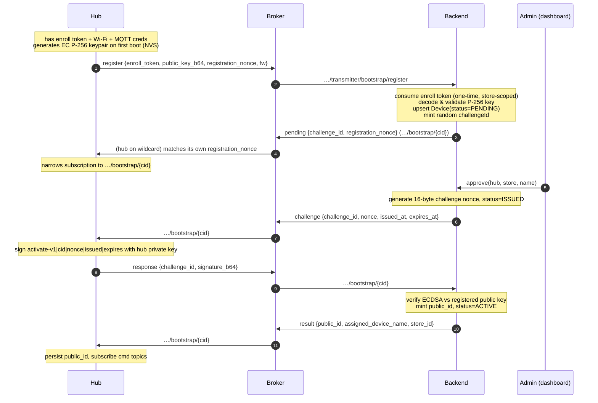
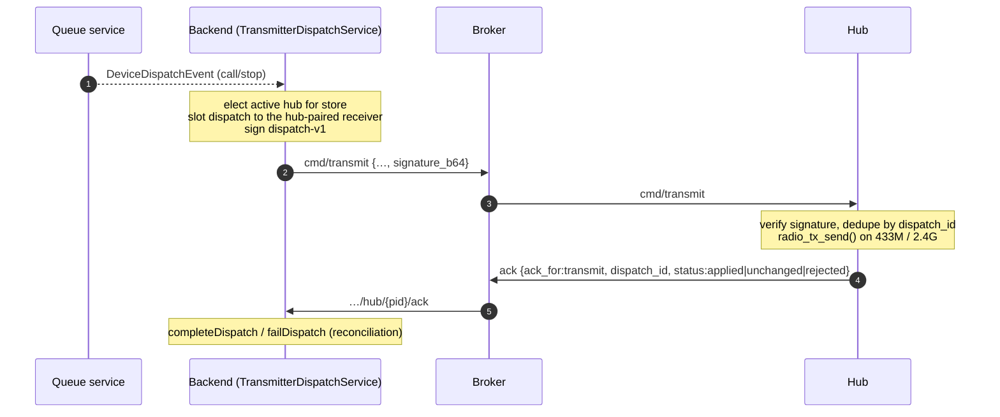
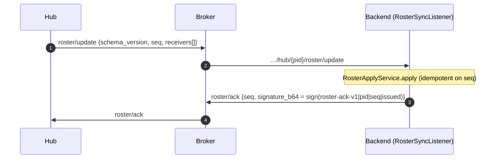
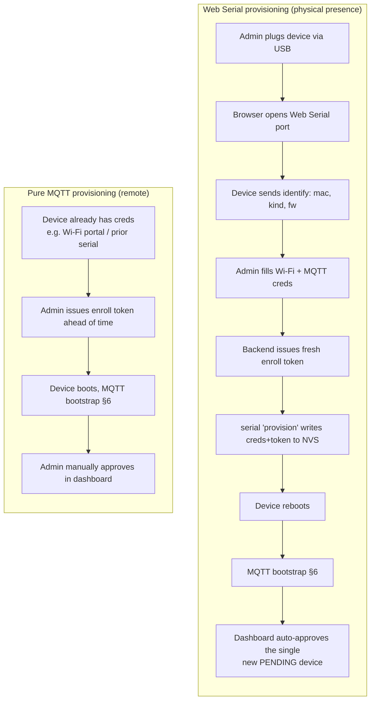

# MQTT Communication Walkthrough

Everything about the MQTT layer in notiguide: the broker connection, the full topic
namespace, packet formats, which keys are used and where, the provisioning
(bootstrap/activation) flow, the normal operational flow, and how the backend tells a
real device apart from a spoofer. The last section contrasts MQTT provisioning with the
Web Serial provisioning path.

> **Scope.** MQTT is used only between the **backend** and the **transmitter hub**.
> Receivers never speak MQTT: they are hub‑paired over ESP‑NOW and reached over RF by their
> hub (see [ESP-NOW Pairing & Dispatch Concurrency](ESP-NOW%20Pairing%20%26%20Dispatch%20Concurrency.md)
> and [ESP-NOW Pairing Discrimination](ESP-NOW%20Pairing%20Discrimination.md)). The keys
> named here are catalogued in [Key Generation Walkthrough](Key%20Generation%20Walkthrough.md).

---

## 1. Transport & connection

| Concern | Value | Source |
|---|---|---|
| Client library (backend) | Eclipse Paho MQTT **v5** async client | `core/mqtt/MqttConfig.kt` |
| Client library (firmware) | ESP‑IDF `esp-mqtt` (MQTT v5) | `transmitter/main/network/mqtt.c` |
| Broker URI | `ssl://…` (backend) / `mqtts://…` (firmware) | `MqttConfig`, provisioning form requires `mqtts://` |
| TLS | Server‑auth TLS; firmware pins an embedded CA (`mqtt_ca.pem`, ISRG Root X1) | `mqtt.c` `mqtt_ca_pem_start` |
| Broker auth | Username + password | `MqttProperties`, provisioning payload `mqtt_user`/`mqtt_pwd` |
| Backend client id | `notiguide-<random8>` (unique per process) | `MqttConfig.mqttAsyncClient()` |
| Device client id | The device `public_id` (once activated) | `mqtt.c` credentials |
| Default QoS | **1** (at‑least‑once) — heartbeats use QoS 0 | `MqttProperties.qos`, `TransmitterOperationalListener` |
| Clean start | `true` (backend) | `MqttConfig` |
| Keepalive | 60 s | `MqttProperties.keepAliveSeconds` |
| Auto‑reconnect | enabled, capped backoff 128 s; re‑subscribes on reconnect | `MqttClientManager.connectComplete` |

The backend MQTT beans are **conditional** on the `mqtt.broker` property being present
(`@ConditionalOnProperty` in `MqttConfig`); every device listener/publisher is
`@ConditionalOnBean(MqttClientManager::class)`. With no broker configured, the whole
device/MQTT layer silently degrades and the app still boots.

> **Broker auth is a shared, transport‑level gate — not a device identity.** The
> username/password and TLS only prove "some client that has the deployment's broker
> credentials". They do **not** prove *which* device is connected. Device identity is
> established separately, cryptographically, in the bootstrap flow (§6) and re‑proven on
> every command via signatures (§8). What the activation signature does and does **not**
> prove — and what actually gates forgery — is spelled out in §7.

---

## 2. Topic namespace

All topics are prefixed by `mqtt.topicPrefix` (default `notiguide`). Only the
`transmitter` family is used in this deployment — receivers are hub‑paired and are not MQTT
devices. Below, `{cid}` = challenge UUID, `{pid}` = hub `public_id`, `{store}` = store UUID.

### Provisioning (bootstrap) topics

| Topic | Dir | Retained | Purpose |
|---|---|---|---|
| `…/transmitter/bootstrap/register` | hub → backend | no | Hub announces itself (shared inbox) |
| `…/transmitter/bootstrap/{cid}` | both | no | Per‑registration channel: `pending`/`challenge`/`result`/`rejected` (backend) and `response` (hub) |

Backend subscribes to the wildcard `…/transmitter/bootstrap/+`
(`TransmitterBootstrapListener`). The hub subscribes to the same wildcard, then narrows to
its own `{cid}` once it learns it.

### Command topics (backend → device)

| Topic | Retained | Purpose |
|---|---|---|
| `…/transmitter/hub/{pid}/cmd/transmit` | no | Signed **slot dispatch** to a hub‑paired receiver |
| `…/transmitter/hub/{pid}/cmd/deact` | **yes** | Signed suspend / decommission |
| `…/transmitter/hub/{pid}/cmd/label` | no | Signed slot‑label update |
| `…/transmitter/hub/{pid}/cmd/unpair` | no | Signed slot unpair |
| `…/transmitter/hub/{pid}/roster/ack` | no | Signed ACK of a roster the hub pushed up |

Retained command topics let a rebooting device re‑read its last state without waiting for
a fresh publish. When a device's `public_id` is rotated, the backend clears the old
retained topics by publishing a zero‑length retained message (`DeviceMqttPublisher.clearRetained`).

### Telemetry / reporting topics (device → backend)

| Topic | QoS | Purpose |
|---|---|---|
| `…/transmitter/hub/{pid}/heartbeat` | 0 | Liveness + diagnostics (heap, RSSI, uptime, dispatch counts, IP) |
| `…/transmitter/hub/{pid}/ack` | 1 | Dispatch result ACK and deact ACK |
| `…/transmitter/hub/{pid}/roster/update` | 1 | Hub pushes its current slot roster to the backend |

### Cluster topic (hub ↔ hub, via broker)

| Topic | Retained | Purpose |
|---|---|---|
| `…/transmitter/cluster/{store}/roster` | **yes** | Shared cluster roster used for **transmitter election / failover** when a store has more than one hub |

> For the **phase-by-phase pub/sub matrix** (who subscribes vs. publishes, wildcards, QoS,
> retain) and the **packet format of every topic**, see §11.

---

## 3. Packet format

Every application message is **UTF‑8 JSON**, one object per publish. Common conventions:

- `schema_version` (int, currently `1`) — receivers reject anything else.
- `type` — discriminator on the bootstrap channel (`pending`, `challenge`, `response`,
  `result`, `rejected`).
- `issued_at` / `expires_at` — ISO‑8601 instants (`…toInstant().toString()`).
- `signature_b64` — Base64 ECDSA (`SHA256withECDSA`) over a **canonical string** (§4).
- Field names are `snake_case` on the wire (Jackson `@JsonProperty`).

Example dispatch (`cmd/transmit`, slot form — the only dispatch form used):

```json
{ "schema_version": 1, "dispatch_id": "…uuid…", "slot": 3, "action": "call",
  "issued_at": "2026-07-09T09:15:00Z", "signature_b64": "MEUCIQ…" }
```

The `slot` addresses a hub‑paired receiver in the hub's roster; the hub looks up that
slot's RF code locally and transmits it over RF.

### 4. Canonical signing strings

Signatures never sign the JSON; they sign a fixed, order‑stable canonical string so both
sides compute the identical bytes. From `core/device/DeviceCanonical.kt`:

| Command | Canonical string |
|---|---|
| Activation response | `activate-v1\|{cid}\|{nonce}\|{issuedAt}\|{expiresAt}` |
| Deact | `deact-v1\|{pid}\|{commandId}\|{action}\|{issuedAt}` |
| Slot dispatch | `dispatch-v1\|{hubPid}\|{dispatchId}\|{slot}\|{action}\|{issuedAt}` |
| Roster ACK | `roster-ack-v1\|{hubPid}\|{seq}\|{issuedAt}` |

The **activation** signature is produced by the *hub* (proving it owns its private key).
Every other signature is produced by the *backend* (proving the command is authentic) and
verified in firmware against the embedded backend public key.

> `DeviceCanonical` also defines `rf-code-v1` and a full‑payload `transmit-v1` string for
> MQTT‑enrolled receivers. That path is **not used in this deployment** (receivers are
> hub‑paired), so it is omitted here.

---

## 5. Keys used on the MQTT path

| Key | Held by | Used for on MQTT | Scope |
|---|---|---|---|
| MQTT CA cert (ISRG Root X1) | firmware (embedded) | Verify the broker's TLS cert | Transport, per broker |
| Broker username/password | firmware (provisioned) + backend | Authenticate to the broker | Deployment‑wide, **not** device identity |
| **Hub EC P‑256 keypair** | private in hub NVS; public registered to backend | Hub **signs the activation challenge** → proves identity | Per hub |
| **Backend command‑signing EC P‑256** | private on backend; public embedded in all firmware | Backend **signs every command** (slot‑dispatch/deact/roster‑ack); firmware verifies | Deployment‑wide |

Full generation/rotation details live in
[Key Generation Walkthrough](Key%20Generation%20Walkthrough.md). The pairing PSK is **not**
used on MQTT — it belongs to the ESP‑NOW pairing handshake only.

---

## 6. Provisioning flow (bootstrap → activation)

The provisioning handshake mints the hub's `public_id` and binds it to a store. It runs
entirely over the transmitter bootstrap topics.



Step detail (from `DeviceRegistrationService`, `DeviceApprovalService`,
`DeviceActivationService`, and firmware `mqtt.c`):

1. **register** — the hub publishes to the shared `…/transmitter/bootstrap/register`.
   Payload carries the one‑time `enrollment_token`, the hub's `public_key_b64` (X.509 DER,
   P‑256), a random `registration_nonce`, firmware version, and declared kind.
2. Backend `onRegister`: consumes the enroll token (invalid → `rejected: invalid_token`),
   validates it's a genuine P‑256 key, enforces the per‑store hub cap for transmitters,
   upserts a `Device` row at `PENDING` keyed by the **public‑key DER** (its stable
   identity), mints a **random `challengeId`**, stores an activation record in Redis
   (15 min TTL), and publishes `pending`.
3. **Admin approval** — an admin picks the pending device, assigns a name + store.
   Backend generates a 16‑byte `nonce`, marks the activation `ISSUED` (5 min lifetime),
   and publishes `challenge`.
4. **response** — the hub signs the canonical `activate-v1|…` string with its private
   key and publishes `response` with the Base64 signature.
5. Backend `onResponse`: reloads the activation record, checks it's `ISSUED` and unexpired,
   verifies the ECDSA signature **against the public key registered in step 2**, mints the
   `public_id`, flips status to `ACTIVE`, and publishes `result`.

### How concurrent registrations stay separated

Multiple hubs (several stores, or a multi‑hub store) can hit the shared
`…/transmitter/bootstrap/register` and the shared `…/transmitter/bootstrap/+` wildcard at
once. Three mechanisms keep them from crossing wires:

- **Stable identity = the hub's EC public key.** `onRegister` upserts by
  `findByPublicKeyDer`, so re‑registration of the same physical hub updates one row rather
  than creating duplicates.
- **Per‑registration `challengeId`.** Every registration gets a fresh random UUID that
  scopes its own `…/bootstrap/{cid}` topic. All `challenge`/`result` traffic for that hub
  flows only there.
- **`registration_nonce` self‑selection.** Because the hub is subscribed to the *wildcard*
  until it learns its `{cid}`, it receives every hub's `pending`/`challenge`. Firmware
  compares `registration_nonce` to its own and ignores non‑matching messages
  (`mqtt.c` `handle_bootstrap_pending` / `handle_bootstrap_challenge`), then re‑subscribes
  to just its `{cid}` topic.

### How the backend knows it's a real device, not a spoofer

| Threat | Control |
|---|---|
| Random client registers | Must present a valid **one‑time, store‑scoped enrollment token** (admin‑issued, hashed + TTL'd in Redis, consumed on first use). |
| Attacker replays a captured public key | Registration alone grants nothing; activation requires **signing a fresh server nonce** with the matching **private key**, which never leaves the device's NVS. |
| Attacker guesses/reuses a nonce | Nonce is 16 random bytes, single‑use, `ISSUED`‑gated, 5 min lifetime; a stale/duplicate response is dropped. |
| Attacker forges commands to a device | Every actuation command is **ECDSA‑signed by the backend**; firmware rejects bad signatures (`signature_failed`). |
| Attacker MITMs the broker | TLS with a **pinned CA** in firmware. |
| Attacker floods the shared inbox | Malformed/oversized payloads are parsed defensively and dropped; a bad token yields only a `rejected`. |

The trust anchor is the **one‑time enrollment token plus admin approval**; the private‑key
signature adds anti‑hijack/anti‑replay and a stable identity, but — since the keypair is
self‑generated — it does **not** by itself prove a genuine device. Broker credentials and
TLS protect the channel but are explicitly *not* treated as identity. **See §7** for the
full breakdown of what the challenge‑response proves and what actually gates forgery.

---

## 7. What the challenge-response proves (and what gates forgery)

> **Disclaimer — the challenge's purpose in one line.** The challenge exists only to prove
> **continuity and liveness of the key‑holder** across the register→confirm gap: that whoever
> answers *now* holds the private key of the public key registered *earlier*, and is doing so
> live (fresh, single‑use nonce), not replaying an old confirmation. That is its **entire**
> job. It is **not** the authorization credential — the **enrollment token** is (§6); it does
> **not** prove genuine hardware — the keypair is self‑generated; and because **admin
> approval** is the actual human gate, the challenge is best understood as a
> **defense‑in‑depth identity anchor**, not a load‑bearing forgery control. It earns its keep
> only if the device's cryptographic identity is ever *used* (e.g. future device‑signed
> telemetry or re‑auth); today that identity is established here but referenced nowhere after
> activation. Everything below expands on this.

A natural objection to §6: the hub signs the activation challenge with its own EC private
key — but the hub **generates that keypair itself on first boot**. So a forger could
generate their *own* keypair and sign the challenge identically. What does the signature
actually prove, and what really stops a forged hub?

### What the signature proves — and only this

The activation signature proves that **the entity that registered public key `K` (step 1)
is the same entity that answers the challenge (step 4)** — i.e. possession of `K`'s private
key. Because the keypair is self‑generated, it does **not** prove genuine hardware or
firmware. Concretely it buys three things:

- **Anti‑hijack.** An attacker who merely *sniffs* the `register` message (which carries the
  public key) cannot finish activation — they don't hold the private key. Without the
  challenge step, an eavesdropper could complete someone else's registration.
- **Anti‑replay.** The nonce is fresh, single‑use, `ISSUED`‑gated, 5‑min TTL; a captured old
  response is worthless.
- **A stable cryptographic identity** to bind the DB row, roster, and later correlation to.

It proves *"the same key‑holder throughout,"* **not** *"a genuine device."*

### What actually gates forgery

The signature is the *last and weakest* link. The controls that actually keep a forger out,
strongest first:

| Control | What it stops | Where |
|---|---|---|
| **Enrollment token** — one‑time, store‑scoped, admin‑issued (SHA‑256‑hashed + TTL'd in Redis, consumed on first use) | No token → no path to `PENDING` (`rejected: invalid_token`). This is the real authorization credential. | `EnrollmentTokenService`, `onRegister` |
| **Admin approval** (human in the loop) | Even with a valid token the device stays `PENDING` until an admin approves it (name + store). Web Serial gates auto‑approval behind **physical USB presence** + "exactly one new pending device". | `DeviceApprovalService`, `usb-provision-dialog` |
| **TLS + broker credentials** | Barrier to reach the broker at all. | `MqttConfig`, provisioning creds |
| **Per‑store hub cap** (`maxRegisteredPerStore`) | Bounds the blast radius of a leaked token — can't flood a store with fake hubs. | `countRegisteredHubsByStoreExcludingPublicKey` |

So the trust chain is **valid enrollment token → admin approves → key‑possession binds the
identity.** Whoever holds a valid token can enroll *a* device (genuine or forged); the
signature merely ties that enrollment to a keypair the device controls.

### The honest gap: no hardware attestation

There is **no device attestation** — no secure‑element / eFuse‑provisioned key, no
manufacturer‑CA‑signed device certificate. `firmware_version`, `hardware_model`, and `kind`
are self‑declared and unauthenticated. A forger holding a valid enrollment token *can*
generate a keypair, register, and activate. If the threat model must prove *genuine
hardware* (not merely "someone with a token"), that requires ESP32 secure boot plus a device
identity provisioned/signed by a manufacturer CA and verified at registration — deliberately
out of scope for this system.

### Bounded impact even if a forged hub activates

A forged hub still **cannot forge commands**: every actuation (`dispatch`, `deact`,
`roster/ack`) is backend‑signed with the command‑signing key, which the forger does not hold
(§5). The realistic damage is **disruption/DoS within one store** — e.g. winning transmitter
election and black‑holing dispatches, or feeding false diagnostics — not command injection.

---

## 8. Normal operations

Once the hub is `ACTIVE`, four flows run over MQTT.

### 8a. Dispatch (call / stop)



The backend arms an ack‑timeout timer (Redis) for **call** dispatches so a lost ACK
surfaces as a failure rather than a silent hang. `RELEASE` stops free the device‑busy lock
immediately, independent of the hub's ACK.

### 8b. Roster sync (hub → backend, backend ACK)

The hub owns its slot roster (it assigns slots during ESP‑NOW pairing). It pushes the
roster up; the backend applies it idempotently by `seq` and returns a **signed** ACK.



### 8c. Heartbeat & diagnostics

The hub emits `heartbeat` (QoS 0) carrying `diag` (heap %, RSSI, uptime, daily/total
dispatch counts, IP). `TransmitterOperationalListener` touches `last_seen_at`, refreshes a
Redis liveness key, lazily triggers **transmitter election** if the store has no active
hub, and records diagnostics.

### 8d. Lifecycle commands

`cmd/deact` (retained), `cmd/label`, `cmd/unpair` — all backend‑signed; the hub verifies
and, where relevant, ACKs on `…/ack`.

---

## 9. MQTT provisioning vs Web Serial provisioning

Both paths end in the **same** MQTT bootstrap crypto core (§6). They differ in how the
device gets its Wi‑Fi/MQTT credentials + enrollment token, and in what serves as the trust
anchor for the *human* step.



### Serial handshake shape (for contrast)

Web Serial is a **line‑delimited JSON request/response** protocol over USB Serial/JTAG —
not MQTT. The browser (`SerialProtocol`) writes `{"id","type","payload"}\n` and matches
`{"type":"response","id",…}` replies by `id`; the device also emits `event.*` frames. The
relevant provisioning command is `provision` with
`{wifi_ssid, wifi_pwd, mqtt_uri, mqtt_user, mqtt_pwd, enroll_token}`; the device persists
it and restarts.

### Side‑by‑side

| Aspect | Web Serial provisioning | Pure MQTT provisioning |
|---|---|---|
| Transport for credentials | USB Serial/JTAG, line‑delimited JSON | Already on device (portal/earlier) |
| Trust anchor for the human step | **Physical possession** of the device (USB cable) | Admin‑issued enrollment token + manual approval |
| Enrollment token | Issued **on demand**, consumed by that device | Issued ahead of time |
| Approval | **Auto**‑approve the one new `PENDING` device (ambiguous → error) | **Manual** approve in dashboard |
| Device‑identity proof | Same — ECDSA challenge/response over MQTT (§6) | Same — ECDSA challenge/response over MQTT (§6) |
| Wi‑Fi verification | `provision.test_wifi` before committing | none (device just connects) |
| Best for | First‑time on‑site setup, unknown networks | Re‑enrollment, remote/fleet, key rotation |

The important equivalence: **Web Serial never bypasses the cryptographic enrollment.** It
only injects credentials and orchestrates the approval; the device still proves possession
of its private key over MQTT exactly as in the pure‑MQTT case. The one privilege Web Serial
adds is *auto‑approval*, which is safe precisely because it is gated by physical presence
(the admin is holding the device) and by the "exactly one new pending device" check.

---

## 10. Security summary

- **Confidentiality/integrity in transit:** TLS to the broker with a firmware‑pinned CA.
- **Authenticity of commands:** every actuation is ECDSA‑signed by the backend and verified
  in firmware against an embedded public key; canonical strings prevent field‑reordering
  ambiguity; `dispatch_id`/`command_id` give idempotency and replay resistance.
- **Device identity:** proven once at activation by signing a fresh server nonce with a
  private key that never leaves NVS, and bound to an admin‑approved public key.
- **Enrollment gating:** one‑time, store‑scoped, TTL'd tokens (hashed in Redis) required to
  even reach `PENDING`.
- **Non‑identity by design:** broker username/password are shared and explicitly not used
  as device identity — a stolen broker credential still cannot forge signed commands or
  pass activation.

---

## 11. Pub/sub flow & per-topic packet formats (reference)

A consolidated view of exactly what the hub and backend **subscribe** to and **publish** in
each phase, the wildcards involved, the QoS/retain flags, and the JSON body of every topic.
Everything is verified against `transmitter/main/network/mqtt.c` and the backend device
listeners/publishers. Notation: `…/` = `mqtt.topicPrefix` (default `notiguide`), `{cid}` =
challenge UUID, `{pid}` = hub `public_id`, `{store}` = store UUID.

### 11a. During provisioning (bootstrap phase)

| Actor | Op | Topic | Wildcard | QoS | Retain |
|---|---|---|---|---|---|
| Hub | PUB | `…/transmitter/bootstrap/register` | — | 1 | no |
| Hub | SUB | `…/transmitter/bootstrap/+` | **`+`** | 1 | — |
| Hub | *(on `pending`)* UNSUB `…/transmitter/bootstrap/+`, then SUB | `…/transmitter/bootstrap/{cid}` | — | 1 | — |
| Hub | PUB | `…/transmitter/bootstrap/{cid}` → `response` | — | 1 | no |
| Backend | SUB | `…/transmitter/bootstrap/+` | **`+`** | 1 | — |
| Backend | PUB | `…/transmitter/bootstrap/{cid}` → `pending` / `challenge` / `result` / `rejected` | — | 1 | no |

Key wildcard behavior: the backend's single `…/transmitter/bootstrap/+` subscription matches
**both** `…/bootstrap/register` *and* every `…/bootstrap/{cid}` (a `+` matches one level, and
`register`/`{cid}` are both one level). The hub starts on the same `+`, then **narrows** to
its own `{cid}` (matched by `registration_nonce`, see §6) and drops the wildcard to stop
hearing other devices.

**Packet formats (bootstrap):**

```json
// register        hub → backend   …/transmitter/bootstrap/register
{ "schema_version": 1, "hardware_model": "ESP32-C3", "kind": "TRANSMITTER_HUB",
  "firmware_version": "1.4.0", "public_key_b64": "<X.509 DER, EC P-256>",
  "enrollment_token": "<one-time token>", "registration_nonce": "<base64url random>" }
```
```json
// pending         backend → hub   …/transmitter/bootstrap/{cid}
{ "schema_version": 1, "type": "pending", "challenge_id": "<uuid>",
  "registration_nonce": "<echoed from register>", "issued_at": "2026-07-09T09:00:00Z" }
```
```json
// challenge       backend → hub   …/transmitter/bootstrap/{cid}   (after admin approval)
{ "schema_version": 1, "type": "challenge", "challenge_id": "<uuid>",
  "registration_nonce": "<echo>", "nonce": "<base64url 16B>",
  "issued_at": "…", "expires_at": "…", "purpose": "activate-v1" }
```
```json
// response        hub → backend   …/transmitter/bootstrap/{cid}
{ "schema_version": 1, "type": "response", "challenge_id": "<uuid>",
  "signature_b64": "<ECDSA over  activate-v1|{cid}|{nonce}|{issued}|{expires}>" }
```
```json
// result          backend → hub   …/transmitter/bootstrap/{cid}
{ "schema_version": 1, "type": "result", "challenge_id": "<uuid>", "status": "active",
  "public_id": "<minted id>", "assigned_device_name": "<name>", "store_id": "<uuid>" }
```
```json
// rejected        backend → hub   …/transmitter/bootstrap/{cid}
{ "schema_version": 1, "type": "rejected", "challenge_id": "<uuid>", "reason": "invalid_token" }
```

### 11b. After provisioning (operational phase)

| Actor | Op | Topic | Wildcard | QoS | Retain |
|---|---|---|---|---|---|
| Hub | SUB | `…/transmitter/hub/{pid}/cmd/transmit` | — | 1 | — |
| Hub | SUB | `…/transmitter/hub/{pid}/cmd/deact` | — | 1 | — |
| Hub | SUB | `…/transmitter/hub/{pid}/cmd/label` | — | 1 | — |
| Hub | SUB | `…/transmitter/hub/{pid}/cmd/unpair` | — | 1 | — |
| Hub | SUB | `…/transmitter/hub/{pid}/roster/ack` | — | 1 | — |
| Hub | SUB | `…/transmitter/cluster/{store}/roster` | — | 1 | — |
| Hub | PUB | `…/transmitter/hub/{pid}/roster/update` | — | 1 | no |
| Hub | PUB | `…/transmitter/hub/{pid}/heartbeat` | — | **0** | no |
| Hub | PUB | `…/transmitter/hub/{pid}/ack` | — | 1 | no |
| Hub | PUB | `…/transmitter/cluster/{store}/roster` | — | 1 | **yes** (v5 expiry) |
| Backend | SUB | `…/transmitter/hub/+/heartbeat` | **`+`** | **0** | — |
| Backend | SUB | `…/transmitter/hub/+/ack` | **`+`** | 1 | — |
| Backend | SUB | `…/transmitter/hub/+/roster/update` | **`+`** | 1 | — |
| Backend | PUB | `…/transmitter/hub/{pid}/cmd/transmit` | — | 1 | no |
| Backend | PUB | `…/transmitter/hub/{pid}/cmd/deact` | — | 1 | **yes** |
| Backend | PUB | `…/transmitter/hub/{pid}/cmd/label` | — | 1 | no |
| Backend | PUB | `…/transmitter/hub/{pid}/cmd/unpair` | — | 1 | no |
| Backend | PUB | `…/transmitter/hub/{pid}/roster/ack` | — | 1 | no |

Note the backend's operational subscriptions use a **mid-topic `+`** (`hub/+/heartbeat`) — one
subscription per suffix that matches every hub's `{pid}`. The hub, by contrast, subscribes to
its **own** exact `{pid}` topics (no wildcard). `cmd/deact` is **retained** so a rebooting hub
re-reads its last lifecycle state; the cluster roster is retained (with an MQTT v5 message
expiry) so a hub joining the cluster gets the current roster immediately.

**Packet formats (operational):**

```json
// cmd/transmit    backend → hub   (slot dispatch — the only form used)
{ "schema_version": 1, "dispatch_id": "<uuid>", "slot": 3, "action": "call",
  "issued_at": "…", "signature_b64": "<ECDSA dispatch-v1|…>" }          // action: call | stop
```
```json
// cmd/deact       backend → hub   (retained)
{ "schema_version": 1, "action": "suspend", "command_id": "<uuid>",
  "issued_at": "…", "signature_b64": "<ECDSA deact-v1|…>" }             // action: suspend | resume | decommission
```
```json
// cmd/label       backend → hub   (cosmetic slot label — NOT signed)
{ "schema_version": 1, "slot": 3, "label": "Table 5" }
```
```json
// cmd/unpair      backend → hub   (NOT signed)
{ "schema_version": 1, "slot": 3 }
```
```json
// roster/ack      backend → hub
{ "schema_version": 1, "seq": 7, "issued_at": "…",
  "signature_b64": "<ECDSA roster-ack-v1|{pid}|{seq}|{issued}>" }
```
```json
// roster/update   hub → backend
{ "schema_version": 1, "seq": 7,
  "receivers": [ { "slot": 1, "band": "433M", "label": "Table 1" } ] }
```
```json
// heartbeat       hub → backend   (QoS 0)
{ "schema_version": 1, "issued_at": "…",
  "diag": { "heap_pct": 42, "rssi": -58, "uptime_ms": 123456,
            "disp_d": 12, "disp_t": 340, "ip": "192.168.1.50" } }
```
```json
// ack             hub → backend   (dual purpose, discriminated by ack_for)
{ "schema_version": 1, "ack_for": "transmit", "dispatch_id": "<uuid>",
  "status": "applied", "reason": null, "applied_at": "…" }              // status: applied | unchanged | rejected
{ "schema_version": 1, "ack_for": "deact", "command_id": "<uuid>",
  "action": "suspend", "status": "applied", "applied_at": "…" }
```
```json
// cluster/roster  hub ↔ hub (via broker, retained)   band: 0 = 433M, 1 = 2.4G
{ "schema_version": 1, "seq": 7, "publisher_id": "<hub pid>", "published_at_ms": 1720000000000,
  "receivers": [ { "slot": 1, "mac": "aa:bb:cc:dd:ee:ff", "band": 0,
                   "rf_code_hex": "A1B2C3", "rf_code_bits": 32,
                   "name": "RX-01", "paired_at_ms": 1719990000000 } ] }
```

### 11c. Wildcard strategy — `+` is used, `#` is not

**Every single-level `+` subscription in the system:**

| Subscriber | Topic filter | What `+` matches |
|---|---|---|
| Hub (bootstrap) | `…/transmitter/bootstrap/+` | any `{cid}` — then narrowed to its own |
| Backend (bootstrap) | `…/transmitter/bootstrap/+` | every hub's `register` **and** every `{cid}` |
| Backend (operational) | `…/transmitter/hub/+/heartbeat` | the `{pid}` of every hub |
| Backend (operational) | `…/transmitter/hub/+/ack` | the `{pid}` of every hub |
| Backend (operational) | `…/transmitter/hub/+/roster/update` | the `{pid}` of every hub |
| Backend (inter-instance, aside) | `…/store/+/queue` | queue events across backend instances (not device‑related; `QueueEventBroadcaster`) |

**Multi-level `#` is deliberately not used anywhere.** Where it *could* apply and why it was
avoided:

- The hub could collapse its five exact command subscriptions into one
  `…/transmitter/hub/{pid}/#`; the backend could catch all hub telemetry with
  `…/transmitter/hub/+/#`.
- It's avoided on purpose: (1) **subscribe only to what you handle** — a `#` would also
  deliver any future/unknown subtopic into a single handler; (2) **per-topic QoS** — the
  backend subscribes `heartbeat` at **QoS 0** but `ack`/`roster/update` at **QoS 1**, which a
  single `#` cannot express; (3) the bootstrap flow deliberately **narrows** `+` → exact
  `{cid}` to *reduce* exposure, the opposite of broadening to `#`.

So the design is: broad `+` only where a client legitimately must see many peers (the backend
watching all hubs; a device discovering its `{cid}`), exact topics everywhere else, and never
`#`.
