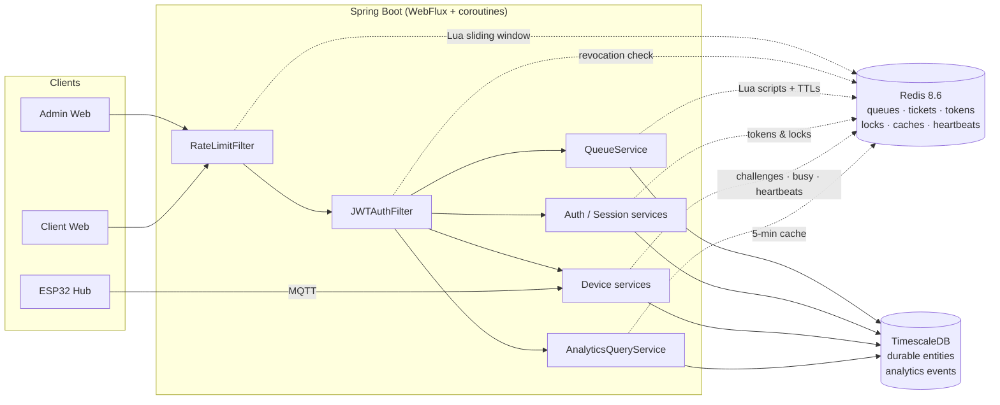
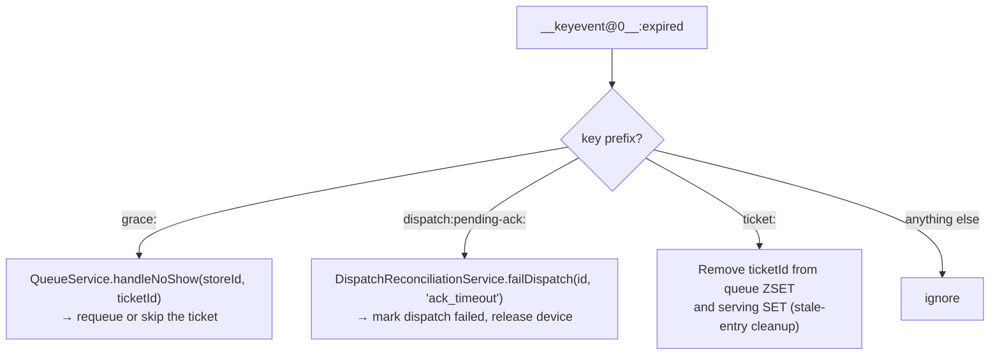
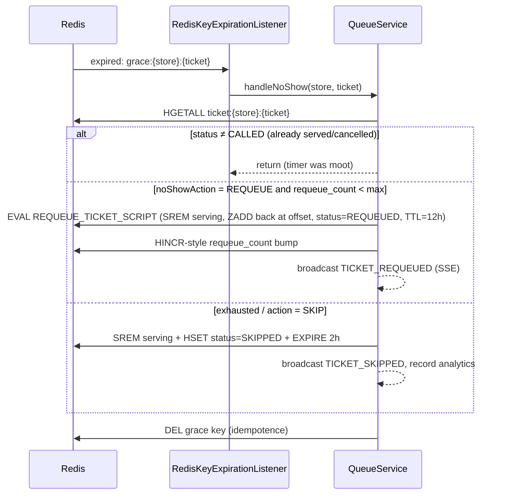
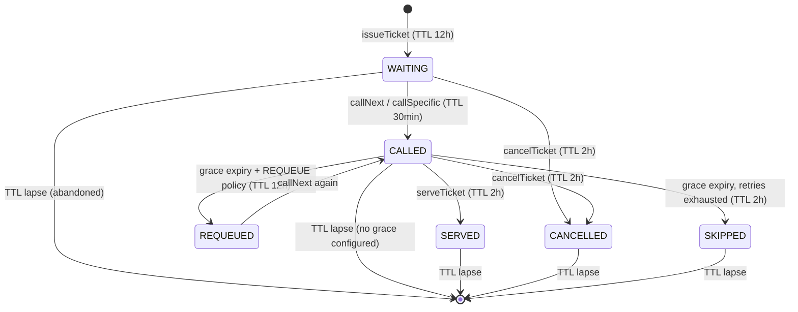

# Redis Walkthrough

> **Last updated:** 2026-07-07 · Covers the full Redis surface of `backend/` as of the `main` branch.
> Written as a study + modification guide: sections 1–12 explain how Redis is provisioned, configured, and used; section 13 catalogs the recurring idioms; section 14 is a change-preparation guide (invariants, recipes, and feature-scale editing checklists).

---

## 1. Why Redis, and What Lives Where

The backend uses **two datastores with a strict division of labor**:

| Store | Holds | Examples |
|---|---|---|
| **TimescaleDB (PostgreSQL 17, via R2DBC)** | Durable, relational, reportable data | admins, organizations, stores, devices, sessions rows, login history, analytics events (hypertable) |
| **Redis 8.6 (via reactive Lettuce)** | Ephemeral, operational, hot-path state | live queues, tickets, counters, tokens, locks, caches, heartbeats |

The rule of thumb used throughout the codebase: **if a piece of state has a natural expiry, or needs sub-millisecond atomic coordination between concurrent requests, it goes to Redis.** Nothing in Redis is ever the *only* copy of data that must survive forever — a full Redis flush loses in-flight queue state and pending onboarding requests, but no accounts, stores, or historical analytics.



---

## 2. Provisioning: Docker Compose + redis.conf

Redis is provisioned in `backend/compose.yaml`:

```yaml
redis:
  image: 'redis:8.6.1-alpine'
  command: redis-server /usr/local/etc/redis/redis.conf --requirepass ${REDIS_PASSWORD}
  ports: ['6379:6379']
  volumes:
    - ./src/main/resources/redis/redis.conf:/usr/local/etc/redis/redis.conf
    - notiguide-redis:/data
  healthcheck:
    test: [ "CMD-SHELL", "redis-cli -a '${REDIS_PASSWORD}' ping | grep -q PONG || exit 1" ]
```

Key points:

- **Password** comes from `REDIS_PASSWORD` in `.env` (dev uses spring-dotenv; the same variable feeds both the container's `--requirepass` and the app's `spring.data.redis.password`).
- **Named volume** `notiguide-redis` persists `/data` across container restarts.
- The **backend container** (`prod` profile) declares `depends_on: redis: condition: service_healthy`, so it only starts after Redis answers `PING`.

The mounted config, `backend/src/main/resources/redis/redis.conf`, is only two lines — but both are **load-bearing**:

```
appendonly yes
notify-keyspace-events Ex
```

| Directive | Why it matters |
|---|---|
| `appendonly yes` | AOF persistence. Queue/ticket state survives a Redis restart instead of evaporating mid-business-day. |
| `notify-keyspace-events Ex` | Enables **expired-key events** (`E` = keyevent channel, `x` = expired class). Without this flag, `RedisKeyExpirationListener` (section 5) subscribes successfully but **never receives a single message** — no-show handling and dispatch-timeout reconciliation silently stop working. This is the first thing to check if expiry-driven behavior "mysteriously" breaks. |

---

## 3. Spring Wiring

### 3.1 Dependency

`backend/build.gradle.kts`:

```kotlin
implementation("org.springframework.boot:spring-boot-starter-data-redis-reactive")
```

This pulls in **Spring Data Redis** with the **Lettuce** reactive client (not Jedis). Everything Redis-related in the app is non-blocking and consumed through Kotlin coroutines.

### 3.2 Connection & template — `core/redis/RedisConfig.kt`

Two beans:

```kotlin
@Bean
fun redisConnectionFactory(props: RedisProperties): LettuceConnectionFactory {
    val redisConfig = RedisStandaloneConfiguration(props.host, props.port).apply {
        username = props.username ?: "default"
        setPassword(RedisPassword.of(props.password))
    }
    val clientConfig = LettuceClientConfiguration.builder()
        .clientOptions(ClientOptions.builder().protocolVersion(ProtocolVersion.RESP3).build())
        .build()
    return LettuceConnectionFactory(redisConfig, clientConfig)
}

@Bean @Primary
fun reactiveRedisTemplate(factory: ReactiveRedisConnectionFactory): ReactiveRedisTemplate<String, String> {
    return ReactiveRedisTemplate(factory, RedisSerializationContext.string())
}
```

Three deliberate decisions here:

1. **`RESP3` protocol** — Redis 8.x's modern wire protocol (push messages, better typed replies). Forced explicitly rather than letting Lettuce negotiate.
2. **`ReactiveRedisTemplate<String, String>`** — the *entire application* shares one template where **keys and values are plain UTF-8 strings** (`RedisSerializationContext.string()`).
3. **No JSON serializer at the template level.** Structured values (device records, invite payloads, join requests…) are serialized *manually* with Jackson's `ObjectMapper` before writing and after reading.

> **⚠️ The serializer invariant (audit-round-4 lesson).** An earlier revision used `GenericJackson2JsonRedisSerializer`. That serializer wraps every string in JSON quotes — `"abc"` is stored as `"\"abc\""`. This **silently corrupts Lua script arguments**: `ARGV[1]` arrives inside the script with literal quote characters, so `tonumber(ARGV[1])` returns `nil` and comparisons fail. All serializers must remain string-based. If you need JSON, do `objectMapper.writeValueAsString(...)` yourself (see `LoginAbortService`, `InviteLinkService`, `JoinRequestService`, `DeviceBusyRecord` writers).

### 3.3 RESP2 vs RESP3 — why the protocol is pinned

RESP (**RE**dis **S**erialization **P**rotocol) is the wire format between client and server. Two generations are in active use, and `RedisConfig` **pins RESP3 explicitly** instead of letting Lettuce auto-negotiate.

#### The protocols side by side

| Aspect | RESP2 (Redis ≤ 5 default, still universally supported) | RESP3 (Redis ≥ 6, opt-in) |
|---|---|---|
| **Handshake** | None. Client just starts sending commands; auth is a separate `AUTH` command. Lettuce validates the link with a `PING` (`pingBeforeActivateConnection`). | Explicit `HELLO 3 AUTH <user> <pass>` — one round trip that switches protocol, authenticates, and returns a server-metadata map (version, proto, role…). |
| **Type system** | 5 frame types: simple string `+`, error `-`, integer `:`, bulk string `$`, array `*`. Everything else is *simulated*: maps are flattened arrays, doubles are bulk strings, booleans are `:1`/`:0`, null is a special `$-1`. | Superset with real semantic types: map `%`, set `~`, double `,`, boolean `#`, big number `(`, unified null `_`, verbatim string `=`, attribute `\|`, and **push `>`**. |
| **`HGETALL` reply (example)** | `*4  $4 name  $3 Bob  $3 age  $2 30` — a flat 4-element array; the *client* must know to pair them up | `%2  $4 name  $3 Bob  $3 age  $2 30` — a real 2-entry map; the reply is self-describing |
| **Server push** | Impossible on a normal connection. Pub/sub messages are plain arrays, so a subscribed connection enters a restricted "subscriber mode" and **must be a dedicated connection** — the client couldn't otherwise tell a pushed message from a command reply. | Push frames (`>`) are typed and out-of-band, so the server can send unsolicited messages (pub/sub, keyspace notifications, client-side caching invalidations via `CLIENT TRACKING`) on a connection that also runs commands. |
| **Auth failure surface** | Connect "succeeds", then the first command fails with `NOAUTH`/`WRONGPASS`. | The `HELLO` itself fails → the *connection* fails fast at startup. |

#### How Lettuce (6.x) handles it

- **Unconfigured** (no `protocolVersion(...)`): Lettuce performs **protocol discovery** — it tries `HELLO 3` first; if the server replies `ERR unknown command` (Redis < 6, or proxies/forks that never implemented `HELLO`), it silently **falls back to RESP2**. Convenient, but the connection's behavior now depends on what answered — two environments can end up on different protocols without any code difference.
- **Pinned `RESP3`** (this project): skips discovery, always sends `HELLO 3`. Deterministic; fails loudly against anything that can't speak RESP3.
- **Pinned `RESP2`**: never sends `HELLO`, uses the legacy `PING` + `AUTH`/`CLIENT SETNAME` handshake path. This is the escape hatch for old servers, Twemproxy-style proxies, and Redis-compatible databases with incomplete `HELLO` support.

#### Why connection setup breaks differently under each (the practical debugging map)

| Symptom | Likely protocol-related cause |
|---|---|
| Works against local Redis, fails against a managed/proxied Redis with `ERR unknown command 'HELLO'` | Server can't speak RESP3 but the client pins it → pin RESP2 or upgrade the server |
| Connection fails immediately at startup with an auth error | RESP3: bad credentials are caught inside `HELLO` during connect (this is a *feature* — RESP2 would defer the failure to the first real command) |
| Auth error mentions `WRONGPASS invalid username-password pair` | ACL semantics: `HELLO 3 AUTH default <pass>` authenticates as the `default` user — the password must be the `requirepass` value. This is why `RedisConfig` sets `username = "default"` explicitly rather than leaving it null. |
| Pub/sub or keyspace notifications silently absent after switching client/protocol | On RESP2 they need a dedicated subscriber connection; on RESP3 they arrive as `>` push frames — a client (or middlebox) that doesn't route push frames drops them |
| Same code returns a `Map` on one box and a flat `List` on another | Protocol discovery landed on different versions; `HGETALL`-family replies are typed differently (this is invisible through Spring Data's `ReactiveRedisTemplate`, which normalizes replies, but visible with raw Lettuce commands or `execute` of custom scripts) |

#### Why this project chose to pin RESP3

1. **Determinism** — Redis 8.6 fully supports RESP3; there is no legacy server to accommodate, so discovery adds a failure mode (falling back unnoticed) without adding value.
2. **Fail-fast auth** — a wrong `REDIS_PASSWORD` kills the app at startup inside the `HELLO`, not minutes later on the first queue operation.
3. **First-class push frames** — the keyspace-expiration listener (section 5) and any future `CLIENT TRACKING` use are native RESP3 push consumers.
4. **Typed replies** — doubles (ZSET scores), booleans, and maps come back semantically typed at the protocol layer rather than as re-parsed strings. Spring Data smooths this over either way, but the Lua-heavy code paths (`redis.execute(...)`) sit closer to the wire.

Note the distinction between the two "string" layers: RESP3 still *transports* values as bulk strings where the data is a string — the **serializer invariant of 3.2 is orthogonal to the protocol version**. Pinning RESP2 would not have fixed the JSON-quoting bug, and RESP3 does not reintroduce it.

### 3.4 Profiles & properties

Connection settings ride on Spring Boot's standard `spring.data.redis.*` autoconfiguration properties (`RedisProperties` is injected straight into the factory bean):

| File | Redis-relevant content |
|---|---|
| `application.yaml` | Nothing Redis-specific — defaults (`localhost:6379`) apply. |
| `application-dev.yaml` | `spring.data.redis.password: ${REDIS_PASSWORD}` (host stays `localhost`); `rate-limit.enabled: false`. |
| `application-prod.yaml` | `spring.data.redis.host: redis` (Compose service DNS name) + password; `rate-limit.enabled: true` with per-tier overrides. |

Dev workflow: `docker compose up -d redis` → `./gradlew bootRun` with `.env` supplying `REDIS_PASSWORD` (via spring-dotenv — the project does **not** use `spring-boot-docker-compose` despite the dependency having existed historically).

### 3.5 Coroutine style

All Redis access happens inside `suspend` functions using either:

- **Reactor-interop awaiters**: `.awaitSingle()` / `.awaitSingleOrNull()` on the `Mono` returned by template operations, or
- **Spring Data's Kotlin extensions**: `removeAndAwait`, `sizeAndAwait`, `rankAndAwait`, `getAndAwait`, `membersAsFlow` (see `RedisQueueRepository` for the cleanest examples).

There is **no blocking Redis call anywhere in request paths**. The single exception to "no blocking" in the codebase is `ServingSetCleanupScheduler`, which wraps its coroutine in `runBlocking` because `@Scheduled` requires a regular function — an accepted limitation.

---

## 4. Core Abstractions

### 4.1 `RedisKeyManager` — the single key registry

Every key in the system is minted by a function in `core/redis/RedisKeyManager.kt` (an `object`, i.e. a singleton with zero state). **No repository or service is allowed to hardcode a key string.** This gives you one file to audit for collisions, one place to grep for usages, and guarantees the expiration listener's parsers (`parseTicketKey`, `parseGraceExpiryKey`, `parsePendingAckKey`) stay in sync with the writers.

Full key inventory, grouped by owner:

#### Queue domain

| Key | Type | TTL | Purpose |
|---|---|---|---|
| `store:{storeId}:queue` | ZSET (score = issue epoch-ms) | none | **Global** waiting queue; rank = position |
| `store:{storeId}:queue:{serviceTypeId}` | ZSET | none | Per-service-type waiting queue (dual-write with global, see 6.3) |
| `store:{storeId}:serving` | SET | none | Tickets currently CALLED |
| `ticket:{storeId}:{ticketId}` | HASH | 12 h / 30 min / 2 h by state | The ticket itself: `store_id`, `number`, `status`, `issued_at`, `called_at`, `counter_id`, `service_type_id`, `requeue_count`, `device_id`, `alert_pos_{n}` flags |
| `store:{storeId}:counter:{yyyy-MM-dd}` | STRING (int) | `EXPIREAT` next midnight (store TZ) | Daily ticket-number counter |
| `store:{storeId}:queue_state` | STRING | none | `ACTIVE` / `PAUSED` |
| `grace:{storeId}:{ticketId}` | STRING `"1"` | store's grace period (s) | Pure timer — its *expiry* triggers no-show handling |
| `store:{storeId}:avg_service_seconds` | STRING (double) | 5 min | Analytics cache: trimmed-mean service duration |
| `store:{storeId}:settings` | — | — | Invalidation hook only (deleted on settings change / store delete) |

#### Rate limiting

| Key | Type | TTL | Purpose |
|---|---|---|---|
| `ratelimit:{tier}:{clientIp}` | ZSET (score = request epoch-ms) | window + 1 s | Sliding-window request log per IP per tier |

#### Auth & sessions

| Key | Type | TTL | Purpose |
|---|---|---|---|
| `refresh:{token}` | STRING (adminId) | 7 d | Opaque refresh token → owner lookup |
| `admin:{adminId}:refresh_tokens` | SET | 7 d (re-armed on issue) | All live refresh tokens of one admin (bulk revocation) |
| `revoked:{tokenHash}` | STRING `"1"` | = access-token lifetime | Access-token denylist (checked by `JWTAuthFilter` on every request) |
| `session:{tokenHash}:last_update` | STRING `"1"` | 5 min | NX throttle so `last_active` is written to Postgres at most every 5 min |
| `auth:abort:{token}` | STRING (JSON `AbortPayload`) | 60 s | One-shot login-rollback capability token |
| `auth:abort:lock:{token}` | STRING `"1"` | 10 s | Mutex around abort consumption |

#### Tenant onboarding

| Key | Type | TTL | Purpose |
|---|---|---|---|
| `join_request:{requestId}` | STRING (JSON payload incl. Argon2 hash) | 7 d | Pending signup awaiting approval |
| `join_request:index:org:{orgId}` / `…:store:{storeId}` | ZSET (score = created-ms) | none (lazily pruned) | Listing index per approver scope |
| `join_request:username:{usernameLower}` | STRING (requestId) | 7 d | NX username reservation |
| `join_request:lock:{requestId}` | STRING `"1"` | 30 s | Mutex around approval |
| `invite:token:{token}` | STRING (JSON `InviteTarget`) | 7 d | Resolvable invite token |
| `invite:active:{TYPE}:{targetId}` | STRING (JSON `ActiveLink`) | 7 d | "Which token is currently active for this org/store" pointer |
| `invite:lock:{TYPE}:{targetId}` | STRING `"1"` | 10 s | Mutex around regeneration |
| `invite:audit:{TYPE}:{targetId}` | ZSET (JSON entries, score = used-ms) | 30 d, capped at 200 entries | Usage trail |

#### Notifications (FCM)

| Key | Type | TTL | Purpose |
|---|---|---|---|
| `fcm:{storeId}:{ticketId}` | STRING (FCM token) | 12 h | Web-push token registered by the client for one ticket |

#### Device domain

| Key | Type | TTL | Purpose |
|---|---|---|---|
| `enroll:{sha256(token)}` | STRING (JSON record) | `device.enrollment.token-ttl-seconds` (dev 3600 s, prod 600 s default) | Hub enrollment token, stored under its hash |
| `device:activation:{challengeId}` | STRING (JSON `DeviceActivationRecord`) | 15 min | Activation challenge (nonce, fingerprint, status) |
| `device:activation-by-device:{deviceId}` | STRING (JSON) | 15 min | Reverse lookup device → open challenge |
| `device:prior-public-id:{deviceId}` | STRING | none (deleted on activation) | Old public ID retained across re-activation |
| `device:lifecycle:{deviceId}` | STRING (JSON `DeviceLifecycleCommandRecord`) | 30 min | In-flight lifecycle command awaiting hub ack |
| `device:busy:{deviceId}` | STRING (JSON `DeviceBusyRecord`) | mirrors ticket-state TTL | "This pager is bound to this ticket" claim/lock |
| `device:hub:alive:{deviceId}` | STRING | `heartbeat-liveness-seconds` (30 s) | Heartbeat-refreshed liveness flag — hub is "online" iff key exists |
| `device:hub:diag:{deviceId}` | STRING (JSON) | `diagnostics-cache-seconds` | Last-known hub diagnostics snapshot |
| `store:{storeId}:transmitter:active` | STRING (JSON `TransmitterActiveRecord`) | `active-cache-seconds` (60 s) | Cached transmitter-election result |
| `dispatch:tracking:{dispatchId}` | STRING (JSON) | 5 min | Dispatch metadata for reconciliation |
| `dispatch:pending-ack:{dispatchId}` | STRING | `dispatch-ack-timeout-seconds` (30 s) | Pure timer — expiry means "hub never acked", triggers `failDispatch` |

### 4.2 `RedisTTLPolicy` — centralized durations

```kotlin
object RedisTTLPolicy {
    val TICKET_WAITING: Duration = Duration.ofHours(12)
    val TICKET_CALLED: Duration = Duration.ofMinutes(30)
    val TICKET_TERMINAL: Duration = Duration.ofHours(2)
    val FCM_TOKEN: Duration = Duration.ofHours(12)
    val REFRESH_TOKEN: Duration = Duration.ofDays(7)
    val JOIN_REQUEST: Duration = Duration.ofDays(7)
    val INVITE_LINK: Duration = Duration.ofDays(7)
    val INVITE_AUDIT: Duration = Duration.ofDays(30)
}
```

Cross-cutting TTLs live here. Domain-local TTLs that are configuration-driven or truly private live as constants/properties next to their user — the notable ones: `ACTIVATION_TTL` 15 min and `CHALLENGE_LIFETIME` 5 min (`DeviceApprovalService`), `LIFECYCLE_TTL` 30 min (`DeviceLifecycleService`), `LOCK_TTL` 10 s (`InviteLinkService`), abort token 60 s / lock 10 s (`LoginAbortService`), avg-service cache 5 min (`AnalyticsQueryService`), and all `device.transmitter.*`-configured TTLs.

> Note: `TICKET_TERMINAL` is **2 hours, not immediate deletion**. Older docs (and one line in `CLAUDE.md`) still say SERVED/CANCELLED tickets are deleted instantly. The code moved on: terminal tickets keep their HASH for 2 h so that **offline reconciliation** (`reconcileTerminalTransition`) and late device dispatch cleanup can still see them.

---

## 5. Key Expiry as a Scheduler — `RedisKeyExpirationListener`

The system deliberately uses **key expiration as a distributed timer**. Instead of polling "has the customer's grace period elapsed?", it writes a key whose TTL *is* the grace period and reacts when Redis announces its death.

### 5.1 Mechanics

`core/redis/RedisKeyExpirationListener.kt`:

- On `ApplicationReadyEvent`, launches a coroutine (scope: `Dispatchers.IO + SupervisorJob`) that subscribes a `ReactiveRedisMessageListenerContainer` to the pattern topic **`__keyevent@0__:expired`** (database 0's expired-event channel — this is what `notify-keyspace-events Ex` feeds).
- Subscription failures retry with exponential backoff: 1 s → 2 s → 5 s → 10 s → 30 s, 5 attempts, then it logs an error and gives up (with `ServingSetCleanupScheduler` as partial compensation).
- `destroy()` cancels the scope and tears the container down.

### 5.2 The three key families it reacts to



Each handler is individually try/caught so one poisoned event never kills the subscription.

### 5.3 Worked example: the no-show flow

When a ticket is called and the store has a grace period configured, `QueueService.setGraceExpiryIfNeeded` writes `grace:{storeId}:{ticketId} = "1"` with `TTL = gracePeriodSec`. Nothing else happens until:



Note that serving/cancelling a ticket **proactively deletes** its grace key, so the timer never fires for tickets that resolved normally.

### 5.4 Known limitations (accepted by design)

- Expired-key notifications are **fire-and-forget**: if the app is down when a key expires, the event is lost. `ServingSetCleanupScheduler` (every 5 min, `runBlocking`) sweeps serving sets for tickets whose HASH no longer exists — compensating for lost `ticket:` events. Lost `grace:`/`pending-ack:` events degrade gracefully (ticket stays CALLED until its own 30-min TTL; dispatch stays unresolved until its 5-min tracking key lapses).
- The listener is a **single subscriber per app instance**; running multiple backend instances would process each expiry once *per instance*. Handlers are written to be idempotent, but the architecture assumes a single backend node (see 14.5).

---

## 6. Queue Domain Deep Dive

This is the thesis centerpiece. Files: `domain/queue/repository/RedisQueueRepository.kt`, `RedisTicketRepository.kt`, `RedisCounterRepository.kt`, `domain/queue/service/QueueService.kt`.

### 6.1 Data-structure choices

| Concern | Structure | Why |
|---|---|---|
| Waiting line | **ZSET** scored by issue-time (epoch-ms) | `ZRANK` gives position in O(log N); `ZPOPMIN` pops the earliest atomically; fractional scores (`+0.001`) allow surgical re-insertion for requeues |
| Now-serving set | **SET** | Order irrelevant; membership + count is all that's needed |
| Ticket record | **HASH** | Field-level updates (`HSET status`) without read-modify-write of a JSON blob; TTL applies to the whole ticket |
| Daily number | **STRING + INCR** | Atomic increment; `EXPIREAT` midnight makes numbering reset itself |

### 6.2 Ticket lifecycle



Every state transition re-arms the HASH's TTL. The TTL is therefore *both* a safety net (nothing lingers past 12 h) and a semantic clock (a CALLED ticket auto-evaporates after 30 min even without grace handling).

### 6.3 Dual queues: global + per-service-type

Tickets are written to **two ZSETs**: the service-type queue `store:{id}:queue:{serviceTypeId}` (via the `ISSUE_TICKET_SCRIPT`) *and* the legacy global queue `store:{id}:queue` (plain `ZADD`, same score — "for backward compatibility"). Consequences you must keep in mind when editing:

- `callNext` pops from **one** of them (service-type queue if a `serviceTypeId` was passed, else global) and then **manually removes the ticket from the counterpart** ("cross-queue cleanup") using the `service_type_id` field stored on the ticket HASH.
- Requeue and transfer logic likewise maintain both.
- Position (`ZRANK`) shown to customers is always computed against the **global** queue.

### 6.4 The four Lua scripts

Multi-key transitions are atomic via server-side Lua (`RedisScript.of(...)` constants in `QueueService`, executed with `redis.execute(script, keys, args)`). All arguments cross the wire as strings — which works *because* of the string-only serializer (section 3.2).

1. **`ISSUE_TICKET_SCRIPT`** — `ZADD` into the service-type queue + `HSET` the ticket fields + `EXPIRE` 12 h, as one unit. A ticket can never exist in a queue without its HASH (or vice versa) due to a crash between commands. After the script, `service_type_id` + any extra fields are HSET separately; if *that* fails, `rollbackIssuedTicket` removes the ticket from both queues and deletes the HASH.

2. **`CALL_NEXT_SCRIPT`** — the most interesting one. Loops up to 100 times: `ZPOPMIN` the queue; if the popped ticket's HASH still `EXISTS`, `SADD` it to serving, `HSET status=CALLED, called_at`, optional `counter_id`, `EXPIRE` 30 min, return `{'SUCCESS', ticketId}`. If the HASH is gone (an expired "**ghost ticket**" whose cleanup event was lost), the loop simply pops the next one — the pop itself already removed the ghost. Kotlin-side, `callNext` re-checks the HASH after the script and `callNextUntilSuccess` retries up to 10 times on `GhostTicketSkipped` — deliberate defense-in-depth, both layers are correct.

3. **`CALL_SPECIFIC_SCRIPT`** — jump-the-line call of a chosen ticket: `ZREM` from the global queue (returning `NOT_IN_QUEUE` if absent), verify the HASH exists (`NOT_FOUND` → ghost), then the same serve-marking as above.

4. **`REQUEUE_TICKET_SCRIPT`** — no-show requeue: `SREM` from serving, compute an insertion score = (score of the element at `requeueOffset`) + 0.001 — i.e. slot the customer back *a few positions down*, not at the tail — `ZADD`, `HSET status=REQUEUED`, re-arm 12 h TTL.

Plus a fifth mini-script in `RedisCounterRepository`: **`INCR` + `EXPIREAT`-on-first-increment**, so the daily counter key sets its own midnight (store-timezone) expiry exactly once.

### 6.5 What happens around a call (side effects)

`callNext`/`callSpecificTicket` don't just mutate Redis. After a successful transition they fan out, in order: analytics event (Postgres) → SSE broadcast to admin dashboards → MQTT publish (physical displays) → **either** device dispatch (if the ticket has a bound pager: write `device:busy:{deviceId}` and broadcast a dispatch event) **or** FCM push to the customer → write the grace timer key → proactive "you're almost up" FCM alerts to the first N waiting tickets (deduplicated via `alert_pos_{n}` flags HSET on each ticket).

### 6.6 Store data teardown — `clearStoreData`

Deleting a store must leave zero orphan keys. `QueueService.clearStoreData` deletes the fixed-name keys directly (`queue`, `serving`, `queue_state`, `settings`, `avg_service_seconds`) and then **`SCAN`-deletes** (never `KEYS` — SCAN is non-blocking) every pattern family: `store:{id}:queue:*`, `store:{id}:serving:*`, `store:{id}:counter:*`, `ticket:{id}:*`, `grace:{id}:*`, `fcm:{id}:*`.

> **This function is a checklist.** Any new store-scoped key family you introduce **must** be added here, or deleted stores leak keys forever.

---

## 7. Rate Limiting

Files: `core/ratelimit/RateLimitFilter.kt` (a `CoWebFilter` at highest precedence), `RateLimiter.kt`, `RateLimitProperties.kt`, `resources/redis/rate_limiter.lua`.

- **Three tiers** configured under `rate-limit.*`: `strict` (sensitive public endpoints), `auth` (login), `standard` (everything else). Disabled entirely in dev (`enabled: false`), enabled with generous limits in prod (e.g. standard 400 req/60 s).
- **Key**: `ratelimit:{tier}:{clientIp}` where the IP honors `X-Forwarded-For`.
- **Algorithm**: true sliding window in Lua — `ZREMRANGEBYSCORE` drops entries older than the window, `ZCARD` counts the remainder, and if under the max it `ZADD`s a UUID member scored with the current ms and `EXPIRE`s the whole ZSET to window+1 s. Returns `{allowed, remaining, resetAt}` so the filter can emit `X-RateLimit-*` headers (exposed via CORS config).
- **Fail-open**: any Redis failure (connection, script, unexpected) logs a warning and returns `allowed=true, remaining=-1`. Rate limiting protects capacity; it must never *become* the outage.
- This is the only Lua loaded from a **classpath file** (`DefaultRedisScript` + `ClassPathResource("redis/rate_limiter.lua")`); the queue scripts are inline Kotlin strings. Either style is fine for new scripts; file-based keeps big scripts readable.

---

## 8. Auth & Session State

### 8.1 Refresh tokens — `core/jwt/RefreshTokenService.kt`

- `issue`: 32 random bytes hex → `SET refresh:{token} = adminId EX 7d`, plus `SADD admin:{id}:refresh_tokens` (the tracking set re-`EXPIRE`d to 7 d on each issue).
- `rotate`: read the key, then **`DEL` as the mutex** — Redis `DEL` returns the number of keys removed, so exactly one concurrent caller sees `1` and proceeds to mint the replacement; every racer sees `0` and gets `null` (one-time-use guarantee without any lock).
- `revokeAll` (password change, account deletion): read the tracking set, single `DEL` of all token keys + the set.

### 8.2 Access-token revocation — `SessionService` + `JWTAuthFilter`

JWTs are stateless, so instant revocation needs a denylist: revoking a session writes `revoked:{tokenHash} = "1"` with TTL equal to the access token's remaining validity class. `JWTAuthFilter` checks `isRevoked(tokenHash)` on **every authenticated request** — one `EXISTS` per request, which is exactly the kind of read Redis is for. The filter also calls `updateLastActive`, throttled by an NX key (`session:{hash}:last_update`, 5 min) so the Postgres session row isn't rewritten on every request.

### 8.3 Login abort — `core/jwt/LoginAbortService.kt`

Solves a cross-site-cookie edge case: the login succeeded server-side but the browser never stored the cookie. The login response includes a one-shot opaque token whose Redis value (60 s TTL) is a JSON payload of everything to roll back (access-token hash, refresh token, login-history row ID). Consumption takes a 10 s NX lock, performs the three rollbacks, and only deletes the token when **all** succeeded — so a transient failure is retryable within the 60 s window. The token doubles as a CSRF-resistant capability since only the client that received the login response knows it.

---

## 9. Tenant Onboarding: Join Requests & Invite Links

These two services are the best exemplars of "**Redis as a short-lived entity store**" — worth studying before writing any similar feature.

### 9.1 Join requests — `domain/admin/service/JoinRequestService.kt`

A signup that awaits owner approval, living entirely in Redis for ≤ 7 days:

- **Username reservation first**: `SETNX join_request:username:{lower} = requestId` — atomic claim; a `false` reply means "already taken" with no cleanup needed.
- Then the JSON payload (`join_request:{requestId}`, includes the Argon2 password hash so approval can materialize the account without re-asking) and a **ZSET index** per org/store for listing. Failure between steps triggers compensating deletes.
- **Listing lazily prunes**: hydrating the index drops (`ZREM`) IDs whose payload key has expired — indexes have no TTL, entries just rot away on read.
- **Approval** takes a 30 s NX lock, re-checks username uniqueness in *Postgres*, saves the `Admin` row (`@Transactional`), then deletes all three key families.

### 9.2 Invite links — `domain/admin/service/InviteLinkService.kt`

- Two-key model: `invite:token:{token}` (what the URL resolves) + `invite:active:{type}:{id}` (which token is current). `regenerate` is serialized per tenant by a 10 s NX lock, and **deletes the old token key before writing the new pair** — orderings chosen so no partial failure leaves a *revoked* token still resolvable.
- The lock release is wrapped in `withContext(NonCancellable)` — a cancelled HTTP request must still release the mutex or the tenant is locked out for the lock TTL.
- **Audit trail** is a ZSET of JSON entries scored by use-time with *triple* pruning on write: by age (30 d cutoff via `ZREMRANGEBYSCORE`), by count (cap 200 via `ZREMRANGEBYRANK`), plus key-level `EXPIRE`. `recordUse` is best-effort: it catches everything except `CancellationException` — an audit hiccup must never fail the actual signup.

---

## 10. Notifications (FCM)

`core/firebase/FcmNotificationService.kt` (`@ConditionalOnBean(FirebaseMessaging::class)` — the whole feature degrades away if Firebase isn't configured):

- Client registers its web-push token per ticket: `fcm:{storeId}:{ticketId}` (12 h, matching the ticket's own max life).
- On call: read token → data-only FCM message (the service worker localizes the text). `UNREGISTERED`/`INVALID_ARGUMENT` responses delete the stored token.
- **Proactive position alerts** dedupe via `alert_pos_{position}` flag fields HSET onto the ticket HASH — piggybacking on the ticket's TTL instead of managing separate dedup keys.

---

## 11. Device Domain

The device/pager subsystem is the heaviest *newer* Redis consumer. It uses no new primitives — every pattern is one already covered — but at higher density. The notable flows:

- **Enrollment** (`EnrollmentTokenService`): hub enrollment tokens stored under their SHA-256 (`enroll:{hash}`) so the plaintext never sits in Redis; listing uses `SCAN enroll:*`. TTL is configuration-driven (`device.enrollment.token-ttl-seconds`).
- **Activation** (`DeviceApprovalService`, `DeviceActivationService`, `DeviceRegistrationService`): a challenge pair — `device:activation:{challengeId}` + reverse index `device:activation-by-device:{deviceId}` — both 15 min, written together with compensating delete on partial failure. Consumed and deleted on successful activation, along with `device:prior-public-id:{deviceId}`.
- **Busy binding** (`DeviceDispatchService`, `QueueService`): `device:busy:{deviceId}` holds a JSON `DeviceBusyRecord(storeId, ticketId, boundAt)`. Claimed with **`setIfAbsent`** at issue time (a pager can serve one ticket at a time); TTL tracks the ticket's state TTL so an orphaned binding self-heals.
- **Transmitter election** (`TransmitterElectionService`, `TransmitterOperationalListener`): the elected hub per store is cached at `store:{id}:transmitter:active` (60 s); hub liveness is `device:hub:alive:{deviceId}` — a key the MQTT heartbeat listener re-`SET`s with a 30 s TTL, making "is the hub online?" a single `EXISTS`.
- **Dispatch reconciliation** (`TransmitterDispatchService`, `DispatchReconciliationService`): each RF dispatch writes `dispatch:tracking:{id}` (5 min, JSON metadata) and `dispatch:pending-ack:{id}` (TTL = ack timeout, 30 s). A hub ack deletes the pending-ack key; if it instead **expires**, the keyspace listener (section 5.2) calls `failDispatch(id, "ack_timeout")` — the same expiry-as-scheduler pattern as no-show handling.
- **Lifecycle commands** (`DeviceLifecycleService`): one in-flight command per device at `device:lifecycle:{deviceId}` (30 min) tracking hub acknowledgment.

---

## 12. Analytics Cache

`AnalyticsQueryService.getCachedAvgServiceDuration`: wait-time estimates need the store's average service duration, computed as a **trimmed mean** (drop top/bottom 10 %) over recent completions in TimescaleDB. That query is cached at `store:{id}:avg_service_seconds` for 5 min — classic cache-aside: `GET`, on miss compute + `SET EX`. Cold-start guard: below a minimum sample size it returns `null` (UI shows no estimate) rather than caching garbage.

---

## 13. Idiom Cheat Sheet

Recurring patterns you can point at during review — each with its canonical exemplar:

| Idiom | How | Exemplar |
|---|---|---|
| **Distributed mutex** | `SET key "1" NX EX ttl` (`setIfAbsent`), `DEL` in `finally` (use `NonCancellable` if inside coroutine) | `InviteLinkService.regenerate` |
| **One-shot token consume** | `GET` then `DEL`-returns-count as the race arbiter | `RefreshTokenService.rotate` |
| **Expiry as scheduler** | Write a value-less key with TTL = the delay; react in `RedisKeyExpirationListener` | grace keys, dispatch pending-ack |
| **Atomic multi-key transition** | Inline Lua via `RedisScript.of` | `QueueService` scripts |
| **Atomic claim** | `setIfAbsent` for first-writer-wins semantics | username reservation, device busy |
| **Index + lazy prune** | ZSET of IDs, `ZREM` dead entries during reads | `JoinRequestService.hydrate` |
| **Capped audit trail** | ZSET + prune by score, by rank, and key TTL | `InviteLinkService.recordUse` |
| **Cache-aside** | `GET` → compute → `SET EX` | `AnalyticsQueryService` |
| **Heartbeat liveness** | Re-`SET` with short TTL; presence = alive | `device:hub:alive` |
| **Scan-delete** | `SCAN match pattern` + `DEL`, never `KEYS` | `clearStoreData` |
| **JSON-in-string values** | Manual `ObjectMapper` both directions, `runCatching` on read | `DeviceBusyRecord`, `InviteTarget` |
| **Throttle** | NX key with TTL = min interval | `SessionService.updateLastActive` |
| **Fail-open infra** | Catch Redis failures, log, allow | `RateLimiter` |

---

## 14. Making Changes — Invariants, Recipes, and Feature-Scale Edits

### 14.1 Invariants (break any of these and something distant fails)

1. **String serialization only.** Never register a JSON/Java serializer on the shared template. Lua `ARGV` handling depends on raw strings (section 3.2).
2. **Every key goes through `RedisKeyManager`.** New keys get a function there; the listener's `is*Key`/`parse*Key` helpers must match any prefix you want to react to.
3. **Cross-cutting TTLs go in `RedisTTLPolicy`;** feature-local/configurable TTLs live beside their single user — but never inline magic numbers at call sites.
4. **Store-scoped keys must be swept by `clearStoreData`** (section 6.6) or they leak on store deletion.
5. **Multi-key writes that must not interleave are Lua scripts.** Keys in `KEYS[]` (required for cluster compatibility and script-cache correctness), values in `ARGV[]`, everything stringly-typed.
6. **Keyspace expiry reactions require** `notify-keyspace-events Ex` (redis.conf) *and* only fire on DB 0 (`__keyevent@0__`) *and* are fire-and-forget — always pair them with a compensating sweep or a self-healing TTL.
7. **Never block.** All access is reactive + `await*`; `runBlocking` is tolerated only in `@Scheduled` entry points.
8. **Rate limiting fails open, onboarding audit is best-effort** — infrastructure hiccups must not become user-facing errors on those paths.
9. **Single-instance assumption.** Locks, the expiration listener, and the cleanup scheduler all assume one backend node. Multi-instance deployment is a *feature project* (see 14.5), not a config change.

### 14.2 Small-change recipes

**Change a TTL**
1. Find it: `RedisTTLPolicy` first; if absent, it's a local constant or a `device.*`/`rate-limit.*` property (section 4.2 lists all).
2. Check *coupling* before changing: e.g. `FCM_TOKEN` deliberately equals `TICKET_WAITING` (a token should outlive its ticket, not vice versa); `revoked:*` TTL must equal the access-token lifetime; `device:busy` TTLs mirror ticket-state TTLs.
3. Nothing else to touch — TTLs are read at write time, so old keys keep old TTLs until rewritten.

**Add a new key family**
1. Add the minting function to `RedisKeyManager` (and a `pattern()` variant if you'll ever SCAN it).
2. Pick TTL home per invariant 3.
3. Store-scoped? → add to `clearStoreData`. Admin-scoped? → check `deleteAllForAdmin`-style teardown paths.
4. JSON value? → define a small `data class` **with default values for every field** (Jackson + Kotlin needs the no-arg path; see every class in `domain/device/redis/`), serialize manually, and `runCatching` the read.

**Add or modify a Lua script**
1. Inline `RedisScript.of("""...""", ReturnType::class.java)` in a `companion object` (queue style) or classpath file + `DefaultRedisScript` (rate-limiter style) for long scripts.
2. All key names via `KEYS[n]` — build them Kotlin-side with `RedisKeyManager` and pass in the `keys` list. All data via `ARGV[n]` as strings; `tonumber()` inside Lua as needed.
3. Return types: `Long`, `String`, or `List` — see `parseScriptResult` in `RateLimiter` for defensive list handling.
4. Remember scripts are atomic *and blocking* on the Redis side: keep them O(small). The `CALL_NEXT` loop caps at 100 iterations for exactly this reason.
5. Test tip: `redis-cli -a $REDIS_PASSWORD --eval script.lua keyname , arg1 arg2` (note the comma separating KEYS from ARGV), and `MONITOR` in a second terminal to watch what the app actually sends.

**React to a key's expiry**
1. Give the key a distinctive prefix + `is*Key` / `parse*Key` helpers in `RedisKeyManager`.
2. Add a branch in `RedisKeyExpirationListener.subscribe`'s collect block — *before* the ticket fallthrough, individually try/caught, `return@collect` at the end.
3. Make the handler idempotent and add a compensating path for lost events (invariant 6).
4. If the handler lives in a conditionally-enabled bean, inject it via `ObjectProvider` like `DispatchReconciliationService`.

**Add a rate-limit tier**
1. New `TierConfig` field in `RateLimitProperties` + prod overrides in `application-prod.yaml`.
2. Route paths to it in `RateLimitFilter.resolveTier`.
3. Key shape stays `ratelimit:{tier}:{ip}` — nothing else changes.

### 14.3 Feature-scale recipes (larger edits the reviewer might ask for)

**"Store a new kind of short-lived entity"** (e.g. some new pending-approval object)
→ Clone the `JoinRequestService` shape: JSON payload key with TTL + NX reservation for any uniqueness constraint + ZSET index per listing scope with lazy pruning + NX lock around the consuming transition + compensating deletes on partial failure. That one file demonstrates the complete pattern.

**"Add a new queue discipline"** (priority tickets, per-counter lanes, VIP lanes)
→ The seams already exist: `RedisKeyManager` has unused-but-reserved key shapes (`serving(storeId, serviceTypeId)`, `counterLanes(storeId, counterId)` — marked `@Suppress("unused")`). The score is the ordering mechanism: priority = subtract a large constant from the score, or use a dedicated ZSET popped first in `CALL_NEXT_SCRIPT` (add its key to `KEYS`, try `ZPOPMIN` on it before the normal queue). Every new queue ZSET must join: issue-script, call-next pop order, cross-queue cleanup, requeue, transfer, `clearStoreData`, and the position calculation.

**"Cache another expensive query"**
→ Copy `getCachedAvgServiceDuration`: key in `RedisKeyManager`, TTL constant beside the service, `GET`-compute-`SET EX`, cold-start guard, and an invalidation `DEL` wherever the underlying data mutates (see `StoreService` deleting `storeSettings` / `avgServiceDuration` keys).

**"Make queue events durable / survive restarts"** → that's a shift from keyspace notifications to Redis Streams (`XADD`/consumer groups) — a real architectural change: notifications are fire-and-forget (invariant 6), streams are not. Flag the scope before agreeing to "just" do it live.

**"Run two backend instances"** → touches invariant 9: the expiration listener would double-fire (handlers are idempotent, so mostly safe but wasteful), `ServingSetCleanupScheduler` would double-sweep, and in-memory SSE broadcasters wouldn't span instances at all (Redis pub/sub would be the natural transport). Also flag as a project, not an edit.

### 14.4 Debugging toolbox

```bash
docker exec -it redis redis-cli -a "$REDIS_PASSWORD"

KEYS 'store:*'            # dev only — never in prod paths (use SCAN)
TYPE store:{id}:queue     # confirm structure
ZRANGE store:{id}:queue 0 -1 WITHSCORES
HGETALL ticket:{storeId}:{ticketId}
TTL ticket:{storeId}:{ticketId}
CONFIG GET notify-keyspace-events        # must contain E and x
SUBSCRIBE __keyevent@0__:expired         # watch expiry events live
MONITOR                                   # every command the app issues
```

Fastest sanity checks when something Redis-flavored misbehaves: (1) `CONFIG GET notify-keyspace-events` if anything expiry-driven is dead; (2) `TTL` on the key in question — a `-1` (no expiry) where you expected a countdown means a write path forgot to re-arm it; (3) `MONITOR` while reproducing — quoted-looking arguments (`"\"...\""`) mean someone broke the serializer invariant.

### 14.5 Accepted limitations (do not "fix" without discussion)

- `ServingSetCleanupScheduler` uses `runBlocking` (Spring `@Scheduled` constraint).
- Rate limiter fail-open; invite audit best-effort.
- Ghost-ticket handling exists in *both* the Lua loop and Kotlin — intentional defense-in-depth.
- Single-node assumptions per invariant 9.
- Dual global/service-type queues (backward compatibility) — removing the global queue is a migration project.
